# Ta en rundtur i Azure IoT Central-användargränssnittet (Ny UI-design)

Den här artikeln beskriver Microsoft Azure IoT Central-användargränssnittet. Du kan använda gränssnittet till att skapa, hantera och använda en Azure IoT Central-lösning och dess anslutna enheter.

Som _byggare_ använder du Azure IoT Central-användargränssnittet till att definiera din Azure IoT Central-lösning. Du kan använda användargränssnittet till att:

- ange vilka enhetstyper som kan ansluta till din lösning
- konfigurera regler och åtgärder för dina enheter
- anpassa användargränssnittet för en _operatör_ som använder din lösning.

Som _operatör_ använder du Azure IoT Central-användargränssnittet till att hantera din Azure IoT Central-lösning. Du kan använda användargränssnittet till att:

- övervaka dina enheter
- konfigurera dina enheter
- felsöka och åtgärda problem med dina enheter.
- Etablera nya enheter.

[!INCLUDE [iot-central-experimental-note](../../includes/iot-central-experimental-note.md)]

## Använda den vänstra navigeringsmenyn

Använd den vänstra navigeringsmenyn för att få åtkomst till de olika områdena för programmet:

| Meny | Beskrivning |
| ---- | ----------- |
| 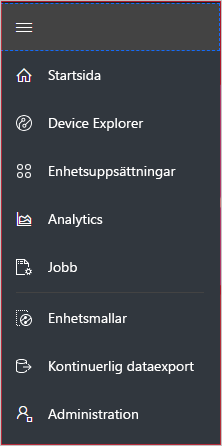 | <ul><li>Knappen **Start** visar startsidan för ditt program. Som byggare kan du anpassa den här startsidan för dina operatörer.</li><li>Knappen **Device Explorer** (Enhetsutforskare) visar simulerade och verkliga enheter som är associerade med varje enhetsmall i programmet. Som operatör kan du använda **Device Explorer** till att hantera dina anslutna enheter.</li><li>Med knappen **Device Sets** (Enhetsuppsättningar) kan du visa och skapa enhetsuppsättningar. Som operatör kan du skapa enhetsuppsättningar som en logisk samling av enheter som anges av en fråga.</li><li>Knappen **Analytics** (Analys) visar analys som härletts från enhetstelemetrin för enheter och enhetsuppsättningar. Som operatör kan du skapa anpassade vyer ovanpå enhetsdata för att kunna härleda insikter från ditt program.</li><li>Med knappen **Jobb** kan du ägna dig åt massenhetshantering genom att skapa och köra jobb och utföra uppdateringar i skala.</li><li>Knappen **Enhetsmallar** visar de verktyg som byggare använder för att skapa och hantera enhetsmallar.</li><li>Knappen **Kontinuerlig dataexport** gör att en administratör kan konfigurera en löpande export till andra Azure-tjänster såsom lagring och köer.</li><li>Knappen **Administration** visar programmets administrationssidor där administratören kan hantera programinställningar, användare och roller.</li></ul> |

## Sök, hjälp och support

Den översta menyn visas på varje sida:

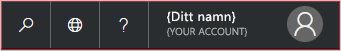

- Om du vill söka efter enhetsmallar och enheter väljer du ikonen **Sök**.
- Om du vill ändra språk i användargränssnittet väljer du ikonen **Språk**.
- Om du behöver hjälp och support väljer du listrutan **Hjälp** för att visa en lista med resurser.
- Om du vill ändra temat i användargränssnittet eller logga ut från programmet väljer du ikonen **Konto**.

Du kan välja mellan ett ljust eller ett mörkt tema för användargränssnittet:

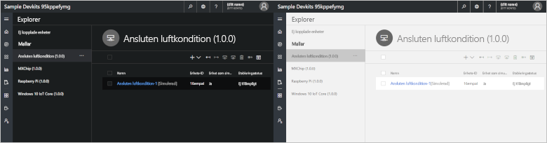

## Startsida

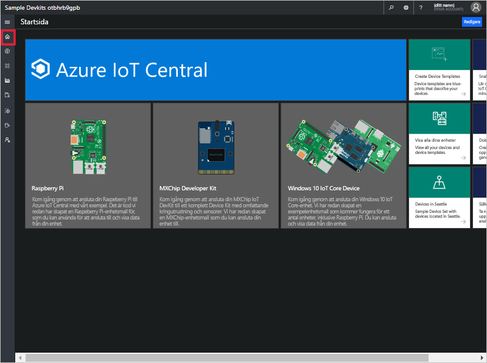

Startsidan är den första sida du ser när du loggar in på ditt Azure IoT Central-program. Som byggare kan du anpassa startsidan för andra användare av programmet genom att lägga till paneler. Mer information finns i självstudien om att [anpassa operatörsvyn i Azure IoT Central](tutorial-customize-operator-experimental.md?toc=/azure/iot-central-experimental/toc.json&bc=/azure/iot-central-experimental/breadcrumb/toc.json).

## Enhetsutforskaren

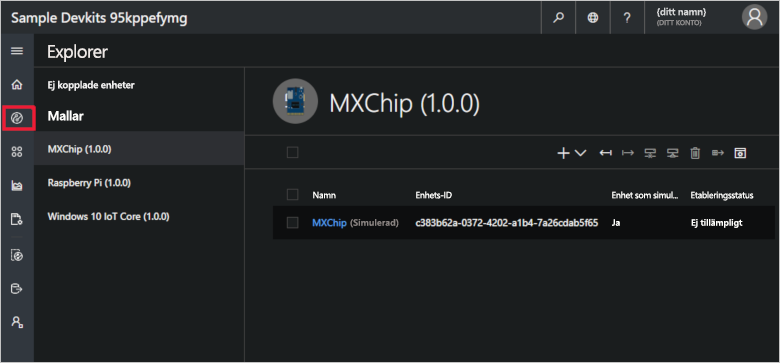

På utforskningssidan visas de _enheter_ som finns i ditt Azure IoT Central-program grupperade efter _enhetsmall_.

* En enhetsmall definierar en typ av enhet som kan ansluta till ditt program. Läs mer i informationen om att [definiera en ny enhetstyp i Azure IoT Central-programmet](tutorial-define-device-type-experimental.md?toc=/azure/iot-central-experimental/toc.json&bc=/azure/iot-central-experimental/breadcrumb/toc.json).
* En enhet motsvarar antingen en verklig eller simulerad enhet i ditt program. Läs mer i informationen om att [lägga till en ny enhet i Azure IoT Central-programmet](tutorial-add-device-experimental.md?toc=/azure/iot-central-experimental/toc.json&bc=/azure/iot-central-experimental/breadcrumb/toc.json).

## Enhetsuppsättningar

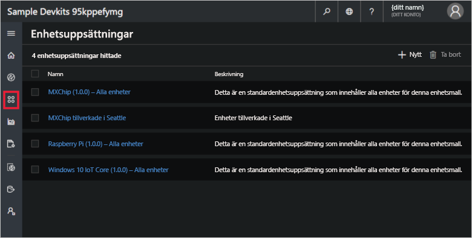

På sidan med _enhetsuppsättningar_ visas de enhetsuppsättningar som har skapats av byggaren. En enhetsuppsättning är en samling relaterade enheter. En byggare definierar en fråga för att identifiera de enheter som ingår i en enhetsuppsättning. Du använder enhetsuppsättningar när du anpassar analyser i ditt program. Mer information finns i artikeln om att [använda enhetsuppsättningar i Azure IoT Central-programmet](howto-use-device-sets-experimental.md?toc=/azure/iot-central-experimental/toc.json&bc=/azure/iot-central-experimental/breadcrumb/toc.json).

## Analytics

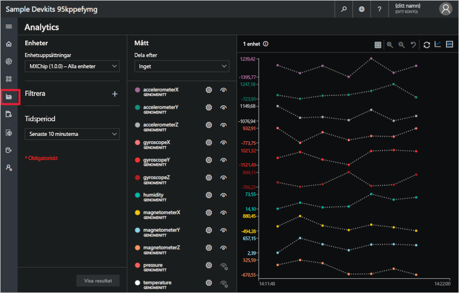

På analyssidan visas diagram där du kan se hur enheter som är anslutna till ditt program fungerar. En operatör använder den här sidan för att övervaka och undersöka problem med anslutna enheter. Byggaren kan definiera vilka diagram som ska visas på den här sidan. Mer information finns i artikeln om att [skapa anpassad analys för Azure IoT Central-programmet](howto-use-device-sets-experimental.md?toc=/azure/iot-central-experimental/toc.json&bc=/azure/iot-central-experimental/breadcrumb/toc.json).

## Jobb

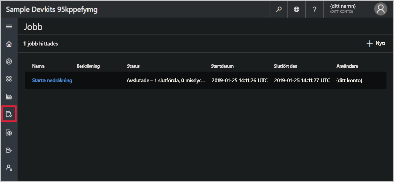

På sidan Jobb kan du utföra aktiviteter för massenhetshantering för dina enheter. Verktyget använder den här sidan för att uppdatera enhetsegenskaper, inställningar och kommandon. Mer information finns i artikeln [Köra ett jobb](howto-run-a-job-experimental.md?toc=/azure/iot-central-experimental/toc.json&bc=/azure/iot-central-experimental/breadcrumb/toc.json).

## Enhetsmallar

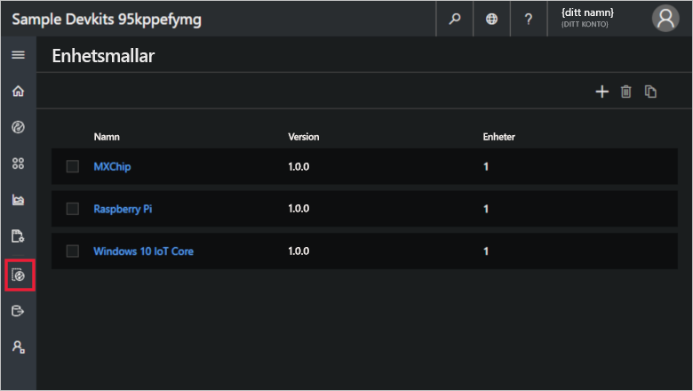

Sidan för enhetsmallar är där en byggare skapar och hanterar enhetsmallarna i programmet. Mer information finns i självstudien om att [definiera en ny enhetstyp i Azure IoT Central-programmet](tutorial-define-device-type-experimental.md?toc=/azure/iot-central-experimental/toc.json&bc=/azure/iot-central-experimental/breadcrumb/toc.json).

## Kontinuerlig dataexport

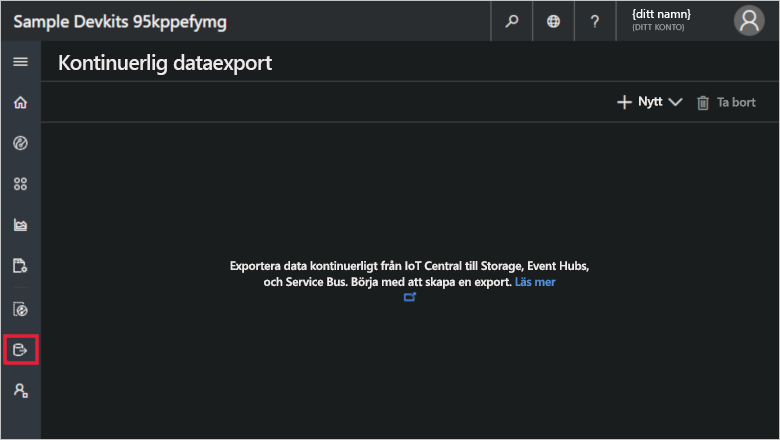

Sidan för kontinuerlig dataexport är där en administratör definierar hur data, till exempel telemetri, ska exporteras från programmet. Andra tjänster kan lagra exporterade data eller använda dem för analys. Mer information finns i artikeln om att [exportera dina data i Azure IoT Central](howto-export-data-experimental.md?toc=/azure/iot-central-experimental/toc.json&bc=/azure/iot-central-experimental/breadcrumb/toc.json).

## Administration

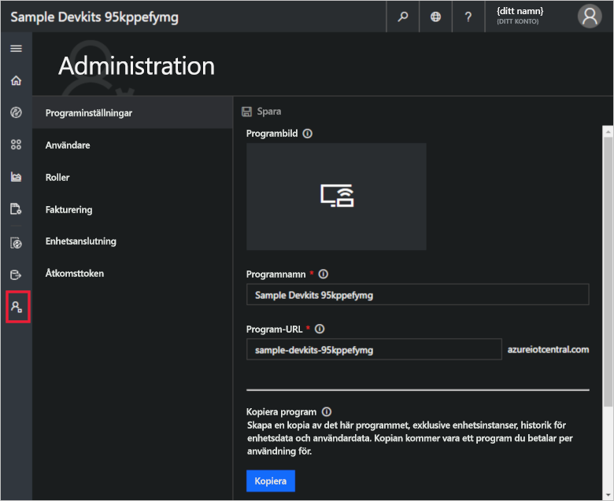

Administrationssidan innehåller länkar till de verktyg som en administratör använder till att exempelvis definiera användare och roller i programmet. Mer information finns i artikeln om att [administrera ditt Azure IoT Central-program](howto-administer-experimental.md?toc=/azure/iot-central-experimental/toc.json&bc=/azure/iot-central-experimental/breadcrumb/toc.json).

## Nästa steg

Nu när du har en översikt över Azure IoT Central och är bekant med layouten i användargränssnittet så föreslår vi att du slutför snabbstarten för att [skapa ett Azure IoT Central-program](quick-deploy-iot-central-experimental.md?toc=/azure/iot-central-experimental/toc.json&bc=/azure/iot-central-experimental/breadcrumb/toc.json).