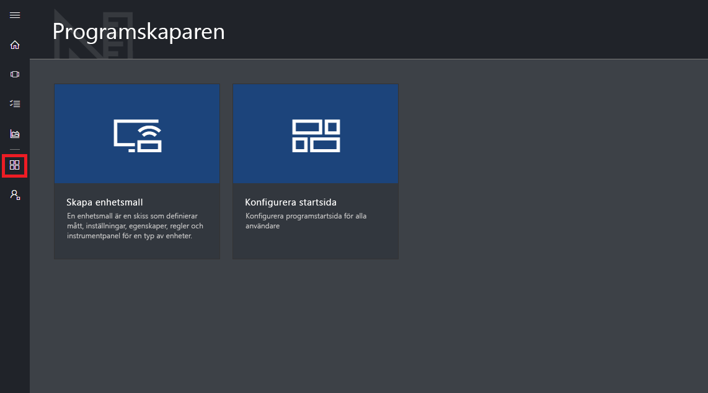

# Ta en rundtur i Azure IoT Central-användargränssnittet

Den här artikeln beskriver Microsoft Azure IoT Central-användargränssnittet. Du kan använda gränssnittet till att skapa, hantera och använda en Azure IoT Central-lösning och dess anslutna enheter.

Som _byggare_ använder du Azure IoT Central-användargränssnittet till att definiera din Azure IoT Central-lösning. Du kan använda användargränssnittet till att:

- ange vilka enhetstyper som kan ansluta till din lösning
- konfigurera regler och åtgärder för dina enheter
- anpassa användargränssnittet för en _operatör_ som använder din lösning.

Som _operatör_ använder du Azure IoT Central-användargränssnittet till att hantera din Azure IoT Central-lösning. Du kan använda användargränssnittet till att:

- övervaka dina enheter
- konfigurera dina enheter
- felsöka och åtgärda problem med dina enheter.
- Etablera nya enheter.

## Använda den vänstra navigeringsmenyn

Använd den vänstra navigeringsmenyn för att få åtkomst till de olika områdena för programmet:

| Meny | Beskrivning |
| ---- | ----------- |
|  | <ul><li>Knappen **Start** visar startsidan för ditt program. Som byggare kan du anpassa den här startsidan för dina operatörer.</li><li>Knappen **Device Explorer** (Enhetsutforskare) visar både enhetsmallar som har definierats i ditt program, samt simulerade och verkliga enheter som är associerade med varje enhetsmall. Som operatör kan du använda **Device Explorer** till att hantera dina anslutna enheter.</li><li>Med knappen **Device Sets** (Enhetsuppsättningar) kan du visa och skapa enhetsuppsättningar. Som operatör kan du skapa enhetsuppsättningar som en logisk samling av enheter som anges av en fråga.</li><li>Knappen **Analytics** (Analys) visar analys som härletts från enhetstelemetrin för enheter och enhetsuppsättningar. Som operatör kan du skapa anpassade vyer ovanpå enhetsdata för att kunna härleda insikter från ditt program.</li><li>Knappen **Application Builder** (Programbyggare) visar de verktyg som en byggare använder, exempelvis verktyget för att **skapa en enhetsmall**.</li><li>Knappen **Administration** visar programmets administrationssidor där administratören kan hantera programinställningar, användare och roller.</li></ul> |

## Sök, hjälp och support

Den översta menyn visas på varje sida:

- Om du vill söka efter enhetsmallar och enheter väljer du ikonen **Sök**.
- Om du behöver hjälp och support väljer du listrutan **Hjälp** för att visa en lista med resurser.
- Om du vill styra självstudierna, ändra användargränssnittstema eller logga ut från programmet väljer du ikonen **Konto**.

Du kan välja mellan ett ljust eller ett mörkt tema för användargränssnittet:

## Startsida

Startsidan är den första sida du ser när du loggar in på ditt Azure IoT Central-program. Som byggare kan du anpassa startsidan för andra användare av programmet genom att lägga till paneler. Mer information finns i självstudien om att [anpassa operatörsvyn i Azure IoT Central](tutorial-customize-operator.md).

## Enhetsutforskaren

På utforskningssidan visas de _enhetsmallar_ och _enheter_ som finns i ditt Azure IoT Central-program.

* En enhetsmall definierar en typ av enhet som kan ansluta till ditt program. Läs mer i informationen om att [definiera en ny enhetstyp i Azure IoT Central-programmet](tutorial-define-device-type.md).
* En enhet motsvarar antingen en verklig eller simulerad enhet i ditt program. Läs mer i informationen om att [lägga till en ny enhet i Azure IoT Central-programmet](tutorial-add-device.md).

## Enhetsuppsättningar

På sidan med _enhetsuppsättningar_ visas de enhetsuppsättningar som har skapats av byggaren. En enhetsuppsättning är en samling relaterade enheter. En byggare definierar en fråga för att identifiera de enheter som ingår i en enhetsuppsättning. Du använder enhetsuppsättningar när du anpassar analyser i ditt program. Mer information finns i artikeln om att [använda enhetsuppsättningar i Azure IoT Central-programmet](howto-use-device-sets.md).

## Analytics

På analyssidan visas diagram där du kan se hur enheter som är anslutna till ditt program fungerar. En operatör använder den här sidan för att övervaka och undersöka problem med anslutna enheter. Byggaren kan definiera vilka diagram som ska visas på den här sidan. Mer information finns i artikeln om att [skapa anpassad analys för Azure IoT Central-programmet](howto-create-analytics.md).

## Application Builder

Sidan Application Builder innehåller länkar till de verktyg som en byggare använder för att skapa ett Azure IoT Central-program, till exempel skapa enhetsmallar och konfigurera startsidan. Mer information finns i självstudien om att [definiera en ny enhetstyp i Azure IoT Central-programmet](tutorial-define-device-type.md).

## Administration

Administrationssidan innehåller länkar till de verktyg som en administratör använder till att exempelvis definiera användare och roller i programmet. Mer information finns i artikeln om att [administrera ditt Azure IoT Central-program](howto-administer.md).

## Nästa steg

Nu när du har en översikt över Azure IoT Central och är bekant med layouten i användargränssnittet så föreslår vi att du slutför snabbstarten för att [skapa ett Azure IoT Central-program](quick-deploy-iot-central.md).