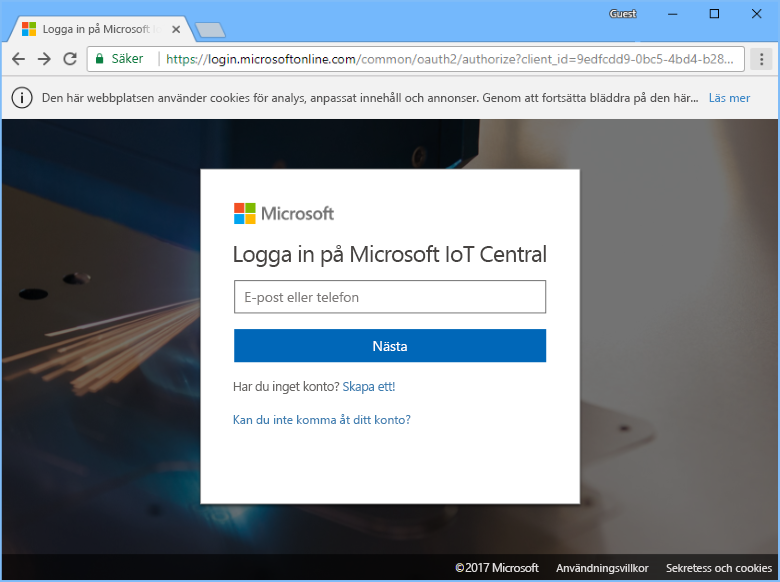
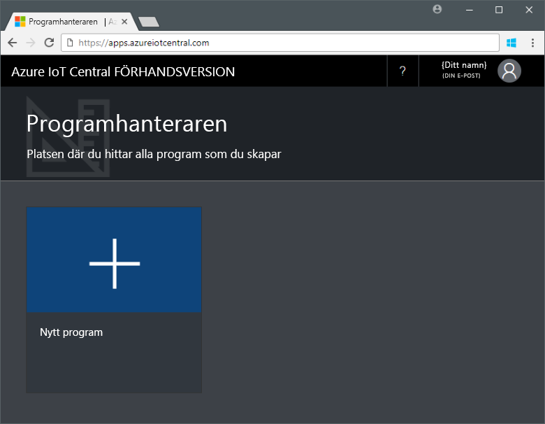
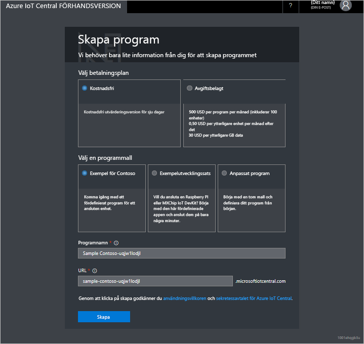

# Skapa ett Azure IoT Central-program

Som _byggare_ använder du Azure IoT Central-användargränssnittet till att definiera ditt Microsoft Azure IoT Central-program. I den här snabbstarten får du veta hur du:

- Skapa ett Azure IoT Central-program som innehåller ett exempel på en _enhetsmall_ och simulerade _enheter_.
- Visa funktionerna i enhetsmallen **Kylande varuautomat** i ditt program.
- Visa telemetri och analys från dina simulerade **kylskåp**.

I den här snabbstarten ser du ett simulerat **kylskåp** från en enhetsmall. Den simulerade enheten:

* Skickar telemetri, till exempel temperatur och tryck, till ditt program.
* Rapporterar enhetens egenskapsvärden, till exempel en rörelseavisering, till ditt program.
* Innehåller enhetsinställningar, till exempel fläkthastighet, som du kan ställa in i programmet.

När du skapar en simulerad enhet från en enhetsmall i Azure IoT Central-programmet, kan du med den simulerade enheten testa programmet innan du ansluter en riktig enhet.

## Skapa programmet

För att kunna slutföra den här snabbstarten måste du skapa ett Azure IoT Central-program från programmallen **Contoso-exempel**.

Gå till sidan [Application Manager](https://aka.ms/iotcentral) (Programhanterare) i Azure IoT Central. Ange sedan den e-postadress och det lösenord som du använder för att få åtkomst till din Azure-prenumeration:

Börja skapa ett nytt Azure IoT Central-program genom att välja **Nytt program**:

Skapa ett nytt Azure IoT Central-program:

1. Välj betalningsplanen **Kostnadsfri utvärderingsversion**.
1. Välj ett eget programnamn, exempelvis **Contoso IoT**. Du får ett unikt URL-prefix från Azure IoT Central. Du kan ändra URL-prefixet till något som är enklare att komma ihåg.
1. Välj programmallen **Contoso-exempel**.
1. Välj sedan **Skapa**.

## Nästa steg

I den här snabbstarten har du skapat ett förifyllt Azure IoT Central-program som innehåller enhetsmallen **Kylande varuautomat** och simulerade enheter. Se [Definiera en ny enhetsmall i ditt program](tutorial-define-device-type.md) för mer information om hur du som byggare kan definiera dina egna enhetsmallar.
