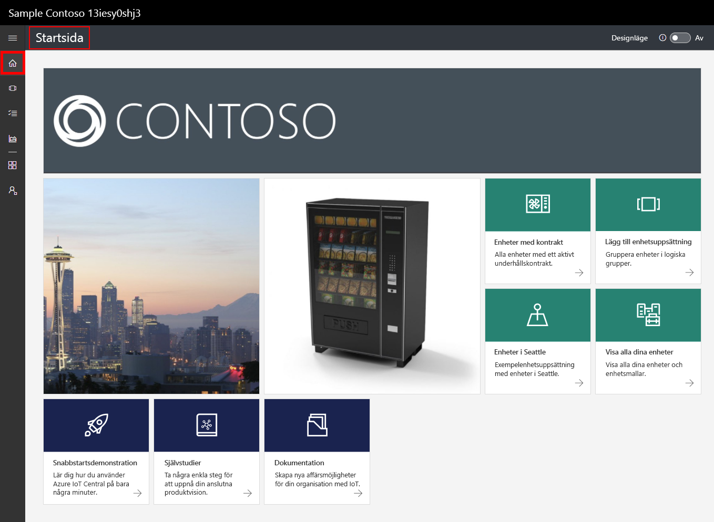
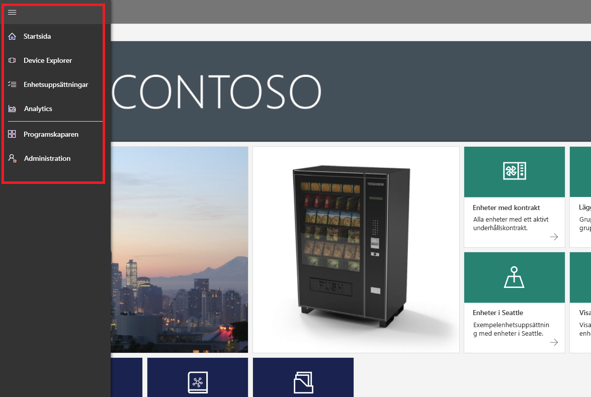
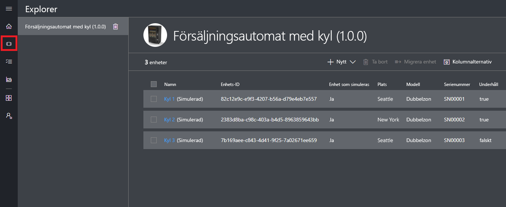
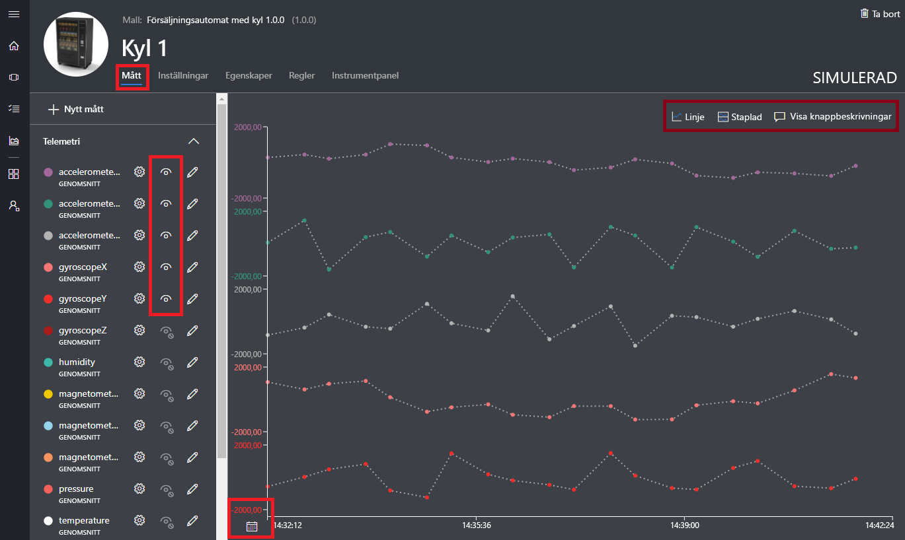
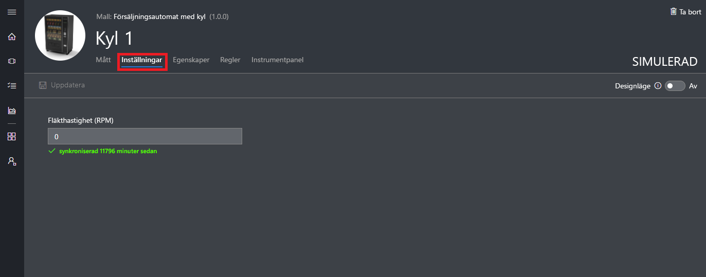
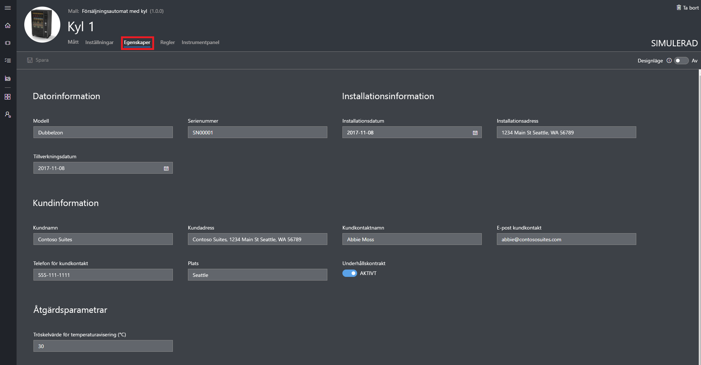
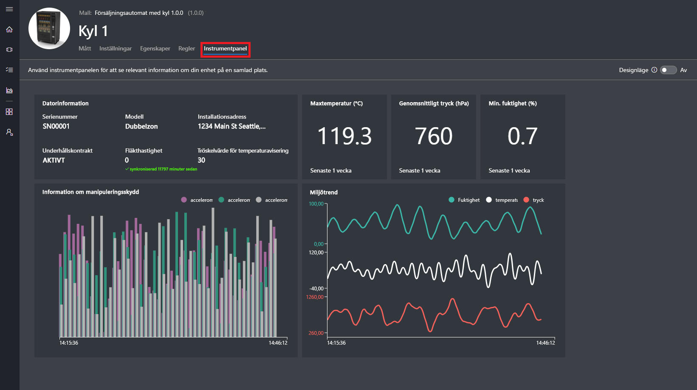
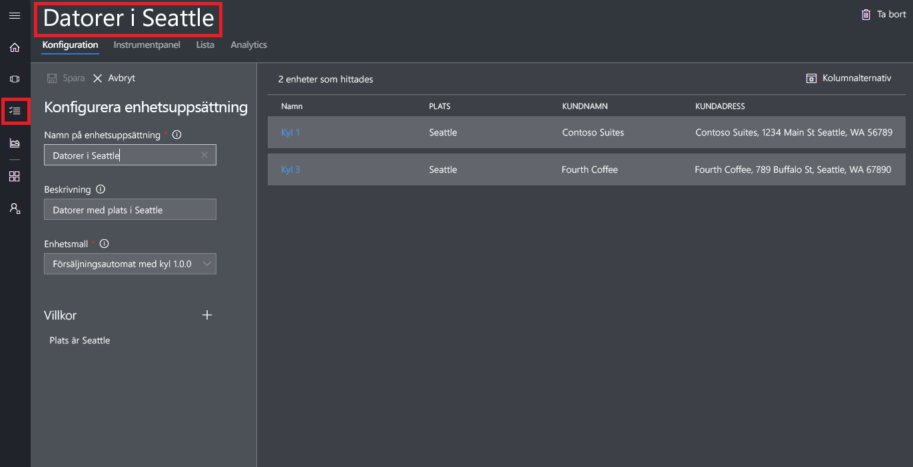
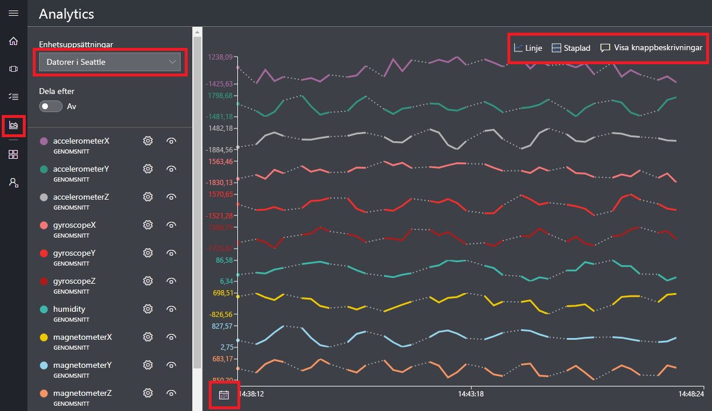

# Skapa ett Azure IoT Central-program

Som _byggare_ använder du Azure IoT Central-användargränssnittet till att definiera ditt Microsoft Azure IoT Central-program. I den här snabbstarten får du veta hur du:

- Skapa ett Azure IoT Central-program som innehåller ett exempel på en _enhetsmall_ och simulerade _enheter_.
- Visa funktionerna i enhetsmallen **Kylande varuautomat** i ditt program.
- Visa telemetri och analys från dina simulerade **kylskåp**.

I den här snabbstarten ser du ett simulerat **kylskåp** från en enhetsmall. Den simulerade enheten:

* Skickar telemetri, till exempel temperatur och tryck, till ditt program.
* Rapporterar enhetens egenskapsvärden, till exempel en rörelseavisering, till ditt program.
* Innehåller enhetsinställningar, till exempel fläkthastighet, som du kan ställa in i programmet.

När du skapar en simulerad enhet från en enhetsmall i Azure IoT Central-programmet, kan du med den simulerade enheten testa programmet innan du ansluter en riktig enhet.

## Skapa programmet

För att kunna slutföra den här snabbstarten måste du skapa ett Azure IoT Central-program från programmallen **Contoso-exempel**.

Gå till sidan [Application Manager](https://aka.ms/iotcentral) (Programhanterare) i Azure IoT Central. Ange sedan den e-postadress och det lösenord som du använder för att få åtkomst till din Azure-prenumeration:

Börja skapa ett nytt Azure IoT Central-program genom att välja **Nytt program**:

Skapa ett nytt Azure IoT Central-program:

1. Välj betalningsplanen **Kostnadsfri utvärderingsversion**.
1. Välj ett eget programnamn, exempelvis **Contoso IoT**. Du får ett unikt URL-prefix från Azure IoT Central. Du kan ändra URL-prefixet till något som är enklare att komma ihåg.
1. Välj programmallen **Contoso-exempel**.
1. Välj sedan **Skapa**.

## Gå till programmet

När ditt program är klart visas programmets **Startsida**. Du kan aktivera _Designläge_ längst upp till höger om du vill redigera startsidan. Programmets URL är den URL som du angav i föregående steg:

Använd den _vänstra navigeringsmenyn_ för att få åtkomst till de olika områdena i ditt nya Azure IoT Central-program:

Om du vill se enhetsmallar och enheter i ditt program väljer du **Device Explorer** i den vänstra navigeringsmenyn. Exempelprogrammet innehåller enhetsmallen **Kylande varuautomat**. Det finns tre simulerade enheter som redan har skapats från den här enhetsmallen:

## Visa enhetsmall och enheter

Använd följande steg för att se en kylskåpsenhet som har skapats från enhetsmallen **Kylande varuautomat**. En enhetsmall definierar:

* _Mått_, till exempel temperaturtelemetri, som skickas från en enhet.
* _Inställningar_, till exempel fläkthastighet, som gör att du kan styra enheten.
* _Egenskaper_, till exempel serienummer, som lagrar information om enheten.
* [Regler](howto-create-telemetry-rules.md), som gör att du kan automatisera åtgärder baserat på enhetens beteende.
* En anpassningsbar _instrumentpanel_ visar information om enheten.

Du kan skapa både simulerade och verkliga enheter från en enhetsmall.

### Mått

Sidan **Mått** för **Kylskåp 1** visas. Du kan se listan med mått som skickats från den simulerade enheten. Sidan visar även ett anpassningsbart diagram över de synliga måtten:

Du kan växla synligheten för enskilda element och anpassa diagrammet. Det aktuella diagrammet visar telemetri från en simulerad enhet. Du kan lägga till nya mått i enhetsmallen om du har rätt behörighet.

> [!NOTE]
> Du kan behöva vänta en stund innan simulerade data visas i diagrammet.

### Inställningar

Välj **Inställningar**. Du kan styra enheten på sidan **Inställningar**. Du kan till exempel uppdatera fläkthastigheten på kylskåpet:

En inställning visas som **synkroniserad** när enheten har bekräftat ändringen.

### Egenskaper

Välj **Egenskaper**. På sidan **Egenskaper** kan du:

* Hantera information om enheten, till exempel kundens namn.
* Visa egenskapsvärden som rapporterats av enheten, till exempel en rörelseavisering.

### Instrumentpanel

Välj **Instrumentpanel**. Instrumentpanelen är en anpassningsbar vy med information om enheten, till exempel mått, egenskaper och KPI:er:

## Visa analys

I föregående avsnitt visades vi hur du kan se information om en viss enhet. Du kan använda [enhetsuppsättningar](howto-use-device-sets.md) och [analys](howto-create-analytics.md) när du vill se sammanslagen information från flera enheter.

En enhetsuppsättning använder frågor för att dynamiskt välja den uppsättning enheter som uppfyller ett villkor. Till exempel väljer enhetsuppsättningen **Maskiner i Seattle** de kylskåpsenheter som finns i Seattle. Om du vill se enhetsuppsättningen **Maskiner i Seattle** väljer du **Enhetsuppsättningar** i den vänstra navigeringsmenyn och sedan **Maskiner i Seattle**:

Du kan se analysdata för enheterna i en enhetsuppsättning på sidan **Analys**:

## Nästa steg

I den här snabbstarten har du skapat ett förifyllt Azure IoT Central-program som innehåller enhetsmallen **Kylande varuautomat** och simulerade enheter. Se [Definiera en ny enhetsmall i ditt program](tutorial-define-device-type.md) för mer information om hur du som byggare kan definiera dina egna enhetsmallar.
