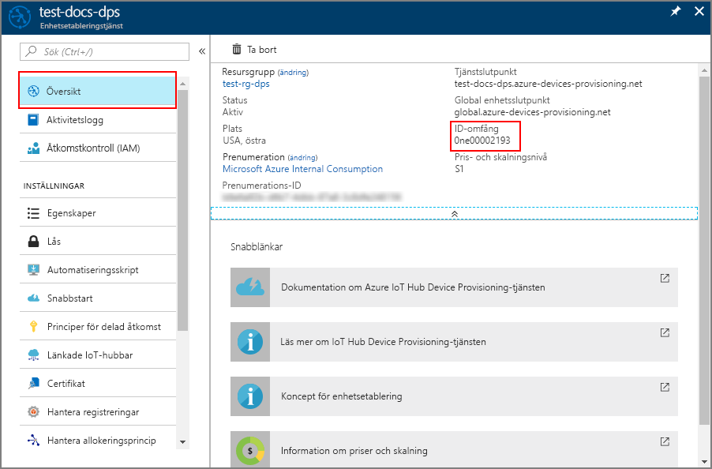

# <a name="how-to-provision-for-multitenancy"></a>Så här etablerar du för flera klientorganisationer 

Den här artikeln visar hur du på ett säkert sätt kan etablera flera symmetriska nyckel enheter till en grupp med IoT-hubbar med hjälp av en [resursallokeringsprincip](concepts-service.md#allocation-policy). De allokeringsregler som definieras av etablerings tjänsten har stöd för olika fördelnings scenarier. Två vanliga scenarier:

* **Geolokalisering/lång latens**: när en enhet flyttas mellan platser förbättras nätverks fördröjningen genom att enheten tillhandahålls till IoT-hubben närmast varje plats. I det här scenariot väljs en grupp IoT-hubbar, som sträcker sig över flera regioner, för registreringar. Den **lägsta latens** tilldelnings principen väljs för dessa registreringar. Den här principen gör att enhets etablerings tjänsten utvärderar enhets fördröjning och fastställer garderob IoT Hub från gruppen med IoT-hubbar. 

* **Flera innehavare**: enheter som används i en IoT-lösning kan behöva tilldelas till en speciell IoT-hubb eller en grupp med IoT-hubbar. Lösningen kan kräva att alla enheter för en viss klient kan kommunicera med en viss grupp IoT-hubbar. I vissa fall kan en klient äga IoT-hubbar och kräva att enheter tilldelas sina IoT-hubbar.

Det är vanligt att kombinera dessa två scenarier. En IoT-lösning med flera innehavare tilldelar till exempel vanligt vis klient enheter med en grupp IoT-hubbar som är spridda över flera regioner. Dessa klient enheter kan tilldelas IoT Hub i gruppen, som har den lägsta svars tiden baserat på geografisk plats.

I den här artikeln används ett simulerat enhets exempel från [Azure IoT C SDK](https://github.com/Azure/azure-iot-sdk-c) som visar hur du etablerar enheter i ett scenario med flera innehavare över flera regioner. Du kommer att utföra följande steg i den här artikeln:

* Använd Azure CLI för att skapa två regionala IoT-hubbar (**västra USA** och **östra USA**)
* Skapa en registrering för flera innehavare
* Använd Azure CLI för att skapa två regionala virtuella Linux-datorer som fungerar som enheter i samma regioner (**USA, västra** och USA, **östra**)
* Konfigurera utvecklings miljön för Azure IoT C SDK på virtuella Linux-datorer
* Simulera enheterna för att se att de är etablerade för samma klient organisation i den närmaste regionen.


[!INCLUDE [quickstarts-free-trial-note](../../includes/quickstarts-free-trial-note.md)]


## <a name="prerequisites"></a>Krav

- [Konfigurations IoT Hub Device Provisioning service har](./quick-setup-auto-provision.md) slutförts med snabb starten för Azure Portal.
[!INCLUDE [azure-cli-prepare-your-environment-no-header.md](../../includes/azure-cli-prepare-your-environment-no-header.md)]

## <a name="create-two-regional-iot-hubs"></a>Skapa två regionala IoT-hubbar

I det här avsnittet ska du använda Azure Cloud Shell för att skapa två nya regionala IoT-hubbar i regionerna **USA, västra** och **USA, östra** för en klient.


1. Använd Azure Cloud Shell för att skapa en resurs grupp med kommandot [AZ Group Create](/cli/azure/group#az-group-create) . En Azure-resursgrupp är en logisk container där Azure-resurser distribueras och hanteras. 

    I följande exempel skapas en resurs grupp med namnet *contoso-US-Resource-Group* i regionen *östra* . Vi rekommenderar att du använder den här gruppen för alla resurser som skapats i den här artikeln. Det blir enklare att rensa när du är klar.

    ```azurecli-interactive 
    az group create --name contoso-us-resource-group --location eastus
    ```

2. Använd Azure Cloud Shell för att skapa en IoT-hubb i **östra** regionen med kommandot [AZ IoT Hub Create](/cli/azure/iot/hub#az-iot-hub-create) . IoT Hub kommer att läggas till i *contoso-US-Resource-Group*.

    I följande exempel skapas en IoT-hubb med namnet *contoso-öst-Hub* på platsen *öster* . Du måste använda ditt eget unika nav i stället för **contoso-öst-Hub**.

    ```azurecli-interactive 
    az iot hub create --name contoso-east-hub --resource-group contoso-us-resource-group --location eastus --sku S1
    ```
    
    Det kan ta några minuter att slutföra kommandot.

3. Använd Azure Cloud Shell för att skapa en IoT-hubb i regionen **väst** med kommandot [AZ IoT Hub Create](/cli/azure/iot/hub#az-iot-hub-create) . Den här IoT-hubben läggs också till i *contoso-US-Resource-Group*.

    I följande exempel skapas en IoT-hubb med namnet *contoso-väst-Hub* på platsen för *västkusten* . Du måste använda ditt eget unika nav i stället för **contoso-väst-Hub**.

    ```azurecli-interactive 
    az iot hub create --name contoso-west-hub --resource-group contoso-us-resource-group --location westus --sku S1
    ```

    Det kan ta några minuter att slutföra kommandot.


## <a name="create-the-multitenant-enrollment"></a>Skapa registrering för flera innehavare

I det här avsnittet ska du skapa en ny registrerings grupp för klient enheterna.  

För enkelhetens skull använder den här artikeln [symmetrisk nyckel attestering](concepts-symmetric-key-attestation.md) med registreringen. För en säkrare lösning bör du överväga att använda [X. 509 certifikat attestering](concepts-x509-attestation.md) med en förtroende kedja.

1. Logga in på [Azure Portal](https://portal.azure.com)och öppna din enhets etablerings tjänst instans.

2. Välj fliken **Hantera registreringar** och klicka sedan på knappen **Lägg till registrerings grupp** överst på sidan. 

3. I **Lägg till registrerings grupp** anger du följande information och klickar på knappen **Spara** .

    **Grupp namn**: ange **contoso-US-Devices**.

    **Attesterings typ**: Välj **symmetrisk nyckel**.

    **Generera nycklar automatiskt**: den här kryss rutan ska redan vara markerad.

    **Välj hur du vill tilldela enheter till hubbar**: Välj **lägsta latens**.

    


4. I **Lägg till registrerings grupp** klickar du på **Länka en ny IoT-hubb** för att länka båda dina regionala hubbar.

    **Prenumeration**: om du har flera prenumerationer väljer du den prenumeration där du skapade de regionala IoT-hubbarna.

    **IoT Hub**: Välj ett av de regionala hubbar som du skapade.

    **Åtkomst princip**: Välj **iothubowner**.

    


5. När båda regionala IoT-hubbar har länkats måste du välja dem för registrerings gruppen och klicka på **Spara** för att skapa den regionala IoT Hub-gruppen för registreringen.

    


6. När du har sparat registreringen kan du öppna den igen och anteckna den **primära nyckeln**. Du måste spara registreringen innan du genererar nycklarna. Den här nyckeln kommer att användas för att generera unika enhets nycklar för båda simulerade enheter senare.


## <a name="create-regional-linux-vms"></a>Skapa regionala virtuella Linux-datorer

I det här avsnittet ska du skapa två regionala virtuella Linux-datorer (VM). De här virtuella datorerna kör ett exempel på enhets simulering från varje region för att demonstrera enhets etablering för klient enheter från båda regionerna.

För att göra rensningen enklare kommer de virtuella datorerna att läggas till i samma resurs grupp som innehåller de IoT-hubbar som har skapats, *contoso-US-resurs-grupp*. De virtuella datorerna kommer dock att köras i separata regioner (**västra USA** och **östra USA**).

1. I Azure Cloud Shell kör du följande kommando för att skapa en virtuell **amerikansk** region i USA efter att du har gjort följande parameter ändringar i kommandot:

    **--Name**: Ange ett unikt namn för den virtuella **USA** -datorn med regional enhet. 

    **--admin-username**: Använd ditt eget administratörs användar namn.

    **--admin-Password**: Använd ditt eget administratörs lösen ord.

    ```azurecli-interactive
    az vm create \
    --resource-group contoso-us-resource-group \
    --name ContosoSimDeviceEast \
    --location eastus \
    --image Canonical:UbuntuServer:18.04-LTS:18.04.201809110 \
    --admin-username contosoadmin \
    --admin-password myContosoPassword2018 \
    --authentication-type password
    ```

    Kommandot tar fem minuter att slutföra. När kommandot har slutförts noterar du **publicIpAddress** -värdet för din virtuella USA-region i USA.

1. I Azure Cloud Shell kör du kommandot för att skapa en region för **västra USA** -regionen när du har gjort följande parameter ändringar i kommandot:

    **--Name**: Ange ett unikt namn för den virtuella datorn med din regionala enhet för **västra USA** . 

    **--admin-username**: Använd ditt eget administratörs användar namn.

    **--admin-Password**: Använd ditt eget administratörs lösen ord.

    ```azurecli-interactive
    az vm create \
    --resource-group contoso-us-resource-group \
    --name ContosoSimDeviceWest \
    --location westus \
    --image Canonical:UbuntuServer:18.04-LTS:18.04.201809110 \
    --admin-username contosoadmin \
    --admin-password myContosoPassword2018 \
    --authentication-type password
    ```

    Kommandot tar fem minuter att slutföra. När kommandot har slutförts noterar du **publicIpAddress** -värdet för din virtuella USA-region, västra.

1. Öppna två kommando rads gränssnitt. Anslut till en av de regionala virtuella datorerna i varje gränssnitt med SSH. 

    Skicka ditt administratörs användar namn och den offentliga IP-adressen som du antecknade för den virtuella datorn som parametrar för SSH. Ange administratörs lösen ordet när du uppmanas till det.

    ```bash
    ssh contosoadmin@1.2.3.4

    contosoadmin@ContosoSimDeviceEast:~$
    ```

    ```bash
    ssh contosoadmin@5.6.7.8

    contosoadmin@ContosoSimDeviceWest:~$
    ```


## <a name="prepare-the-azure-iot-c-sdk-development-environment"></a>Förbered utvecklings miljön för Azure IoT C SDK

I det här avsnittet ska du klona Azure IoT C SDK på varje virtuell dator. SDK: n innehåller ett exempel som simulerar en klients enhets etablering från varje region.

1. För varje virtuell dator installerar du **cmake**, **g + +**, **gcc** och [git](https://git-scm.com/book/en/v2/Getting-Started-Installing-Git) med följande kommandon:

    ```bash
    sudo apt-get update
    sudo apt-get install cmake build-essential libssl-dev libcurl4-openssl-dev uuid-dev git-all
    ```

1. Hitta taggnamnet för den [senaste versionen](https://github.com/Azure/azure-iot-sdk-c/releases/latest) av SDK.

1. Klona [Azure IoT C SDK](https://github.com/Azure/azure-iot-sdk-c) på båda virtuella datorerna.  Använd taggen som du hittade i föregående steg som `-b` parameter värde:

    ```bash
    git clone -b <release-tag> https://github.com/Azure/azure-iot-sdk-c.git
    cd azure-iot-sdk-c
    git submodule update --init
    ```

    Den här åtgärden kan förväntas ta flera minuter att slutföra.

1. Skapa en ny **cmake** -mapp i lagrings platsen för båda de virtuella datorerna och ändra till mappen.

    ```bash
    mkdir ~/azure-iot-sdk-c/cmake
    cd ~/azure-iot-sdk-c/cmake
    ```

1. Kör följande kommando för båda virtuella datorerna, som skapar en version av SDK som är specifika för din utvecklings klient plattform. 

    ```bash
    cmake -Dhsm_type_symm_key:BOOL=ON -Duse_prov_client:BOOL=ON  ..
    ```

    När bygget är klart ser de sista utdataraderna ut ungefär som följande utdata:

    ```bash
    -- IoT Client SDK Version = 1.2.9
    -- Provisioning client ON
    -- Provisioning SDK Version = 1.2.9
    -- target architecture: x86_64
    -- Checking for module 'libcurl'
    --   Found libcurl, version 7.58.0
    -- Found CURL: curl
    -- target architecture: x86_64
    -- target architecture: x86_64
    -- target architecture: x86_64
    -- target architecture: x86_64
    -- iothub architecture: x86_64
    -- target architecture: x86_64
    -- Configuring done
    -- Generating done
    -- Build files have been written to: /home/contosoadmin/azure-iot-sdk-c/cmake
    ```    


## <a name="derive-unique-device-keys"></a>Härled unika enhets nycklar

När du använder symmetrisk nyckel attestering med grupp registreringar använder du inte nycklarna för registrerings gruppen direkt. I stället skapar du en unik härledd nyckel för varje enhet och anges i [grupp registreringar med symmetriska nycklar](concepts-symmetric-key-attestation.md#group-enrollments).

Generera enhets nyckeln genom att använda gruppens huvud nyckel för att beräkna en [HMAC-SHA256](https://wikipedia.org/wiki/HMAC) av det unika registrerings-ID: t för enheten och konvertera resultatet till base64-format.

Ta inte med din grupp huvud nyckel i enhets koden.

Använd exemplet bash shell för att skapa en härledd enhets nyckel för varje enhet med hjälp av **openssl**.

- Ersätt värdet för **Key** med den **primära nyckel** som du antecknade tidigare för din registrering.

- Ersätt värdet för **REG_ID** med ditt eget unika registrerings-ID för varje enhet. Använd gemena alfanumeriska tecken och bindestreck (-) för att definiera båda ID: na.

Exempel på generering av enhets nyckel för *contoso-simdevice – öst*:

```bash
KEY=rLuyBPpIJ+hOre2SFIP9Ajvdty3j0EwSP/WvTVH9eZAw5HpDuEmf13nziHy5RRXmuTy84FCLpOnhhBPASSbHYg==
REG_ID=contoso-simdevice-east

keybytes=$(echo $KEY | base64 --decode | xxd -p -u -c 1000)
echo -n $REG_ID | openssl sha256 -mac HMAC -macopt hexkey:$keybytes -binary | base64
```

```bash
p3w2DQr9WqEGBLUSlFi1jPQ7UWQL4siAGy75HFTFbf8=
```

Exempel på generering av enhets nyckel för *contoso-simdevice-väst*:

```bash
KEY=rLuyBPpIJ+hOre2SFIP9Ajvdty3j0EwSP/WvTVH9eZAw5HpDuEmf13nziHy5RRXmuTy84FCLpOnhhBPASSbHYg==
REG_ID=contoso-simdevice-west

keybytes=$(echo $KEY | base64 --decode | xxd -p -u -c 1000)
echo -n $REG_ID | openssl sha256 -mac HMAC -macopt hexkey:$keybytes -binary | base64
```

```bash
J5n4NY2GiBYy7Mp4lDDa5CbEe6zDU/c62rhjCuFWxnc=
```


Klient enheterna kommer att använda sin härledda enhets nyckel och ett unikt registrerings-ID för att utföra symmetrisk nyckel attestering med registrerings gruppen under etableringen till klientens IoT-hubbar.


## <a name="simulate-the-devices-from-each-region"></a>Simulera enheterna från varje region


I det här avsnittet ska du uppdatera ett etablerings exempel i Azure IoT C SDK för båda regionala virtuella datorer. 

Exempel koden simulerar en enhets startsekvens som skickar etablerings förfrågan till din enhets etablerings tjänst instans. Startsekvensen gör att enheten identifieras och tilldelas IoT-hubben som är närmast beroende av svars tiden.

1. I Azure-portalen väljer du fliken **Översikt** för enhetsetableringstjänsten och noterar värdet för **_ID-omfång_**.

     

1. Öppna **~/Azure-IoT-SDK-c/Provisioning- \_ klient/sampel/ \_ \_ testa dev client- \_ exemplet/bevisa \_ dev \_ client \_ Sample. c** för redigering på båda virtuella datorerna.

    ```bash
    vi ~/azure-iot-sdk-c/provisioning_client/samples/prov_dev_client_sample/prov_dev_client_sample.c
    ```

1. Hitta konstanten `id_scope` och ersätt värdet med ditt värde för **ID-omfång** som du kopierade tidigare. 

    ```c
    static const char* id_scope = "0ne00002193";
    ```

1. Hitta definitionen för funktionen `main()` i samma fil. Se till att `hsm_type` variabeln har angetts `SECURE_DEVICE_TYPE_SYMMETRIC_KEY` enligt nedan för att matcha registrerings gruppens attesterings metod. 

    Spara ändringarna i filerna på båda de virtuella datorerna.

    ```c
    SECURE_DEVICE_TYPE hsm_type;
    //hsm_type = SECURE_DEVICE_TYPE_TPM;
    //hsm_type = SECURE_DEVICE_TYPE_X509;
    hsm_type = SECURE_DEVICE_TYPE_SYMMETRIC_KEY;
    ```

1. På båda de virtuella datorerna hittar du ett anrop till `prov_dev_set_symmetric_key_info()` i **test av dev- \_ \_ klienten \_ . c** som är kommenterad.

    ```c
    // Set the symmetric key if using they auth type
    //prov_dev_set_symmetric_key_info("<symm_registration_id>", "<symmetric_Key>");
    ```

    Ta bort kommentarer till funktions anropen och ersätt plats hållarnas värden (inklusive vinkelparenteser) med de unika registrerings-ID: na och härledda enhets nycklar för varje enhet. De nycklar som visas nedan är endast till exempel syfte. Använd de nycklar som du skapade tidigare.

    USA, östra:
    ```c
    // Set the symmetric key if using they auth type
    prov_dev_set_symmetric_key_info("contoso-simdevice-east", "p3w2DQr9WqEGBLUSlFi1jPQ7UWQL4siAGy75HFTFbf8=");
    ```

    Västra USA:
    ```c
    // Set the symmetric key if using they auth type
    prov_dev_set_symmetric_key_info("contoso-simdevice-west", "J5n4NY2GiBYy7Mp4lDDa5CbEe6zDU/c62rhjCuFWxnc=");
    ```

    Spara filerna.

1. På båda virtuella datorerna navigerar du till exempel mappen som visas nedan och skapar exemplet.

    ```bash
    cd ~/azure-iot-sdk-c/cmake/provisioning_client/samples/prov_dev_client_sample/
    cmake --build . --target prov_dev_client_sample --config Debug
    ```

1. När bygget lyckas kan du köra **en \_ dev dev- \_ klient \_sample.exe** på båda virtuella datorerna för att simulera en klient enhet från varje region. Observera att varje enhet allokeras till den klient IoT-hubb som är närmast den simulerade enhetens regioner.

    Kör simuleringen:
    ```bash
    ~/azure-iot-sdk-c/cmake/provisioning_client/samples/prov_dev_client_sample/prov_dev_client_sample
    ```

    Exempel på utdata från den virtuella datorn USA, östra:

    ```bash
    contosoadmin@ContosoSimDeviceEast:~/azure-iot-sdk-c/cmake/provisioning_client/samples/prov_dev_client_sample$ ./prov_dev_client_sample
    Provisioning API Version: 1.2.9

    Registering Device

    Provisioning Status: PROV_DEVICE_REG_STATUS_CONNECTED
    Provisioning Status: PROV_DEVICE_REG_STATUS_ASSIGNING
    Provisioning Status: PROV_DEVICE_REG_STATUS_ASSIGNING

    Registration Information received from service: contoso-east-hub.azure-devices.net, deviceId: contoso-simdevice-east
    Press enter key to exit:

    ```

    Exempel på utdata från den virtuella datorn västra USA:
    ```bash
    contosoadmin@ContosoSimDeviceWest:~/azure-iot-sdk-c/cmake/provisioning_client/samples/prov_dev_client_sample$ ./prov_dev_client_sample
    Provisioning API Version: 1.2.9

    Registering Device

    Provisioning Status: PROV_DEVICE_REG_STATUS_CONNECTED
    Provisioning Status: PROV_DEVICE_REG_STATUS_ASSIGNING
    Provisioning Status: PROV_DEVICE_REG_STATUS_ASSIGNING

    Registration Information received from service: contoso-west-hub.azure-devices.net, deviceId: contoso-simdevice-west
    Press enter key to exit:
    ```


## <a name="clean-up-resources"></a>Rensa resurser

Om du planerar att fortsätta arbeta med resurser som skapats i den här artikeln kan du lämna dem. Om du inte planerar att fortsätta använda resursen kan du använda följande steg för att ta bort alla resurser som skapats i den här artikeln för att undvika onödiga kostnader.

Stegen här förutsätter att du har skapat alla resurser i den här artikeln enligt anvisningarna i samma resurs grupp med namnet **contoso-US-Resource-Group**.

> [!IMPORTANT]
> Att ta bort en resursgrupp kan inte ångras. Resursgruppen och alla resurser som ingår i den tas bort permanent. Kontrollera att du inte av misstag tar bort fel resursgrupp eller resurser. Om du har skapat IoT Hub:en inuti en befintlig resursgrupp som innehåller resurser som du vill behålla, ta bara bort själva IoT Hub-resursen i stället för att ta bort resursgruppen.
>

Så här tar du bort resurs gruppen efter namn:

1. Logga in på [Azure Portal](https://portal.azure.com) och klicka på **Resursgrupper**.

2. I text rutan **Filtrera efter namn...** skriver du namnet på den resurs grupp som innehåller dina resurser, **contoso-US-Resource-Group**. 

3. Till höger av din resursgrupp i resultatlistan klickar du på **...** och därefter **Ta bort resursgrupp**.

4. Du blir ombedd att bekräfta borttagningen av resursgruppen. Skriv namnet på din resursgrupp igen för att bekräfta och klicka sedan på **Ta bort**. Efter en liten stund tas resursgruppen och resurser som finns i den bort.

## <a name="next-steps"></a>Nästa steg

- Mer information om hur du reetablerar finns i [IoT Hub metoder för att etablera enheter](concepts-device-reprovision.md) 
- Mer information om hur du avetablerar [enheter finns i så här avetablerar du enheter som tidigare var automatiskt etablerade](how-to-unprovision-devices.md) 


