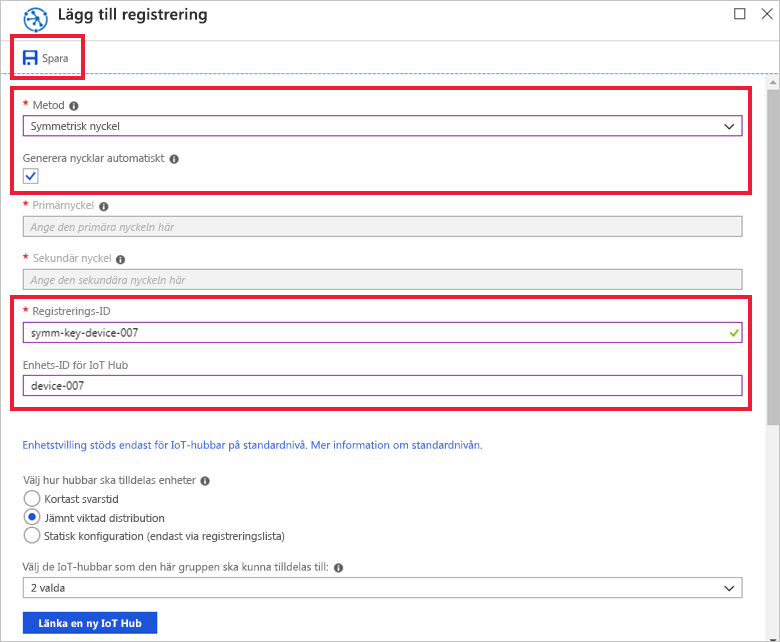

# <a name="quickstart-provision-a-simulated-device-with-symmetric-keys"></a>Snabbstart: Etablera en simulerad enhet med symmetriska nycklar

I den här snabbstarten får lära dig att skapa och köra en enhetssimulator på en Windows-utvecklingsdator. Du konfigurerar den här simulerade enheten för att använda en symmetrisk nyckel för att autentisera med hjälp av en enhetsetableringstjänstinstans och för att tilldelas till en IoT-hubb. Exempelkoden från [Azure IoT C SDK](https://github.com/Azure/azure-iot-sdk-c) används för att simulera en startsekvens för enheten som initierar etablering. Enheten identifieras baserat på enskild registrering med etableringstjänstinstansen och tilldelas till en IoT-hubb.

Även om den här artikeln visar etablering med en enskild registrering kan du använda registrerings grupper. Det finns vissa skillnader när du använder registrerings grupper. Du måste till exempel använda en härledd enhets nyckel med ett unikt registrerings-ID för enheten. Även om registreringsgrupper för symmetrisk nyckel inte är begränsade till äldre enheter finns det ett exempel för registreringsgrupper i avsnittet om [hur du etablerar äldre enheter med symmetrisk nyckelattestering](how-to-legacy-device-symm-key.md). Mer information finns i avsnittet om [gruppregistreringar för symmetrisk nyckelattestering](concepts-symmetric-key-attestation.md#group-enrollments).

Om du inte är bekant med processen för automatisk etablering, granskar du [etablerings](about-iot-dps.md#provisioning-process) översikten. 

Se även till att slutföra stegen i [Set up IoT Hub Device Provisioning Service with the Azure portal](./quick-setup-auto-provision.md) (Konfigurera IoT Hub-enhetsetableringstjänsten med Azure-portalen) innan du fortsätter med den här snabbstarten. Den här snabbstarten kräver att du redan har skapat en Device Provisioning Service-instans.

Den här artikeln riktar sig till en Windows-arbetsstation. Du kan dock utföra procedurerna i Linux. Ett Linux-exempel finns i informationen om att [etablera för flera innehavare](how-to-provision-multitenant.md).


[!INCLUDE [quickstarts-free-trial-note](../../includes/quickstarts-free-trial-note.md)]


## <a name="prerequisites"></a>Krav

Följande förutsättningar gäller för en Windows-utvecklings miljö. För Linux eller macOS, se lämpligt avsnitt i [förbereda utvecklings miljön](https://github.com/Azure/azure-iot-sdk-c/blob/master/doc/devbox_setup.md) i SDK-dokumentationen.

* [Visual Studio](https://visualstudio.microsoft.com/vs/) 2019 med arbets belastningen ["Skriv bords utveckling med C++"](/cpp/ide/using-the-visual-studio-ide-for-cpp-desktop-development) aktiverat. Visual Studio 2015 och Visual Studio 2017 stöds också.

* Senaste versionen av [Git](https://git-scm.com/download/) installerad.

<a id="setupdevbox"></a>

## <a name="prepare-an-azure-iot-c-sdk-development-environment"></a>Förbereda en utvecklingsmiljö för Azure IoT C SDK

I det här avsnittet förbereder du en utvecklingsmiljö som används för att skapa [Azure IoT C SDK](https://github.com/Azure/azure-iot-sdk-c). 

SDK innehåller exempelkod för en simulerad enhet. Den här simulerade enheten försöker etablera under enhetens startsekvens.

1. Ladda ned [cmake build-systemet](https://cmake.org/download/).

    Det är viktigt att förutsättningarna för Visual Studio (Visual Studio och arbetsbelastningen ”Desktop development with C++” (Skrivbordsutveckling med C++)) är installerade på datorn **innan** installationen av `CMake` påbörjas. När förutsättningarna är uppfyllda och nedladdningen har verifierats installerar du CMake-byggesystemet.

    Äldre versioner av CMake build-systemet kan inte generera lösnings filen som används i den här artikeln. Se till att använda en nyare version av CMake.

2. Klicka på **taggar** och hitta taggnamnet för den senaste versionen på [sidan release i Azure IoT C SDK](https://github.com/Azure/azure-iot-sdk-c/releases/latest).

3. Öppna en kommandotolk eller Git Bash-gränssnittet. Kör följande kommandon för att klona den senaste versionen av [Azure IoT C SDK](https://github.com/Azure/azure-iot-sdk-c) GitHub-lagringsplatsen. Använd taggen som du hittade i föregående steg som `-b` parameter värde:

    ```cmd/sh
    git clone -b <release-tag> https://github.com/Azure/azure-iot-sdk-c.git
    cd azure-iot-sdk-c
    git submodule update --init
    ```

    Den här åtgärden kan förväntas ta flera minuter att slutföra.

4. Skapa en `cmake`-underkatalog i rotkatalogen på git-lagringsplatsen och navigera till den mappen. Kör följande kommandon från `azure-iot-sdk-c` katalogen:

    ```cmd/sh
    mkdir cmake
    cd cmake
    ```

5. Kör följande kommando som skapar en version av SDK:t som är specifik för plattformen i din utvecklingsklient. En Visual Studio-lösning för den simulerade enheten genereras i `cmake`-katalogen. 

    ```cmd
    cmake -Dhsm_type_symm_key:BOOL=ON -Duse_prov_client:BOOL=ON  ..
    ```
    
    Om `cmake` inte hittar din C++-kompilerare kan du få kompileringsfel när du kör kommandot ovan. Om det händer ska du försöka köra det här kommandot i [kommandotolken i Visual Studio](/dotnet/framework/tools/developer-command-prompt-for-vs). 

    När bygget är klart ser de sista utdataraderna ut ungefär som följande utdata:

    ```cmd/sh
    $ cmake -Dhsm_type_symm_key:BOOL=ON -Duse_prov_client:BOOL=ON  ..
    -- Building for: Visual Studio 15 2017
    -- Selecting Windows SDK version 10.0.16299.0 to target Windows 10.0.17134.
    -- The C compiler identification is MSVC 19.12.25835.0
    -- The CXX compiler identification is MSVC 19.12.25835.0

    ...

    -- Configuring done
    -- Generating done
    -- Build files have been written to: E:/IoT Testing/azure-iot-sdk-c/cmake
    ```

## <a name="create-a-device-enrollment-entry-in-the-portal"></a>Skapa en post för enhetsregistrering i portalen

1. Logga in på [Azure Portal](https://portal.azure.com), Välj knappen **alla resurser** i den vänstra menyn och öppna Device Provisioning-tjänsten.

2. Välj fliken **Hantera registreringar** och välj sedan knappen **Lägg till individuell registrering** överst. 

3. Ange följande information på panelen **Lägg till registrering** och tryck på knappen **Spara** .

   - **Mekanism:** välj **Symmetrisk nyckel** som identitetsattesterings *mekanism*.

   - **Generera nycklar automatiskt**: Markera den här kryss rutan.

   - **Registrerings-ID**: Ange ett registrerings-ID för att identifiera registreringen. Använd endast alfanumeriska gemener och bindestreck (”-”). Till exempel **symm-Key-Device-007**.

   - **Enhets-ID för IoT Hub:** Ange en enhetsidentifierare. Till exempel **device-007**.

     

4. När du har sparat registreringen genereras **primär nyckeln** och den **sekundära nyckeln** och läggs till i registrerings posten. Registreringen av din symmetriska nyckel visas som **symm-key-device-007** under kolumnen *Registrerings-ID* på fliken *Enskilda registreringar*. 

    Öppna registreringen och kopiera värdet för din genererade **primärnyckel**.


<a id="firstbootsequence"></a>

## <a name="simulate-first-boot-sequence-for-the-device"></a>Simulera första startsekvens för enheten

I det här avsnittet uppdaterar du exempelkoden för att skicka enhetens startsekvens till din instans av enhetsetableringstjänsten. Den här startsekvensen medför att enheten identifieras och tilldelas till en IoT-hubb som är länkad till instansen av enhetsetableringstjänsten.


1. I Azure Portal väljer du fliken **Översikt** för enhets etablerings tjänsten och noterar värdet för **_ID-omfång_** .

     

2. I Visual Studio öppnar du lösningsfilen **azure_iot_sdks.sln** som har genererats genom att köra CMake. Lösningsfilen bör vara på följande plats:

    ```
    \azure-iot-sdk-c\cmake\azure_iot_sdks.sln
    ```

    Om filen inte genererades i cmake-katalogen ser du till att du har använt en ny version av CMake-build-systemet.

3. I fönstret *Solution Explorer* i Visual Studio går du till mappen **Provision (Etablera)\_Exempel**. Expandera exempelprojektet som heter **prov\_dev\_client\_sample**. Expandera **Källfiler** och öppna **prov\_dev\_client\_sample.c**.

4. Hitta konstanten `id_scope` och ersätt värdet med ditt värde för **ID-omfång** som du kopierade tidigare. 

    ```c
    static const char* id_scope = "0ne00002193";
    ```

5. Hitta definitionen för funktionen `main()` i samma fil. Kontrollera att variabeln `hsm_type` är inställd på `SECURE_DEVICE_TYPE_SYMMETRIC_KEY` enligt nedan:

    ```c
    SECURE_DEVICE_TYPE hsm_type;
    //hsm_type = SECURE_DEVICE_TYPE_TPM;
    //hsm_type = SECURE_DEVICE_TYPE_X509;
    hsm_type = SECURE_DEVICE_TYPE_SYMMETRIC_KEY;
    ```

6. Leta upp anropet till `prov_dev_set_symmetric_key_info()` i **prov\_dev\_client\_sample.c** som har kommenterats bort.

    ```c
    // Set the symmetric key if using they auth type
    //prov_dev_set_symmetric_key_info("<symm_registration_id>", "<symmetric_Key>");
    ```

    Avkommentera funktionsanropet och ersätt platshållarvärdena (inklusive hakparenteserna) med ditt registrerings-ID och primärnyckelvärdena.

    ```c
    // Set the symmetric key if using they auth type
    prov_dev_set_symmetric_key_info("symm-key-device-007", "your primary key here");
    ```
   
    Spara filen.

7. Högerklicka på projektet **prov\_dev\_client\_sample** och välj **Set as Startup Project** (Ange som startprojekt). 

8. På Visual Studio-menyn väljer du **Felsök**  >  **Start utan fel sökning** för att köra lösningen. I prompten för att återskapa projektet väljer du **Ja** för att återskapa projektet innan det körs.

    Följande utdata är ett exempel på när den simulerade enheten lyckas med starten och ansluter till etableringstjänstinstansen för att tilldelas en IoT-hubb:

    ```cmd
    Provisioning API Version: 1.2.8

    Registering Device

    Provisioning Status: PROV_DEVICE_REG_STATUS_CONNECTED
    Provisioning Status: PROV_DEVICE_REG_STATUS_ASSIGNING
    Provisioning Status: PROV_DEVICE_REG_STATUS_ASSIGNING

    Registration Information received from service: 
    test-docs-hub.azure-devices.net, deviceId: device-007    
    Press enter key to exit:
    ```

9. I portalen navigerar du till den IoT-hubb som din simulerade enhet har tilldelats och väljer fliken **IoT-enheter** . Vid lyckad etablering av den simulerade till hubben visas dess enhets-ID på bladet **IoT-enheter** med *status* **aktive rad**. Du kan behöva klicka på knappen **Uppdatera** längst upp. 

     


## <a name="clean-up-resources"></a>Rensa resurser

Om du planerar att fortsätta att arbeta med och utforska enhets klient exemplet ska du inte rensa upp resurserna som du skapade i den här snabb starten. Om du inte planerar att fortsätta kan du använda följande steg för att ta bort alla resurser som skapats i den här snabb starten.

1. Stäng utdatafönstret för enhetsklientexemplet på datorn.
1. Välj **alla resurser** på den vänstra menyn i Azure Portal och välj sedan enhets etablerings tjänsten. Öppna **Hantera registreringar** för din tjänst och välj sedan fliken **enskilda registreringar** . Markera kryss rutan bredvid *registrerings-ID* för enheten som du har registrerat i den här snabb starten och klicka på knappen **ta bort** högst upp i fönstret. 
1. Välj **alla resurser** på den vänstra menyn i Azure Portal och välj sedan din IoT Hub. Öppna **IoT-enheter** för navet, markera kryss rutan bredvid *enhets-ID* för enheten som du registrerade i den här snabb starten och tryck sedan på knappen **ta bort** högst upp i fönstret.

## <a name="next-steps"></a>Nästa steg

I den här snabb starten har du skapat en simulerad enhet på Windows-datorn och allokerat den till IoT-hubben med hjälp av symmetrisk nyckel med Azure-IoT Hub Device Provisioning Service på portalen. Om du vill lära dig hur du registrerar enheten program mässigt fortsätter du till snabb starten för program mässig registrering av X. 509-enheter. 

> [!div class="nextstepaction"]
> [Azure snabb start – registrera X. 509-enheter till Azure IoT Hub Device Provisioning Service](quick-enroll-device-x509-java.md)