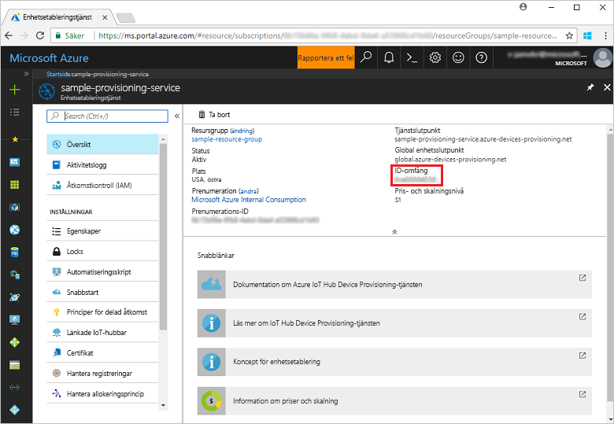
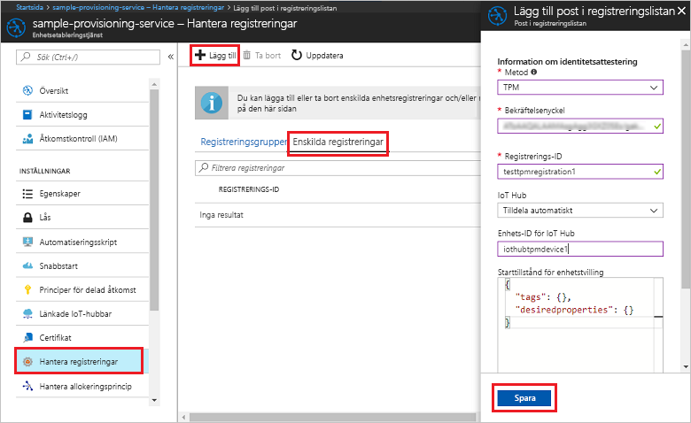
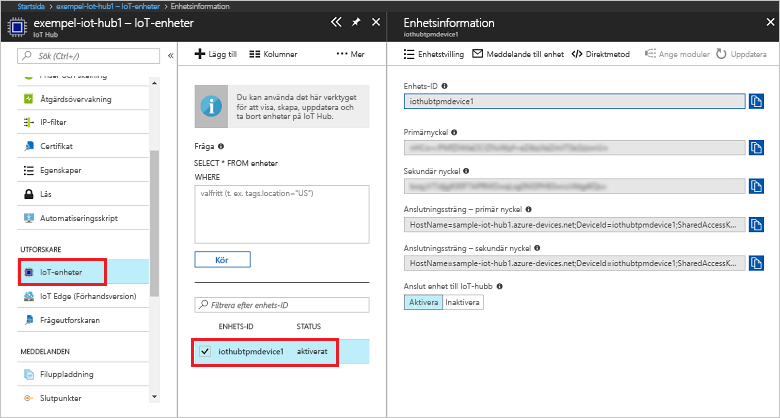

# <a name="create-and-provision-a-simulated-tpm-device-using-c-device-sdk-for-iot-hub-device-provisioning-service"></a>Skapa och etablera en simulerad TPM-enhet med C#-enhets-SDK för IoT Hub Device Provisioning-tjänsten

[!INCLUDE [iot-dps-selector-quick-create-simulated-device-tpm](../../includes/iot-dps-selector-quick-create-simulated-device-tpm.md)]

I det här stegen visas hur du skapar exemplet på simulerad TPM-enhet med Azure IoT Hub C# SDK på en utvecklingsdator som kör Windows OS och ansluter den simulerade enheten med Device Provisioning-tjänsten och din IoT-hubb. Exempelkoden använder Windows TPM-simulatorn som enhetens [maskinvarusäkerhetsmodul (HSM)](https://azure.microsoft.com/blog/azure-iot-supports-new-security-hardware-to-strengthen-iot-security/). 

Se till att slutföra stegen i [Set up IoT Hub Device Provisioning Service with the Azure portal](./quick-setup-auto-provision.md) (Konfigurera IoT Hub Device Provisioning-tjänsten med Azure-portalen) innan du fortsätter.

<a id="setupdevbox"></a>
## <a name="prepare-the-development-environment"></a>Förbereda utvecklingsmiljön 

1. Kontrollera att du har [.Net Core SDK](https://www.microsoft.com/net/download/windows) installerat på datorn. 

1. Kontrollera att `git` är installerat på datorn och har lagts till i de miljövariabler som är tillgängliga för kommandofönstret. Se [Git-klientverktyg för Software Freedom Conservancy](https://git-scm.com/download/) för att få den senaste versionen av `git`-verktyg att installera, vilket omfattar **Git Bash**, kommandoradsappen som du kan använda för att interagera med det lokala Git-lagret. 

4. Öppna en kommandotolk eller Git Bash. Klona Azure IoT SDK för C# GitHub-lagringsplatsen:
    
    ```cmd
    git clone --recursive https://github.com/Azure/azure-iot-sdk-csharp.git
    ```

## <a name="provision-the-simulated-device"></a>Etablera den simulerade enheten


1. Logga in på Azure Portal. Klicka på knappen **Alla resurser** i menyn till vänster och öppna Device Provisioning-tjänsten. På bladet **Översikt** noterar du värdet för **_ID-omfång_**.

     


2. I en kommandotolk ändrar du kataloger till projektkatalogen för TPM-enhetsetableringsexemplet.

    ```cmd
    cd .\azure-iot-sdk-csharp\provisioning\device\samples\ProvisioningDeviceClientTpm
    ```

2. Skriv följande kommando för att skapa och köra TPM-enhetsetableringsexemplet. Ersätt `<IDScope>`-värdet med ID-omfånget för etableringstjänsten. 

    ```cmd
    dotnet run <IDScope>
    ```

1. Kommandofönstret visar **_bekräftelsenyckeln_**, **_registrerings-ID_** och ett föreslaget **_enhets-ID_** som behövs för enhetsregistreringen. Anteckna dessa värden. 
   > [!NOTE]
   > Blanda inte ihop fönstret som innehåller utdata från kommandot med fönstret som innehåller utdata från TPM-simulatorn. Du kanske måste klicka på kommandofönstret för att placera det längst fram.

     


4. I Azure Portal, på sammanfattningsbladet för Device Provisioning-tjänsten väljer du **Hantera registreringar**. Välj fliken **Enskilda registreringar** och klicka på knappen **Lägg till** längst upp. 

5. Under **Lägg till post i registreringslistan** anger du följande information:
    - Välj **TPM** som identitet för bestyrkande *mekanism*.
    - Ange *registrerings-ID* och *bekräftelsenyckel* för din TPM-enhet. 
    - Alternativt väljer du en IoT-hubb som är länkad till din etableringstjänst.
    - Ange ett unikt enhets-ID. Du kan ange det enhets-ID som föreslås i exempelutdata eller ange ett eget. Om du använder ett eget ska du undvika känslig information när du namnger enheten. 
    - Uppdatera **inledande enhetstvillingstatus** med önskad inledande konfiguration för enheten.
    - Klicka på knappen **Spara** när det är klart. 

      

   Vid lyckad registrering visas *Registrerings-ID* för enheten i listan under fliken *Individual Enrollments* (Enskilda registreringar). 

6. Klicka på RETUR för att registrera den simulerade enheten. Lägg märke till de meddelanden som simulerar enhetsstart och anslutning till Device Provisioning-tjänsten för att hämta IoT-hubinformationen. 

1. Kontrollera att enheten har etablerats. Vid lyckad etablering av den simulerade enheten på IoT-hubben som är kopplad till etableringstjänsten visas enhets-ID på hubbens blad **IoT-enheter**. 

     

    Om du ändrade din *inledande enhetstvillingstatus* från standardvärdet i registreringsposten för din enhet kan den hämta önskad tvillingstatus från hubben och agera utifrån det. Mer information finns i [Understand and use device twins in IoT Hub](../iot-hub/iot-hub-devguide-device-twins.md) (Förstå och använda enhetstvillingar i IoT Hub)


## <a name="clean-up-resources"></a>Rensa resurser

Om du vill fortsätta att arbeta med och utforska enhetsklientexemplet ska du inte rensa de resurser som har skapats i den här snabbstarten. Om du inte planerar att fortsätta kan du använda stegen nedan för att ta bort alla resurser som har skapats i den här snabbstarten.

1. Stäng utdatafönstret för enhetsklientexemplet på datorn.
1. Stäng fönstret för TPM-simulatorn på datorn.
1. I den vänstra menyn i Azure-portalen klickar du på **Alla resurser** och väljer sedan Device Provisioning-tjänsten. Klicka på **Ta bort** överst på bladet **Alla resurser**.  
1. Klicka på **Alla resurser** på menyn till vänster på Azure-portalen och välj din IoT-hubb. Klicka på **Ta bort** överst på bladet **Alla resurser**.  

## <a name="next-steps"></a>Nästa steg

I den här snabbstarten har du skapat en TPM-simulerad enhet på datorn och etablerat den på IoT-hubben med hjälp av IoT Hub Device Provisioning-tjänsten. Information om hur du registrerar TPM-enheten programmässigt får du om du fortsätter till snabbstarten för programmässig registrering av en TPM-enhet. 

> [!div class="nextstepaction"]
> [Azure snabbstart – Registrera TPM-enhet på Azure IoT Hub Device Provisioning-tjänsten](quick-enroll-device-tpm-csharp.md)
