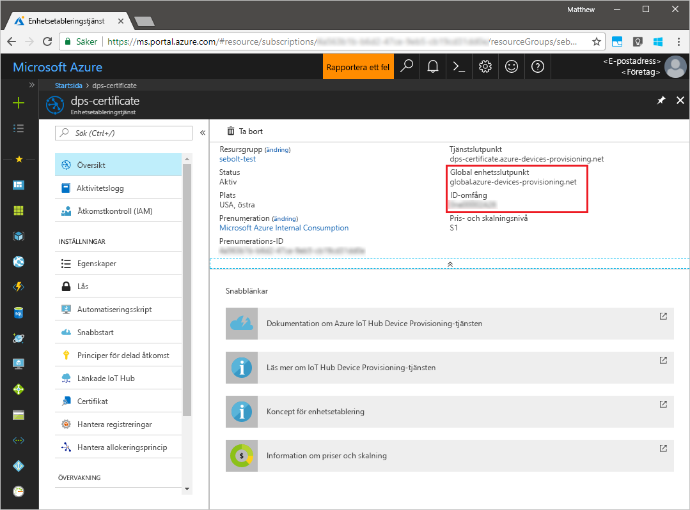
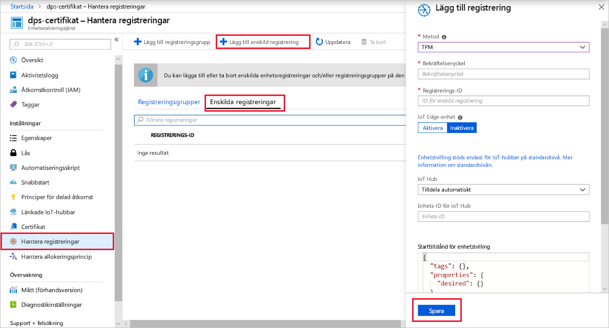
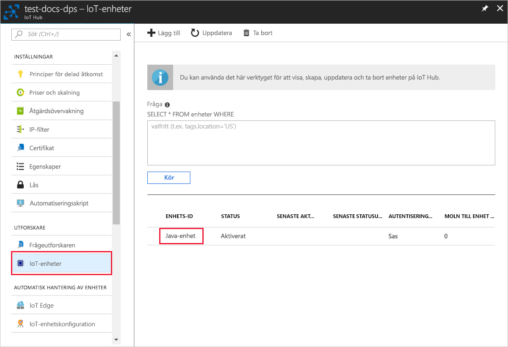

# <a name="quickstart-create-and-provision-a-simulated-tpm-device-using-java-device-sdk-for-azure-iot-hub-device-provisioning-service"></a>Snabb start: skapa och etablera en simulerad TPM-enhet med Java-enhets-SDK för Azure IoT Hub Device Provisioning Service

[!INCLUDE [iot-dps-selector-quick-create-simulated-device-tpm](../../includes/iot-dps-selector-quick-create-simulated-device-tpm.md)]

I den här snabb starten skapar du en simulerad IoT-enhet på en Windows-dator. Den simulerade enheten innehåller en TPM-simulator som en maskin varu säkerhetsmodul (HSM). Du använder Device-exempel-Java-kod för att ansluta den här simulerade enheten med IoT-hubben med hjälp av en enskild registrering med enhets etablerings tjänsten (DPS).

## <a name="prerequisites"></a>Krav

- Bekant med [etablerings](about-iot-dps.md#provisioning-process) koncept.
- Slut för ande av [konfigurations IoT Hub Device Provisioning service med Azure Portal](./quick-setup-auto-provision.md).
- Ett Azure-konto med en aktiv prenumeration. [Skapa ett kostnads fritt](https://azure.microsoft.com/free/?ref=microsoft.com&utm_source=microsoft.com&utm_medium=docs&utm_campaign=visualstudio).
- [Java se Development Kit 8](/azure/developer/java/fundamentals/java-jdk-long-term-support).
- [Maven](https://maven.apache.org/install.html).
- [Git](https://git-scm.com/download/).

[!INCLUDE [IoT Device Provisioning Service basic](../../includes/iot-dps-basic.md)]

## <a name="prepare-the-environment"></a>Förbereda miljön 

1. Kontrollera att [Java SE Development Kit 8](/azure/developer/java/fundamentals/java-jdk-long-term-support) är installerat på datorn.

1. Ladda ned och installera [Maven](https://maven.apache.org/install.html).

1. Kontrollera att `git` är installerat på datorn och har lagts till i de miljövariabler som är tillgängliga för kommandofönstret. Se [Git-klientverktyg för Software Freedom Conservancy](https://git-scm.com/download/) för att få den senaste versionen av `git`-verktyg att installera, vilket omfattar **Git Bash**, kommandoradsappen som du kan använda för att interagera med det lokala Git-lagret. 

1. Öppna en kommandotolk. Klona GitHub-lagringsplatsen för enhetssimuleringens kodexempel.
    
    ```cmd/sh
    git clone https://github.com/Azure/azure-iot-sdk-java.git --recursive
    ```

1. Kör [TPM](/windows/device-security/tpm/trusted-platform-module-overview) -simulatorn som [HSM](https://azure.microsoft.com/blog/azure-iot-supports-new-security-hardware-to-strengthen-iot-security/) för den simulerade enheten. Klicka på **Tillåt åtkomst** för att tillåta ändringar i inställningar för _Windows-brandväggen_. Den lyssnar via en socket på portarna 2321 och 2322. Stäng inte det här fönstret; Du måste hålla denna simulator igång tills du är klar med snabb starts guiden. 

    ```cmd/sh
    .\azure-iot-sdk-java\provisioning\provisioning-tools\tpm-simulator\Simulator.exe
    ```

    

1. Använd en separat kommandotolk för att navigera till rotmappen och skapa exempelberoenden.

    ```cmd/sh
    cd azure-iot-sdk-java
    mvn install -DskipTests=true
    ```

1. Navigera till exempelmappen.

    ```cmd/sh
    cd provisioning/provisioning-samples/provisioning-tpm-sample
    ```

1. Logga in på Azure Portal, Välj knappen **alla resurser** i den vänstra menyn och öppna Device Provisioning-tjänsten. Anteckna _ID-omfånget_ och den _globala slut punkten för etablerings tjänsten_.

    

1. Redigera `src/main/java/samples/com/microsoft/azure/sdk/iot/ProvisioningTpmSample.java` för att ta med din _ID-omfattning_ och _etablerings tjänstens globala slut punkt_ som tidigare nämnts.  

    ```java
    private static final String idScope = "[Your ID scope here]";
    private static final String globalEndpoint = "[Your Provisioning Service Global Endpoint here]";
    private static final ProvisioningDeviceClientTransportProtocol PROVISIONING_DEVICE_CLIENT_TRANSPORT_PROTOCOL = ProvisioningDeviceClientTransportProtocol.HTTPS;
    ```
    Spara filen.

1. Använd följande kommandon för att skapa projektet, navigera till målmappen och köra den skapade. jar-filen. Ersätt `version` plats hållaren med din version av Java.

    ```cmd/sh
    mvn clean install
    cd target
    java -jar ./provisioning-tpm-sample-{version}-with-deps.jar
    ```

1. Programmet börjar att köras. Anteckna _bekräftelse nyckeln_ och _registrerings-ID:_ t för nästa avsnitt och lämna programmet igång.

    
    

## <a name="create-a-device-enrollment-entry"></a>Skapa en post för enhetsregistrering

Azure IoT Device Provisioning Service stöder två typer av registreringar:

- [Registreringsgrupper](concepts-service.md#enrollment-group): används för att registrera flera relaterade enheter.
- [Enskilda registreringar](concepts-service.md#individual-enrollment): används för att registrera en enskild enhet.

Den här artikeln visar enskilda registreringar.

1. Logga in på Azure Portal, Välj knappen **alla resurser** i den vänstra menyn och öppna Device Provisioning-tjänsten.

1. Från menyn enhets etablerings tjänst väljer du **Hantera registreringar**. Välj fliken **enskilda registreringar** och välj knappen **Lägg till individuell registrering** överst. 

1. Ange följande information på panelen **Lägg till registrering** :
   - Välj **TPM** som identitet för bestyrkande *mekanism*.
   - Ange *registrerings-ID* och *bekräftelse nyckel* för din TPM-enhet från de värden som du antecknade tidigare.
   - Välj en IoT hub som är länkad till din etableringstjänst.
   - Du kan även ange följande information:
       - Ange ett unikt *enhets-ID*. Se till att undvika känsliga data när du namnger din enhet. Om du väljer att inte ange en, används registrerings-ID: t för att identifiera enheten i stället.
       - Uppdatera **inledande enhetstvillingstatus** med önskad inledande konfiguration för enheten.
   - När du är klar trycker du på knappen **Spara** . 

       

   Vid lyckad registrering visas *Registrerings-ID* för enheten i listan under fliken *Enskilda registreringar*. 


## <a name="simulate-the-device"></a>Simulera enheten

1. I kommando fönstret som kör Java-exempelprogrammet på datorn trycker du på *RETUR* för att fortsätta köra programmet. Lägg märke till de meddelanden som simulerar enhetsstart och anslutning till Device Provisioning-tjänsten för att hämta IoT-hubinformationen.  

    

1. Vid lyckad etablering av den simulerade enheten till IoT-hubben som är länkad till din etablerings tjänst visas enhets-ID på hubbens bladet **IoT-enheter** .

     

    Om du ändrade din *inledande enhetstvillingstatus* från standardvärdet i registreringsposten för din enhet kan den hämta önskad tvillingstatus från hubben och agera utifrån det. Mer information finns i [Understand and use device twins in IoT Hub](../iot-hub/iot-hub-devguide-device-twins.md) (Förstå och använda enhetstvillingar i IoT Hub).


## <a name="clean-up-resources"></a>Rensa resurser

Om du planerar att fortsätta att arbeta med och utforska enhets klient exemplet ska du inte rensa upp resurserna som du skapade i den här snabb starten. Om du inte planerar att fortsätta kan du använda följande steg för att ta bort alla resurser som skapats i den här snabb starten.

1. Stäng utdatafönstret för enhetsklientexemplet på datorn.
1. Stäng fönstret för TPM-simulatorn på datorn.
1. Välj **alla resurser** på den vänstra menyn i Azure Portal och välj sedan enhets etablerings tjänsten. Öppna bladet **Hantera registreringar** för din tjänst och välj sedan fliken **enskilda registreringar** . Markera kryss rutan bredvid *registrerings-ID* för enheten som du har registrerat i den här snabb starten och klicka på knappen **ta bort** högst upp i fönstret. 
1. Välj **alla resurser** på den vänstra menyn i Azure Portal och välj sedan din IoT Hub. Öppna bladet **IoT-enheter** för navet, markera kryss rutan bredvid *enhets-ID* för den enhet som du registrerade i den här snabb starten och tryck sedan på knappen **ta bort** högst upp i fönstret.

## <a name="next-steps"></a>Nästa steg

I den här snabb starten har du skapat en TPM-simulerad enhet på datorn och allokerat den till IoT-hubben med hjälp av IoT Hub Device Provisioning Service. Om du vill lära dig hur du registrerar en TPM-enhet program mässigt kan du fortsätta till snabb starten för program registrering av en TPM-enhet. 

> [!div class="nextstepaction"]
> [Azure snabb start – registrera TPM-enhet på Azure IoT Hub Device Provisioning Service](quick-enroll-device-tpm-java.md)