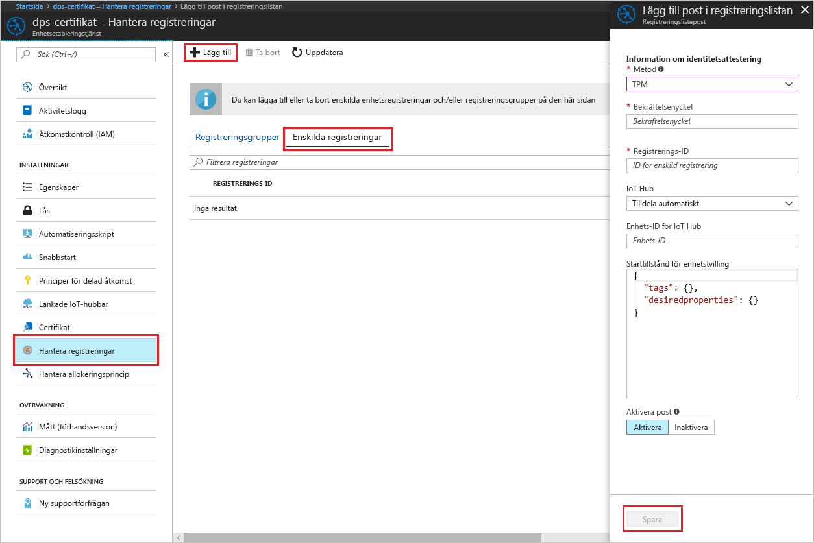
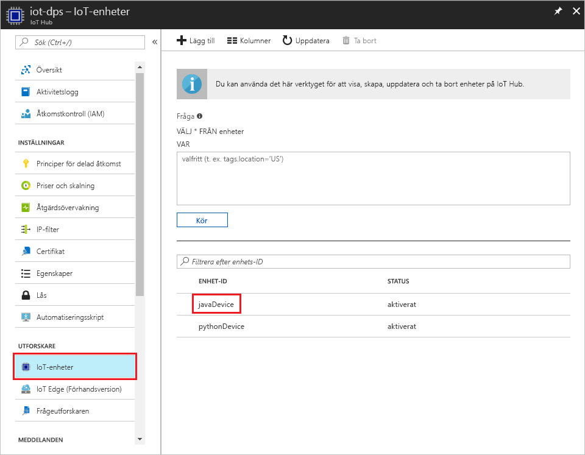

# <a name="create-and-provision-a-simulated-tpm-device-using-java-device-sdk-for-azure-iot-hub-device-provisioning-service"></a>Skapa och etablera en simulerad TPM-enhet med Java-enhets-SDK för Azure IoT Hub Device Provisioning-tjänsten

[!INCLUDE [iot-dps-selector-quick-create-simulated-device-tpm](../../includes/iot-dps-selector-quick-create-simulated-device-tpm.md)]

Dessa steg visar hur du skapar en simulerad enhet på utvecklingsdatorn som kör Windows OS, kör Windows TPM-simulatorn som [maskinvarusäkerhetsmodul (HSM)](https://azure.microsoft.com/blog/azure-iot-supports-new-security-hardware-to-strengthen-iot-security/) för enheten och använder kodexemplet för att ansluta till denna simulerade enhet med Device Provisioning-tjänsten och IoT-hubben. 

Om du inte känner till processen för automatisk etablering, bör du också gå igenom [Begrepp inom automatisk etablering](concepts-auto-provisioning.md). Se också till att slutföra stegen i [Set up IoT Hub Device Provisioning Service with the Azure portal](./quick-setup-auto-provision.md) (Konfigurera IoT Hub Device Provisioning-tjänsten med Azure Portal) innan du fortsätter. 

[!INCLUDE [IoT DPS basic](../../includes/iot-dps-basic.md)]

## <a name="prepare-the-environment"></a>Förbereda miljön 

1. Kontrollera att [Java SE Development Kit 8](http://www.oracle.com/technetwork/java/javase/downloads/jdk8-downloads-2133151.html) är installerat på datorn.

1. Ladda ned och installera [Maven](https://maven.apache.org/install.html).

1. Kontrollera att `git` är installerat på datorn och har lagts till i de miljövariabler som är tillgängliga för kommandofönstret. Se [Git-klientverktyg för Software Freedom Conservancy](https://git-scm.com/download/) för att få den senaste versionen av `git`-verktyg att installera, vilket omfattar **Git Bash**, kommandoradsappen som du kan använda för att interagera med det lokala Git-lagret. 

1. Öppna en kommandotolk. Klona GitHub-lagringsplatsen för enhetssimuleringens kodexempel.
    
    ```cmd/sh
    git clone https://github.com/Azure/azure-iot-sdk-java.git --recursive
    ```

1. Kör [TPM](https://docs.microsoft.com/windows/device-security/tpm/trusted-platform-module-overview)-simulatorn. Klicka på **Tillåt åtkomst** för att tillåta ändringar i inställningar för _Windows-brandväggen_. Den lyssnar via en socket på portarna 2321 och 2322. Stäng inte det här fönstret. Den här simulatorn måste fortsätta att köras till slutet av den här snabbstartsguiden. 

    ```cmd/sh
    .\azure-iot-sdk-java\provisioning\provisioning-tools\tpm-simulator\Simulator.exe
    ```

    

1. Använd en separat kommandotolk för att navigera till rotmappen och skapa exempelberoenden.

    ```cmd/sh
    cd azure-iot-sdk-java
    mvn install -DskipTests=true
    ```

1. Navigera till exempelmappen.

    ```cmd/sh
    cd provisioning/provisioning-samples/provisioning-tpm-sample
    ```

1. Logga in på Azure-portalen, klicka på knappen **Alla resurser** i den vänstra menyn och öppna Device Provisioning-tjänsten. Kom ihåg _ID-omfång_ och _Provisioning Service Global Endpoint_ (Global slutpunkt för etableringstjänsten).

    

1. Redigera `src/main/java/samples/com/microsoft/azure/sdk/iot/ProvisioningTpmSample.java` så att _ID-omfång_ och _Provisioning Service Global Endpoint_ (Global slutpunkt för etableringstjänsten) inkluderas enligt tidigare notering.  

    ```java
    private static final String idScope = "[Your ID scope here]";
    private static final String globalEndpoint = "[Your Provisioning Service Global Endpoint here]";
    private static final ProvisioningDeviceClientTransportProtocol PROVISIONING_DEVICE_CLIENT_TRANSPORT_PROTOCOL = ProvisioningDeviceClientTransportProtocol.HTTPS;
    ```

1. Bygga projektet. Navigera till målmappen och kör den skapade jar-filen.

    ```cmd/sh
    mvn clean install
    cd target
    java -jar ./provisioning-tpm-sample-{version}-with-deps.jar
    ```

1. Programmet börjar att köras. Kom ihåg _bekräftelsenyckeln_ och _Registrerings-ID_ för nästa avsnitt och lämna programmet igång.

    
    

## <a name="create-a-device-enrollment-entry"></a>Skapa en post för enhetsregistrering

1. Logga in på Azure-portalen, klicka på knappen **Alla resurser** i den vänstra menyn och öppna Device Provisioning-tjänsten.

1. På sammanfattningsbladet för Device Provisioning-tjänsten väljer du **Manage enrollments** (Hantera registreringar). Välj fliken **Individual Enrollments** (Enskilda registreringar) och klicka på knappen **Lägg till** längst upp. 

1. Under posten för att **lägga till registreringslista** anger du följande information:
    - Välj **TPM** som identitet för bestyrkande *mekanism*.
    - Ange *registrerings-ID* och *bekräftelsenyckel* för din TPM-enhet enligt tidigare notering. 
    - Välj en IoT hub som är länkad till din etableringstjänst.
    - Ange ett unikt enhets-ID. Se till att undvika känsliga data när du namnger din enhet.
    - Uppdatera **inledande enhetstvillingstatus** med önskad inledande konfiguration för enheten.
    - Klicka på knappen **Spara** när det är klart. 

      

   Vid lyckad registrering visas *Registrerings-ID* för enheten i listan under fliken *Enskilda registreringar*. 


## <a name="simulate-the-device"></a>Simulera enheten

1. Klicka på retur på kommandofönstret som kör Java-exempelkoden på din dator för att fortsätta att köra programmet. Lägg märke till de meddelanden som simulerar enhetsstart och anslutning till Device Provisioning-tjänsten för att hämta IoT-hubinformationen.  

    

1. Vid lyckad etablering av den simulerade enheten på IoT-hubben som är kopplad till etableringstjänsten visas enhets-ID på hubbens blad **Device Explorer**.

     

    Om du ändrade din *inledande enhetstvillingstatus* från standardvärdet i registreringsposten för din enhet kan den hämta önskad tvillingstatus från hubben och agera utifrån det. Mer information finns i [Understand and use device twins in IoT Hub](../iot-hub/iot-hub-devguide-device-twins.md) (Förstå och använda enhetstvillingar i IoT Hub)


## <a name="clean-up-resources"></a>Rensa resurser

Om du vill fortsätta att arbeta med och utforska enhetsklientexemplet ska du inte rensa de resurser som har skapats i den här snabbstarten. Om du inte planerar att fortsätta kan du använda stegen nedan för att ta bort alla resurser som har skapats i den här snabbstarten.

1. Stäng utdatafönstret för enhetsklientexemplet på datorn.
1. Stäng fönstret för TPM-simulatorn på datorn.
1. Klicka på **Alla resurser** på menyn till vänster på Azure-portalen och välj din Device Provisioning-tjänst. Öppna bladet **Hantera registreringar** för tjänsten och klicka på fliken **Enskilda registreringar**. Välj *REGISTRERINGS-ID* för enheten du har registrerat i den här snabbstarten och klicka på knappen **Ta bort** högst upp. 
1. Klicka på **Alla resurser** på menyn till vänster på Azure-portalen och välj din IoT-hubb. Öppna bladet **IoT-enheter** för din hubb, välj *ENHETS-ID* för enheten du har registrerat i den här snabbstarten och klicka på knappen **Ta bort** högst upp.

## <a name="next-steps"></a>Nästa steg

I den här snabbstarten har du skapat en TPM-simulerad enhet på datorn och etablerat den på IoT-hubben med hjälp av IoT Hub Device Provisioning-tjänsten. Information om hur du registrerar TPM-enheten programmässigt får du om du fortsätter till snabbstarten för programmässig registrering av en TPM-enhet. 

> [!div class="nextstepaction"]
> [Azure snabbstart – Registrera TPM-enhet på Azure IoT Hub Device Provisioning-tjänsten](quick-enroll-device-tpm-java.md)
