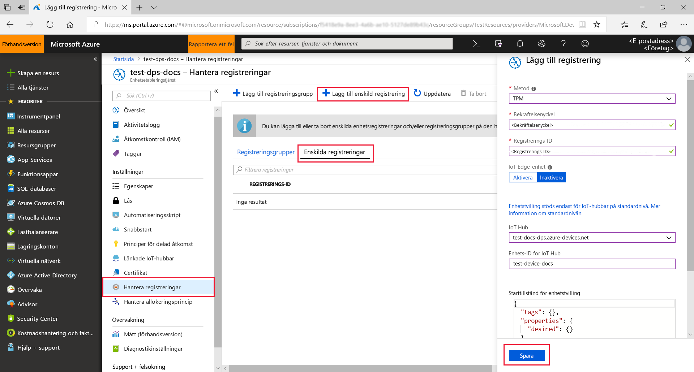
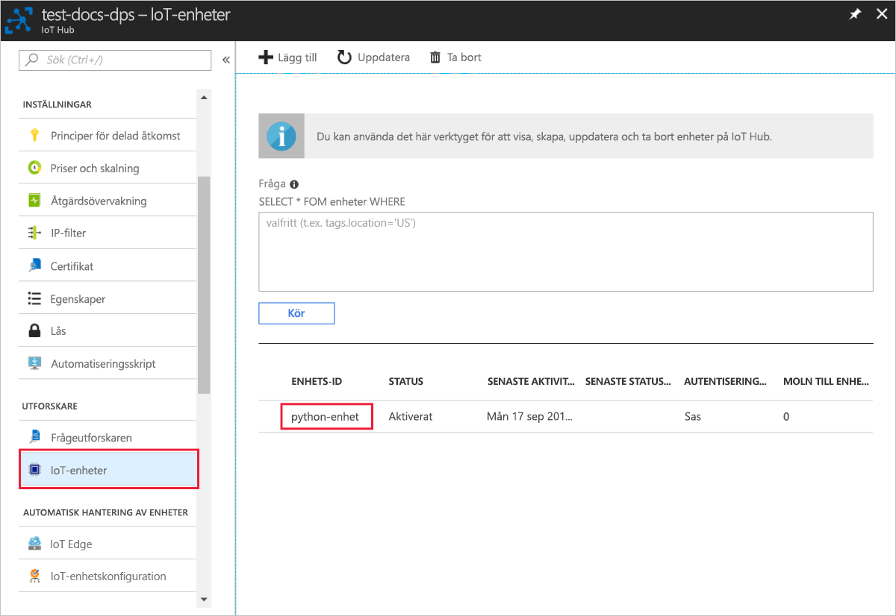

# <a name="quickstart-create-and-provision-a-simulated-tpm-device-using-python-device-sdk-for-iot-hub-device-provisioning-service"></a>Snabb start: skapa och etablera en simulerad TPM-enhet med python-enhets-SDK för IoT Hub Device Provisioning Service

[!INCLUDE [iot-dps-selector-quick-create-simulated-device-tpm](../../includes/iot-dps-selector-quick-create-simulated-device-tpm.md)]

Dessa steg visar hur du skapar en simulerad enhet på utvecklingsdatorn som kör Windows OS, kör Windows TPM-simulatorn som [maskinvarusäkerhetsmodul (HSM)](https://azure.microsoft.com/blog/azure-iot-supports-new-security-hardware-to-strengthen-iot-security/) för enheten och använder Python-kodexemplet för att ansluta till denna simulerade enhet med Device Provisioning-tjänsten och IoT-hubben. 

Om du inte känner till processen för automatisk etablering, bör du också gå igenom [Begrepp inom automatisk etablering](concepts-auto-provisioning.md). Se också till att slutföra stegen i [Set up IoT Hub Device Provisioning Service with the Azure portal](./quick-setup-auto-provision.md) (Konfigurera IoT Hub Device Provisioning-tjänsten med Azure Portal) innan du fortsätter. 

Azure IoT Device Provisioning Service stöder två typer av registreringar:
- [Registreringsgrupper](concepts-service.md#enrollment-group): används för att registrera flera relaterade enheter.
- [Enskilda registreringar](concepts-service.md#individual-enrollment): används för att registrera en enskild enhet.

Den här artikeln visar enskilda registreringar.

[!INCLUDE [IoT Device Provisioning Service basic](../../includes/iot-dps-basic.md)]

> [!NOTE]
> Den här guiden gäller endast för nu-inaktuella v1 python SDK. Simulerade TPM-enheter stöds ännu inte i v2. Teamet är för närvarande hårt på arbetet och ansluter till v2 för att få till funktion paritet.

## <a name="prepare-the-environment"></a>Förbereda miljön 

1. Kontrol lera att du har installerat antingen [Visual studio](https://visualstudio.microsoft.com/vs/) 2015 eller senare, med arbets belastningen " C++Skriv bords utveckling med" aktiverat för Visual Studio-installationen.

1. Hämta och installera [CMake-buildsystemet](https://cmake.org/download/).

1. Kontrollera att `git` är installerat på datorn och har lagts till i de miljövariabler som är tillgängliga för kommandofönstret. Se [Git-klientverktyg för Software Freedom Conservancy](https://git-scm.com/download/) för att få den senaste versionen av `git`-verktyg att installera, vilket omfattar **Git Bash**, kommandoradsappen som du kan använda för att interagera med det lokala Git-lagret. 

1. Öppna en kommandotolk eller Git Bash. Klona GitHub-lagringsplatsen för enhetssimuleringens kodexempel:
    
    ```cmd/sh
    git clone --single-branch --branch v1-deprecated https://github.com/Azure/azure-iot-sdk-python.git --recursive
    ```

1. Skapa en mapp på den lokala kopian av denna GitHub-lagringsplats för CMake-buildprocessen. 

    ```cmd/sh
    cd azure-iot-sdk-python/c
    mkdir cmake
    cd cmake
    ```

1. Kodexemplet använder en Windows TPM-simulator. Kör följande kommando för att aktivera autentisering med SAS-token. Det genererar även en Visual Studio-lösning för den simulerade enheten.

    ```cmd/sh
    cmake -Duse_prov_client:BOOL=ON -Duse_tpm_simulator:BOOL=ON ..
    ```

1. Använd en separat kommandotolk för att navigera till TPM-simulatormappen och köra [TPM](https://docs.microsoft.com/windows/device-security/tpm/trusted-platform-module-overview)-simulatorn. Klicka på **Tillåt åtkomst**. Den lyssnar via en socket på portarna 2321 och 2322. Stäng inte det här kommando fönstret. Du måste hålla denna simulator igång tills du är klar med snabb starts guiden. 

    ```cmd/sh
    .\azure-iot-sdk-python\c\provisioning_client\deps\utpm\tools\tpm_simulator\Simulator.exe
    ```

    


## <a name="create-a-device-enrollment-entry"></a>Skapa en post för enhetsregistrering

1. Öppna den lösning som har genererats i mappen *cmake* med namnet `azure_iot_sdks.sln`, och skapa den i Visual Studio.

1. Högerklicka på projektet **tpm_device_provision** och markera **Set as Startup Project** (Ange som startprojekt). Kör lösningen. I fönstret Utdata visas **_bekräftelse nyckeln_** och det **_registrerings-ID_** som krävs för enhets registreringen. Anteckna dessa värden. 

    

1. Logga in på Azure Portal, Välj knappen **alla resurser** i den vänstra menyn och öppna Device Provisioning-tjänsten.

1. Från menyn enhets etablerings tjänst väljer du **Hantera registreringar**. Välj fliken **enskilda registreringar** och välj knappen **Lägg till individuell registrering** överst. 

1. Ange följande information på panelen **Lägg till registrering** :
   - Välj **TPM** som identitet för bestyrkande *mekanism*.
   - Ange *registrerings-ID* och *bekräftelse nyckel* för din TPM-enhet från de värden som du antecknade tidigare.
   - Välj en IoT hub som är länkad till din etableringstjänst.
   - Du kan även ange följande information:
       - Ange ett unikt *enhets-ID*. Se till att undvika känsliga data när du namnger din enhet. Om du väljer att inte ange en, används registrerings-ID: t för att identifiera enheten i stället.
       - Uppdatera **inledande enhetstvillingstatus** med önskad inledande konfiguration för enheten.
   - När du är klar trycker du på knappen **Spara** . 

       

   Vid lyckad registrering visas *Registrerings-ID* för enheten i listan under fliken *Individual Enrollments* (Enskilda registreringar). 


## <a name="simulate-the-device"></a>Simulera enheten

1. Ladda ned och installera [Python 2.x eller 3.x](https://www.python.org/downloads/). Se till att använda en 32-bitars eller 64-bitars installation beroende på vad som krävs för din konfiguration. Se till att du lägger till Python i de plattformsspecifika miljövariablerna när du uppmanas att göra det under installationen.
    - Om du använder Windows OS installerar du [Visual C++ redistributable package](https://www.microsoft.com/download/confirmation.aspx?id=48145) så att du kan använda native-DLL:er från Python.

1. Skapa Python-paketen med hjälp av [de här instruktionerna](https://github.com/Azure/azure-iot-sdk-python/blob/master/doc/python-devbox-setup.md).

   > [!NOTE]
   > Om du kör `build_client.cmd` använder du `--use-tpm-simulator`-flagan.
   > 
   > [!NOTE]
   > Om du använder `pip` ska du även installera `azure-iot-provisioning-device-client`-paketet. Obs! De utgivna PIP-paketen använder verkliga TPM, inte simulatorn. Om du vill använda simulatorn måste du kompilera från källan med `--use-tpm-simulator`-flaggan.

1. Navigera till exempelmappen.

    ```cmd/sh
    cd azure-iot-sdk-python/provisioning_device_client/samples
    ```

1. Med Python IDE redigerar du python-skriptet **provisioning\_device\_client\_sample.py**. Ändra variablerna *GLOBAL\_PROV\_URI* och *ID\_SCOPE* till de värden som angavs tidigare. Kontrollera också att *SECURITY\_DEVICE\_TYPE* har getts värdet `ProvisioningSecurityDeviceType.TPM`

    ```python
    GLOBAL_PROV_URI = "{globalServiceEndpoint}"
    ID_SCOPE = "{idScope}"
    SECURITY_DEVICE_TYPE = ProvisioningSecurityDeviceType.TPM
    PROTOCOL = ProvisioningTransportProvider.HTTP
    ```

    

1. Kör exemplet. 

    ```cmd/sh
    python provisioning_device_client_sample.py
    ```

1. Lägg märke till de meddelanden som simulerar enhetsstart och anslutning till Device Provisioning-tjänsten för att hämta IoT-hubinformationen. 

    

1. Vid lyckad etablering av den simulerade enheten till IoT-hubben som är länkad till din etablerings tjänst visas enhets-ID på hubbens bladet **IoT-enheter** .

     

    Om du ändrade din *inledande enhetstvillingstatus* från standardvärdet i registreringsposten för din enhet kan den hämta önskad tvillingstatus från hubben och agera utifrån det. Mer information finns i [Understand and use device twins in IoT Hub](../iot-hub/iot-hub-devguide-device-twins.md) (Förstå och använda enhetstvillingar i IoT Hub)


## <a name="clean-up-resources"></a>Rensa resurser

Om du planerar att fortsätta att arbeta med och utforska enhets klient exemplet ska du inte rensa upp resurserna som du skapade i den här snabb starten. Om du inte planerar att fortsätta kan du använda följande steg för att ta bort alla resurser som skapats i den här snabb starten.

1. Stäng utdatafönstret för enhetsklientexemplet på datorn.
1. Stäng fönstret för TPM-simulatorn på datorn.
1. Välj **alla resurser** på den vänstra menyn i Azure Portal och välj sedan enhets etablerings tjänsten. Öppna bladet **Hantera registreringar** för din tjänst och välj sedan fliken **enskilda registreringar** . Markera kryss rutan bredvid *registrerings-ID* för den enhet som du har registrerat i den här snabb starten och klicka på knappen **ta bort** högst upp i fönstret. 
1. Välj **alla resurser** på den vänstra menyn i Azure Portal och välj sedan din IoT Hub. Öppna bladet **IoT-enheter** för navet, markera kryss rutan bredvid *enhets-ID* för den enhet som du registrerade i den här snabb starten och tryck sedan på knappen **ta bort** högst upp i fönstret.

## <a name="next-steps"></a>Nästa steg

I den här snabb starten har du skapat en TPM-simulerad enhet på datorn och allokerat den till IoT-hubben med hjälp av IoT Hub Device Provisioning Service. Om du vill lära dig hur du registrerar en TPM-enhet program mässigt kan du fortsätta till snabb starten för program registrering av en TPM-enhet. 

> [!div class="nextstepaction"]
> [Azure snabb start – registrera TPM-enhet på Azure IoT Hub Device Provisioning Service](quick-enroll-device-tpm-python.md)
