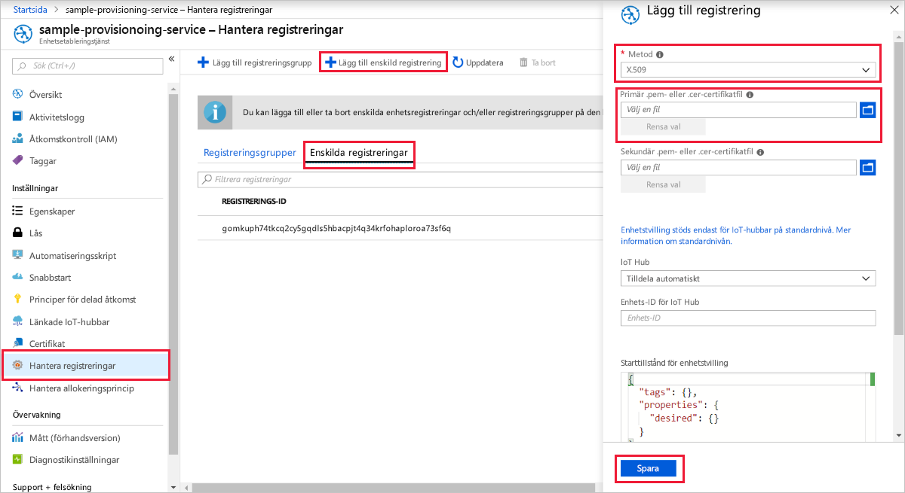
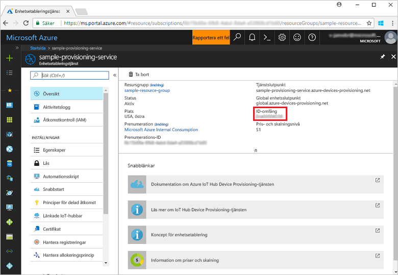
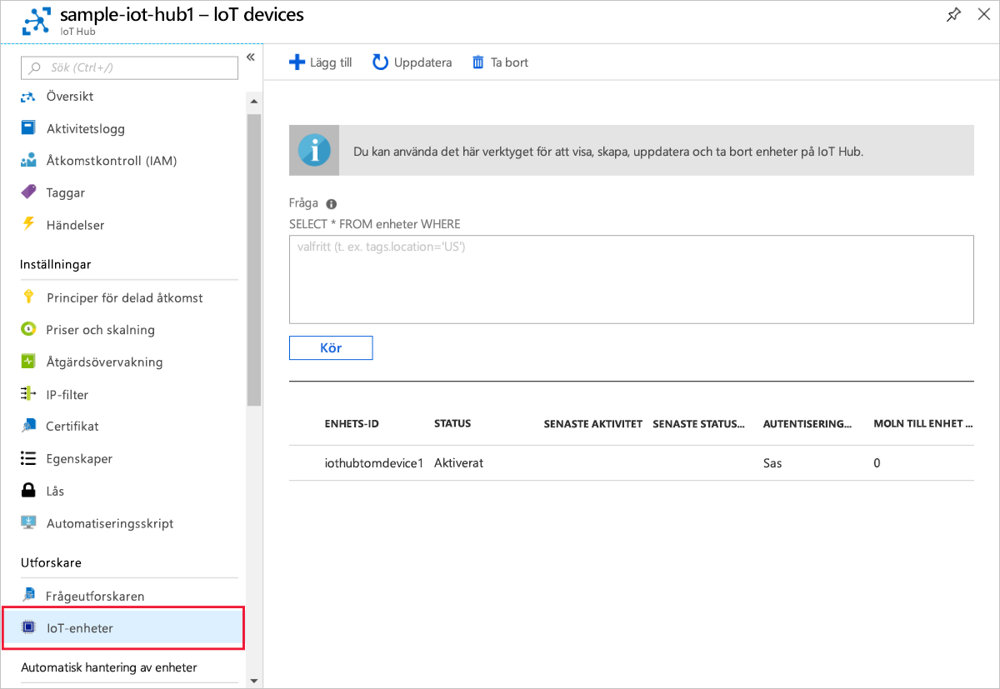

# <a name="create-and-provision-a-simulated-x509-device-using-c-device-sdk-for-iot-hub-device-provisioning-service"></a>Skapa och etablera en simulerad X.509-enhet med C#-enhets-SDK för IoT Hub Device Provisioning-tjänsten
[!INCLUDE [iot-dps-selector-quick-create-simulated-device-x509](../../includes/iot-dps-selector-quick-create-simulated-device-x509.md)]

De här stegen visar hur du använder [Azure IoT-exempel för C# ](https://github.com/Azure-Samples/azure-iot-samples-csharp) för att simulera en X.509-enhet på en utvecklingsdator som kör Windows operativsystem. Exemplet ansluter även den simulerade enhet till en IoT Hub med hjälp av enhetsetableringstjänsten.

Om du inte känner till processen för automatisk etablering, bör du även gå igenom [Begrepp inom automatisk etablering](concepts-auto-provisioning.md). Se också till att slutföra stegen i [Set up IoT Hub Device Provisioning Service with the Azure portal](./quick-setup-auto-provision.md) (Konfigurera IoT Hub Device Provisioning-tjänsten med Azure Portal) innan du fortsätter. 

Azure IoT Device Provisioning Service stöder två typer av registreringar:
- [Registreringsgrupper](concepts-service.md#enrollment-group): Används för att registrera flera relaterade enheter.
- [Enskilda registreringar](concepts-service.md#individual-enrollment): Används för att registrera en enskild enhet.

Den här artikeln visar enskilda registreringar.

[!INCLUDE [IoT Device Provisioning Service basic](../../includes/iot-dps-basic.md)]

<a id="setupdevbox"></a>
## <a name="prepare-the-development-environment"></a>Förbereda utvecklingsmiljön 

1. Kontrollera att du har den [SDK för .NET Core 2.1 eller senare](https://www.microsoft.com/net/download/windows) installerat på datorn. 

1. Kontrollera att `git` är installerat på datorn och har lagts till i de miljövariabler som är tillgängliga för kommandofönstret. Se [Git-klientverktyg för Software Freedom Conservancy](https://git-scm.com/download/) för att få den senaste versionen av `git`-verktyg att installera, vilket omfattar **Git Bash**, kommandoradsappen som du kan använda för att interagera med det lokala Git-lagret. 

1. Öppna en kommandotolk eller Git Bash. Klona Azure IoT-exempel för C# GitHub-lagringsplatsen:
    
    ```cmd
    git clone https://github.com/Azure-Samples/azure-iot-samples-csharp.git
    ```

## <a name="create-a-self-signed-x509-device-certificate-and-individual-enrollment-entry"></a>Skapa ett självsignerat X.509-enhetscertifikat och en post för enskild registrering

I det här avsnittet använder du ett självsignerat X.509-certifikat. Då måste du tänka på det här:

* Självsignerade certifikat är endast till för testning och ska inte användas i produktion.
* Standardutgångsdatumet för ett självsignerat certifikat är ett år.

Du kommer att använda exempelkoden från [Etablera enhetsklientexempel – X.509-attestering](https://github.com/Azure-Samples/azure-iot-samples-csharp/tree/master/provisioning/Samples/device/X509Sample) till att skapa det certifikat som ska användas med posten för enskild registrering för den simulerade enheten.


1. I en kommandotolk ändrar du kataloger till projektkatalogen för X.509-enhetsetableringsexemplet.

    ```cmd
    cd .\azure-iot-samples-csharp\provisioning\Samples\device\X509Sample
    ```

2. Exempelkoden konfigureras att använda X.509-certifikat som lagras i en lösenordsskyddad PKCS12-formaterad fil (certificate.pfx). Dessutom behöver du en certifikatfil för offentlig nyckel (certificate.cer) för att skapa en enskild registrering senaste i den här snabbstarten. Generera ett självsignerat certifikat och dess associerade .cer- och .pfx-filer genom att köra följande kommando:

    ```cmd
    powershell .\GenerateTestCertificate.ps1
    ```

3. Med skriptet uppmanas du att ange ett PFX-lösenord. Kom ihåg lösenordet. Du måste använda det när du kör exemplet.

      


4. Logga in på Azure-portalen, klicka på knappen **Alla resurser** i den vänstra menyn och öppna din distributionstjänst.

5. På sammanfattningsbladet för Device Provisioning-tjänsten väljer du **Manage enrollments** (Hantera registreringar). Välj fliken **Enskilda registreringar** och klicka på knappen **Lägg till enskild registrering** längst upp. 

6. Under panelen **Lägg till registrering** anger du följande information:
   - Välj **X.509** som identitet för bestyrkande *mekanism*.
   - Under *Primär .pem- eller .cer-certifikatfil* klickar du på *Välj en fil* för att välja certifikatfilen **certificate.cer** som skapades i föregående steg.
   - Lämna **Enhets-ID** tomt. Enheten etableras med dess enhet-ID inställt på nätverksnamnet (CN) i X.509-certifikatet **iothubx509device1**. Det här är även namnet som används som registrerings-ID för posten för enskild registrering. 
   - Du kan även ange följande information:
       - Välj en IoT hub som är länkad till din etableringstjänst.
       - Uppdatera **inledande enhetstvillingstatus** med önskad inledande konfiguration för enheten.
   - Klicka på knappen **Spara** när det är klart. 

     [](./media/quick-create-simulated-device-x509-csharp/device-enrollment.png#lightbox)
    
   Vid lyckad registrering visas X.509-registreringsposten som **iothubx509device1** under kolumnen *Registrerings-ID* på fliken *Enskilda registreringar*. 

## <a name="provision-the-simulated-device"></a>Etablera den simulerade enheten

1. På bladet **Översikt** för etableringstjänsten noterar du värdet för **_ID-omfång_**.

     


2. Skriv följande kommando för att skapa och köra X.509-enhetsetableringsexemplet. Ersätt `<IDScope>`-värdet med ID-omfånget för etableringstjänsten. 

    ```cmd
    dotnet run <IDScope>
    ```

3. Vid uppmaning anger du lösenordet för PFX-filen du skapade tidigare. Lägg märke till de meddelanden som simulerar enhetsstart och anslutning till Device Provisioning-tjänsten för att hämta IoT-hubinformationen. 

     

4. Kontrollera att enheten har etablerats. Vid lyckad etablering av den simulerade enheten på IoT-hubben som är kopplad till etableringstjänsten visas enhets-ID på hubbens blad **IoT-enheter**. 

     

    Om du ändrade din *inledande enhetstvillingstatus* från standardvärdet i registreringsposten för din enhet kan den hämta önskad tvillingstatus från hubben och agera utifrån det. Mer information finns i [Understand and use device twins in IoT Hub](../iot-hub/iot-hub-devguide-device-twins.md) (Förstå och använda enhetstvillingar i IoT Hub)


## <a name="clean-up-resources"></a>Rensa resurser

Om du vill fortsätta att arbeta med och utforska enhetsklientexemplet ska du inte rensa de resurser som har skapats i den här snabbstarten. Om du inte planerar att fortsätta kan du använda stegen nedan för att ta bort alla resurser som har skapats i den här snabbstarten.

1. Stäng utdatafönstret för enhetsklientexemplet på datorn.
1. Stäng fönstret för TPM-simulatorn på datorn.
1. I den vänstra menyn i Azure-portalen klickar du på **Alla resurser** och väljer sedan Device Provisioning-tjänsten. Klicka på **Ta bort** överst på bladet **Alla resurser**.  
1. Klicka på **Alla resurser** på menyn till vänster på Azure-portalen och välj din IoT-hubb. Klicka på **Ta bort** överst på bladet **Alla resurser**.  

## <a name="next-steps"></a>Nästa steg

I den här snabbstarten har du skapat en X.509-simulerad enhet på Windows-datorn och etablerat den på IoT-hubben med hjälp av Azure IoT Hub Device Provisioning-tjänsten på portalen. Information om hur du registrerar X.509-enheten programmässigt får du om du fortsätter till snabbstarten för programmässig registrering av X.509-enheter. 

> [!div class="nextstepaction"]
> [Azure snabbstart – Registrera X.509-enheter på Azure IoT Hub Device Provisioning-tjänsten](quick-enroll-device-x509-csharp.md)
