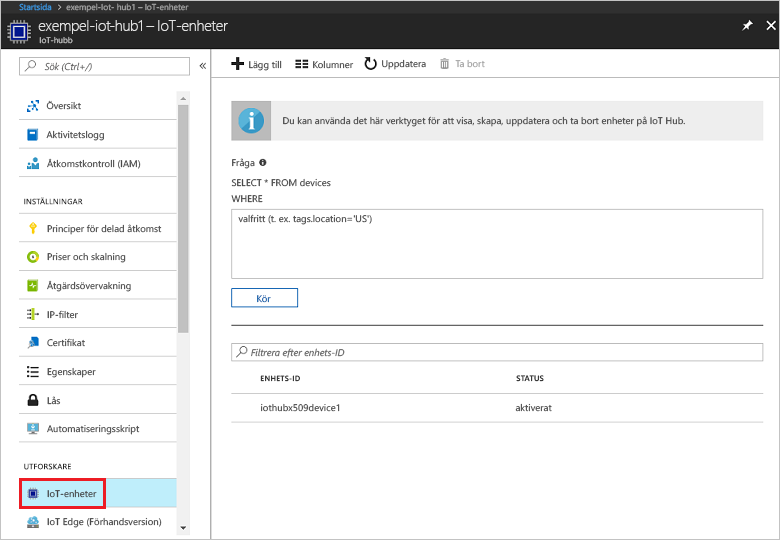

# <a name="create-and-provision-a-simulated-x509-device-using-c-device-sdk-for-iot-hub-device-provisioning-service"></a>Skapa och etablera en simulerad X.509-enhet med C#-enhets-SDK för IoT Hub Device Provisioning-tjänsten
[!INCLUDE [iot-dps-selector-quick-create-simulated-device-x509](../../includes/iot-dps-selector-quick-create-simulated-device-x509.md)]

I det här stegen visas hur du skapar exemplet på simulerad X.509-enhet med [Azure IoT Hub C# SDK](https://github.com/Azure/azure-iot-sdk-csharp) på en utvecklingsdator som kör Windows OS och ansluter den simulerade enheten med Device Provisioning-tjänsten och din IoT-hubb.

Se till att slutföra stegen i [Set up IoT Hub Device Provisioning Service with the Azure portal](./quick-setup-auto-provision.md) (Konfigurera IoT Hub Device Provisioning-tjänsten med Azure-portalen) innan du fortsätter.

<a id="setupdevbox"></a>
## <a name="prepare-the-development-environment"></a>Förbereda utvecklingsmiljön 

1. Kontrollera att du har [.NET Core SDK](https://www.microsoft.com/net/download/windows) installerat på datorn. 

1. Kontrollera att `git` är installerat på datorn och har lagts till i de miljövariabler som är tillgängliga för kommandofönstret. Se [Git-klientverktyg för Software Freedom Conservancy](https://git-scm.com/download/) för att få den senaste versionen av `git`-verktyg att installera, vilket omfattar **Git Bash**, kommandoradsappen som du kan använda för att interagera med det lokala Git-lagret. 

4. Öppna en kommandotolk eller Git Bash. Klona [Azure IoT SDK för C#](https://github.com/Azure/azure-iot-sdk-csharp) GitHub-lagringsplatsen:
    
    ```cmd
    git clone --recursive https://github.com/Azure/azure-iot-sdk-csharp.git
    ```

## <a name="create-a-self-signed-x509-device-certificate-and-individual-enrollment-entry"></a>Skapa ett självsignerat X.509-enhetscertifikat och en post för enskild registrering

1. I en kommandotolk ändrar du kataloger till projektkatalogen för X.509-enhetsetableringsexemplet.

    ```cmd
    cd .\azure-iot-sdk-csharp\provisioning\device\samples\ProvisioningDeviceClientX509
    ```

1. Exempelkoden konfigureras att använda X.509-certifikat som lagras i en lösenordsskyddad PKCS12-formaterad fil (certificate.pfx). Dessutom behöver du en certifikatfil för offentlig nyckel (certificate.cer) för att skapa en enskild registrering senaste i den här snabbstarten. Generera ett självsignerat certifikat och dess associerade .cer- och .pfx-filer genom att köra följande kommando:

    ```cmd
    powershell .\GenerateTestCertificate.ps1
    ```

2. Med skriptet uppmanas du att ange ett PFX-lösenord. Kom ihåg lösenordet. Du måste använda det när du kör exemplet.

      


4. Logga in på Azure-portalen, klicka på knappen **Alla resurser** i den vänstra menyn och öppna din distributionstjänst.

4. På sammanfattningsbladet för Device Provisioning-tjänsten väljer du **Manage enrollments** (Hantera registreringar). Välj fliken **Individual Enrollments** (Enskilda registreringar) och klicka på knappen **Lägg till** längst upp. 

5. Under posten för att **lägga till registreringslista** anger du följande information:
    - Välj **X.509** som identitet för bestyrkande *mekanism*.
    - Under *certifikatets .pem- eller .cer-fil* väljer du certifikatfilen **certificate.cer** som har skapats i de föregående stegen med widgeten *Utforskaren*.
    - Lämna **Enhets-ID** tomt. Enheten etableras med dess enhet-ID inställt på nätverksnamnet (CN) i X.509-certifikatet **iothubx509device1**. Det här är även namnet som används som registrerings-ID för posten för enskild registrering. 
    - Du kan även ange följande information:
        - Välj en IoT hub som är länkad till din etableringstjänst.
        - Uppdatera **inledande enhetstvillingstatus** med önskad inledande konfiguration för enheten.
    - Klicka på knappen **Spara** när det är klart. 

      

   Vid lyckad registrering visas X.509-registreringsposten som **iothubx509device1** under kolumnen *Registrerings-ID* på fliken *Enskilda registreringar*. 

## <a name="provision-the-simulated-device"></a>Etablera den simulerade enheten

1. På bladet **Översikt** för etableringstjänsten noterar du värdet för **_ID-omfång_**.

     


2. Skriv följande kommando för att skapa och köra X.509-enhetsetableringsexemplet. Ersätt `<IDScope>`-värdet med ID-omfånget för etableringstjänsten. 

    ```cmd
    dotnet run <IDScope>
    ```

6. Vid uppmaning anger du lösenordet för PFX-filen du skapade tidigare. Lägg märke till de meddelanden som simulerar enhetsstart och anslutning till Device Provisioning-tjänsten för att hämta IoT-hubinformationen. 

     

1. Kontrollera att enheten har etablerats. Vid lyckad etablering av den simulerade enheten på IoT-hubben som är kopplad till etableringstjänsten visas enhets-ID på hubbens blad **IoT-enheter**. 

     

    Om du ändrade din *inledande enhetstvillingstatus* från standardvärdet i registreringsposten för din enhet kan den hämta önskad tvillingstatus från hubben och agera utifrån det. Mer information finns i [Understand and use device twins in IoT Hub](../iot-hub/iot-hub-devguide-device-twins.md) (Förstå och använda enhetstvillingar i IoT Hub)


## <a name="clean-up-resources"></a>Rensa resurser

Om du vill fortsätta att arbeta med och utforska enhetsklientexemplet ska du inte rensa de resurser som har skapats i den här snabbstarten. Om du inte planerar att fortsätta kan du använda stegen nedan för att ta bort alla resurser som har skapats i den här snabbstarten.

1. Stäng utdatafönstret för enhetsklientexemplet på datorn.
1. Stäng fönstret för TPM-simulatorn på datorn.
1. I den vänstra menyn i Azure-portalen klickar du på **Alla resurser** och väljer sedan Device Provisioning-tjänsten. Klicka på **Ta bort** överst på bladet **Alla resurser**.  
1. Klicka på **Alla resurser** på menyn till vänster på Azure-portalen och välj din IoT-hubb. Klicka på **Ta bort** överst på bladet **Alla resurser**.  

## <a name="next-steps"></a>Nästa steg

I den här snabbstarten har du skapat en X.509-simulerad enhet på Windows-datorn och etablerat den på IoT-hubben med hjälp av Azure IoT Hub Device Provisioning-tjänsten på portalen. Information om hur du registrerar X.509-enheten programmässigt får du om du fortsätter till snabbstarten för programmässig registrering av X.509-enheter. 

> [!div class="nextstepaction"]
> [Azure snabbstart – Registrera X.509-enheter på Azure IoT Hub Device Provisioning-tjänsten](quick-enroll-device-x509-node.md)
