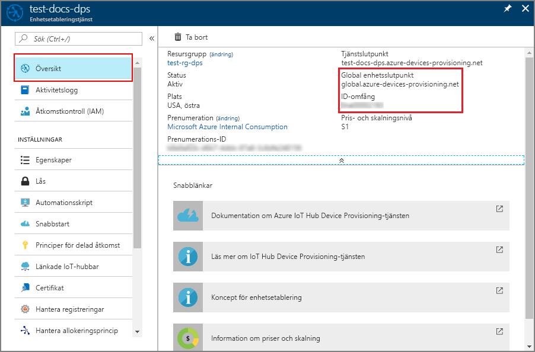
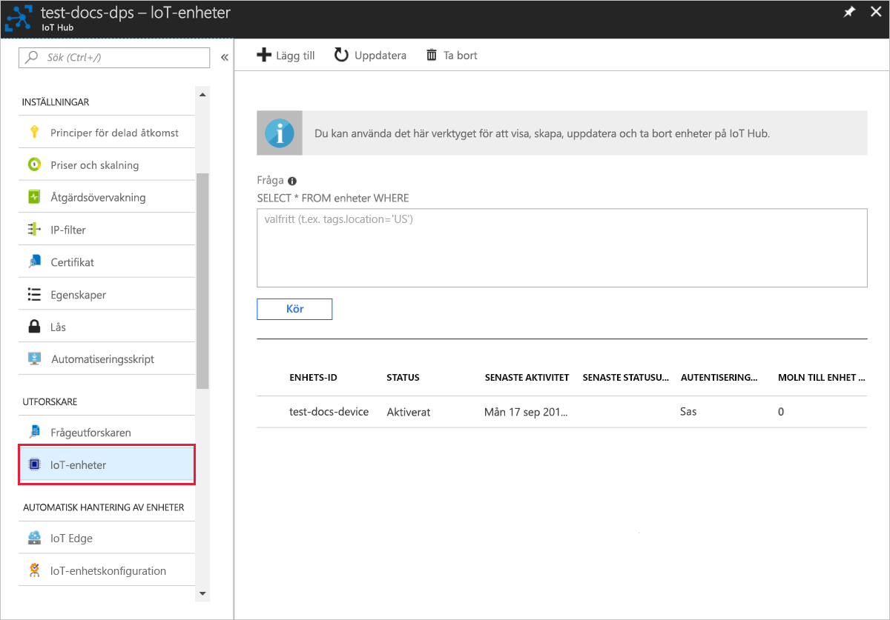

# <a name="quickstart-create-and-provision-an-x509-simulated-device-using-nodejs-device-sdk-for-iot-hub-device-provisioning-service"></a>Snabb start: skapa och etablera en simulerad X. 509-enhet med hjälp av Node.js Device SDK för IoT Hub Device Provisioning Service

[!INCLUDE [iot-dps-selector-quick-create-simulated-device-x509](../../includes/iot-dps-selector-quick-create-simulated-device-x509.md)]

I den här snabb starten skapar du en simulerad X. 509-enhet på en Windows-dator. Du använder enhets exempel Node.js kod för att ansluta den här simulerade enheten med IoT-hubben med hjälp av en enskild registrering med enhets etablerings tjänsten (DPS).

## <a name="prerequisites"></a>Krav

- Bekant med [etablerings](about-iot-dps.md#provisioning-process) koncept.
- Slut för ande av [konfigurations IoT Hub Device Provisioning service med Azure Portal](./quick-setup-auto-provision.md).
- Ett Azure-konto med en aktiv prenumeration. [Skapa ett kostnads fritt](https://azure.microsoft.com/free/?ref=microsoft.com&utm_source=microsoft.com&utm_medium=docs&utm_campaign=visualstudio).
- [Node.js v 4.0 +](https://nodejs.org).
- [Git](https://git-scm.com/download/).
- [Openssl](https://www.openssl.org/).

[!INCLUDE [IoT Device Provisioning Service basic](../../includes/iot-dps-basic.md)]

## <a name="prepare-the-environment"></a>Förbereda miljön 

1. Slutför stegen i [Konfigurera IoT Hub Device Provisioning-tjänsten med Azure Portal](./quick-setup-auto-provision.md) innan du fortsätter.

2. Kontrollera att [Node.js v4.0 eller senare](https://nodejs.org) är installerat på din dator.

3. Kontrol lera att [git](https://git-scm.com/download/) är installerat på datorn och har lagts till i de miljövariabler som är tillgängliga för kommando fönstret. 

4. Kontrollera att [OpenSSL](https://www.openssl.org/) är installerat på datorn och har lagts till i de miljövariabler som är tillgängliga för kommandofönstret. Biblioteket kan antingen byggas och installeras från källkoden eller laddas ned och installeras från en [tredje part](https://wiki.openssl.org/index.php/Binaries) som [det här](https://sourceforge.net/projects/openssl/). 

    > [!NOTE]
    > Om du redan skapat _rotcertifikat_, _mellanliggande certifikat_ och/eller X.509-_lövcertifikat_ kan du hoppa över det här steget och alla efterföljande steg som rör skapande av certifikat.
    >

## <a name="create-a-self-signed-x509-device-certificate-and-individual-enrollment-entry"></a>Skapa ett självsignerat X.509-enhetscertifikat och en post för enskild registrering

I det här avsnittet använder du ett självsignerat X.509-certifikat. Det är viktigt att tänka på följande:

* Självsignerade certifikat är endast till för testning och ska inte användas i produktion.
* Standardutgångsdatumet för ett självsignerat certifikat är ett år.

Du kommer att använda exempelkoden från [Azure IoT SDK för Node.js](https://github.com/Azure/azure-iot-sdk-node.git) för att skapa det certifikat som ska användas med posten för enskild registrering för den simulerade enheten.

Azure IoT Device Provisioning Service stöder två typer av registreringar:

- [Registreringsgrupper](concepts-service.md#enrollment-group): används för att registrera flera relaterade enheter.
- [Enskilda registreringar](concepts-service.md#individual-enrollment): används för att registrera en enskild enhet.

Den här artikeln visar enskilda registreringar.

1. Öppna en kommandotolk. Klona GitHub-lagringsplatsen för att hämta exempelkoden:
    
    ```cmd/sh
    git clone https://github.com/Azure/azure-iot-sdk-node.git --recursive
    ```

2. Navigera till certifikatgeneratorskriptet och skapa projektet. 

    ```cmd/sh
    cd azure-iot-sdk-node/provisioning/tools
    npm install
    ```

3. Skapa ett _lövcertifikat_ förX.509 genom att köra skriptet med ditt eget _certifikatnamn_. Lövcertifikatets namn blir [Registrerings-ID](./concepts-service.md#registration-id) så var noga med att bara använda små bokstäver, siffror och bindestreck.

    ```cmd/sh
    node create_test_cert.js device {certificate-name}
    ```

4. Logga in på [Azure Portal](https://portal.azure.com), Välj knappen **alla resurser** i den vänstra menyn och öppna din enhets etablerings tjänst instans.

5. Från menyn enhets etablerings tjänst väljer du **Hantera registreringar**. Välj fliken **enskilda registreringar** och välj knappen **Lägg till individuell registrering** överst. 

6. Ange följande information på panelen **Lägg till registrering** :
   - Välj **X.509** som identitet för bestyrkande *mekanism*.
   - Under *filen Primary Certificate. pem eller. cer* väljer du *Välj en fil* för att välja certifikat filen **{certificate-Name} _cert. pem** som skapades i föregående steg.  
   - Du kan även ange följande information:
     - Välj en IoT hub som är länkad till din etableringstjänst.
     - Ange ett unikt enhets-ID. Se till att undvika känsliga data när du namnger din enhet. 
     - Uppdatera **inledande enhetstvillingstatus** med önskad inledande konfiguration för enheten.
     - När du är klar trycker du på knappen **Spara** . 

     [](./media/quick-create-simulated-device-x509-node/device-enrollment.png#lightbox)

     Vid lyckad registrering visas din X. 509-enhet som **{certificateName}** under kolumnen *registrerings-ID* på fliken *enskilda registreringar* . Observera detta värde för senare.

## <a name="simulate-the-device"></a>Simulera enheten

[Azure IoT Hub Node.js-enhets-SDK](https://github.com/Azure/azure-iot-sdk-node) gör det enkelt att simulera en enhet. Läs mer i [Enhetskoncept](./concepts-service.md).

1. I Azure Portal väljer du bladet **Översikt** för enhets etablerings tjänsten och noterar värdena för **_GLobal enhets slut punkt_** och **_ID-omfång_** .

     

2. Kopiera ditt _certifikat_ och din _nyckel_ till exempelmappen.

    ```cmd/sh
    copy .\{certificate-name}_cert.pem ..\device\samples\{certificate-name}_cert.pem
    copy .\{certificate-name}_key.pem ..\device\samples\{certificate-name}_key.pem
    ```

3. Navigera till skriptet för enhetstest och skapa projektet. 

    ```cmd/sh
    cd ..\device\samples
    npm install
    ```

4. Redigera **register\_x509.js**-filen. Spara filen när du gjort följande ändringar.
    - Ersätt `provisioning host` med den **_globala enhetsslutpunkt_** du antecknade i **steg 1** ovan.
    - Ersätt `id scope` med det **_ID-omfång_** som anges i **steg 1** ovan. 
    - Ersätt `registration id` med det **_registrerings-ID_** som anges i föregående avsnitt.
    - Ersätt `cert filename` och `key filename` med de filer du kopierade i **steg 2** ovan. 

5. Kör skriptet och verifiera att enheten etablerats korrekt.

    ```cmd/sh
    node register_x509.js
    ```   

6. I portalen navigerar du till IoT-hubben som är länkad till din etablerings tjänst och öppnar bladet **IoT-enheter** . Vid lyckad etablering av den simulerade X. 509-enheten till hubben visas dess enhets-ID på bladet **IoT-enheter** med *status* **aktive rad**. Du kan behöva klicka på knappen **Uppdatera** längst upp om du redan har öppnat bladet innan du kör programmet för enhets exempel. 

     

    Om du ändrade din *inledande enhetstvillingstatus* från standardvärdet i registreringsposten för din enhet kan den hämta önskad tvillingstatus från hubben och agera utifrån det. Mer information finns i [Understand and use device twins in IoT Hub](../iot-hub/iot-hub-devguide-device-twins.md) (Förstå och använda enhetstvillingar i IoT Hub).


## <a name="clean-up-resources"></a>Rensa resurser

Om du planerar att fortsätta att arbeta med och utforska enhets klient exemplet ska du inte rensa upp resurserna som du skapade i den här snabb starten. Om du inte planerar att fortsätta kan du använda följande steg för att ta bort alla resurser som skapats i den här snabb starten.

1. Stäng utdatafönstret för enhetsklientexemplet på datorn.
2. Välj **alla resurser** på den vänstra menyn i Azure Portal och välj sedan enhets etablerings tjänsten. Öppna bladet **Hantera registreringar** för din tjänst och välj sedan fliken **enskilda registreringar** . Markera kryss rutan bredvid *registrerings-ID* för enheten som du har registrerat i den här snabb starten och klicka på knappen **ta bort** högst upp i fönstret. 
3. Välj **alla resurser** på den vänstra menyn i Azure Portal och välj sedan din IoT Hub. Öppna bladet **IoT-enheter** för navet, markera kryss rutan bredvid *enhets-ID* för den enhet som du registrerade i den här snabb starten och tryck sedan på knappen **ta bort** högst upp i fönstret.


## <a name="next-steps"></a>Nästa steg

I den här snabb starten har du skapat en simulerad X. 509-enhet och etablerad den till IoT-hubben med hjälp av Azure-IoT Hub Device Provisioning Service på portalen. Om du vill lära dig hur du registrerar X. 509-enheten program mässigt fortsätter du till snabb starten för program mässig registrering av X. 509-enheter. 

> [!div class="nextstepaction"]
> [Azure snabb start – registrera X. 509-enheter till Azure IoT Hub Device Provisioning Service](quick-enroll-device-x509-node.md)