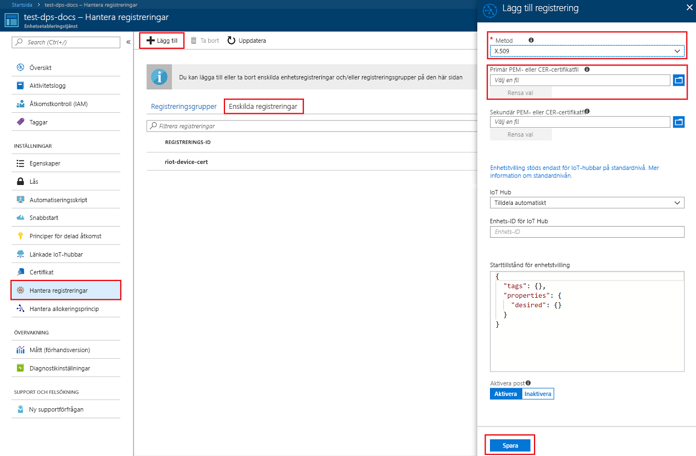
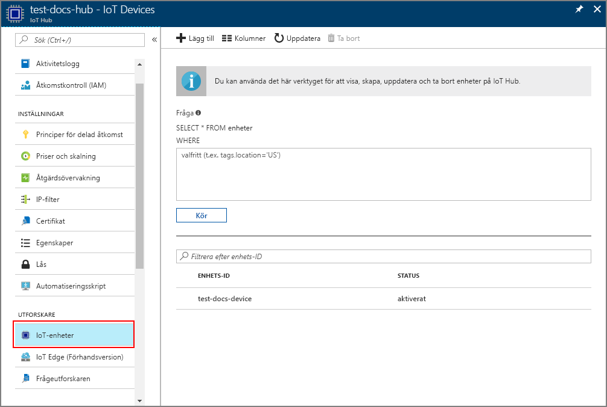

# <a name="create-and-provision-an-x509-simulated-device-using-nodejs-device-sdk-for-iot-hub-device-provisioning-service"></a>Skapa och etablera en simulerad X.509-enhet med Node.js-enhets-SDK för IoT Hub Device Provisioning-tjänsten
[!INCLUDE [iot-dps-selector-quick-create-simulated-device-x509](../../includes/iot-dps-selector-quick-create-simulated-device-x509.md)]

Dessa steg visar hur du skapar en registreringspost i enhetsetableringstjänsten, simulerar en X.509-enhet på utvecklingsmaskinen, ansluter den simulerade enheten med enhetsetableringstjänsten och registrerar enheten i din IoT Hub med [Azure IoT Hub Node.js-enhets-SDK](https://github.com/Azure/azure-iot-sdk-node).

Om du inte känner till processen för automatisk etablering, bör du också gå igenom [Begrepp inom automatisk etablering](concepts-auto-provisioning.md). Se också till att slutföra stegen i [Set up IoT Hub Device Provisioning Service with the Azure portal](./quick-setup-auto-provision.md) (Konfigurera IoT Hub Device Provisioning-tjänsten med Azure Portal) innan du fortsätter. 

[!INCLUDE [IoT Device Provisioning Service basic](../../includes/iot-dps-basic.md)]

## <a name="prepare-the-environment"></a>Förbereda miljön 

1. Slutför stegen i [Konfigurera IoT Hub Device Provisioning-tjänsten med Azure Portal](./quick-setup-auto-provision.md) innan du fortsätter.

2. Kontrollera att [Node.js v4.0 eller senare](https://nodejs.org) är installerat på din dator.

3. Kontrollera att [Git](https://git-scm.com/download/) är installerat på datorn och har lagts till i de miljövariabler som är tillgängliga för kommandofönstret. 

4. Kontrollera att [OpenSSL](https://www.openssl.org/) är installerat på datorn och har lagts till i de miljövariabler som är tillgängliga för kommandofönstret. Biblioteket kan antingen byggas och installeras från källkoden eller laddas ned och installeras från en [tredje part](https://wiki.openssl.org/index.php/Binaries) som [det här](https://sourceforge.net/projects/openssl/). 

    > [!NOTE]
    > Om du redan skapat _rotcertifikat_,  _mellanliggande certifikat_ och/eller X.509-_lövcertifikat_ kan du hoppa över det här steget och alla efterföljande steg som rör skapande av certifikat.
    >

## <a name="create-a-self-signed-x509-device-certificate-and-individual-enrollment-entry"></a>Skapa ett självsignerat X.509-enhetscertifikat och en post för enskild registrering

I det här avsnittet använder du ett självsignerat X.509-certifikat. Då måste du tänka på det här:

* Självsignerade certifikat är endast till för testning och ska inte användas i produktion.
* Standardutgångsdatumet för ett självsignerat certifikat är 1 år.

Du kommer att använda exempelkoden från [Azure IoT SDK för Node.js](https://github.com/Azure/azure-iot-sdk-node.git) för att skapa det certifikat som ska användas med posten för enskild registrering för den simulerade enheten.


1. Öppna en kommandotolk. Klona GitHub-lagringsplatsen för att hämta exempelkoden:
    
    ```cmd/sh
    git clone https://github.com/Azure/azure-iot-sdk-node.git --recursive
    ```

2. Navigera till certifikatgeneratorskriptet och skapa projektet. 

    ```cmd/sh
    cd azure-iot-sdk-node/provisioning/tools
    npm install
    ```

3. Skapa ett _lövcertifikat_ förX.509 genom att köra skriptet med ditt eget _certifikatnamn_. Lövcertifikatets namn blir [Registrerings-ID](https://docs.microsoft.com/azure/iot-dps/concepts-device#registration-id) så var noga med att bara använda små bokstäver, siffror och bindestreck.

    ```cmd/sh
    node create_test_cert.js device {certificate-name}
    ```

4. Logga in på [Azure Portal](https://portal.azure.com), klicka på knappen **Alla resurser** i den vänstra menyn och öppna Device Provisioning-tjänsten.

5. På sammanfattningsbladet för Device Provisioning-tjänsten väljer du **Manage enrollments** (Hantera registreringar). Välj fliken **Individual Enrollments** (Enskilda registreringar) och klicka på knappen **Lägg till** längst upp. 

6. Under panelen **Lägg till registrering** anger du följande information:
    - Välj **X.509** som identitet för bestyrkande *mekanism*.
    - Under *Primary certificate .pem or .cer file* (Primär .pem- eller .cer-certifikatfil) klickar du på *Välj en fil* för att välja certifikatfilen **{certificate-name}_cert.pem** som skapades i föregående steg.  
    - Du kan även ange följande information:
      - Välj en IoT hub som är länkad till din etableringstjänst.
      - Ange ett unikt enhets-ID. Se till att undvika känsliga data när du namnger din enhet. 
      - Uppdatera **inledande enhetstvillingstatus** med önskad inledande konfiguration för enheten.
   - Klicka på knappen **Spara** när det är klart. 

    [](./media/quick-create-simulated-device-x509-node/individual-enrollment.png#lightbox)

    Om registreringen har lyckats visas din X.509-enhet som **{certifikatnamn}** under kolumnen *Registrerings-ID* på fliken *Enskilda registreringar*. Anteckna det här värdet för senare användning.

## <a name="simulate-the-device"></a>Simulera enheten

[Azure IoT Hub Node.js-enhets-SDK](https://github.com/Azure/azure-iot-sdk-node) gör det enkelt att simulera en enhet. Läs mer i [Enhetskoncept](https://docs.microsoft.com/azure/iot-dps/concepts-device).

1. I Azure-portalen väljer du bladet **Översikt** för Device Provisioning-tjänsten och noterar värdena för **_Global enhetsslutpunkt_** och **_ID-omfång_**.

     

2. Kopiera ditt _certifikat_ och din _nyckel_ till exempelmappen.

    ```cmd/sh
    copy .\{certificate-name}_cert.pem ..\device\samples\{certificate-name}_cert.pem
    copy .\{certificate-name}_key.pem ..\device\samples\{certificate-name}_key.pem
    ```

3. Navigera till skriptet för enhetstest och skapa projektet. 

    ```cmd/sh
    cd ..\device\samples
    npm install
    ```

4. Redigera **register\_x509.js**-filen. Spara filen när du gjort följande ändringar.
    - Ersätt `provisioning host` med den **_globala enhetsslutpunkt_** du antecknade i **steg 1** ovan.
    - Ersätt `id scope` med det **_ID-omfång_** du antecknade i **steg 1** ovan. 
    - Ersätt `registration id` med det **_Registrerings-ID_** du antecknade i föregående avsnitt.
    - Ersätt `cert filename` och `key filename` med de filer du kopierade i **steg 2** ovan. 

5. Kör skriptet och verifiera att enheten etablerats korrekt.

    ```cmd/sh
    node register_x509.js
    ```   

6. I portalen går du till den IoT-hubb som är kopplad till din etableringstjänst och öppnar bladet **IoT-enheter**. Vid lyckad etablering av den simulerade X.509-enheten till hubben visas dess enhets-ID på bladet **IoT-enheter** med *STATUS* **aktiverad**. Du kan behöva klicka på **uppdateringsknappen** högst upp om du redan har öppnat bladet innan du kör programmet på exempelenheten. 

     

    Om du ändrade din *inledande enhetstvillingstatus* från standardvärdet i registreringsposten för din enhet kan den hämta önskad tvillingstatus från hubben och agera utifrån det. Mer information finns i [Understand and use device twins in IoT Hub](../iot-hub/iot-hub-devguide-device-twins.md) (Förstå och använda enhetstvillingar i IoT Hub).


## <a name="clean-up-resources"></a>Rensa resurser

Om du vill fortsätta att arbeta med och utforska enhetsklientexemplet ska du inte rensa de resurser som har skapats i den här snabbstarten. Om du inte planerar att fortsätta kan du använda stegen nedan för att ta bort alla resurser som har skapats i den här snabbstarten.

1. Stäng utdatafönstret för enhetsklientexemplet på datorn.
2. Klicka på **Alla resurser** på menyn till vänster på Azure-portalen och välj din Device Provisioning-tjänst. Öppna bladet **Hantera registreringar** för tjänsten och klicka på fliken **Enskilda registreringar**. Välj *REGISTRERINGS-ID* för enheten du har registrerat i den här snabbstarten och klicka på knappen **Ta bort** högst upp. 
3. Klicka på **Alla resurser** på menyn till vänster på Azure-portalen och välj din IoT-hubb. Öppna bladet **IoT-enheter** för din hubb, välj *ENHETS-ID* för enheten du har registrerat i den här snabbstarten och klicka på knappen **Ta bort** högst upp.


## <a name="next-steps"></a>Nästa steg

I den här snabbstarten har du skapat en simulerad X.509-enhet och etablerat den på IoT-hubben med hjälp av Azure IoT Hub Device Provisioning-tjänsten i portalen. Information om hur du registrerar X.509-enheten programmässigt får du om du fortsätter till snabbstarten för programmässig registrering av X.509-enheter. 

> [!div class="nextstepaction"]
> [Azure snabbstart – Registrera X.509-enheter på Azure IoT Hub Device Provisioning-tjänsten](quick-enroll-device-x509-node.md)
