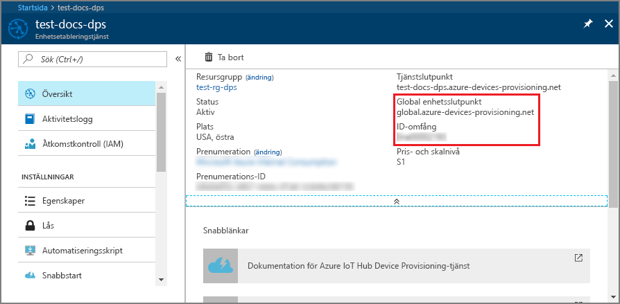
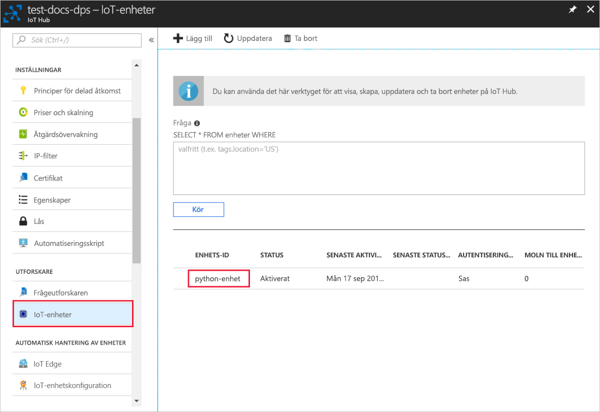

# <a name="quickstart-create-and-provision-a-simulated-x509-device-using-python-device-sdk-for-iot-hub-device-provisioning-service"></a>Snabb start: skapa och etablera en simulerad X. 509-enhet med python-enhets-SDK för IoT Hub Device Provisioning Service

[!INCLUDE [iot-dps-selector-quick-create-simulated-device-x509](../../includes/iot-dps-selector-quick-create-simulated-device-x509.md)]

I den här snabb starten skapar du en simulerad X. 509-enhet på en Windows-dator. Du använder enhets exempel python-kod för att ansluta den här simulerade enheten med IoT-hubben med hjälp av en enskild registrering med enhets etablerings tjänsten (DPS).

## <a name="prerequisites"></a>Förutsättningar

- Bekant med [etablerings](about-iot-dps.md#provisioning-process) koncept.
- Slut för ande av [konfigurations IoT Hub Device Provisioning service med Azure Portal](./quick-setup-auto-provision.md).
- Ett Azure-konto med en aktiv prenumeration. [Skapa ett kostnads fritt](https://azure.microsoft.com/free/?ref=microsoft.com&utm_source=microsoft.com&utm_medium=docs&utm_campaign=visualstudio).
- [Visual Studio 2015 +](https://visualstudio.microsoft.com/vs/) med Skriv bords utveckling med C++.
- [Cmake build-system](https://cmake.org/download/).
- [Git](https://git-scm.com/download/).

> [!IMPORTANT]
> Den här artikeln gäller endast den inaktuella v1 python SDK. Enhets-och tjänst klienter för IoT Hub Device Provisioning-tjänsten är ännu inte tillgängliga i v2. Teamet är för närvarande hårt för att ge v2 till funktionens paritet.

[!INCLUDE [IoT Device Provisioning Service basic](../../includes/iot-dps-basic.md)]

## <a name="prepare-the-environment"></a>Förbereda miljön 

1. Kontrol lera att du har installerat antingen [Visual studio](https://visualstudio.microsoft.com/vs/) 2015 eller senare, med arbets belastningen "Desktop Development with C++" som är aktive rad för Visual Studio-installationen.

2. Hämta och installera [CMake-buildsystemet](https://cmake.org/download/).

3. Kontrollera att `git` är installerat på datorn och har lagts till i de miljövariabler som är tillgängliga för kommandofönstret. Se [Git-klientverktyg för Software Freedom Conservancy](https://git-scm.com/download/) för att få den senaste versionen av `git`-verktyg att installera, vilket omfattar **Git Bash**, kommandoradsappen som du kan använda för att interagera med det lokala Git-lagret. 

4. Öppna en kommandotolk eller Git Bash. Klona GitHub-lagringsplatsen för enhetssimuleringens kodexempel.
    
    ```cmd/sh
    git clone https://github.com/Azure/azure-iot-sdk-python.git --recursive
    ```

5. Skapa en mapp på den lokala kopian av denna GitHub-lagringsplats för CMake-buildprocessen. 

    ```cmd/sh
    cd azure-iot-sdk-python/c
    mkdir cmake
    cd cmake
    ```

6. Kör följande kommando för att skapa Visual Studio-lösningen för etableringsklienten.

    ```cmd/sh
    cmake -Duse_prov_client:BOOL=ON ..
    ```


## <a name="create-a-self-signed-x509-device-certificate-and-individual-enrollment-entry"></a>Skapa ett självsignerat X.509-enhetscertifikat och en post för enskild registrering

I det här avsnittet använder du ett självsignerat X.509-certifikat. Det är viktigt att tänka på följande punkter:

* Självsignerade certifikat är endast till för testning och ska inte användas i produktion.
* Standardutgångsdatumet för ett självsignerat certifikat är ett år.

Du kommer att använda exempelkoden från Azure IoT C SDK för att skapa det certifikat som ska användas med posten för enskild registrering för den simulerade enheten.

Azure IoT Device Provisioning Service stöder två typer av registreringar:

- [Registreringsgrupper](concepts-service.md#enrollment-group): används för att registrera flera relaterade enheter.
- [Enskilda registreringar](concepts-service.md#individual-enrollment): används för att registrera en enskild enhet.

Den här artikeln visar enskilda registreringar.

1. Öppna den lösning som har genererats i mappen *cmake* med namnet `azure_iot_sdks.sln`, och skapa den i Visual Studio.

2. Högerklicka på projektet **dice\_device\_enrollment** i mappen **Provision\_Tools** och välj **Set as Startup Project** (Ange som startprojekt). Kör lösningen. 

3. I utdatafönstret anger du `i` för individuell registrering när du blir uppmanad till det. I utdatafönstret visas ett lokalt genererat X.509-certifikat för din simulerade enhet. 
    
    ```output
    Copy the first certificate to clipboard. Begin with the first occurrence of:
    
        -----BEGIN CERTIFICATE----- 
        
    End you copying after the first occurrence of:
    
        -----END CERTIFICATE-----
        
    Make sure to include both of those lines as well.
    ``` 

    
 
4. Skapa en fil med namnet **_X509testcertificate.pem_** på din Windows-dator, öppna den i valfritt redigeringsprogram och kopiera urklippsinnehållet till filen. Spara filen. 

5. Logga in på Azure Portal, Välj knappen **alla resurser** i den vänstra menyn och öppna etablerings tjänsten.

6. Från menyn enhets etablerings tjänst väljer du **Hantera registreringar**. Välj fliken **enskilda registreringar** och välj knappen **Lägg till individuell registrering** överst. 

7. Ange följande information på panelen **Lägg till registrering** :
   - Välj **X.509** som identitet för bestyrkande *mekanism*.
   - Under *filen Primary Certificate. pem eller. cer* väljer du *Välj en fil* för att välja certifikat filen **X509testcertificate. pem** som skapades i föregående steg.
   - Du kan även ange följande information:
     - Välj en IoT hub som är länkad till din etableringstjänst.
     - Ange ett unikt enhets-ID. Se till att undvika känsliga data när du namnger din enhet. 
     - Uppdatera **inledande enhetstvillingstatus** med önskad inledande konfiguration för enheten.
   - När du är klar trycker du på knappen **Spara** . 

     [](./media/python-quick-create-simulated-device-x509/device-enrollment.png#lightbox)

   Om registreringen har lyckats visas din X.509-enhet som **riot-device-cert** under kolumnen *Registrerings-ID* på fliken *Enskilda registreringar*. 

## <a name="simulate-the-device"></a>Simulera enheten

1. Från menyn enhets etablerings tjänst väljer du **Översikt**. Anteckna _ID-omfånget_ och den _globala tjänst slut punkten_.

    

2. Ladda ned och installera [Python 2.x eller 3.x](https://www.python.org/downloads/). Se till att använda en 32-bitars eller 64-bitars installation beroende på vad som krävs för din konfiguration. Se till att du lägger till Python i de plattformsspecifika miljövariablerna när du uppmanas att göra det under installationen. Om du använder Python 2.x kan du behöva [installera eller uppgradera *PIP* (pakethanteringssystemet för Python)](https://pip.pypa.io/en/stable/installing/).
    
    > [!NOTE] 
    > Om du använder Windows ska du även installera [Visual C++ Redistributable för Visual Studio 2015](https://support.microsoft.com/help/2977003/the-latest-supported-visual-c-downloads). Pip-paketen kräver Redistributable för att läsa in/köra C DLL-filer.

3. Skapa Python-paketen med hjälp av [de här instruktionerna](https://github.com/Azure/azure-iot-sdk-python/blob/v1-deprecated/doc/python-devbox-setup.md).

   > [!NOTE]
   > Om du använder `pip` ska du även installera `azure-iot-provisioning-device-client`-paketet.

4. Navigera till exempelmappen.

    ```cmd/sh
    cd azure-iot-sdk-python/provisioning_device_client/samples
    ```

5. Med Python IDE redigerar du python-skriptet **provisioning\_device\_client\_sample.py**. Ändra variablerna _GLOBAL\_PROV\_URI_ och _ID\_SCOPE_ till de värden som angavs tidigare.

    ```python
    GLOBAL_PROV_URI = "{globalServiceEndpoint}"
    ID_SCOPE = "{idScope}"
    SECURITY_DEVICE_TYPE = ProvisioningSecurityDeviceType.X509
    PROTOCOL = ProvisioningTransportProvider.HTTP
    ```

6. Kör exemplet. 

    ```cmd/sh
    python provisioning_device_client_sample.py
    ```

7. Programmet ansluts, registrerar enheten och visar ett meddelande om lyckad registrering.

    

8. I portalen går du till den IoT-hubb som är kopplad till din etableringstjänst och öppnar bladet **Device Explorer**. Vid lyckad etablering av den simulerade X.509-enheten till hubben visas dess enhets-ID på bladet **Device Explorer** med *STATUS***aktiverad**. Du kan behöva klicka på knappen **Uppdatera** längst upp om du redan har öppnat bladet innan du kör programmet för enhets exempel. 

     

> [!NOTE]
> Om du ändrade din *inledande enhetstvillingstatus* från standardvärdet i registreringsposten för din enhet kan den hämta önskad tvillingstatus från hubben och agera utifrån det. Mer information finns i [Understand and use device twins in IoT Hub](../iot-hub/iot-hub-devguide-device-twins.md) (Förstå och använda enhetstvillingar i IoT Hub).
>

## <a name="clean-up-resources"></a>Rensa resurser

Om du planerar att fortsätta att arbeta med och utforska enhets klient exemplet ska du inte rensa upp resurserna som du skapade i den här snabb starten. Om du inte planerar att fortsätta kan du använda följande steg för att ta bort alla resurser som skapats i den här snabb starten.

1. Stäng utdatafönstret för enhetsklientexemplet på datorn.
2. Välj **alla resurser** på den vänstra menyn i Azure Portal och välj sedan enhets etablerings tjänsten. Öppna bladet **Hantera registreringar** för din tjänst och välj sedan fliken **enskilda registreringar** . Markera kryss rutan bredvid *registrerings-ID* för enheten som du har registrerat i den här snabb starten och klicka på knappen **ta bort** högst upp i fönstret. 
3. Välj **alla resurser** på den vänstra menyn i Azure Portal och välj sedan din IoT Hub. Öppna bladet **IoT-enheter** för navet, markera kryss rutan bredvid *enhets-ID* för den enhet som du registrerade i den här snabb starten och tryck sedan på knappen **ta bort** högst upp i fönstret.

## <a name="next-steps"></a>Nästa steg

I den här snabb starten har du skapat en simulerad X. 509-enhet på din Windows-dator och etablerade den till IoT-hubben med hjälp av Azure-IoT Hub Device Provisioning Service på portalen. Om du vill lära dig hur du registrerar X. 509-enheten program mässigt fortsätter du till snabb starten för program mässig registrering av X. 509-enheter. 

> [!div class="nextstepaction"]
> [Azure snabb start – registrera X. 509-enheter till Azure IoT Hub Device Provisioning Service](quick-enroll-device-x509-python.md)
