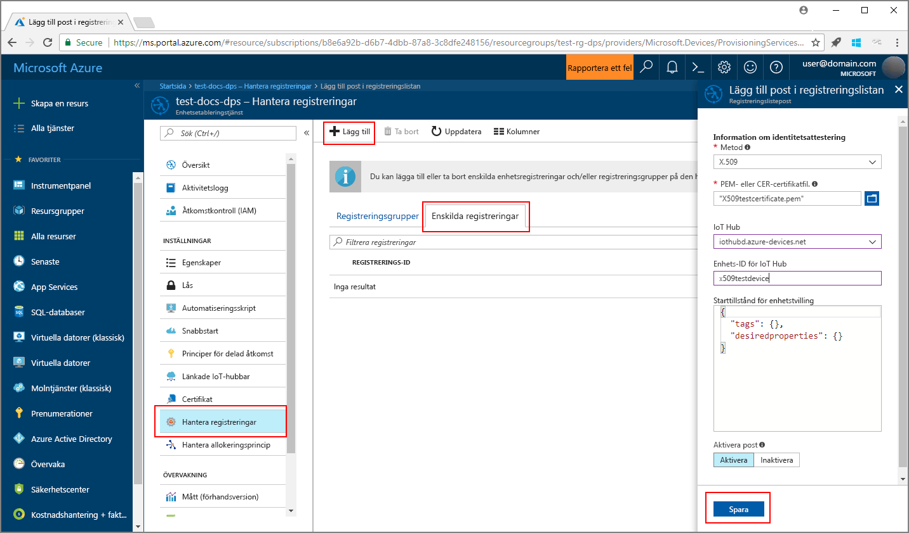
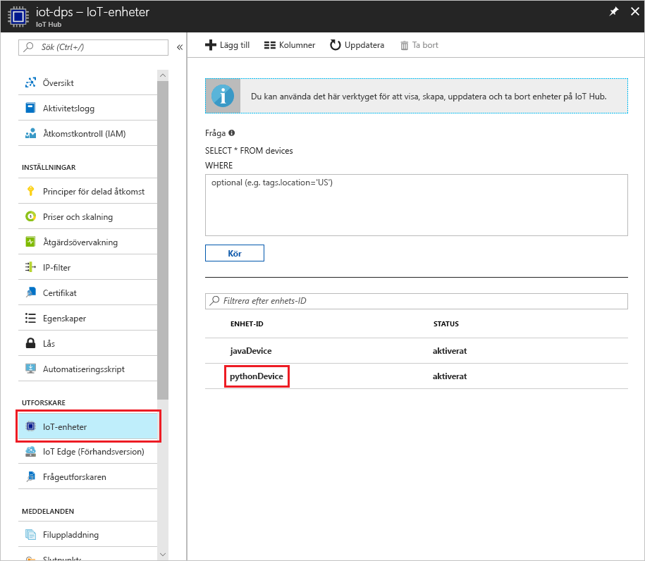

# <a name="create-and-provision-a-simulated-x509-device-using-python-device-sdk-for-iot-hub-device-provisioning-service"></a>Skapa och etablera en simulerad X.509-enhet med Python-enhets-SDK för IoT Hub Device Provisioning-tjänsten
> [!div class="op_single_selector"]
> * [C](quick-create-simulated-device-x509.md)
> * [Java](quick-create-simulated-device-x509-java.md)
> * [C#](quick-create-simulated-device-x509-csharp.md)
> * [Python](quick-create-simulated-device-x509-python.md)

Dessa steg visar hur du simulerar en X.509-enhet på utvecklingsdatorn som kör Windows OS och använder Python-kodexemplet för att ansluta till denna simulerade enhet med Device Provisioning-tjänsten och IoT-hubben. 

Se till att slutföra stegen i [Set up IoT Hub Device Provisioning Service with the Azure portal](./quick-setup-auto-provision.md) (Konfigurera IoT Hub Device Provisioning-tjänsten med Azure-portalen) innan du fortsätter.


## <a name="prepare-the-environment"></a>Förbereda miljön 

1. Kontrollera att du har antingen [Visual Studio 2015](https://www.visualstudio.com/vs/older-downloads/) eller [Visual Studio 2017](https://www.visualstudio.com/vs/) installerat på datorn. Du måste ha arbetsbelastningen ”Desktop development with C++” (Skrivbordsutveckling med C++) aktiverad för installationen av Visual Studio.

1. Hämta och installera [CMake-buildsystemet](https://cmake.org/download/).

1. Kontrollera att `git` är installerat på datorn och har lagts till i de miljövariabler som är tillgängliga för kommandofönstret. Se [Git-klientverktyg för Software Freedom Conservancy](https://git-scm.com/download/) för att få den senaste versionen av `git`-verktyg att installera, vilket omfattar **Git Bash**, kommandoradsappen som du kan använda för att interagera med det lokala Git-lagret. 

1. Öppna en kommandotolk eller Git Bash. Klona GitHub-lagringsplatsen för enhetssimuleringens kodexempel.
    
    ```cmd/sh
    git clone https://github.com/Azure/azure-iot-sdk-python.git --recursive
    ```

1. Skapa en mapp på den lokala kopian av denna GitHub-lagringsplats för CMake-buildprocessen. 

    ```cmd/sh
    cd azure-iot-sdk-python/c
    mkdir cmake
    cd cmake
    ```

1. Kör följande kommando för att skapa Visual Studio-lösningen för etableringsklienten.

    ```cmd/sh
    cmake -Duse_prov_client:BOOL=ON ..
    ```


## <a name="create-a-device-enrollment-entry"></a>Skapa en post för enhetsregistrering

1. Öppna den lösning som har genererats i mappen *cmake* med namnet `azure_iot_sdks.sln`, och skapa den i Visual Studio.

1. Högerklicka på projektet **dice\_device\_enrollment** i mappen **Provision\_Tools** och välj **Set as Startup Project** (Ange som startprojekt). Kör lösningen. I utdatafönstret anger du `i` för individuell registrering när du blir uppmanad till det. I utdatafönstret visas ett lokalt genererat X.509-certifikat för din simulerade enhet. Kopiera utdata till Urklipp som börjar på *-----BEGIN CERTIFICATE-----* och slutar på *-----END CERTIFICATE-----*, och se till att du får med båda raderna. 

    
 
1. Skapa en fil med namnet **_X509testcertificate.pem_** på din Windows-dator, öppna den i valfritt redigeringsprogram och kopiera urklippsinnehållet till filen. Spara filen. 

1. Logga in på Azure-portalen, klicka på knappen **Alla resurser** i den vänstra menyn och öppna din distributionstjänst.

1. På sammanfattningsbladet för Device Provisioning-tjänsten väljer du **Manage enrollments** (Hantera registreringar). Välj fliken **Individual Enrollments** (Enskilda registreringar) och klicka på knappen **Lägg till** längst upp. 

1. Under posten för att **lägga till registreringslista** anger du följande information:
    - Välj **X.509** som identitet för bestyrkande *mekanism*.
    - Under filen *Certificate .pem eller .cer* väljer du certifikatfilen **_X509testcertificate.pem_** som skapades i föregående steg med widgeten *Utforskaren*.
    - Du kan även ange följande information:
        - Välj en IoT hub som är länkad till din etableringstjänst.
        - Ange ett unikt enhets-ID. Se till att undvika känsliga data när du namnger din enhet. 
        - Uppdatera **inledande enhetstvillingstatus** med önskad inledande konfiguration för enheten.
    - Klicka på knappen **Spara** när det är klart. 

      

   Om registreringen har lyckats visas din X.509-enhet som **riot-device-cert** under kolumnen *Registrerings-ID* på fliken *Enskilda registreringar*. 


## <a name="simulate-the-device"></a>Simulera enheten

1. Välj **Översikt** på sammanfattningsbladet för Device Provisioning-tjänsten. Anteckna _ID-omfånget_ och _slutpunkten för global övervakning_.

    

1. Ladda ned och installera [Python 2.x eller 3.x](https://www.python.org/downloads/). Se till att använda en 32-bitars eller 64-bitars installation beroende på vad som krävs för din konfiguration. Se till att du lägger till Python i den plattformsspecifika miljövariabeln när du uppmanas att göra det under installationen. Om du använder Python 2.x kan du behöva [installera eller uppgradera *PIP* (pakethanteringssystemet för Python)](https://pip.pypa.io/en/stable/installing/).
    - Om du använder Windows OS installerar du [Visual C++ redistributable package](http://www.microsoft.com/download/confirmation.aspx?id=48145) så att du kan använda native-DLL:er från Python.

1. Skapa Python-paketen med hjälp av [de här instruktionerna](https://github.com/Azure/azure-iot-sdk-python/blob/master/doc/python-devbox-setup.md).

    > [!NOTE]
        > Om du använder `pip` ska du även installera `azure-iot-provisioning-device-client`-paketet.

1. Navigera till exempelmappen.

    ```cmd/sh
    cd azure-iot-sdk-python/provisioning_device_client/samples
    ```

1. Med Python IDE redigerar du python-skriptet **provisioning\_device\_client\_sample.py**. Ändra variablerna _GLOBAL\_PROV\_URI_ och _ID\_SCOPE_ till de värden som angavs tidigare.

    ```python
    GLOBAL_PROV_URI = "{globalServiceEndpoint}"
    ID_SCOPE = "{idScope}"
    SECURITY_DEVICE_TYPE = ProvisioningSecurityDeviceType.X509
    PROTOCOL = ProvisioningTransportProvider.HTTP
    ```

1. Kör exemplet. 

    ```cmd/sh
    python provisioning_device_client_sample.py
    ```

1. Programmet ansluts, registrerar enheten och visar ett meddelande om lyckad registrering.

    

1. I portalen går du till den IoT-hubb som är kopplad till din etableringstjänst och öppnar bladet **Device Explorer**. Vid lyckad etablering av den simulerade X.509-enheten till hubben visas dess enhets-ID på bladet **Device Explorer** med *STATUS* **aktiverad**. Du kan behöva klicka på **uppdateringsknappen** högst upp om du redan har öppnat bladet innan du kör programmet på exempelenheten. 

     

> [!NOTE]
> Om du ändrade din *inledande enhetstvillingstatus* från standardvärdet i registreringsposten för din enhet kan den hämta önskad tvillingstatus från hubben och agera utifrån det. Mer information finns i [Understand and use device twins in IoT Hub](../iot-hub/iot-hub-devguide-device-twins.md) (Förstå och använda enhetstvillingar i IoT Hub).
>


## <a name="clean-up-resources"></a>Rensa resurser

Om du vill fortsätta att arbeta med och utforska enhetsklientexemplet ska du inte rensa de resurser som har skapats i den här snabbstarten. Om du inte planerar att fortsätta kan du använda stegen nedan för att ta bort alla resurser som har skapats i den här snabbstarten.

1. Stäng utdatafönstret för enhetsklientexemplet på datorn.
1. Klicka på **Alla resurser** på menyn till vänster på Azure-portalen och välj din Device Provisioning-tjänst. Öppna bladet **Hantera registreringar** för tjänsten och klicka på fliken **Enskilda registreringar**. Välj *REGISTRERINGS-ID* för enheten du har registrerat i den här snabbstarten och klickar på knappen **Ta bort** högst upp. 
1. Klicka på **Alla resurser** på menyn till vänster på Azure-portalen och välj din IoT-hubb. Öppna bladet **IoT-enheter** för din hubb, välj *ENHETS-ID* för enheten du har registrerat i den här snabbstarten och klicka på knappen **Ta bort** högst upp.

## <a name="next-steps"></a>Nästa steg

I den här snabbstarten har du skapat en X.509-simulerad enhet på Windows-datorn och etablerat den på IoT-hubben med hjälp av Azure IoT Hub Device Provisioning-tjänsten på portalen. Information om hur du registrerar X.509-enheten programmässigt får du om du fortsätter till snabbstarten för programmässig registrering av X.509-enheter. 

> [!div class="nextstepaction"]
> [Azure Quickstart – Registrera X.509-enhet på Azure IoT Hub Device Provisioning-tjänsten](quick-enroll-device-x509-java.md)
