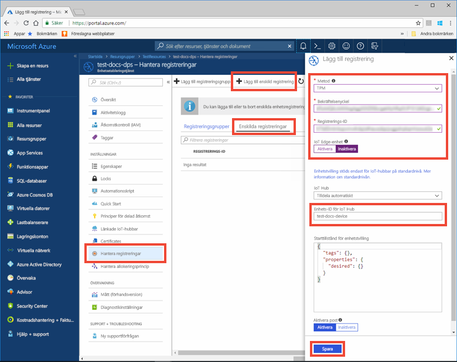
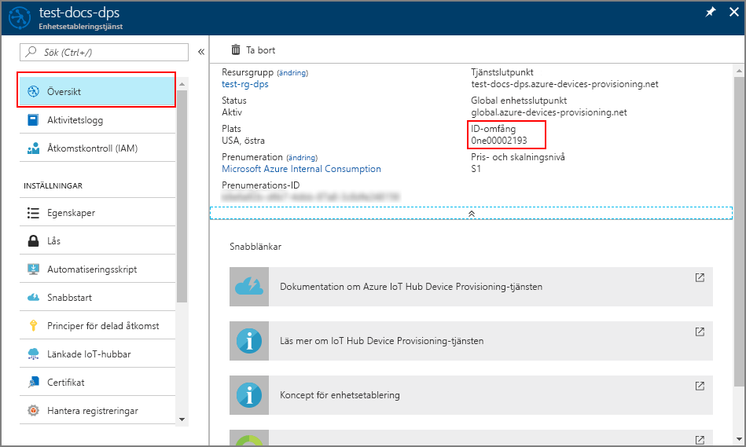
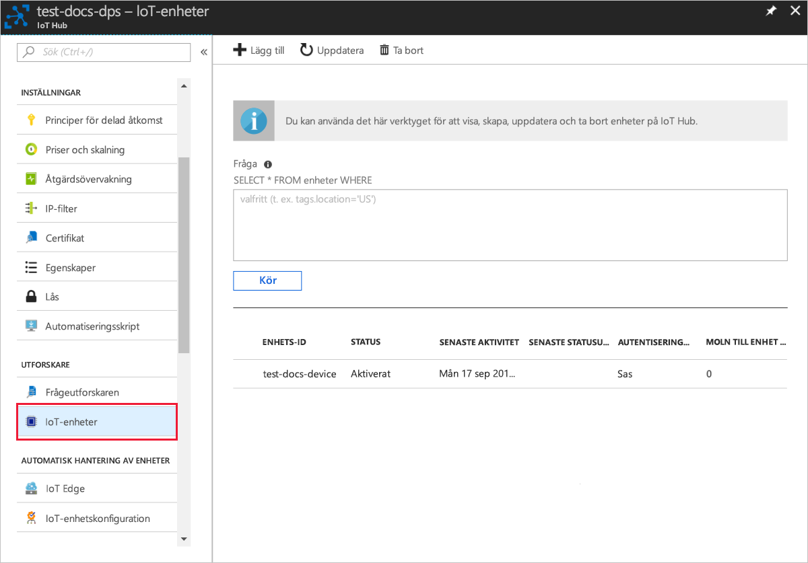

# <a name="quickstart-provision-a-simulated-tpm-device-using-the-azure-iot-c-sdk"></a>Snabbstart: Etablera en simulerad TPM-enhet med Azure IoT C SDK

[!INCLUDE [iot-dps-selector-quick-create-simulated-device-tpm](../../includes/iot-dps-selector-quick-create-simulated-device-tpm.md)]

I den här snabbstarten får lära dig att skapa och köra en TPM-enhetssimulator (Trusted Platform Module) på en Windows-utvecklingsdator. Du ansluter denna simulerade enhet till en IoT-hubb med hjälp av en instans av enhetsetableringstjänst. Exempelkoden från [Azure IoT C SDK](https://github.com/Azure/azure-iot-sdk-c) används för att registrera enheten med en instans av enhetsetableringstjänst och simulera en startsekvens för enheten.

Om du inte är bekant med processen för autoetablering, granskar du [etablerings](about-iot-dps.md#provisioning-process) översikten. Se även till att slutföra stegen i [Set up IoT Hub Device Provisioning Service with the Azure portal](./quick-setup-auto-provision.md) (Konfigurera IoT Hub-enhetsetableringstjänsten med Azure-portalen) innan du fortsätter med den här snabbstarten. 

Azure IoT Device Provisioning Service stöder två typer av registreringar:
- [Registreringsgrupper](concepts-service.md#enrollment-group): används för att registrera flera relaterade enheter.
- [Enskilda registreringar](concepts-service.md#individual-enrollment): används för att registrera en enskild enhet.

Den här artikeln visar enskilda registreringar.

[!INCLUDE [quickstarts-free-trial-note](../../includes/quickstarts-free-trial-note.md)]

## <a name="prerequisites"></a>Krav

Följande förutsättningar gäller för en Windows-utvecklings miljö. För Linux eller macOS, se lämpligt avsnitt i [förbereda utvecklings miljön](https://github.com/Azure/azure-iot-sdk-c/blob/master/doc/devbox_setup.md) i SDK-dokumentationen.

* [Visual Studio](https://visualstudio.microsoft.com/vs/) 2019 med arbets belastningen ["Skriv bords utveckling med C++"](/cpp/ide/using-the-visual-studio-ide-for-cpp-desktop-development) aktiverat. Visual Studio 2015 och Visual Studio 2017 stöds också.

* Senaste versionen av [Git](https://git-scm.com/download/) installerad.

<a id="setupdevbox"></a>

## <a name="prepare-a-development-environment-for-the-azure-iot-c-sdk"></a>Förbereda en utvecklingsmiljö för Azure IoT C SDK

I det här avsnittet förbereder du en utvecklingsmiljö som används för att skapa [Azure IoT C SDK](https://github.com/Azure/azure-iot-sdk-c) och [TPM](/windows/device-security/tpm/trusted-platform-module-overview)-enhetssimulatorexemplet.

1. Ladda ned [cmake build-systemet](https://cmake.org/download/).

    Det är viktigt att förutsättningarna för Visual Studio (Visual Studio och arbetsbelastningen ”Desktop development with C++” (Skrivbordsutveckling med C++)) är installerade på datorn **innan** installationen av `CMake` påbörjas. När förutsättningarna är uppfyllda och nedladdningen har verifierats installerar du CMake-byggesystemet.

2. Hitta taggnamnet för den [senaste versionen](https://github.com/Azure/azure-iot-sdk-c/releases/latest) av SDK.

3. Öppna en kommandotolk eller Git Bash-gränssnittet. Kör följande kommandon för att klona den senaste versionen av [Azure IoT C SDK](https://github.com/Azure/azure-iot-sdk-c) GitHub-lagringsplatsen. Använd taggen som du hittade i föregående steg som `-b` parameter värde:

    ```cmd/sh
    git clone -b <release-tag> https://github.com/Azure/azure-iot-sdk-c.git
    cd azure-iot-sdk-c
    git submodule update --init
    ```

    Den här åtgärden kan förväntas ta flera minuter att slutföra.

4. Skapa en `cmake`-underkatalog i rotkatalogen på git-lagringsplatsen och navigera till den mappen. Kör följande kommandon från `azure-iot-sdk-c` katalogen:

    ```cmd/sh
    mkdir cmake
    cd cmake
    ```

## <a name="build-the-sdk-and-run-the-tpm-device-simulator"></a>Skapa SDK och köra TPM-enhetssimulatorn

I det här avsnittet skapar du Azure IoT C SDK, som innehåller exempelkoden för TPM-enhetssimulatorn. Det här exemplet tillhandahåller en TPM-[attesteringsmekanism](concepts-service.md#attestation-mechanism) via SAS-tokenautentisering (signatur för delad åtkomst).

1. Från `cmake`-underkatalogen som du skapade i azure-iot-sdk-c git-lagringsplatsen kör du följande kommando för att skapa exemplet. En Visual Studio-lösning för den simulerade enheten genereras också av det här kompileringskommandot.

    ```cmd/sh
    cmake -Duse_prov_client:BOOL=ON -Duse_tpm_simulator:BOOL=ON ..
    ```

    Om `cmake` inte hittar din C++-kompilerare kan du få kompileringsfel när du kör kommandot ovan. Om det händer ska du försöka köra det här kommandot i [kommandotolken i Visual Studio](/dotnet/framework/tools/developer-command-prompt-for-vs). 

    När bygget är klart ser de sista utdataraderna ut ungefär som följande utdata:

    ```cmd/sh
    $ cmake -Duse_prov_client:BOOL=ON -Duse_tpm_simulator:BOOL=ON ..
    -- Building for: Visual Studio 15 2017
    -- Selecting Windows SDK version 10.0.16299.0 to target Windows 10.0.17134.
    -- The C compiler identification is MSVC 19.12.25835.0
    -- The CXX compiler identification is MSVC 19.12.25835.0

    ...

    -- Configuring done
    -- Generating done
    -- Build files have been written to: E:/IoT Testing/azure-iot-sdk-c/cmake
    ```

2. Navigera till rotmappen på den git-lagringsplats som du klonade och kör [TPM](/windows/device-security/tpm/trusted-platform-module-overview)-simulatorn med hjälp av den sökväg som visas nedan. Den här simulatorn lyssnar via en socket på portarna 2321 och 2322. Stäng inte det här kommandofönstret. Den här simulatorn måste fortsätta att köras till slutet av den här snabbstarten. 

   Om du är i mappen *cmake* kör du sedan följande kommandon:

    ```cmd/sh
    cd ..
    .\provisioning_client\deps\utpm\tools\tpm_simulator\Simulator.exe
    ```

    Du kommer inte se några utdata från simulatorn. Låt den fortsätta att köra simuleringen av en TPM-enhet.

<a id="simulatetpm"></a>

## <a name="read-cryptographic-keys-from-the-tpm-device"></a>Läsa kryptografiska nycklar från TPM-enheten

I det här avsnittet kompilerar och kör du ett exempel som läser bekräftelsenyckeln och registrerings-ID från den TPM-simulator som lät köra och lyssna via portarna 2321 och 2322. Dessa värden används för enhetsregistrering med din instans för enhetsetableringstjänst.

1. Starta Visual Studio och öppna den nya lösningsfilen med namnet `azure_iot_sdks.sln`. Den här lösningsfilen finns i den `cmake`-mapp som du tidigare skapade i roten på azure-iot-sdk-c git-lagringsplatsen.

2. På menyn Visual Studio väljer du **bygge**  >  **build-lösning** för att bygga alla projekt i lösningen.

3. I fönstret *Solution Explorer* i Visual Studio går du till mappen **Provision (Etablera)\_Verktyg**. Högerklicka på projektet **tpm_device_provision** och markera **Set as Startup Project** (Ange som startprojekt). 

4. På Visual Studio-menyn väljer du **Felsök**  >  **Start utan fel sökning** för att köra lösningen. Appen läser och visar ett **_registrerings-ID_** och en **_bekräftelse nyckel_**. Observera eller kopiera dessa värden. De kommer att användas i nästa avsnitt för enhetsregistrering. 


<a id="portalenrollment"></a>

## <a name="create-a-device-enrollment-entry-in-the-portal"></a>Skapa en post för enhetsregistrering i portalen

1. Logga in på Azure Portal, Välj knappen **alla resurser** i den vänstra menyn och öppna Device Provisioning-tjänsten.

1. Välj fliken **Hantera registreringar** och välj sedan knappen **Lägg till individuell registrering** överst. 

1. Ange följande information på panelen **Lägg till registrering** :
   - Välj **TPM** som identitet för bestyrkande *mekanism*.
   - Ange *registrerings-ID* och *bekräftelse nyckel* för din TPM-enhet från de värden som du antecknade tidigare.
   - Välj en IoT hub som är länkad till din etableringstjänst.
   - Du kan även ange följande information:
       - Ange ett unikt *enhets-ID* (du kan använda den föreslagna **test-dok-enheten** eller ange en egen). Se till att undvika känsliga data när du namnger din enhet. Om du väljer att inte ange en, används registrerings-ID: t för att identifiera enheten i stället.
       - Uppdatera **inledande enhetstvillingstatus** med önskad inledande konfiguration för enheten.
   - När du är klar trycker du på knappen **Spara** . 

        

      Vid lyckad registrering visas *Registrerings-ID* för enheten i listan under fliken *Individual Enrollments* (Enskilda registreringar). 


<a id="firstbootsequence"></a>

## <a name="simulate-first-boot-sequence-for-the-device"></a>Simulera första startsekvens för enheten

I det här avsnittet konfigurerar du exempelkod för att använda [Advanced Message Queuing Protocol (AMQP)](https://wikipedia.org/wiki/Advanced_Message_Queuing_Protocol) för att skicka enhetens startsekvens till din instans av enhetsetableringstjänst. Den här startsekvensen medför att enheten identifieras och tilldelas till en IoT-hubb som är länkad till instansen av enhetsetableringstjänsten.

1. I Azure-portalen väljer du fliken **Översikt** för enhetsetableringstjänsten och kopierar värdet för **_ID-omfång_**.

     

2. I fönstret *Solution Explorer* i Visual Studio går du till mappen **Provision (Etablera)\_Exempel**. Expandera exempelprojektet som heter **prov\_dev\_client\_sample**. Expandera **Källfiler** och öppna **prov\_dev\_client\_sample.c**.

3. Längst upp i filen hittar du `#define`-uttrycken för varje enhetsprotokoll enligt nedan. Se till att endast `SAMPLE_AMQP` saknar kommentarer.

    För närvarande [stöds inte MQTT-protokollet för enskild TPM-registrering](https://github.com/Azure/azure-iot-sdk-c#provisioning-client-sdk).

    ```c
    //
    // The protocol you wish to use should be uncommented
    //
    //#define SAMPLE_MQTT
    //#define SAMPLE_MQTT_OVER_WEBSOCKETS
    #define SAMPLE_AMQP
    //#define SAMPLE_AMQP_OVER_WEBSOCKETS
    //#define SAMPLE_HTTP
    ```

4. Hitta konstanten `id_scope` och ersätt värdet med ditt värde för **ID-omfång** som du kopierade tidigare. 

    ```c
    static const char* id_scope = "0ne00002193";
    ```

5. Hitta definitionen för funktionen `main()` i samma fil. Kontrollera att variabeln `hsm_type` anges till `SECURE_DEVICE_TYPE_TPM` i stället för `SECURE_DEVICE_TYPE_X509` enligt nedan.

    ```c
    SECURE_DEVICE_TYPE hsm_type;
    hsm_type = SECURE_DEVICE_TYPE_TPM;
    //hsm_type = SECURE_DEVICE_TYPE_X509;
    ```

6. Högerklicka på projektet **prov\_dev\_client\_sample** och välj **Set as Startup Project** (Ange som startprojekt). 

7. På Visual Studio-menyn väljer du **Felsök**  >  **Start utan fel sökning** för att köra lösningen. I prompten för att återskapa projektet väljer du **Ja** för att återskapa projektet innan det körs.

    Följande utdata är ett exempel på när etableringsenhetens klientprov lyckas med starten och ansluter till en instans av enhetsetableringstjänst för att hämta IoT-hubbinformation och registrera:

    ```cmd
    Provisioning API Version: 1.2.7
    Provisioning Status: PROV_DEVICE_REG_STATUS_CONNECTED

    Registering... Press enter key to interrupt.

    Provisioning Status: PROV_DEVICE_REG_STATUS_CONNECTED
    Provisioning Status: PROV_DEVICE_REG_STATUS_ASSIGNING
    Provisioning Status: PROV_DEVICE_REG_STATUS_ASSIGNING

    Registration Information received from service:
    test-docs-hub.azure-devices.net, deviceId: test-docs-device
    ```

8. När den simulerade enheten har allokerats till IoT-hubben av etablerings tjänsten visas enhets-ID: t med hubbens **IoT-enheter**. 

     


## <a name="clean-up-resources"></a>Rensa resurser

Om du planerar att fortsätta att arbeta med och utforska enhets klient exemplet ska du inte rensa upp resurserna som du skapade i den här snabb starten. Om du inte planerar att fortsätta kan du använda följande steg för att ta bort alla resurser som skapats i den här snabb starten.

1. Stäng utdatafönstret för enhetsklientexemplet på datorn.
2. Stäng fönstret för TPM-simulatorn på datorn.
3. Välj **alla resurser** på den vänstra menyn i Azure Portal och välj sedan enhets etablerings tjänsten. Öppna **Hantera registreringar** för din tjänst och välj sedan fliken **enskilda registreringar** . Markera kryss rutan bredvid *registrerings-ID* för enheten som du har registrerat i den här snabb starten och klicka på knappen **ta bort** högst upp i fönstret. 
4. Välj **alla resurser** på den vänstra menyn i Azure Portal och välj sedan din IoT Hub. Öppna **IoT-enheter** för navet, markera kryss rutan bredvid *enhets-ID* för enheten som du registrerade i den här snabb starten och tryck sedan på knappen **ta bort** högst upp i fönstret.

## <a name="next-steps"></a>Nästa steg

I den här snabb starten har du skapat en TPM-simulerad enhet på datorn och allokerat den till IoT-hubben med hjälp av IoT Hub Device Provisioning Service. Om du vill lära dig hur du registrerar en TPM-enhet program mässigt kan du fortsätta till snabb starten för program registrering av en TPM-enhet. 

> [!div class="nextstepaction"]
> [Azure snabb start – registrera TPM-enhet på Azure IoT Hub Device Provisioning Service](quick-enroll-device-tpm-java.md)