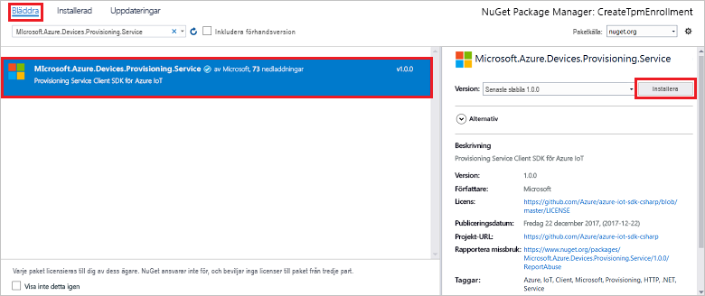

# <a name="quickstart-enroll-tpm-device-to-iot-hub-device-provisioning-service-using-c-service-sdk"></a>Snabb start: registrera TPM-enhet för att IoT Hub Device Provisioning Service med C#-tjänst-SDK

[!INCLUDE [iot-dps-selector-quick-enroll-device-tpm](../../includes/iot-dps-selector-quick-enroll-device-tpm.md)]

Den här artikeln visar hur du program mässigt skapar en enskild registrering för en TPM-enhet i Azure-IoT Hub Device Provisioning Service med hjälp av [C#-tjänst-SDK](https://github.com/Azure/azure-iot-sdk-csharp) och ett exempel C# .net Core-program. Du kan också registrera en simulerad TPM-enhet till etablerings tjänsten med hjälp av den här enskilda registrerings posten. Även om de här stegen fungerar på både Windows-och Linux-datorer använder den här artikeln en Windows-utvecklings dator.

## <a name="prepare-the-development-environment"></a>Förbereda utvecklingsmiljön

1. Kontrol lera att [Visual Studio 2019](https://www.visualstudio.com/vs/) är installerat på datorn.

1. Kontrol lera att du har [.net Core SDK](https://www.microsoft.com/net/download/windows) installerat på datorn.

1. Slutför stegen i [konfigurera IoT Hub Device Provisioning service med Azure Portal](./quick-setup-auto-provision.md) innan du fortsätter.

1. Valfritt Om du vill registrera en simulerad enhet i slutet av den här snabb starten följer du stegen i [skapa och etablera en simulerad TPM-enhet med C#-enhets-SDK](quick-create-simulated-device-tpm-csharp.md) upp till steget där du får en bekräftelse nyckel för enheten. Spara bekräftelse nyckeln, registrerings-ID och eventuellt enhets-ID eftersom du måste använda dem senare i den här snabb starten.

   > [!NOTE]
   > Följ inte stegen för att skapa en enskild registrering med hjälp av Azure Portal.

## <a name="get-the-connection-string-for-your-provisioning-service"></a>Hämta anslutningssträngen för etableringstjänsten

För exemplet i den här snabbstarten behöver du anslutningssträngen för etableringstjänsten.

1. Logga in på Azure Portal, Välj **alla resurser** och sedan enhets etablerings tjänsten.

1. Välj **principer för delad åtkomst** och välj sedan den åtkomst princip som du vill använda för att öppna dess egenskaper. I **åtkomst princip** kopierar du och sparar den primära nyckelns anslutnings sträng.

    

## <a name="create-the-individual-enrollment-sample"></a>Skapa ett exempel på enskild registrering

Det här avsnittet visar hur du skapar en .NET Core-webbapp som lägger till en enskild registrering för en TPM-enhet till etablerings tjänsten. Med vissa ändringar kan du även följa de här stegen för att skapa en [Windows IoT Core](https://developer.microsoft.com/en-us/windows/iot)-konsolapp för att lägga till den enskilda registreringen. Mer information om hur du utvecklar med IoT Core finns i [dokumentationen till Windows IoT Core Developer](/windows/iot-core/).

1. Öppna Visual Studio och välj **skapa ett nytt projekt**. I **skapa ett nytt projekt** väljer du projekt mal len **konsol program (.net Core)** för C# och väljer **sedan nästa**.

1. Ge projektet namnet *CreateTpmEnrollment* och tryck på **skapa**.

    

1. När lösningen öppnas i Visual Studio högerklickar du på projektet **CreateTpmEnrollment** i rutan **Solution Explorer** . Välj **Hantera NuGet-paket**.

1. I **NuGet Package Manager** väljer du **Bläddra**, söker efter och väljer **Microsoft. Azure. devices. Provisioning. service** och trycker sedan på **Installera**.

   

   Det här steget hämtar, installerar och lägger till en referens till [klient-SDK NuGet-paketet för Azure IoT Provisioning-tjänsten](https://www.nuget.org/packages/Microsoft.Azure.Devices.Provisioning.Service/) och dess beroenden.

1. Lägg till följande- `using` satser efter de andra- `using` satserna överst i `Program.cs` :
  
   ```csharp
   using System.Threading.Tasks;
   using Microsoft.Azure.Devices.Provisioning.Service;
   ```

1. Lägg till följande fält i `Program` -klassen och gör ändringarna i listan nedan.

   ```csharp
   private static string ProvisioningConnectionString = "{ProvisioningServiceConnectionString}";
   private const string RegistrationId = "sample-registrationid-csharp";
   private const string TpmEndorsementKey =
       "AToAAQALAAMAsgAgg3GXZ0SEs/gakMyNRqXXJP1S124GUgtk8qHaGzMUaaoABgCAAEMAEAgAAAAAAAEAxsj2gUS" +
       "cTk1UjuioeTlfGYZrrimExB+bScH75adUMRIi2UOMxG1kw4y+9RW/IVoMl4e620VxZad0ARX2gUqVjYO7KPVt3d" +
       "yKhZS3dkcvfBisBhP1XH9B33VqHG9SHnbnQXdBUaCgKAfxome8UmBKfe+naTsE5fkvjb/do3/dD6l4sGBwFCnKR" +
       "dln4XpM03zLpoHFao8zOwt8l/uP3qUIxmCYv9A7m69Ms+5/pCkTu/rK4mRDsfhZ0QLfbzVI6zQFOKF/rwsfBtFe" +
       "WlWtcuJMKlXdD8TXWElTzgh7JS4qhFzreL0c1mI0GCj+Aws0usZh7dLIVPnlgZcBhgy1SSDQMQ==";
       
   // Optional parameters
   private const string OptionalDeviceId = "myCSharpDevice";
   private const ProvisioningStatus OptionalProvisioningStatus = ProvisioningStatus.Enabled;
   ```

   * Ersätt `ProvisioningServiceConnectionString` placeholder-värdet med anslutnings strängen för etablerings tjänsten som du vill skapa registreringen för.

   * Om du vill kan du ändra registrerings-ID:t, bekräftelsenyckeln, enhets-ID:t och etableringsstatusen.

   * Om du använder den här snabb starten tillsammans med guiden [skapa och etablera en simulerad TPM-enhet med C#-enhets-SDK](quick-create-simulated-device-tpm-csharp.md) snabb start för att etablera en simulerad enhet ersätter du bekräftelse nyckeln och registrerings-ID: t med de värden som du antecknade i snabb starten. Du kan ersätta enhets-ID: t med det värde som föreslås i snabb starten, använda ditt eget värde eller använda standardvärdet i det här exemplet.

1. Lägg till följande metod i- `Program` klassen.  Den här koden skapar en enskild registrerings post och anropar sedan `CreateOrUpdateIndividualEnrollmentAsync` metoden på `ProvisioningServiceClient` för att lägga till den enskilda registreringen till etablerings tjänsten.

   ```csharp
   public static async Task RunSample()
   {
       Console.WriteLine("Starting sample...");

       using (ProvisioningServiceClient provisioningServiceClient =
               ProvisioningServiceClient.CreateFromConnectionString(ProvisioningConnectionString))
       {
           #region Create a new individualEnrollment config
           Console.WriteLine("\nCreating a new individualEnrollment...");
           Attestation attestation = new TpmAttestation(TpmEndorsementKey);
           IndividualEnrollment individualEnrollment =
                   new IndividualEnrollment(
                           RegistrationId,
                           attestation);

           // The following parameters are optional. Remove them if you don't need them.
           individualEnrollment.DeviceId = OptionalDeviceId;
           individualEnrollment.ProvisioningStatus = OptionalProvisioningStatus;
           #endregion

           #region Create the individualEnrollment
           Console.WriteLine("\nAdding new individualEnrollment...");
           IndividualEnrollment individualEnrollmentResult =
               await provisioningServiceClient.CreateOrUpdateIndividualEnrollmentAsync(individualEnrollment).ConfigureAwait(false);
           Console.WriteLine("\nIndividualEnrollment created with success.");
           Console.WriteLine(individualEnrollmentResult);
           #endregion
        
       }
   }
   ```

1. Ersätt till sist `Main` metoden med följande rader:

   ```csharp
    static async Task Main(string[] args)
    {
        await RunSample();
        Console.WriteLine("\nHit <Enter> to exit ...");
        Console.ReadLine();
    }
   ```

1. Skapa lösningen.

## <a name="run-the-individual-enrollment-sample"></a>Köra exemplet på enskild registrering
  
Kör exemplet i Visual Studio för att skapa den enskilda registreringen för din TPM-enhet.

Ett kommando tolks fönster visas och du kan börja Visa bekräftelse meddelanden. När den har skapats visas egenskaperna för den nya enskilda registreringen i kommando tolkens fönster.

Du kan kontrol lera att den enskilda registreringen har skapats. Gå till sammanfattning av enhets etablerings tjänsten och välj **Hantera registreringar** och välj sedan **enskilda registreringar**. Du bör se en ny registreringspost som motsvarar det registrerings-ID som du använde i exemplet.


Välj posten för att verifiera bekräftelse nyckeln och andra egenskaper för posten.

Om du har använt stegen i snabb starten för att [skapa och etablera en simulerad TPM-enhet med C#-enhets-SDK](quick-create-simulated-device-tpm-csharp.md) kan du fortsätta med de återstående stegen i snabb starten för att registrera din simulerade enhet. Hoppa över stegen för att skapa en enskild registrering med Azure-portalen.

## <a name="clean-up-resources"></a>Rensa resurser

Om du planerar att utforska C#-tjänst exemplet ska du inte rensa upp resurserna som du skapade i den här snabb starten. Annars kan du använda följande steg för att ta bort alla resurser som skapats i den här snabb starten.

1. Stäng fönstret C#-exempel i utdata på din dator.

1. Gå till enhets etablerings tjänsten i Azure Portal, Välj **Hantera registreringar** och välj sedan fliken **enskilda registreringar** . Markera kryss rutan bredvid *registrerings-ID* för registrerings posten som du skapade med den här snabb starten och klicka på knappen **ta bort** högst upp i fönstret.

1. Om du har följt stegen i [skapa och etablera en simulerad TPM-enhet med C#-enhets-SDK](quick-create-simulated-device-tpm-csharp.md) för att skapa en simulerad TPM-enhet utför du följande steg:

    1. Stäng TPM-simulatorfönstret och exempelutdatafönstret för den simulerade enheten.

    1. I Azure-portalen går du till den IoT Hub där din enhet etablerades. I menyn under **Explorer** väljer du IoT- **enheter**, markerar kryss rutan bredvid *enhets-ID* för den enhet som du registrerade i den här snabb starten och trycker sedan på knappen **ta bort** högst upp i fönstret.

## <a name="next-steps"></a>Nästa steg

I den här snabb starten har du skapat en individuell registrerings post för en TPM-enhet genom programmering. Du kan också skapa en TPM-simulerad enhet på datorn och etablerade den till IoT-hubben med hjälp av Azure-IoT Hub Device Provisioning Service. Om du vill ha mer djupgående information om enhetsetablering kan du fortsätta till självstudien om konfiguration av Device Provisioning-tjänsten i Azure-portalen.

> [!div class="nextstepaction"]
> [Självstudier om Azure IoT Hub Device Provisioning-tjänsten](./tutorial-set-up-cloud.md)