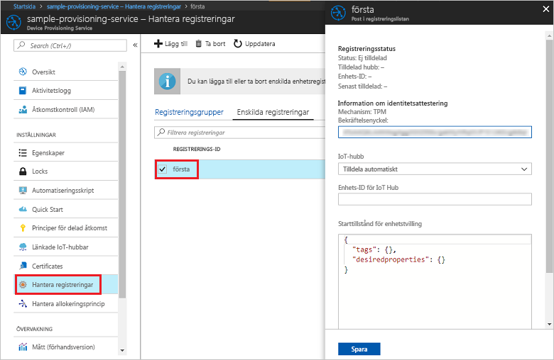

# <a name="enroll-tpm-device-to-iot-hub-device-provisioning-service-using-nodejs-service-sdk"></a>Registrera TPM-enhet på IoT Hub Device Provisioning-tjänsten med Node.js-tjänst-SDK

[!INCLUDE [iot-dps-selector-quick-enroll-device-tpm](../../includes/iot-dps-selector-quick-enroll-device-tpm.md)]


De här stegen visar hur du programmässigt skapar en enskild registrering för en TPM-enhet i Azure IoT Hub Device Provisioning-tjänsten med [Node.js-tjänst-SDK](https://github.com/Azure/azure-iot-sdk-node) och ett Node.js-exempelprogram. Om du vill kan du registrera en simulerad TPM-enhet för etableringstjänsten med den här posten för enskild registrering. Även om de här stegen fungerar både med Windows- och Linux-datorer använder vi en Windows-utvecklingsdator i den här artikeln.

## <a name="prerequisites"></a>Nödvändiga komponenter

- Se till att slutföra stegen i [Set up the IoT Hub Device Provisioning Service with the Azure portal](./quick-setup-auto-provision.md) (Konfigurera IoT Hub Device Provisioning-tjänsten med Azure-portalen) innan du fortsätter. 
-  Kontrollera att [Node.js v4.0 eller senare](https://nodejs.org) är installerat på din dator.
- Om du vill registrera en simulerad enhet i slutet av den här snabbstarten ska du följa instruktionerna om att [skapa och etablera en simulerad enhet](quick-create-simulated-device.md) tills du kommer till steget där du får en bekräftelsenyckel för enheten. Anteckna bekräftelsenyckeln. Du kommer att använda den senare i den här snabbstarten. **Följ inte stegen för att skapa en enskild registrering med Azure-portalen.**
 
## <a name="create-the-individual-enrollment-sample"></a>Skapa ett exempel på enskild registrering 

 
1. Från ett kommandofönster i arbetsmappen kör du:
  
    ```cmd\sh
    npm install azure-iot-provisioning-service
    ```  

2. Med en textredigerare skapar du filen **create_individual_enrollment.js** i arbetsmappen. Lägg till följande kod i filen och spara:

    ```
    'use strict';

    var provisioningServiceClient = require('azure-iot-provisioning-service').ProvisioningServiceClient;

    var serviceClient = provisioningServiceClient.fromConnectionString(process.argv[2]);
    var endorsementKey = process.argv[3];

    var enrollment = {
      registrationId: 'first',
      attestation: {
        type: 'tpm',
        tpm: {
          endorsementKey: endorsementKey
        }
      }
    };

    serviceClient.createOrUpdateIndividualEnrollment(enrollment, function(err, enrollmentResponse) {
      if (err) {
        console.log('error creating the individual enrollment: ' + err);
      } else {
        console.log("enrollment record returned: " + JSON.stringify(enrollmentResponse, null, 2));
      }
    });
    ````

## <a name="run-the-individual-enrollment-sample"></a>Köra exemplet på enskild registrering
  
1. Om du vill köra exemplet behöver du anslutningssträngen för etableringstjänsten. 
    1. Logga in på Azure-portalen, klicka på knappen **Alla resurser** i den vänstra menyn och öppna Device Provisioning-tjänsten. 
    2. Klicka på **Policyer för delad åtkomst** och sedan på den åtkomstprincip du vill använda för att öppna dess egenskaper. I fönstret **Åtkomstprincip** kopierar du och antecknar primärnyckelns anslutningssträng. 

     


2. Du behöver också bekräftelsenyckeln för din enhet. Om du har följt snabbstarten om att [skapa och etablera en simulerad enhet](quick-create-simulated-device.md) för att skapa en simulerad TPM-enhet använder du nyckeln som skapats för den enheten. När du vill skapa ett exempel på en enskild registrering kan du också använda följande bekräftelsenyckel som medföljer SDK:n:

    ```
    AToAAQALAAMAsgAgg3GXZ0SEs/gakMyNRqXXJP1S124GUgtk8qHaGzMUaaoABgCAAEMAEAgAAAAAAAEAxsj2gUScTk1UjuioeTlfGYZrrimExB+bScH75adUMRIi2UOMxG1kw4y+9RW/IVoMl4e620VxZad0ARX2gUqVjYO7KPVt3dyKhZS3dkcvfBisBhP1XH9B33VqHG9SHnbnQXdBUaCgKAfxome8UmBKfe+naTsE5fkvjb/do3/dD6l4sGBwFCnKRdln4XpM03zLpoHFao8zOwt8l/uP3qUIxmCYv9A7m69Ms+5/pCkTu/rK4mRDsfhZ0QLfbzVI6zQFOKF/rwsfBtFeWlWtcuJMKlXdD8TXWElTzgh7JS4qhFzreL0c1mI0GCj+Aws0usZh7dLIVPnlgZcBhgy1SSDQMQ==
    ```

3. Om du vill skapa en enskild registrering för din TPM-enhet kör du följande kommando (ta med citattecknen runt kommandoargumenten):
 
     ```cmd\sh
     node create_individual_enrollment.js "<the connection string for your provisioning service>" "<endorsement key>"
     ```
 
3. När gruppen har skapats visas egenskaperna för den nya enskilda registreringen i kommandofönstret.

     

4. Verifiera att en enskild registrering har skapats. I Azure Portal, på sammanfattningsbladet för Device Provisioning-tjänsten väljer du **Hantera registreringar**. Välj fliken **Enskilda registreringar** och klicka på den nya registreringsposten (*första*) för att verifiera bekräftelsenyckeln och andra egenskaper för posten.

     
 
Nu när du har skapat en enskild registrering för en TPM-enhet och vill registrera en simulerad enhet kan du fortsätta med resten av stegen för att [skapa och etablera en simulerad enhet](quick-create-simulated-device.md). Se till att hoppa över stegen för att skapa en enskild registrering med Azure-portalen i snabbstarten.

## <a name="clean-up-resources"></a>Rensa resurser
Om du tänker utforska Node.js-tjänstexemplet ska du inte rensa resurserna som har skapats i den här snabbstarten. Om du inte planerar att fortsätta kan du använda stegen nedan för att ta bort alla resurser som har skapats i den här snabbstarten.

1. Stäng utdatafönstret för Node.js på datorn.
1. Om du har skapat en simulerad TPM-enhet stänger du TPM-simulatorfönstret.
2. Navigera till Device Provisioning-tjänsten i Azure Portal, klicka på **Hantera registreringar** och välj sedan fliken **Enskilda registreringar**. Välj *Registrerings-ID* för registreringsposten du har skapat med den här snabbstarten och klickar på knappen **Ta bort** högst upp på bladet. 
 
## <a name="next-steps"></a>Nästa steg
I den här snabbstarten har du programmässigt skapat en individuell registreringspost för en TPM-enhet, och eventuellt skapat en TPM-simulerad enhet på datorn och etablerat den på IoT-hubben med hjälp av Azure IoT Hub Device Provisioning-tjänsten. Om du vill ha mer djupgående information om enhetsetablering kan du fortsätta till självstudien om konfiguration av Device Provisioning-tjänsten i Azure-portalen. 
 
> [!div class="nextstepaction"]
> [Självstudier om Azure IoT Hub Device Provisioning-tjänsten](./tutorial-set-up-cloud.md)