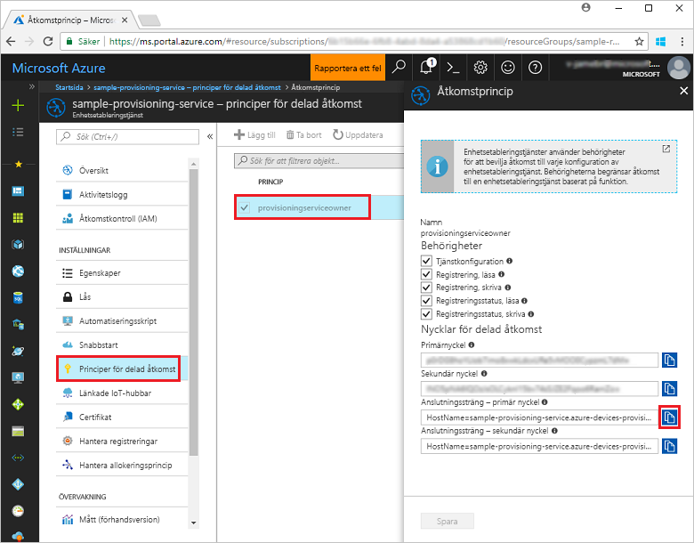
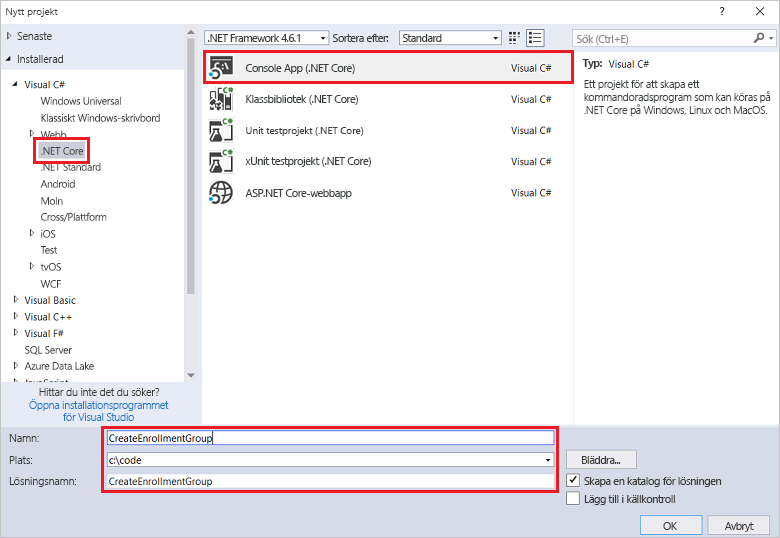
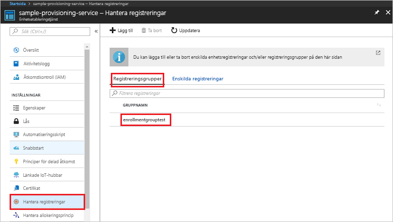

# <a name="quickstart-enroll-x509-devices-to-the-device-provisioning-service-using-c"></a>Snabbstart: Registrera X.509-enheter till Device Provisioning Service med hjälp av C#

[!INCLUDE [iot-dps-selector-quick-enroll-device-x509](../../includes/iot-dps-selector-quick-enroll-device-x509.md)]


Den här snabbstarten beskriver hur du använder C# för att programmässigt skapa en [registreringsgrupp](concepts-service.md#enrollment-group) som använder mellanliggande CA X.509-certifikat eller CA X.509-rotcertifikat. Registreringsgruppen skapas med hjälp av [Microsoft Azure IoT SDK för .NET](https://github.com/Azure/azure-iot-sdk-csharp) och ett C# .NET Core-exempelprogram. En registreringsgrupp kontrollerar åtkomst till etableringstjänsten för enheter som delar ett gemensamt signeringscertifikat i certifikatkedjan. Läs mer i informationen om att [kontrollera enhetsåtkomst till etableringstjänsten med X.509-certifikat](./concepts-security.md#controlling-device-access-to-the-provisioning-service-with-x509-certificates). Mer information om att använda X.509-certifikatbaserad Public Key Infrastructure (PKI) med Azure IoT Hub och enhetsetableringstjänst finns i [Översikt över certifikatsäkerhet med X.509 CA](https://docs.microsoft.com/azure/iot-hub/iot-hub-x509ca-overview). 

Den här snabbstarten förutsätter att du redan har skapat en IoT-hubb och en Device Provisioning Service-instans. Om du inte redan har skapat dessa resurser slutför du snabbstarten [Konfigurera IoT Hub Device Provisioning-tjänsten med Azure-portalen](./quick-setup-auto-provision.md) innan du fortsätter med den här artikeln.

Även om stegen i den här artikeln fungerar både med Windows- och Linux-datorer är den här artikeln utvecklad för en Windows-utvecklingsdator.

[!INCLUDE [quickstarts-free-trial-note](../../includes/quickstarts-free-trial-note.md)]


## <a name="prerequisites"></a>Nödvändiga komponenter

* Installera [Visual Studio 2017](https://www.visualstudio.com/vs/).
* Installera [.Net Core SDK](https://www.microsoft.com/net/download/windows).
* Installera [Git](https://git-scm.com/download/).


## <a name="prepare-test-certificates"></a>Förbereda testcertifikat

I den här snabbstarten måste du ha en .pem- eller en .cer-fil som innehåller den offentliga delen av ett mellanliggande X.509-certifikat eller ett X.509-rotcertifikat. Det här certifikatet måste laddas upp till din etableringstjänst och verifieras av tjänsten. 

[Azure IoT C SDK](https://github.com/Azure/azure-iot-sdk-c) innehåller testverktyg som du kan använda för att skapa en X.509-certifikatkedja, ladda upp ett rot- eller mellanliggande certifikat från kedjan och utföra innehavarbevis med tjänsten för att verifiera certifikatet. Certifikat som skapas med SDK-verktygsuppsättningen är utformade för att **endast användas för testutveckling**. Dessa certifikat **får inte användas i produktion**. De innehåller hårdkodade lösenord (”1234”) som upphör att gälla efter 30 dagar. Om du vill lära dig mer om att hämta certifikat som är lämpliga för produktion kan du läsa [How to get an X.509 CA certificate](https://docs.microsoft.com/azure/iot-hub/iot-hub-x509ca-overview#how-to-get-an-x509-ca-certificate) (Hämta ett X.509 CA-certifikat) i dokumentationen för Azure IoT Hub.

Om du vill använda det här testverktyget för att generera certifikat utför du följande steg: 
 
1. Öppna en kommandotolk eller Git Bash-gränssnittet och växla till en arbetsmapp på datorn. Kör följande kommando för att klona [Azure IoT C SDK](https://github.com/Azure/azure-iot-sdk-c) GitHub-lagringsplatsen:
    
   ```cmd/sh
   git clone https://github.com/Azure/azure-iot-sdk-c.git --recursive
   ```

   Storleken på den här lagringsplatsen är för närvarande cirka 220 MB. Den här åtgärden kan förväntas ta flera minuter att slutföra.

   Testverktyget finns i den *azure-iot-sdk-c/tools/CACertificates* för den lagringsplats som du klonade.    

2. Följ stegen på sidan om att [hantera CA-testcertifikat för exempel och självstudier](https://github.com/Azure/azure-iot-sdk-c/blob/master/tools/CACertificates/CACertificateOverview.md). 

Utöver verktygsuppsättningen i C SDK visar [exemplet på verifiering av gruppcertifikat](https://github.com/Azure-Samples/azure-iot-samples-csharp/tree/master/provisioning/Samples/service/GroupCertificateVerificationSample) i *Microsoft Azure IoT SDK för .NET* hur du utför innehavarbevis i C# med ett befintligt mellanliggande X.509-certifikat eller ett rotcertifikatutfärdarcertifikat. 


## <a name="get-the-connection-string-for-your-provisioning-service"></a>Hämta anslutningssträngen för etableringstjänsten

För exemplet i den här snabbstarten behöver du anslutningssträngen för etableringstjänsten.
1. Logga in på Azure-portalen, klicka på knappen **Alla resurser** i den vänstra menyn och öppna Device Provisioning Service. 
2. Klicka på **Policyer för delad åtkomst** och sedan på den åtkomstprincip du vill använda för att öppna dess egenskaper. I fönstret **Åtkomstprincip** kopierar du och antecknar primärnyckelns anslutningssträng. 

    

## <a name="create-the-enrollment-group-sample"></a>Skapa exemplet för registrering av grupp 

Stegen i det här avsnittet visar hur du skapar en .NET Core-konsolapp som lägger till en registreringsgrupp till din etableringstjänst. Med vissa ändringar kan du även följa de här stegen för att skapa en [Windows IoT Core](https://developer.microsoft.com/en-us/windows/iot)-konsolapp för att lägga till registreringsgruppen. Mer information om hur du utvecklar med IoT Core i finns i [Windows IoT Core-dokumentationen för utvecklare](https://docs.microsoft.com/windows/iot-core/).
1. I Visual Studio lägger du till ett Visual C# .NET Core-konsolprogramprojekt i den nya lösningen med hjälp av projektmallen **Konsolapp (.NET Core)**. Kontrollera att .NET Framework-versionen är 4.5.1 eller senare. Ge projektet namnet **CreateEnrollmentGroup**.

    

2. Högerklicka i Solution Explorer på projektet **CreateEnrollmentGroup** och klicka sedan på **Hantera NuGet-paket**.
3. Välj **Bläddra** i fönstret för **NuGet-pakethanteraren**, leta upp **Microsoft.Azure.Devices.Provisioning.Service**, välj **Installera** för att installera **Microsoft.Azure.Devices.Provisioning.Service**-paketet och godkänn användningsvillkoren. Denna procedur hämtar, installerar och lägger till en referens för NuGet-paketets [klient-SDK för etableringstjänst i Azure IoT](https://www.nuget.org/packages/Microsoft.Azure.Devices.Provisioning.Service/) och dess beroenden.

    

4. Lägg till följande `using`-satser efter andra `using`-satser överst i filen **Program.cs**:
   
   ```csharp
   using System.Security.Cryptography.X509Certificates;
   using System.Threading.Tasks;
   using Microsoft.Azure.Devices.Provisioning.Service;
   ```
    
5. Lägg till följande fält i klassen **Program**.  
   - Ersätt värdet för platshållaren **ProvisioningConnectionString** med anslutningssträngen för etableringstjänsten du vill skapa registreringen för.
   - Ersätt platshållarvärdet **X509RootCertPath** med sökvägen till en .pem- eller .cer-fil som representerar den offentliga delen av ett mellanliggande eller CA X.509-rotcertifikat som tidigare har laddats upp och verifierats med din etableringstjänst.
   - Om du vill kan du ändra värdet **EnrollmentGroupId**. Strängen får bara innehålla gemener och bindestreck. 

   > [!IMPORTANT]
   > I produktionskoden ska du vara medveten om följande säkerhetsöverväganden:
   >
   > - Hårdkodning av anslutningssträngen för etableringstjänstadministratören går emot bästa säkerhetsmetoder. Istället ska anslutningssträngen lagras på ett säkert sätt, som i en säker konfigurationsfil eller i registret.
   > - Glöm inte att överföra den offentliga delen av signeringscertifikatet. Ladda aldrig upp .pfx- (PKCS12) eller .pem-filer som innehåller privata nycklar till etableringstjänsten.
        
   ```csharp
   private static string ProvisioningConnectionString = "{Your provisioning service connection string}";
   private static string EnrollmentGroupId = "enrollmentgrouptest";
   private static string X509RootCertPath = @"{Path to a .cer or .pem file for a verified root CA or intermediate CA X.509 certificate}";
   ```
    
6. Lägg till följande metod i klassen **Program**. Den här koden skapar en post för registreringsgruppen och anropar sedan metoden **CreateOrUpdateEnrollmentGroupAsync** på **ProvisioningServiceClient** för att lägga till registreringsgruppen till etableringstjänsten.
   
   ```csharp
   public static async Task RunSample()
   {
       Console.WriteLine("Starting sample...");
 
       using (ProvisioningServiceClient provisioningServiceClient =
               ProvisioningServiceClient.CreateFromConnectionString(ProvisioningConnectionString))
       {
           #region Create a new enrollmentGroup config
           Console.WriteLine("\nCreating a new enrollmentGroup...");
           var certificate = new X509Certificate2(X509RootCertPath);
           Attestation attestation = X509Attestation.CreateFromRootCertificates(certificate);
           EnrollmentGroup enrollmentGroup =
                   new EnrollmentGroup(
                           EnrollmentGroupId,
                           attestation)
                   {
                       ProvisioningStatus = ProvisioningStatus.Enabled
                   };
           Console.WriteLine(enrollmentGroup);
           #endregion
 
           #region Create the enrollmentGroup
           Console.WriteLine("\nAdding new enrollmentGroup...");
           EnrollmentGroup enrollmentGroupResult =
               await provisioningServiceClient.CreateOrUpdateEnrollmentGroupAsync(enrollmentGroup).ConfigureAwait(false);
           Console.WriteLine("\nEnrollmentGroup created with success.");
           Console.WriteLine(enrollmentGroupResult);
           #endregion
 
       }
   }
   ```

7. Ersätt till sist brödtexten i metoden **Main** med följande rader:
   
   ```csharp
   RunSample().GetAwaiter().GetResult();
   Console.WriteLine("\nHit <Enter> to exit ...");
   Console.ReadLine();
   ```
        
8. Skapa lösningen.

## <a name="run-the-enrollment-group-sample"></a>Köra exemplet för registrering av grupp
  
1. Kör exemplet i Visual Studio för att skapa registreringsgruppen.
 
2. När gruppen har skapats visas egenskaperna för den nya registreringsgruppen i kommandofönstret.

    

3. Om du vill kontrollera att registreringsgruppen har skapats väljer du **Hantera registreringar** på sammanfattningsbladet Enhetsetableringstjänst i Azure Portal och väljer sedan fliken **Registreringsgrupper**. Du bör se en ny registreringspost som motsvarar det registrerings-ID som du använde i exemplet. Klicka på posten för att verifiera certifikatets tumavtryck och andra egenskaper för posten.

    
 
## <a name="clean-up-resources"></a>Rensa resurser
Om du tänker utforska C#-tjänstexemplet ska du inte rensa resurserna som har skapats i den här snabbstarten. Om du inte planerar att fortsätta kan du använda stegen nedan för att ta bort alla resurser som har skapats i den här snabbstarten.

1. Stäng utdatafönstret för C#-exemplet på datorn.
2. Navigera till Device Provisioning-tjänsten i Azure Portal, klicka på **Hantera registreringar** och välj sedan fliken **Registreringsgrupper**. Välj *Registrerings-ID* för registreringsposten du har skapat med den här snabbstarten och klickar på knappen **Ta bort** högst upp på bladet.  
3. I Device Provisioning-tjänsten i Azure-portalen klickar du på **Certifikat**, sedan på certifikatet du laddade upp för den här snabbstarten och till sist på knappen **Ta bort** överst i fönstret **Certifikatinformation**.  
 
## <a name="next-steps"></a>Nästa steg
I den här snabbstarten har du skapat en gruppregistrering för ett mellanliggande X.509-certifikat eller ett rotcertifikatutfärdarcertifikat med tjänsten Azure IoT Hub Device Provisioning. Om du vill ha mer djupgående information om enhetsetablering kan du fortsätta till självstudien om konfiguration av Device Provisioning-tjänsten i Azure-portalen. 
 
> [!div class="nextstepaction"]
> [Självstudier om Azure IoT Hub Device Provisioning-tjänsten](./tutorial-set-up-cloud.md)
