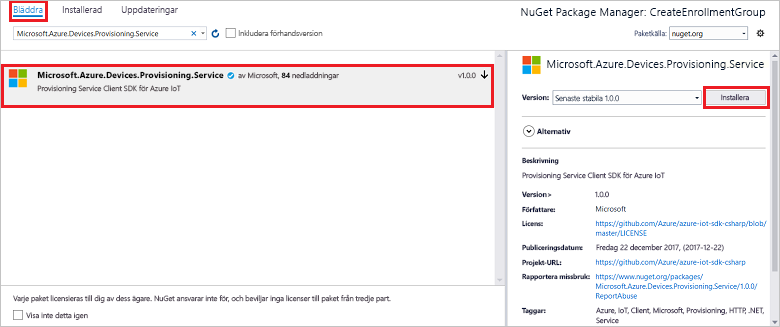

# <a name="quickstart-enroll-x509-devices-to-the-device-provisioning-service-using-c"></a>Snabbstart: Registrera X.509-enheter till Device Provisioning Service med hjälp av C#

[!INCLUDE [iot-dps-selector-quick-enroll-device-x509](../../includes/iot-dps-selector-quick-enroll-device-x509.md)]

Den här snabbstarten beskriver hur du använder C# för att programmässigt skapa en [registreringsgrupp](concepts-service.md#enrollment-group) som använder mellanliggande CA X.509-certifikat eller CA X.509-rotcertifikat. Registrerings gruppen skapas med hjälp av [Microsoft Azure IoT SDK för .net](https://github.com/Azure/azure-iot-sdk-csharp) och ett exempel på ett C# .net Core-program. En registreringsgrupp kontrollerar åtkomst till etableringstjänsten för enheter som delar ett gemensamt signeringscertifikat i certifikatkedjan. Läs mer i informationen om att [kontrollera enhetsåtkomst till etableringstjänsten med X.509-certifikat](./concepts-x509-attestation.md#controlling-device-access-to-the-provisioning-service-with-x509-certificates). Mer information om att använda X.509-certifikatbaserad Public Key Infrastructure (PKI) med Azure IoT Hub och enhetsetableringstjänst finns i [Översikt över certifikatsäkerhet med X.509 CA](../iot-hub/iot-hub-x509ca-overview.md). 

Den här snabb starten förväntar dig att du redan har skapat en IoT Hub-och Device Provisioning-tjänstinstans. Om du inte redan har skapat de här resurserna slutför du guiden [konfigurera IoT Hub Device Provisioning service med](./quick-setup-auto-provision.md) snabb starten för Azure Portal innan du fortsätter med den här artikeln.

Även om stegen i den här artikeln fungerar på både Windows-och Linux-datorer, använder den här artikeln en Windows-utvecklings dator.

[!INCLUDE [quickstarts-free-trial-note](../../includes/quickstarts-free-trial-note.md)]

## <a name="prerequisites"></a>Krav

* Installera [Visual Studio 2019](https://www.visualstudio.com/vs/).
* Installera [.net Core SDK](https://www.microsoft.com/net/download/windows).
* Installera [git](https://git-scm.com/download/).

## <a name="prepare-test-certificates"></a>Förbereda testcertifikat

I den här snabbstarten måste du ha en .pem- eller en .cer-fil som innehåller den offentliga delen av ett mellanliggande X.509-certifikat eller ett X.509-rotcertifikat. Det här certifikatet måste laddas upp till din etableringstjänst och verifieras av tjänsten.

[Azure IoT C SDK](https://github.com/Azure/azure-iot-sdk-c) innehåller test verktyg som kan hjälpa dig att skapa en X. 509-certifikat kedja, överföra ett rot-eller mellanliggande certifikat från den kedjan och sköta om tjänsten med tjänsten för att verifiera certifikatet.

> [!CAUTION]
> Använd certifikat som skapats med SDK-verktyget endast för utvecklings testning.
> Använd inte dessa certifikat i produktion.
> De innehåller hårdkodade lösen ord, till exempel *1234*, som upphör att gälla efter 30 dagar.
> Om du vill lära dig mer om att hämta certifikat som är lämpliga för produktion kan du läsa [How to get an X.509 CA certificate](../iot-hub/iot-hub-x509ca-overview.md#how-to-get-an-x509-ca-certificate) (Hämta ett X.509 CA-certifikat) i dokumentationen för Azure IoT Hub.
>

Gör så här om du vill använda test verktyget för att skapa certifikat:

1. Hitta taggnamnet för den [senaste versionen](https://github.com/Azure/azure-iot-sdk-c/releases/latest) av Azure IoT C SDK.

2. Öppna en kommandotolk eller Git Bash-gränssnittet och växla till en arbetsmapp på datorn. Kör följande kommandon för att klona den senaste versionen av [Azure IoT C SDK](https://github.com/Azure/azure-iot-sdk-c) GitHub-lagringsplatsen. Använd taggen som du hittade i föregående steg som `-b` parameter värde:

    ```cmd/sh
    git clone -b <release-tag> https://github.com/Azure/azure-iot-sdk-c.git
    cd azure-iot-sdk-c
    git submodule update --init
    ```

    Den här åtgärden kan förväntas ta flera minuter att slutföra.

   Testverktyget finns i den *azure-iot-sdk-c/tools/CACertificates* för den lagringsplats som du klonade.

3. Följ stegen på sidan om att [hantera CA-testcertifikat för exempel och självstudier](https://github.com/Azure/azure-iot-sdk-c/blob/master/tools/CACertificates/CACertificateOverview.md).

Förutom verktyget i C SDK, visar [verifierings exemplet för grupp certifikat](https://github.com/Azure-Samples/azure-iot-samples-csharp/tree/master/provisioning/Samples/service/GroupCertificateVerificationSample) i *Microsoft Azure IoT SDK för .net* hur du kan använda det i C# med ett befintligt X. 509-mellanliggande eller rot certifikat utfärdares certifikat.

## <a name="get-the-connection-string-for-your-provisioning-service"></a>Hämta anslutningssträngen för etableringstjänsten

För exemplet i den här snabbstarten behöver du anslutningssträngen för etableringstjänsten.

1. Logga in på Azure Portal, Välj **alla resurser** och sedan enhets etablerings tjänsten.

1. Välj **principer för delad åtkomst** och välj sedan den åtkomst princip som du vill använda för att öppna dess egenskaper. I **åtkomst princip** kopierar du och sparar den primära nyckelns anslutnings sträng.

    

## <a name="create-the-enrollment-group-sample"></a>Skapa exemplet för registrering av grupp 

I det här avsnittet visas hur du skapar en .NET Core-konsol som lägger till en registrerings grupp till etablerings tjänsten. Med vissa ändringar kan du även följa de här stegen för att skapa en [Windows IoT Core](https://developer.microsoft.com/en-us/windows/iot)-konsolapp för att lägga till registreringsgruppen. Mer information om hur du utvecklar med IoT Core i finns i [Windows IoT Core-dokumentationen för utvecklare](/windows/iot-core/).

1. Öppna Visual Studio och välj **skapa ett nytt projekt**. I **skapa ett nytt projekt** väljer du **konsolens program (.net Core)** för C#-projekt mal len och väljer **sedan nästa**.

1. Ge projektet namnet *CreateEnrollmentGroup* och tryck sedan på **skapa**.

    

1. När lösningen öppnas i Visual Studio högerklickar du på projektet **CreateEnrollmentGroup** i fönstret **Solution Explorer** och väljer sedan **Hantera NuGet-paket**.

1. I **NuGet Package Manager** väljer du **Bläddra**, söker efter och väljer **Microsoft. Azure. devices. Provisioning. service** och trycker sedan på **Installera**.

    

   Det här steget hämtar, installerar och lägger till en referens till [klient-SDK NuGet-paketet för Azure IoT Provisioning-tjänsten](https://www.nuget.org/packages/Microsoft.Azure.Devices.Provisioning.Service/) och dess beroenden.

1. Lägg till följande- `using` satser efter de andra- `using` satserna överst i `Program.cs` :

   ```csharp
   using System.Security.Cryptography.X509Certificates;
   using System.Threading.Tasks;
   using Microsoft.Azure.Devices.Provisioning.Service;
   ```

1. Lägg till följande fält i `Program` -klassen och gör de listade ändringarna.  

   ```csharp
   private static string ProvisioningConnectionString = "{ProvisioningServiceConnectionString}";
   private static string EnrollmentGroupId = "enrollmentgrouptest";
   private static string X509RootCertPath = @"{Path to a .cer or .pem file for a verified root CA or intermediate CA X.509 certificate}";
   ```

   * Ersätt `ProvisioningServiceConnectionString` placeholder-värdet med anslutnings strängen för etablerings tjänsten som du vill skapa registreringen för.

   * Ersätt `X509RootCertPath` placeholder-värdet med sökvägen till en. pem-eller. cer-fil. Den här filen representerar den offentliga delen av ett mellanliggande eller rot-CA X. 509-certifikat som tidigare har laddats upp och verifierats med din etablerings tjänst.

   * Alternativt kan du ändra `EnrollmentGroupId` värdet. Strängen får bara innehålla gemener och bindestreck.

   > [!IMPORTANT]
   > I produktionskoden ska du vara medveten om följande säkerhetsöverväganden:
   >
   > * Hårdkodning av anslutningssträngen för etableringstjänstadministratören går emot bästa säkerhetsmetoder. Istället ska anslutningssträngen lagras på ett säkert sätt, som i en säker konfigurationsfil eller i registret.
   > * Glöm inte att överföra den offentliga delen av signeringscertifikatet. Ladda aldrig upp .pfx- (PKCS12) eller .pem-filer som innehåller privata nycklar till etableringstjänsten.

1. Lägg till följande metod i- `Program` klassen. Den här koden skapar en registrerings grupp post och anropar sedan `CreateOrUpdateEnrollmentGroupAsync` metoden för `ProvisioningServiceClient` att lägga till registrerings gruppen till etablerings tjänsten.

   ```csharp
   public static async Task RunSample()
   {
       Console.WriteLine("Starting sample...");
 
       using (ProvisioningServiceClient provisioningServiceClient =
               ProvisioningServiceClient.CreateFromConnectionString(ProvisioningConnectionString))
       {
           #region Create a new enrollmentGroup config
           Console.WriteLine("\nCreating a new enrollmentGroup...");
           var certificate = new X509Certificate2(X509RootCertPath);
           Attestation attestation = X509Attestation.CreateFromRootCertificates(certificate);
           EnrollmentGroup enrollmentGroup =
                   new EnrollmentGroup(
                           EnrollmentGroupId,
                           attestation)
                   {
                       ProvisioningStatus = ProvisioningStatus.Enabled
                   };
           Console.WriteLine(enrollmentGroup);
           #endregion
 
           #region Create the enrollmentGroup
           Console.WriteLine("\nAdding new enrollmentGroup...");
           EnrollmentGroup enrollmentGroupResult =
               await provisioningServiceClient.CreateOrUpdateEnrollmentGroupAsync(enrollmentGroup).ConfigureAwait(false);
           Console.WriteLine("\nEnrollmentGroup created with success.");
           Console.WriteLine(enrollmentGroupResult);
           #endregion
 
       }
   }
   ```

1. Ersätt till sist `Main` metoden med följande rader:

   ```csharp
    static async Task Main(string[] args)
    {
        await RunSample();
        Console.WriteLine("\nHit <Enter> to exit ...");
        Console.ReadLine();
    }
   ```

1. Skapa lösningen.

## <a name="run-the-enrollment-group-sample"></a>Köra exemplet för registrering av grupp
  
Kör exemplet i Visual Studio för att skapa registreringsgruppen. Ett kommando tolks fönster visas och du kan börja Visa bekräftelse meddelanden. När du har skapat fönstret visas egenskaperna för den nya registrerings gruppen i kommando tolken.

Du kan kontrol lera att registrerings gruppen har skapats. Gå till sammanfattning av enhets etablerings tjänsten och välj **Hantera** registreringar och välj sedan **registrerings grupper**. Du bör se en ny registreringspost som motsvarar det registrerings-ID som du använde i exemplet.


Välj posten för att verifiera tumavtryck för certifikatet och andra egenskaper för posten.

## <a name="clean-up-resources"></a>Rensa resurser

Om du planerar att utforska C#-tjänst exemplet ska du inte rensa upp resurserna som du skapade i den här snabb starten. Annars kan du använda följande steg för att ta bort alla resurser som skapats i den här snabb starten.

1. Stäng fönstret C#-exempel i utdata på din dator.

1. Gå till enhets etablerings tjänsten i Azure Portal, Välj **Hantera registreringar** och välj sedan **registrerings grupper**. Välj *registrerings-ID* för registrerings posten du skapade med den här snabb starten och tryck på **ta bort**.

1. Från enhets etablerings tjänsten i Azure Portal väljer du **certifikat**, väljer det certifikat som du laddade upp för den här snabb starten och trycker på **ta bort** högst upp i **certifikat information**.  

## <a name="next-steps"></a>Nästa steg

I den här snabb starten skapade du en registrerings grupp för ett X. 509-mellanliggande eller rot certifikat utfärdares certifikat med hjälp av Azure IoT Hub Device Provisioning Service. Om du vill ha mer djupgående information om enhetsetablering kan du fortsätta till självstudien om konfiguration av Device Provisioning-tjänsten i Azure-portalen.

> [!div class="nextstepaction"]
> [Självstudier om Azure IoT Hub Device Provisioning-tjänsten](./tutorial-set-up-cloud.md)