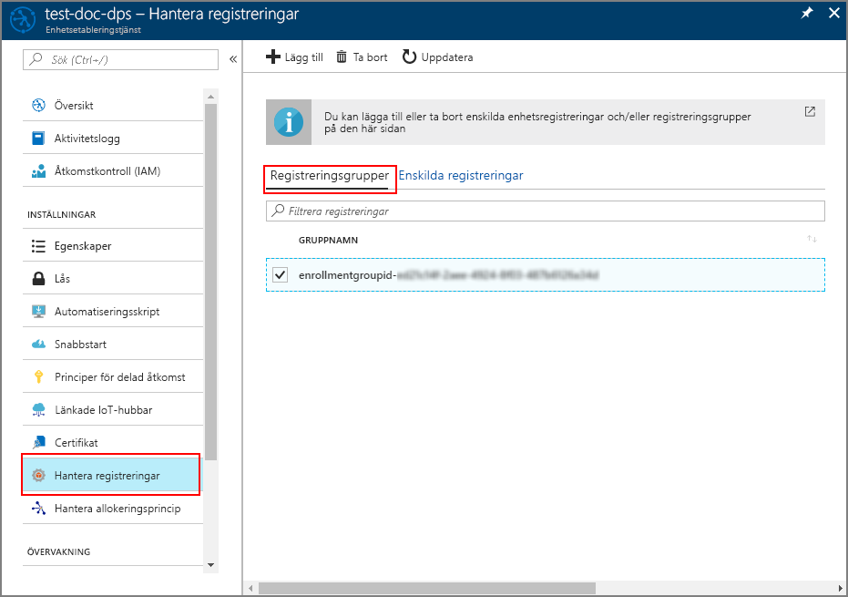

# <a name="quickstart-enroll-x509-devices-to-the-device-provisioning-service-using-java"></a>Snabbstart: Registrera X.509-enheter till Device Provisioning Service med hjälp av Java

[!INCLUDE [iot-dps-selector-quick-enroll-device-x509](../../includes/iot-dps-selector-quick-enroll-device-x509.md)]

I den här snabb starten använder du Java för att program mässigt registrera en grupp av X. 509 simulerade enheter till Azure-IoT Hub Device Provisioning Service. Enheter registreras för en etablerings tjänst instans genom att skapa en registrerings grupp eller en enskild registrering. Den här snabb starten visar hur du skapar båda typerna av registreringar med hjälp av Java-tjänst-SDK och ett Java-exempelprogram.

## <a name="prerequisites"></a>Förutsättningar

- Konfiguration av [IoT Hub Device Provisioning service med Azure Portal](./quick-setup-auto-provision.md)slutförs.
- Ett Azure-konto med en aktiv prenumeration. [Skapa ett kostnads fritt](https://azure.microsoft.com/free/?ref=microsoft.com&utm_source=microsoft.com&utm_medium=docs&utm_campaign=visualstudio).
- [Java se Development Kit 8](/azure/developer/java/fundamentals/java-jdk-long-term-support). I den här snabb starten installeras [Java service SDK](https://azure.github.io/azure-iot-sdk-java/master/service/) nedan. Det fungerar både i Windows och Linux. I den här snabb starten används Windows.
- [Maven 3](https://maven.apache.org/download.cgi).
- [Git](https://git-scm.com/download/).

<a id="javasample"></a>

## <a name="download-and-modify-the-java-sample-code"></a>Ladda ned och ändra Java-exempelkoden

I det här avsnittet används ett självsignerat X.509-certifikat. Det är viktigt att tänka på följande punkter:

* Självsignerade certifikat är endast till för testning och ska inte användas i produktion.
* Standardutgångsdatumet för ett självsignerat certifikat är ett år.

De följande stegen visar hur du lägger till etableringsinformationen för X.509-enheten i exempelkoden. 

1. Öppna en kommandotolk. Klona GitHub-lagrings platsen för enhets registrerings kod exempel med [Java-tjänst-SDK](https://azure.github.io/azure-iot-sdk-java/master/service/):
    
    ```cmd\sh
    git clone https://github.com/Azure/azure-iot-sdk-java.git --recursive
    ```

2. I den nedladdade källkoden går du till exempelmappen **_azure-iot-sdk-java/provisioning/provisioning-samples/service-enrollment-group-sample_**. Öppna filen **_/src/main/java/samples/com/microsoft/azure/sdk/iot/ServiceEnrollmentGroupSample.java_** i valfritt redigeringsprogram och lägg till följande information:

    1. Lägg till `[Provisioning Connection String]` för etableringstjänsten från portalen enligt följande:
        1. Navigera till etablerings tjänsten i [Azure Portal](https://portal.azure.com). 
        2. Öppna **Policyer för delad åtkomst** och välj en princip med behörigheten *EnrollmentWrite*.
        3. Kopiera **Anslutningssträng – primär nyckel**. 

              

        4. I exempelkodfilen **_ServiceEnrollmentGroupSample.java_** ersätter du `[Provisioning Connection String]` med **Anslutningssträng – primär nyckel**.

            ```Java
            private static final String PROVISIONING_CONNECTION_STRING = "[Provisioning Connection String]";
            ```

    2. Lägg till rotcertifikatet för gruppen med enheter. Om du behöver ett exempelrotcertifikat använder du verktyget _X.509 Certificate Generator_ enligt följande:
        1. I ett kommandofönster navigerar du vill mappen **_azure-iot-sdk-java/provisioning/provisioning-tools/provisioning-x509-cert-generator_**.
        2. Skapa verktyget genom att köra följande kommando:

            ```cmd\sh
            mvn clean install
            ```

        4. Kör verktyget med följande kommandon:

            ```cmd\sh
            cd target
            java -jar ./provisioning-x509-cert-generator-{version}-with-deps.jar
            ```

        5. Vid uppmaning kan du ange ett _eget namn_ för dina certifikat.
        6. Verktyget genererar lokalt **Client Cert** (klientcertifikat), **Client Cert Private Key** (privat nyckel för klientcertifikat) och **Root Cert** (rotcertifikat).
        7. Kopiera **rotcertifikatet**, inklusive raderna **_-----BEGIN CERTIFICATE-r----_** och **_-----END CERTIFICATE-----_**. 
        8. Tilldela **rotcertifikatets** värde till parametern **PUBLIC_KEY_CERTIFICATE_STRING** enligt nedan:

            ```Java
            private static final String PUBLIC_KEY_CERTIFICATE_STRING =
            "-----BEGIN CERTIFICATE-----\n" +
            "XXXXXXXXXXXXXXXXXXXXXXXXXXXXXXXXXXXXXXXXXXXXXXXXXXXXXXXXXXXXXXXX\n" +
            "XXXXXXXXXXXXXXXXXXXXXXXXXXXXXXXXXXXXXXXXXXXXXXXXXXXXXXXXXXXXXXXX\n" +
            "XXXXXXXXXXXXXXXXXXXXXXXXXXXXXXXXXXXXXXXXXXXXXXXXXXXXXXXXXXXXXXXX\n" +
            "XXXXXXXXXXXXXXXXXXXXXXXXXXXXXXXXXXXXXXXXXXXXXXXXXXXXXXXXXXXXXXXX\n" +
            "XXXXXXXXXXXXXXXXXXXXXXXXXXXXXXXXXXXXXXXXXXXXXXXXXXXXXXXXXXXXXXXX\n" +
            "XXXXXXXXXXXXXXXXXXXXXXXXXXXXXXXXXXXXXXXXXXXXXXXXXXXXXXXXXXXXXXXX\n" +
            "XXXXXXXXXXXXXXXXXXXXXXXXXXXXXXXXXXXXXXXXXXXXXXXXXXXXXXXXXXXXXXXX\n" +
            "XXXXXXXXXXXXXXXXXXXXXXXXXXXXXXXXXXXXXXXXXXXXXXXXXXXXXXXXXXXXXXXX\n" +
            "XXXXXXXXXXXXXXXXXXXXXXXXXXXXXXXXXXXXXXXXXXXXXXXXXXXXXXXXXXXXXXXX\n" +
            "XXXXXXXXXXXXXXXXXXXXXXXXXXXXXXXXXXXXXXXXXXXXXXXXXXXXXXXXXXXXXXXX\n" +
            "-----END CERTIFICATE-----\n";
            ```

        9. Stäng kommandofönstret eller ange **n** när du tillfrågas om *verifieringskod*. 
 
    3. Alternativt kan du konfigurera etableringstjänsten genom exempelkoden:
        - Om du vill lägga till konfigurationen i exemplet gör du följande:
            1. Navigera till IoT-hubben som är länkad till din etableringstjänst i [Azure Portal](https://portal.azure.com). Öppna fliken **Översikt** för hubben och kopiera **värdnamnet**. Tilldela **värdnamnet** till parametern *IOTHUB_HOST_NAME*.

                ```Java
                private static final String IOTHUB_HOST_NAME = "[Host name].azure-devices.net";
                ```
            2. Tilldela ett eget namn till parametern *DEVICE_ID* och behåll standardvärdet för *PROVISIONING_STATUS*, *ENABLED*. 

        - Eller: om du väljer att inte konfigurera etableringstjänsten kommentera ut eller ta bort följande instruktioner i filen _ServiceEnrollmentGroupSample.java_:

            ```Java
            enrollmentGroup.setIotHubHostName(IOTHUB_HOST_NAME);                // Optional parameter.
            enrollmentGroup.setProvisioningStatus(ProvisioningStatus.ENABLED);  // Optional parameter.
            ```

    4. Studera exempelkoden. Den skapar, uppdaterar, frågar och tar bort en gruppregistrering för X.509-enheter. Du kan verifiera att registreringen har lyckats i portalen genom att tillfälligt kommentera ut följande rader med kod i filen _ServiceEnrollmentGroupSample.java_:

        ```Java
        // ************************************** Delete info of enrollmentGroup ***************************************
        System.out.println("\nDelete the enrollmentGroup...");
        provisioningServiceClient.deleteEnrollmentGroup(enrollmentGroupId);
        ```

    5. Spara filen _ServiceEnrollmentGroupSample.java_. 
 

<a id="runjavasample"></a>

## <a name="build-and-run-sample-group-enrollment"></a>Skapa och kör exemplet på gruppregistrering

Azure IoT Device Provisioning Service stöder två typer av registreringar:

- [Registreringsgrupper](concepts-service.md#enrollment-group): används för att registrera flera relaterade enheter.
- [Enskilda registreringar](concepts-service.md#individual-enrollment): används för att registrera en enskild enhet.

I den här proceduren används en registrerings grupp. I nästa avsnitt används en enskild registrering.

1. Öppna ett kommandofönster och navigera till mappen **_azure-iot-sdk-java/provisioning/provisioning-samples/service-enrollment-group-sample_**.

2. Skapa exempelkoden genom att använda följande kommando:

    ```cmd\sh
    mvn install -DskipTests
    ```

   Det här kommandot laddar ned maven-paketet [`com.microsoft.azure.sdk.iot.provisioning.service`](https://mvnrepository.com/artifact/com.microsoft.azure.sdk.iot.provisioning/provisioning-service-client) till din dator. Paketet innehåller binärfilerna för Java-tjänst-SDK, som exempelkoden behöver skapa. Om du har kört verktyget _X.509 Certificate Generator_ i det föregående avsnittet har det här paketet redan laddats ned på datorn. 

3. Kör exemplet genom att använda de här kommandona i kommandofönstret:

    ```cmd\sh
    cd target
    java -jar ./service-enrollment-group-sample-{version}-with-deps.jar
    ```

4. Se utdatafönstret om registreringen har lyckats.

5. Navigera till etableringstjänsten i Azure Portal. Klicka på **Hantera registreringar**. Observera att gruppen med X.509-enheter visas under fliken **Registreringsgrupper**, med ett automatiskt genererat *GRUPPNAMN*. 

      

## <a name="modifications-to-enroll-a-single-x509-device"></a>Ändringar för att registrera en enskild X.509-enhet

Om du vill registrera en enskild X.509-enhet ändrar du exempelkoden för *enskild registrering* som används i [Registrera TPM-enhet på IoT Hub Device Provisioning-tjänsten med Java-tjänst-SDK](quick-enroll-device-tpm-java.md#javasample) enligt följande:

1. Kopiera *eget namn* för din X.509-klientcertifikatet till Urklipp. Om du vill använda verktyget _X.509 Certificate Generator_ enligt [föregående exempelkodavsnitt](#javasample) anger du ett _eget namn_ för certifikatet eller använder standardvärdet **microsoftriotcore**. Använd **eget namn** som värdet för variabeln *REGISTRATION_ID*. 

    ```Java
    // Use common name of your X.509 client certificate
    private static final String REGISTRATION_ID = "[RegistrationId]";
    ```

2. Byt namn på variabeln *TPM_ENDORSEMENT_KEY* som *PUBLIC_KEY_CERTIFICATE_STRING*. Kopiera ditt klientcertifikat eller **Client Cert** (klientcertifikat) från utdata för verktyget _X.509 Certificate Generator_ som värdet för variabeln *PUBLIC_KEY_CERTIFICATE_STRING*. 

    ```Java
    // Rename the variable *TPM_ENDORSEMENT_KEY* as *PUBLIC_KEY_CERTIFICATE_STRING*
    private static final String PUBLIC_KEY_CERTIFICATE_STRING =
            "-----BEGIN CERTIFICATE-----\n" +
            "XXXXXXXXXXXXXXXXXXXXXXXXXXXXXXXXXXXXXXXXXXXXXXXXXXXXXXXXXXXXXXXX\n" +
            "XXXXXXXXXXXXXXXXXXXXXXXXXXXXXXXXXXXXXXXXXXXXXXXXXXXXXXXXXXXXXXXX\n" +
            "XXXXXXXXXXXXXXXXXXXXXXXXXXXXXXXXXXXXXXXXXXXXXXXXXXXXXXXXXXXXXXXX\n" +
            "XXXXXXXXXXXXXXXXXXXXXXXXXXXXXXXXXXXXXXXXXXXXXXXXXXXXXXXXXXXXXXXX\n" +
            "XXXXXXXXXXXXXXXXXXXXXXXXXXXXXXXXXXXXXXXXXXXXXXXXXXXXXXXXXXXXXXXX\n" +
            "XXXXXXXXXXXXXXXXXXXXXXXXXXXXXXXXXXXXXXXXXXXXXXXXXXXXXXXXXXXXXXXX\n" +
            "XXXXXXXXXXXXXXXXXXXXXXXXXXXXXXXXXXXXXXXXXXXXXXXXXXXXXXXXXXXXXXXX\n" +
            "XXXXXXXXXXXXXXXXXXXXXXXXXXXXXXXXXXXXXXXXXXXXXXXXXXXXXXXXXXXXXXXX\n" +
            "XXXXXXXXXXXXXXXXXXXXXXXXXXXXXXXXXXXXXXXXXXXXXXXXXXXXXXXXXXXXXXXX\n" +
            "XXXXXXXXXXXXXXXXXXXXXXXXXXXXXXXXXXXXXXXXXXXXXXXXXXXXXXXXXXXXXXXX\n" +
            "-----END CERTIFICATE-----\n";
    ```
3. I funktionen **main** ersätter du raden `Attestation attestation = new TpmAttestation(TPM_ENDORSEMENT_KEY);` med följande för att använda X.509-klientcertifikatet:
    ```Java
    Attestation attestation = X509Attestation.createFromClientCertificates(PUBLIC_KEY_CERTIFICATE_STRING);
    ```

4. Spara, skapa och kör den enskilda exempel filen för *registrering* med hjälp av stegen i avsnittet [skapa och kör exempel koden för enskild registrering](quick-enroll-device-tpm-java.md#runjavasample).


## <a name="clean-up-resources"></a>Rensa resurser
Om du planerar att utforska Java-tjänsteexemplet ska du inte rensa upp resurserna som du skapade i den här snabb starten. Om du inte planerar att fortsätta kan du använda följande steg för att ta bort alla resurser som skapats i den här snabb starten.

1. Stäng utdatafönstret för Java-exemplet på datorn.
1. Stäng _X509 Cert Generator_-fönstret på datorn.
1. Gå till enhets etablerings tjänsten i Azure Portal, Välj **Hantera registreringar** och välj sedan fliken **registrerings grupper** . Markera kryss rutan bredvid *grupp namnet* för de X. 509-enheter som du har registrerat med hjälp av den här snabb starten och klicka på knappen **ta bort** högst upp i fönstret.  

## <a name="next-steps"></a>Nästa steg
I den här snabb starten har du registrerat en simulerad grupp med X. 509-enheter för enhets etablerings tjänsten. Om du vill ha mer djupgående information om enhetsetablering kan du fortsätta till självstudien om konfiguration av Device Provisioning-tjänsten i Azure-portalen. 

> [!div class="nextstepaction"]
> [Självstudier om Azure IoT Hub Device Provisioning-tjänsten](./tutorial-set-up-cloud.md)