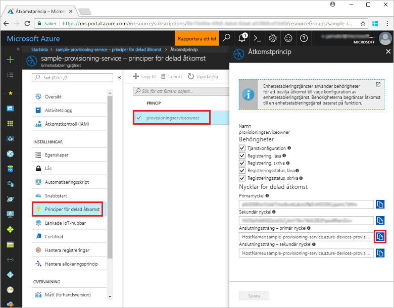
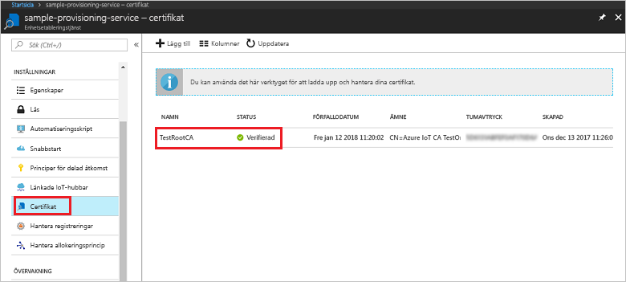
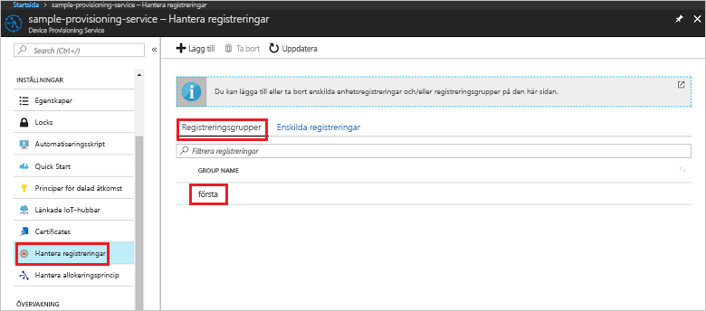

# <a name="enroll-x509-devices-to-iot-hub-device-provisioning-service-using-nodejs-service-sdk"></a>Registrera X.509-enheter på IoT Hub Device Provisioning-tjänsten med Node.js-tjänst-SDK
> [!div class="op_single_selector"]
> * [Java](quick-enroll-device-x509-java.md)
> * [Node.js](quick-enroll-device-x509-node.md)

De här stegen visar hur du programmässigt skapar en registreringsgrupp för ett mellanliggande eller X.509-rotcertifikatutfärdarcertifikat med [Node.js-tjänst-SDK](https://github.com/Azure/azure-iot-sdk-node) och ett Node.js-exempel. Även om de här stegen fungerar både med Windows- och Linux-datorer använder vi en Windows-utvecklingsdator i den här artikeln.
 

## <a name="prerequisites"></a>Nödvändiga komponenter

- Se till att slutföra stegen i [Set up the IoT Hub Device Provisioning Service with the Azure portal](./quick-setup-auto-provision.md) (Konfigurera IoT Hub Device Provisioning-tjänsten med Azure-portalen). 

 
- Kontrollera att [Node.js v4.0 eller senare](https://nodejs.org) är installerat på din dator.


- Du behöver också en .pem-fil som innehåller ett rotcertifikatutfärdarcertifikat eller mellanliggande X.509-certifikat som har laddats upp tidigare och verifierats av din etableringstjänst. **Azure IoT c SDK** innehåller verktyg som du kan använda för att skapa en X.509-certifikatkedja, ladda upp ett rot- eller mellanliggande certifikat från kedjan och utföra innehavarbevis med tjänsten för att verifiera certifikatet. Om du vill använda verktygen klonar du [Azure IoT c SDK](https://github.com/Azure/azure-iot-sdk-c) och följer stegen i [azure-iot-sdk-c\tools\CACertificates\CACertificateOverview.md](https://github.com/Azure/azure-iot-sdk-c/blob/master/tools/CACertificates/CACertificateOverview.md) på datorn.

## <a name="create-the-enrollment-group-sample"></a>Skapa exemplet för registrering av grupp 

 
1. Från ett kommandofönster i arbetsmappen kör du:
  
     ```cmd\sh
     npm install azure-iot-provisioning-service
     ```  

2. Med en textredigerare skapar du filen **create_enrollment_group.js** i arbetsmappen. Lägg till följande kod i filen och spara:

    ```
    'use strict';
    var fs = require('fs');

    var provisioningServiceClient = require('azure-iot-provisioning-service').ProvisioningServiceClient;

    var serviceClient = provisioningServiceClient.fromConnectionString(process.argv[2]);

    var enrollment = {
      enrollmentGroupId: 'first',
      attestation: {
        type: 'x509',
        x509: {
          signingCertificates: {
            primary: {
              certificate: fs.readFileSync(process.argv[3], 'utf-8').toString()
            }
          }
        }
      },
      provisioningStatus: 'disabled'
    };

    serviceClient.createOrUpdateEnrollmentGroup(enrollment, function(err, enrollmentResponse) {
      if (err) {
        console.log('error creating the group enrollment: ' + err);
      } else {
        console.log("enrollment record returned: " + JSON.stringify(enrollmentResponse, null, 2));
        enrollmentResponse.provisioningStatus = 'enabled';
        serviceClient.createOrUpdateEnrollmentGroup(enrollmentResponse, function(err, enrollmentResponse) {
          if (err) {
            console.log('error updating the group enrollment: ' + err);
          } else {
            console.log("updated enrollment record returned: " + JSON.stringify(enrollmentResponse, null, 2));
          }
        });
      }
    });
    ````

## <a name="run-the-enrollment-group-sample"></a>Köra exemplet för registrering av grupp
 
1. Om du vill köra exemplet behöver du anslutningssträngen för etableringstjänsten. 
    1. Logga in på Azure-portalen, klicka på knappen **Alla resurser** i den vänstra menyn och öppna Device Provisioning-tjänsten. 
    2. Klicka på **Policyer för delad åtkomst** och sedan på den åtkomstprincip du vill använda för att öppna dess egenskaper. I fönstret **Åtkomstprincip** kopierar du och antecknar primärnyckelns anslutningssträng. 

     


3. Som det står i [Nödvändiga komponenter](#prerequisites) behöver du också en .pem-fil som innehåller ett mellanliggande X.509-certifikat eller ett rotcertifikatutfärdarcertifikat som har laddats upp tidigare och verifierats av din etableringstjänst. Om du vill kontrollera om ditt certifikat har laddats upp och verifierats går du till sammanfattningsbladet för Device Provisioning-tjänsten i Azure Portal och klickar på **Certifikat**. Leta upp det certifikat du vill använda för gruppregistreringen och se till att statusvärdet är *verifierat*.

     

1. Om du vill skapa en registreringsgrupp för certifikatet kör du följande kommando (ta med citattecknen runt kommandoargumenten):
 
     ```cmd\sh
     node create_enrollment_group.js "<the connection string for your provisioning service>" "<your certificate's .pem file>"
     ```
 
3. När gruppen har skapats visas egenskaperna för den nya registreringsgruppen i kommandofönstret.

     

4. Verifiera att registreringsgruppen har skapats. I Azure Portal, på sammanfattningsbladet för Device Provisioning-tjänsten väljer du **Hantera registreringar**. Välj fliken **Registreringsgrupper** och kontrollera att den nya registreringsposten (*första*) finns.

     
 
## <a name="clean-up-resources"></a>Rensa resurser
Om du tänker utforska Node.js-tjänstexemplet ska du inte rensa resurserna som har skapats i den här snabbstarten. Om du inte planerar att fortsätta kan du använda stegen nedan för att ta bort alla Azure-resurser som har skapats i den här snabbstarten.
 
1. Stäng utdatafönstret för Node.js på datorn.
2. Navigera till Device Provisioning-tjänsten i Azure Portal, klicka på **Hantera registreringar** och välj sedan fliken **Registreringsgrupper**. Välj *Registrerings-ID* för registreringsposten du har skapat med den här snabbstarten och klickar på knappen **Ta bort** högst upp på bladet.  
3. I Device Provisioning-tjänsten i Azure-portalen klickar du på **Certifikat**, sedan på certifikatet du laddade upp för den här snabbstarten och till sist på knappen **Ta bort** överst i fönstret **Certifikatinformation**.  
 
## <a name="next-steps"></a>Nästa steg
I den här snabbstarten har du skapat en gruppregistrering för ett mellanliggande X.509-certifikat eller ett rotcertifikatutfärdarcertifikat med tjänsten Azure IoT Hub Device Provisioning. Om du vill ha mer djupgående information om enhetsetablering kan du fortsätta till självstudien om konfiguration av Device Provisioning-tjänsten i Azure-portalen. 
 
> [!div class="nextstepaction"]
> [Självstudier om Azure IoT Hub Device Provisioning-tjänsten](./tutorial-set-up-cloud.md)