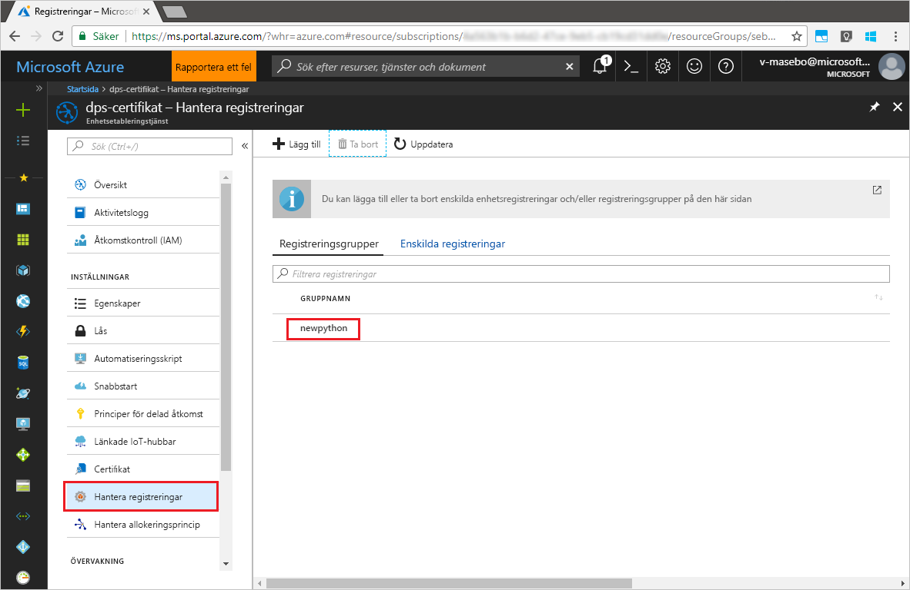

# <a name="quickstart-enroll-x509-devices-to-the-device-provisioning-service-using-python"></a>Snabbstart: Registrera X.509-enheter till Device Provisioning Service med hjälp av Python

[!INCLUDE [iot-dps-selector-quick-enroll-device-x509](../../includes/iot-dps-selector-quick-enroll-device-x509.md)]

I den här snabb starten använder du python för att program mässigt skapa en registrerings grupp som använder mellanliggande eller rot certifikat för CA X. 509-certifikat. En registreringsgrupp kontrollerar åtkomst till etableringstjänsten för enheter som delar ett gemensamt signeringscertifikat i certifikatkedjan. Registreringsgruppen skapas med SDK för Python-etableringstjänsten och ett Python-exempelprogram.

## <a name="prerequisites"></a>Krav

- Konfiguration av [IoT Hub Device Provisioning service med Azure Portal](./quick-setup-auto-provision.md)slutförs.
- Ett Azure-konto med en aktiv prenumeration. [Skapa ett kostnads fritt](https://azure.microsoft.com/free/?ref=microsoft.com&utm_source=microsoft.com&utm_medium=docs&utm_campaign=visualstudio).
- [Python 2. x eller 3. x](https://www.python.org/downloads/). Lägg till python i dina plattformsspecifika miljövariabler. Den här snabb starten installerar [tjänst-SDK för python-etablering](https://github.com/Azure/azure-iot-sdk-python/tree/v1-deprecated/provisioning_service_client) nedan.
- [Pip](https://pip.pypa.io/en/stable/installing/), om det inte ingår i din distribution av python.
- [Git](https://git-scm.com/download/).

> [!IMPORTANT]
> Den här artikeln gäller endast den inaktuella v1 python SDK. Enhets-och tjänst klienter för IoT Hub Device Provisioning Service är ännu inte tillgängliga i v2. Teamet är för närvarande hårt för att ge v2 till funktionens paritet.

## <a name="prepare-test-certificates"></a>Förbereda testcertifikat

I den här snabbstarten måste du ha en .pem- eller en .cer-fil som innehåller den offentliga delen av ett mellanliggande X.509-certifikat eller ett X.509-rotcertifikat. Det här certifikatet måste laddas upp till din etableringstjänst och verifieras av tjänsten.

Mer information om att använda X.509-certifikatbaserad Public Key Infrastructure (PKI) med Azure IoT Hub och enhetsetableringstjänst finns i [Översikt över certifikatsäkerhet med X.509 CA](../iot-hub/iot-hub-x509ca-overview.md).

[Azure IoT C SDK](https://github.com/Azure/azure-iot-sdk-c) innehåller testverktyg som du kan använda för att skapa en X.509-certifikatkedja, ladda upp ett rot- eller mellanliggande certifikat från kedjan och utföra innehavarbevis med tjänsten för att verifiera certifikatet. Certifikat som skapas med SDK-verktygsuppsättningen är utformade för att **endast användas för testutveckling**. Dessa certifikat **får inte användas i produktion**. De innehåller hårdkodade lösenord (”1234”) som upphör att gälla efter 30 dagar. Om du vill lära dig mer om att hämta certifikat som är lämpliga för produktion kan du läsa [How to get an X.509 CA certificate](../iot-hub/iot-hub-x509ca-overview.md#how-to-get-an-x509-ca-certificate) (Hämta ett X.509 CA-certifikat) i dokumentationen för Azure IoT Hub.

Om du vill använda det här testverktyget för att generera certifikat utför du följande steg:

1. Hitta taggnamnet för den [senaste versionen](https://github.com/Azure/azure-iot-sdk-c/releases/latest) av Azure IoT C SDK.

2. Öppna en kommandotolk eller Git Bash-gränssnittet och växla till en arbetsmapp på datorn. Kör följande kommandon för att klona den senaste versionen av [Azure IoT C SDK](https://github.com/Azure/azure-iot-sdk-c) GitHub-lagringsplatsen. Använd taggen som du hittade i föregående steg som `-b` parameter värde:

    ```cmd/sh
    git clone -b <release-tag> https://github.com/Azure/azure-iot-sdk-c.git
    cd azure-iot-sdk-c
    git submodule update --init
    ```

    Den här åtgärden kan förväntas ta flera minuter att slutföra.

   Testverktyget finns i den *azure-iot-sdk-c/tools/CACertificates* för den lagringsplats som du klonade.

3. Följ stegen på sidan om att [hantera CA-testcertifikat för exempel och självstudier](https://github.com/Azure/azure-iot-sdk-c/blob/master/tools/CACertificates/CACertificateOverview.md). 

## <a name="modify-the-python-sample-code"></a>Ändra Python-exempelkoden

I det här avsnittet visas hur du lägger till etableringsinformationen för X.509-enheten i exempelkoden. 

1. Skapa en ny **Registreringsgrupp.py**-fil med en texteditor.

1. Lägg till följande `import`-instruktioner och variabler längst upp i **Registreringsgrupp.py**-filen. Byt sedan `dpsConnectionString` mot din anslutningssträng som finns under **Policyer för delad åtkomst** i **Device Provisioning-tjänsten** på **Azure-portalen**. Byt ut platshållaren för certifikat med certifikatet som skapades i [Förbereda testcertifikat](quick-enroll-device-x509-python.md#prepare-test-certificates). Skapa slutligen ett unikt `registrationid` och se till att det endast innehåller små bokstäver, siffror och bindestreck.  
   
    ```python
    from provisioningserviceclient import ProvisioningServiceClient
    from provisioningserviceclient.models import EnrollmentGroup, AttestationMechanism

    CONNECTION_STRING = "{dpsConnectionString}"

    SIGNING_CERT = """-----BEGIN CERTIFICATE-----
    XXXXXXXXXXXXXXXXXXXXXXXXXXXXXXXXXXXXXXXXXXXXXXXXXXXXXXXXXXXXXXXX
    XXXXXXXXXXXXXXXXXXXXXXXXXXXXXXXXXXXXXXXXXXXXXXXXXXXXXXXXXXXXXXXX
    XXXXXXXXXXXXXXXXXXXXXXXXXXXXXXXXXXXXXXXXXXXXXXXXXXXXXXXXXXXXXXXX
    XXXXXXXXXXXXXXXXXXXXXXXXXXXXXXXXXXXXXXXXXXXXXXXXXXXXXXXXXXXXXXXX
    XXXXXXXXXXXXXXXXXXXXXXXXXXXXXXXXXXXXXXXXXXXXXXXXXXXXXXXXXXXXXXXX
    XXXXXXXXXXXXXXXXXXXXXXXXXXXXXXXXXXXXXXXXXXXXXXXXXXXXXXXXXXXXXXXX
    XXXXXXXXXXXXXXXXXXXXXXXXXXXXXXXXXXXXXXXXXXXXXXXXXXXXXXXXXXXXXXXX
    XXXXXXXXXXXXXXXXXXXXXXXXXXXXXXXXXXXXXXXXXXXXXXXXXXXXXXXXXXXXXXXX
    XXXXXXXXXXXXXXXXXXXXXXXXXXXXXXXXXXXXXXXXXXXXXXXXXXXXXXXXXXXXXXXX
    XXXXXXXXXXXXXXXXXXXXXXXXXXXXXXXXXXXXXXXXXXXXXXXXXXXXXXXXXXXXXXXX
    XXXXXXXXXXXXXXXXXXXXXXXXXXXXXXXXXXXXXXXXXXXXXXXXXXXXXXXXXXXXXXXX
    XXXXXXXXXXXXXXXXXXXXXXXXXXXXXXXXXXXXXXXXXXXXXXXXXXXXXXXXXXXXXXXX
    XXXXXXXXXXXXXXXXXXXXXXXXXXXXXXXXXXXXXXXXXXXXXXXXXXXXXXXXXXXXXXXX
    XXXXXXXXXXXXXXXXXXXXXXXXXXXXXXXXXXXXXXXXXXXXXXXXXXXXXXXXXXXXXXXX
    XXXXXXXXXXXXXXXXXXXXXXXXXXXXXXXXXXXXXXXXXXXXXXXXXXXXXXXX
    -----END CERTIFICATE-----"""

    GROUP_ID = "{registrationid}"
    ```

1. Lägg till följande funktion och funktionsanrop för att implementera skapandet av registreringsgruppen:
   
    ```python
    def main():
        print ( "Initiating enrollment group creation..." )

        psc = ProvisioningServiceClient.create_from_connection_string(CONNECTION_STRING)
        att = AttestationMechanism.create_with_x509_signing_certs(SIGNING_CERT)
        eg = EnrollmentGroup.create(GROUP_ID, att)

        eg = psc.create_or_update(eg)
    
        print ( "Enrollment group created." )

    if __name__ == '__main__':
        main()
    ```

1. Spara och stäng **Registreringsgrupp.py**-filen.
 

## <a name="run-the-sample-group-enrollment"></a>Kör exemplet på gruppregistrering

Azure IoT Device Provisioning Service stöder två typer av registreringar:

- [Registreringsgrupper](concepts-service.md#enrollment-group): används för att registrera flera relaterade enheter.
- [Enskilda registreringar](concepts-service.md#individual-enrollment): används för att registrera en enskild enhet.

Skapande av enskilda registreringar via [SDK för Python-etableringstjänsten](https://github.com/Azure/azure-iot-sdk-python/tree/v1-deprecated/provisioning_service_client) är en process som är under utveckling. Läs mer i informationen om att [kontrollera enhetsåtkomst till etableringstjänsten med X.509-certifikat](./concepts-x509-attestation.md#controlling-device-access-to-the-provisioning-service-with-x509-certificates).

1. Öppna en kommandotolk och kör följande kommando för att installera [azure-iot-provisioning-device-client](https://pypi.org/project/azure-iot-provisioning-device-client).

    ```cmd/sh
    pip install azure-iothub-provisioningserviceclient    
    ```

2. I kommandotolken kör du skriptet.

    ```cmd/sh
    python EnrollmentGroup.py
    ```

3. Se utdata för att se om registreringen har lyckats.

4. Navigera till etableringstjänsten i Azure Portal. Klicka på **Hantera registreringar**. Observera att gruppen med X.509-enheter visas under fliken **Registreringsgrupper**, med namnet som `registrationid` skapade tidigare. 

      


## <a name="clean-up-resources"></a>Rensa resurser
Om du planerar att utforska Java-tjänsteexemplet ska du inte rensa upp resurserna som du skapade i den här snabb starten. Om du inte planerar att fortsätta kan du använda följande steg för att ta bort alla resurser som skapats i den här snabb starten.

1. Stäng utdatafönstret för Java-exemplet på datorn.
1. Stäng _X509 Cert Generator_-fönstret på datorn.
1. Gå till enhets etablerings tjänsten i Azure Portal, Välj **Hantera registreringar** och välj sedan fliken **registrerings grupper** . Markera kryss rutan bredvid *grupp namnet* för de X. 509-enheter som du har registrerat med hjälp av den här snabb starten och klicka på knappen **ta bort** högst upp i fönstret.    


## <a name="next-steps"></a>Nästa steg
I den här snabb starten har du registrerat en simulerad grupp med X. 509-enheter för enhets etablerings tjänsten. Om du vill ha mer djupgående information om enhetsetablering kan du fortsätta till självstudien om konfiguration av Device Provisioning-tjänsten i Azure-portalen. 

> [!div class="nextstepaction"]
> [Självstudier om Azure IoT Hub Device Provisioning-tjänsten](./tutorial-set-up-cloud.md)