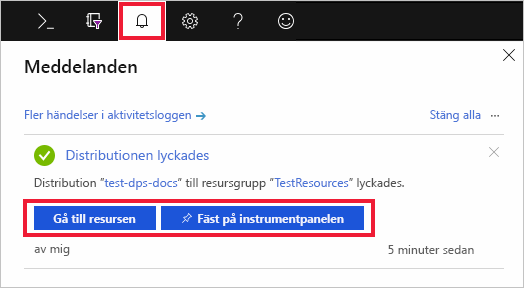

# Snabb start: Konfigurera IoT Hub Device Provisioning Service med Azure Portal

Dessa steg beskriver hur du konfigurerar Azure-molnresurserna på portalen för att etablera dina enheter. I den här artikeln hittar du anvisningar för att: skapa en IoT-hubb, skapa en ny instans av IoT Hub Device Provisioning-tjänsten och länka de två tjänsterna. 

Om du inte har en Azure-prenumeration kan du skapa ett [kostnadsfritt konto](https://azure.microsoft.com/free/?WT.mc_id=A261C142F) innan du börjar.

## Skapa en IoT Hub

[!INCLUDE [iot-hub-include-create-hub](../../includes/iot-hub-include-create-hub.md)]

## Skapa en ny instans av IoT Hub Device Provisioning-tjänsten

1. Välj knappen **+ skapa en resurs** igen.

2. *Sök i Marketplace* efter **enhets etablerings tjänsten**. Välj **IoT Hub Device Provisioning service** och tryck på knappen **skapa** . 

3. Ange följande information för din nya enhets etablerings tjänst instans och tryck på **skapa**.

    * **Namn:** Ange ett unikt namn för den nya instansen av enhetsetableringstjänsten. Om namnet som du anger är tillgängligt visas en grön bockmarkering.
    * **Prenumeration**: Välj den prenumeration du vill använda för att skapa instansen av enhetsetableringstjänsten.
    * **Resursgrupp:** I det här fältet kan du skapa en ny resursgrupp eller välja en befintlig som ska innehålla den nya instansen. Välj resursgruppen som innehåller den IoT-hubb du skapade, till exempel **TestResources**. Genom att lägga till alla relaterade resurser i en grupp kan du hantera dem tillsammans. Till exempel tas alla resurser som ingår i gruppen bort om resursgruppen tas bort. Mer information finns i [Hantera Azure Resource Manager-resursgrupper](../azure-resource-manager/manage-resource-groups-portal.md).
    * **Plats**: Välj den plats som är närmast enheten.

        

4. Välj knappen meddelande för att övervaka skapandet av resurs instansen. När tjänsten har distribuerats väljer du **Fäst på instrument panelen**och **går sedan till resurs**.

    

## Länka IoT-hubben och enhets etablerings tjänsten

I det här avsnittet ska du lägga till en konfiguration i enhets etablerings tjänst instansen. Den här konfigurationen anger den IoT-hubb för vilken enheter tillhandahålls.

1. Välj knappen **alla resurser** på den vänstra menyn i Azure Portal. Välj Device Provisioning-tjänstinstansen som du skapade i det föregående avsnittet.  

2. Från enhets Provisioning-tjänstens meny väljer du **länkade IoT-hubbar**. Tryck på knappen **+ Lägg till** som visas överst. 

3. På sidan **Lägg till länk i IoT Hub** fyller du i följande information för att länka den nya instansen av enhetsetableringstjänsten till en IoT-hubb. Tryck sedan på **Spara**. 

    * **Prenumeration:** Välj den prenumeration som innehåller den IoT-hubb som du vill länka till den nya instansen av enhetsetableringstjänsten.
    * **IoT-hubb:** Välj den IoT-hubb som du vill länka till den nya instansen av enhetsetableringstjänsten.
    * **Åtkomstprincip:** Välj **iothubowner** som autentiseringsuppgifter när du upprättar länken till IoT-hubben.  

        

3. Nu bör den valda hubben visas under bladet **Linked IoT hubs** (Länkade IoT-hubbar). Du kan behöva klicka på **Uppdatera** för att visa.

## Rensa resurser

De andra snabbstarterna i den här samlingen bygger på den här snabbstarten. Om du planerar att fortsätta att arbeta med efterföljande snabbstarter eller med självstudierna ska du inte rensa resurserna som skapas i denna snabbstart. Om du inte planerar att fortsätta kan du använda stegen nedan för att ta bort alla resurser som har skapats i den här snabbstarten i Azure-portalen.

1. Välj **alla resurser** på den vänstra menyn i Azure Portal och välj sedan enhets etablerings tjänsten. Välj **ta bort**överst i enhets informations fönstret.  
2. Välj **alla resurser** på den vänstra menyn i Azure Portal och välj sedan din IoT Hub. Välj **ta bort**överst i informations fönstret hubb.  

## Nästa steg

I den här snabb starten har du distribuerat en IoT-hubb och en enhets etablerings tjänst instans och länkat de två resurserna. Om du vill lära dig hur du använder den här installationen för att etablera en simulerad enhet fortsätter du till snabb starten för att skapa en simulerad enhet.

> [!div class="nextstepaction"]
> [Snabb start för att skapa en simulerad enhet](./quick-create-simulated-device.md)
