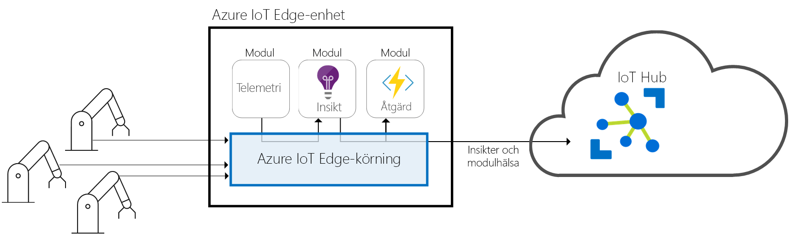
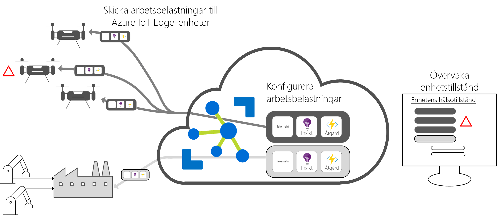

# Vad är Azure IoT Edge?

Azure IoT Edge flyttar molnbaserade analyser och anpassad affärslogik så att din organisation kan fokusera på affärsinsikter istället för datahantering. Konfigurera din IoT-programvara, distribuera den till enheter via standardcontainrar och övervaka alltihop från molnet.

>[!NOTE]
>Azure IoT Edge finns tillgängligt på kostnadsfri och standardnivå för IoT Hub. Den kostnadsfria nivån är endast för testning och utvärdering. Mer information om nivåerna Basic och Standard finns i artikeln om att [välja rätt nivå för IoT Hub](../iot-hub/iot-hub-scaling.md).

Analyser ger IoT-lösningar värde, men alla analyser behövs inte i molnet. Om du vill att enheten ska reagera så snabbt som möjligt vid nödfall kan du utföra avvikelseidentifiering på själva enheten. Om du vill minska bandbreddskostnaderna och undvika att överföra terabyte med rådata kan du på samma sätt utföra datarensning och sammanställning lokalt. Skicka sedan insikterna till molnet för analys. 

Azure IoT Edge består av tre komponenter:
* IoT Edge-moduler är containrar som kör Azure-tjänster, tjänster från tredje part eller din egen kod. Moduler distribueras till IoT Edge-enheter och körs lokalt på enheterna. 
* IoT Edge-körningen körs på varje IoT Edge-enhet och hanterar modulerna som distribueras till varje enhet. 
* Med ett molnbaserad gränssnitt kan du övervaka och hantera IoT-enheter via fjärranslutning.

## IoT Edge-moduler

IoT Edge-moduler är körningsenheter som är implementerade som Docker-kompatibla containrar och kör din affärslogik på gränsen. Flera moduler kan konfigureras för att kommunicera med varandra, vilket skapar en pipeline med databearbetning. Du kan utveckla anpassade moduler eller paketera vissa Azure-tjänster i moduler som ger insikter offline och på gränsen. 

### Artificiell intelligens på gränsen

Med Azure IoT Edge kan du distribuera komplex händelsebearbetning, maskininlärning, bildigenkänning och annan värdefull AI utan att skriva internt. Azure-tjänster som Azure Functions, Azure Stream Analytics och Azure Machine Learning kan köras lokalt via Azure IoT Edge, men du är inte begränsad till Azure-tjänster. Vem som helst kan skapa AI-moduler och göra dem tillgängliga för communityn för användning via Microsoft Azure Marketplace. 

### Ha med din egen kod

När du vill distribuera din egen kod till dina enheter kan du göra det med Azure IoT Edge. Azure IoT Edge innehåller samma programmeringsmiljö som de andra Azure IoT-tjänsterna. Samma kod kan köras på en enhet eller i molnet. Azure IoT Edge stöder både Linux och Windows, så du kan koda till vilken plattform du vill. Den har stöd för Java, .NET Core 2.0, Node.js, C och Python. Det gör att dina utvecklare kan koda på ett språk de redan kan och använda befintlig affärslogik.

## IoT Edge-körning

Azure IoT Edge-körning möjliggör anpassad och molnbaserad logik på IoT Edge-enheter. Det finns på IoT Edge-enheten och utför åtgärder för hantering och kommunikation. Körningen utför flera funktioner:

* Installerar och uppdaterar arbetsbelastningar på enheten.
* Upprätthåller Azure IoT Edge-säkerhetsstandarder på enheten.
* Säkerställer att IoT Edge-moduler alltid körs.
* Rapporterar modulens hälsa till molnet för fjärrövervakning.
* Hanterar kommunikationen mellan nedströms lövenheter och en IoT Edge-enhet, mellan modulerna på en IoT Edge-enhet, och mellan en IoT Edge-enhet och molnet.

Det är upp till dig hur du använder en Azure IoT Edge-enhet. Körningen används ofta för att distribuera AI till gatewayer som aggregerar och bearbetar data från andra lokala enheter, men den här distributionsmodellen är bara ett alternativ. Lövenheter kan också vara Azure IoT Edge-enheter oavsett om de är anslutna till en gateway eller direkt till molnet.

Azure IoT Edge-körningen körs på en stor uppsättning IoT-enheter för att möjliggöra körningen på många olika sätt. Den stöder både Linux- och Windows-operativsystem och avlägsnar maskinvaruinformation. Använd en enhet som är mindre än en Raspberry Pi 3 om du inte hanterar stora datamängder eller skala upp till en industrialiserad server för att köra resursintensiva arbetsbelastningar.

## IoT Edge-molngränssnitt

Det är komplicerat att hantera programvarans livscykel för företagsenheter. Det är ännu svårare att hantera programvarans livscykel för miljontals heterogena IoT-enheter. Arbetsbelastningar måste skapas och konfigureras för en viss typ av enhet, distribueras i stor skala till de miljontals enheterna i din lösning och övervakas för att fånga upp enheter som beter sig felaktigt. Dessa aktiviteter kan inte utföras på enhetsbasis och måste göras i stor skala.

Azure IoT Edge integreras sömlöst med Azure IoT-lösningsacceleratorer för att tillhandahålla en kontrollplan för lösningens behov. Med molntjänster kan du:

* Skapa och konfigurera en arbetsbelastning som ska köras på en specifik typ av enhet.
* Skicka en arbetsbelastning till en uppsättning enheter.
* Övervaka arbetsbelastningar som körs på enheter i fältet.

## Nästa steg

Prova de här koncepten genom att [distribuera IoT Edge på en simulerad enhet](quickstart.md).