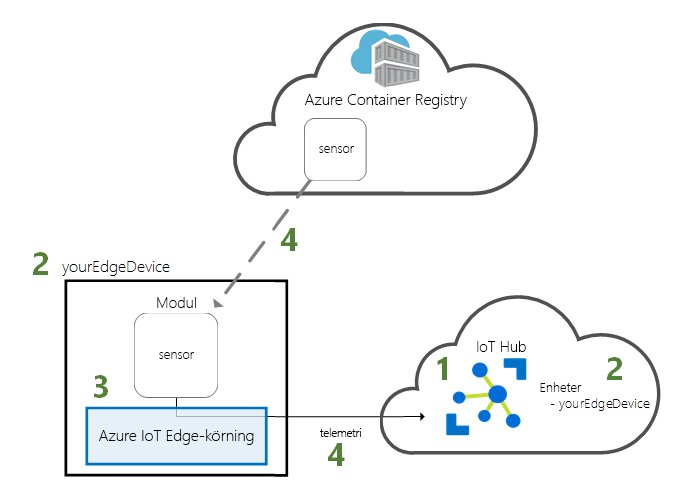
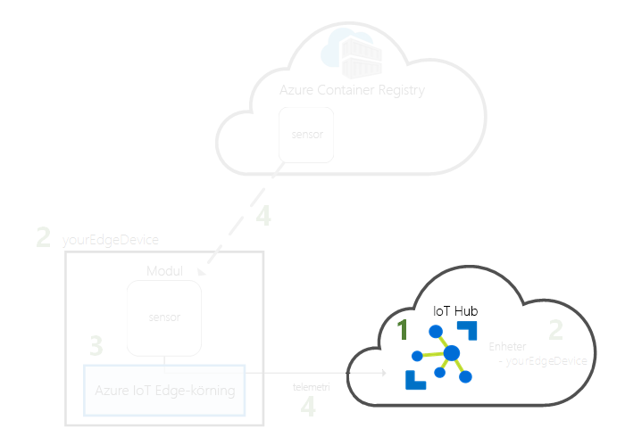
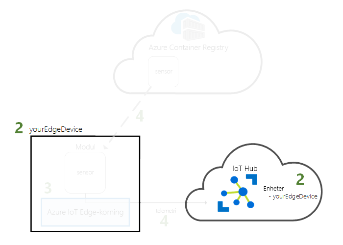
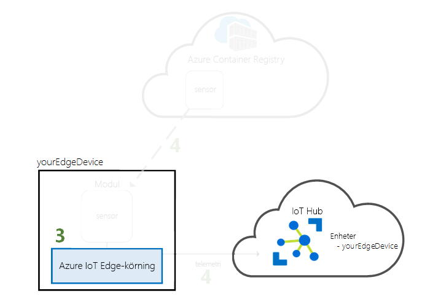
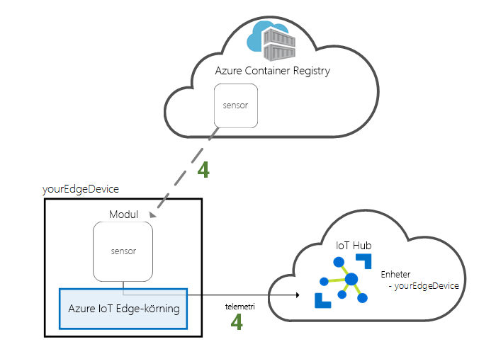

# <a name="quickstart-deploy-your-first-iot-edge-module-to-a-virtual-linux-device"></a>Snabb start: distribuera din första IoT Edge-modul till en virtuell Linux-enhet

Testa Azure IoT Edge i den här snabb starten genom att distribuera container kod till en virtuell Linux IoT Edge-enhet. Med IoT Edge kan du fjärrhantera kod på dina enheter så att du kan skicka fler arbets belastningar till gränsen. I den här snabb starten rekommenderar vi att du använder en virtuell Azure-dator för din IoT Edge-enhet, vilket gör att du snabbt kan skapa en test dator med tjänsten IoT Edge installerad och sedan ta bort den när du är klar.

I den här snabbstarten lär du dig att:

* Skapa en IoT Hub.
* Registrera en IoT Edge-enhet till din IoT Hub.
* Installera och starta IoT Edge runtime på den virtuella enheten.
* Fjärrdistribuera en modul till en IoT Edge-enhet.



Den här snabb starten vägleder dig genom att skapa en virtuell Linux-dator som är konfigurerad som en IoT Edge enhet. Sedan distribuerar du en modul från Azure Portal till din enhet. Modulen som används i den här snabb starten är en simulerad sensor som genererar temperatur-, fuktighets-och tryck data. De andra Azure IoT Edge självstudierna bygger på det arbete du gör här genom att distribuera ytterligare moduler som analyserar simulerade data för affärs insikter.

Om du inte har en aktiv Azure-prenumeration kan du skapa ett [kostnadsfritt konto](https://azure.microsoft.com/free) innan du börjar.

[!INCLUDE [cloud-shell-try-it.md](../../includes/cloud-shell-try-it.md)]

Du kommer använda Azure CLI för att slutföra många av stegen i den här snabbstarten och Azure IoT har ett tillägg för att aktivera ytterligare funktioner.

Lägg till Azure IoT-tillägget till Cloud Shell-instansen.

   ```azurecli-interactive
   az extension add --name azure-iot
   ```

[!INCLUDE [iot-hub-cli-version-info](../../includes/iot-hub-cli-version-info.md)]

## <a name="prerequisites"></a>Förutsättningar

Molnresurser:

* En resursgrupp som du använder för att hantera alla resurser i den här snabbstarten. Vi använder exempel på resurs grupps namnet **IoTEdgeResources** i den här snabb starten och följande självstudier.

   ```azurecli-interactive
   az group create --name IoTEdgeResources --location westus2
   ```

## <a name="create-an-iot-hub"></a>Skapa en IoT Hub

Starta snabbstarten genom att skapa en IoT-hubb med Azure CLI.



Den kostnadsfria nivån för IoT Hub fungerar för den här snabbstarten. Om du har använt IoT Hub tidigare och redan har skapat en hubb, kan du använda den IoT Hub.

Följande kod skapar en kostnads fri **F1** -hubb i resurs gruppen **IoTEdgeResources**. Ersätt `{hub_name}` med ett unikt namn för din IoT Hub. Det kan ta några minuter att skapa en IoT Hub.

   ```azurecli-interactive
   az iot hub create --resource-group IoTEdgeResources --name {hub_name} --sku F1 --partition-count 2
   ```

   Om du får ett felmeddelande eftersom det redan finns en kostnadsfri hubb i din prenumeration ändrar du SKU till **S1**. Varje prenumeration kan bara ha en kostnadsfri IoT Hub. Om du får ett felmeddelande om att IoT Hub-namnet inte är tillgängligt innebär det att någon annan redan har en hubb med det namnet. Prova med ett nytt namn.

## <a name="register-an-iot-edge-device"></a>Registrera en IoT Edge-enhet

Registrera en IoT Edge-enhet med IoT-hubben som du nyss skapade.



Skapa en enhetsidentitet för din IoT Edge-enhet så att den kan kommunicera med din IoT Hub. Enhetsidentiteten finns i molnet, och du använder en unik enhetsanslutningssträng för att associera en fysisk enhet med en enhetsidentitet.

Eftersom IoT Edge-enheter fungerar och kan hanteras på annat sätt än typiska IoT-enheter deklarerar du den här identiteten till att höra till en IoT Edge-enhet med flaggan `--edge-enabled`.

1. I Azure Cloud Shell anger du följande kommando för att skapa en enhet med namnet **myEdgeDevice** i hubben.

   ```azurecli-interactive
   az iot hub device-identity create --device-id myEdgeDevice --edge-enabled --hub-name {hub_name}
   ```

   Om du får ett fel meddelande om princip nycklar för iothubowner kontrollerar du att din Cloud Shell kör den senaste versionen av Azure-IoT-tillägget.

2. Visa anslutnings strängen för enheten, som länkar din fysiska enhet med sin identitet i IoT Hub. Det innehåller namnet på din IoT-hubb, namnet på enheten och sedan en delad nyckel som autentiserar anslutningar mellan de två. Vi kommer att referera till den här anslutnings strängen igen i nästa avsnitt när du konfigurerar din IoT Edge-enhet.

   ```azurecli-interactive
   az iot hub device-identity connection-string show --device-id myEdgeDevice --hub-name {hub_name}
   ```

   

## <a name="configure-your-iot-edge-device"></a>Konfigurera din IoT Edge-enhet

Skapa en virtuell dator med Azure IoT Edge runtime på den.



IoT Edge-körningen distribueras på alla IoT Edge-enheter. Den har tre komponenter. *IoT Edge Security daemon* startar varje gång en IoT Edge enhet startar och startar enheten genom att starta IoT Edge agenten. *IoT Edge-agenten* underlättar distribution och övervakning av moduler på IoT Edges enheten, inklusive IoT Edge hubben. *IoT Edge Hub* hanterar kommunikation mellan moduler på IoT Edge-enheten och mellan enheten och IoT Hub.

Under körningskonfigurationen anger du en enhetsanslutningssträng. Detta är den sträng som du hämtade från Azure CLI. Den här strängen associerar den fysiska enheten med IoT Edge-enhetsidentiteten i Azure.

### <a name="deploy-the-iot-edge-device"></a>Distribuera IoT Edge-enheten

I det här avsnittet används en Azure Resource Manager-mall för att skapa en ny virtuell dator och installera IoT Edge runtime på den. Om du vill använda en egen Linux-enhet i stället kan du följa installations stegen i [installera Azure IoT Edge runtime](how-to-install-iot-edge.md)och sedan återgå till den här snabb starten.

Använd följande CLI-kommando för att skapa din IoT Edge-enhet baserat på mallen för inbyggd [iotedge-VM-Deploy](https://github.com/Azure/iotedge-vm-deploy) .

* För bash eller Cloud Shell användare kopierar du följande kommando till en text redigerare, ersätter platshållartexten med din information och kopierar sedan till bash-eller Cloud Shells fönstret:

   ```azurecli-interactive
   az deployment group create \
   --resource-group IoTEdgeResources \
   --template-uri "https://aka.ms/iotedge-vm-deploy" \
   --parameters dnsLabelPrefix='my-edge-vm' \
   --parameters adminUsername='azureUser' \
   --parameters deviceConnectionString=$(az iot hub device-identity connection-string show --device-id myEdgeDevice --hub-name
   <REPLACE_WITH_HUB_NAME> -o tsv) \
   --parameters authenticationType='password'
   --parameters adminPasswordOrKey="<REPLACE_WITH_PASSWORD>"
   ```

* För PowerShell-användare kopierar du följande kommando till PowerShell-fönstret och ersätter sedan platshållartexten med din egen information:

   ```azurecli
   az deployment group create `
   --resource-group IoTEdgeResources `
   --template-uri "https://aka.ms/iotedge-vm-deploy" `
   --parameters dnsLabelPrefix='my-edge-vm1' `
   --parameters adminUsername='azureUser' `
   --parameters deviceConnectionString=$(az iot hub device-identity connection-string show --device-id myEdgeDevice --hub-name <REPLACE_WITH_HUB_NAME> -o tsv) `
   --parameters authenticationType='password' `
   --parameters adminPasswordOrKey="<REPLACE_WITH_PASSWORD>"
   ```

Den här mallen använder följande parametrar:

| Parameter | Beskrivning |
| --------- | ----------- |
| **resurs grupp** | Resurs gruppen som resurserna ska skapas i. Använd standard **IoTEdgeResources** som vi har använt i den här artikeln eller ange namnet på en befintlig resurs grupp i din prenumeration. |
| **mall-URI** | En pekare till den Resource Manager-mall som vi använder. |
| **dnsLabelPrefix** | En sträng som ska användas för att skapa den virtuella datorns värdnamn. Använd exempel **Min-Edge-VM** eller ange en ny sträng. |
| **adminUsername** | Ett användar namn för administratörs kontot för den virtuella datorn. Använd exemplet **azureUser** eller ange ett nytt användar namn. |
| **deviceConnectionString** | Anslutnings strängen från enhets identiteten i IoT Hub, som används för att konfigurera IoT Edge runtime på den virtuella datorn. Kommandot CLI i den här parametern hämtar anslutnings strängen åt dig. Ersätt platshållartexten med ditt IoT Hub-namn. |
| **authenticationType** | Autentiseringsmetoden för administratörs kontot. Den här snabb starten använder **lösenordsautentisering** , men du kan också ange parametern till **sshPublicKey**. |
| **adminPasswordOrKey** | Lösen ordet eller värdet för SSH-nyckeln för administratörs kontot. Ersätt platshållartexten med ett säkert lösen ord. Lösen ordet måste vara minst 12 tecken långt och ha tre av fyra av följande: gemener, versaler, siffror och specialtecken. |

När distributionen är klar bör du ta emot JSON-formaterade utdata i CLI som innehåller SSH-informationen för att ansluta till den virtuella datorn. Kopiera värdet för den **offentliga SSH** -posten i avsnittet **utdata** :

   

### <a name="view-the-iot-edge-runtime-status"></a>Visa status för IoT Edge-körningen

Resten av kommandona i den här snabbstarten sker på din IoT Edge-enhet så att du kan se vad som händer på enheten. Om du använder en virtuell dator kan du ansluta till den datorn med det administratörs användar namn som du har skapat och det DNS-namn som angavs av distributions kommandot. Du kan också hitta DNS-namnet på den virtuella datorns översikts sida i Azure Portal. Använd följande kommando för att ansluta till din virtuella dator. Ersätt `{admin username}` och `{DNS name}` med dina egna värden.

   ```console
   ssh {admin username}@{DNS name}
   ```

När du är ansluten till den virtuella datorn kontrollerar du att körningen har installerats och kon figurer ATS på IoT Edge enheten.

1. Kontrol lera att IoT Edge Security Daemon körs som en system tjänst.

   ```bash
   sudo systemctl status iotedge
   ```

   

   >[!TIP]
   >Förhöjd behörighet krävs för att köra `iotedge`-kommandon. När du loggar ut från datorn och sedan loggar in igen för första gången efter installationen av IoT Edge-körningen, så uppdateras dina behörigheter automatiskt. Tills dess kan du använda framför `sudo` kommandona.

2. Hämta tjänstloggar om du behöver felsöka tjänsten.

   ```bash
   journalctl -u iotedge
   ```

3. Visa alla moduler som körs på din IoT Edge-enhet. Eftersom det är första gången du startar tjänsten, bör du bara kunna se den **edgeAgent** -modul som körs. EdgeAgent-modulen körs som standard och hjälper till att installera och starta ytterligare moduler som du distribuerar till din enhet.

   ```bash
   sudo iotedge list
   ```

   

IoT Edge-enheten har nu konfigurerats. Den är redo att köra molndistribuerade moduler.

## <a name="deploy-a-module"></a>Distribuera en modul

Hantera din Azure IoT Edge-enhet från molnet för att distribuera en modul som ska skicka telemetridata till IoT Hub.



[!INCLUDE [iot-edge-deploy-module](../../includes/iot-edge-deploy-module.md)]

## <a name="view-generated-data"></a>Visa genererade data

I den här snabbstarten skapade du en ny IoT Edge-enhet och installerade IoT Edge-körningsmiljön på den. Sedan använde du Azure-portalen för att distribuera en IoT Edge-modul som ska köras på enheten utan att några ändringar behövs göras i själva enheten.

I det här fallet genererar modulen som du har överfört exempel miljö data som du kan använda för testning senare. Den simulerade sensorn övervakar både en dator och miljön runt datorn. Den här sensorn kan till exempel finnas i ett serverrum, på fabriksgolvet eller på en vindturbin. Meddelandet innehåller rumstemperatur och fuktighet, maskintemperatur och tryck samt en tidsstämpel. I IoT Edge-självstudierna används de data som skapas av den här modulen som testdata för analys.

Öppna kommandotolken på IoT Edge-enheten igen eller använd SSH-anslutningen från Azure CLI. Kontrollera att modulen distribuerades från molnet som körs på IoT Edge-enheten:

   ```bash
   sudo iotedge list
   ```

   

Visa de meddelanden som skickas från temperatursensor-modulen:

   ```bash
   sudo iotedge logs SimulatedTemperatureSensor -f
   ```

   >[!TIP]
   >IoT Edge-kommandon är skiftlägeskänsliga när det gäller modulnamnen.

   

Du kan också se att meddelandena kommer till din IoT-hubb genom att använda [Azure IoT Hub-tillägget för Visual Studio Code](https://marketplace.visualstudio.com/items?itemName=vsciot-vscode.azure-iot-toolkit).

## <a name="clean-up-resources"></a>Rensa resurser

Om du vill fortsätta med IoT Edge-självstudierna kan du använda enheten du registrerade och konfigurerade i den här snabbstarten. Annars kan du ta bort de Azure-resurser som du har skapat för att undvika avgifter.

Om du skapade den virtuella datorn och IoT-hubben i en ny resursgrupp kan du ta bort den gruppen och alla associerade resurser. Kontrollera att det inte finns något du vill behålla i innehållet i resursgruppen. Om du inte vill ta bort hela gruppen kan du ta bort enskilda resurser i stället.

> [!IMPORTANT]
> Att ta bort en resursgrupp kan inte ångras.

Ta bort gruppen **IoTEdgeResources**. Det kan ta några minuter att ta bort en resurs grupp.

```azurecli-interactive
az group delete --name IoTEdgeResources
```

Du kan bekräfta att resurs gruppen tas bort genom att visa listan över resurs grupper.

```azurecli-interactive
az group list
```

## <a name="next-steps"></a>Nästa steg

I den här snabbstarten skapade du en IoT Edge-enhet och använde molngränssnittet i Azure IoT Edge för att distribuera kod till enheten. Nu har du en testenhet som genererar rådata för sin miljö.

Nästa steg är att konfigurera din lokala utvecklings miljö så att du kan börja skapa IoT Edge moduler som kör din affärs logik.

> [!div class="nextstepaction"]
> [Börja utveckla IoT Edge moduler för Linux-enheter](tutorial-develop-for-linux.md)
