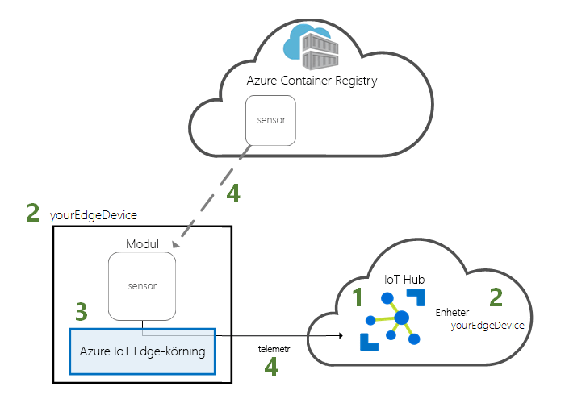
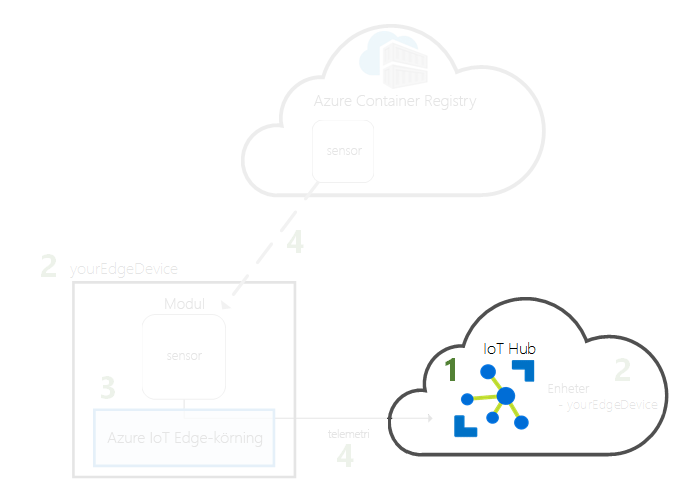
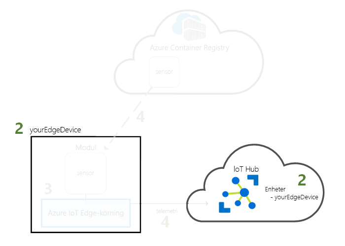
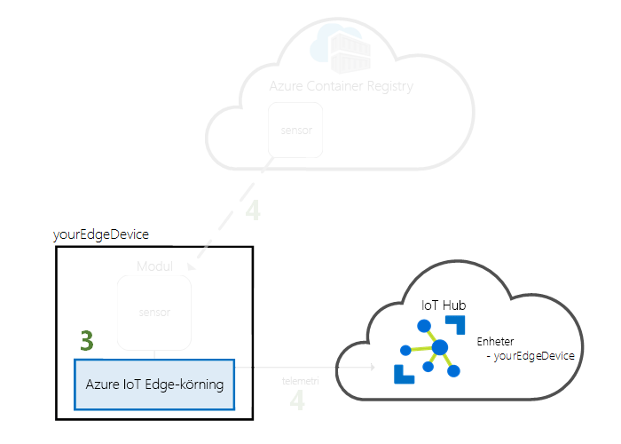
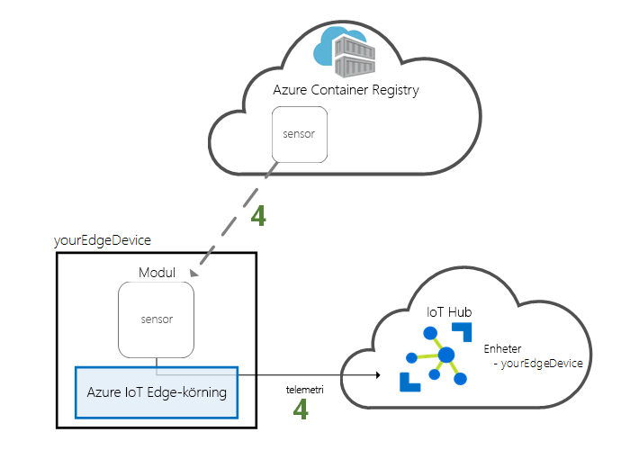

# <a name="quickstart-deploy-your-first-iot-edge-module-to-a-virtual-windows-device"></a>Snabb start: distribuera din första IoT Edge-modul till en virtuell Windows-enhet

Prova Azure IoT Edge i den här snabb starten genom att distribuera container kod till en virtuell Windows IoT Edge-enhet. Med IoT Edge kan du fjärrhantera kod på dina enheter så att du kan skicka fler arbets belastningar till gränsen. I den här snabb starten rekommenderar vi att du använder en virtuell Azure-dator för din IoT Edge-enhet. Med hjälp av en virtuell dator kan du snabbt skapa en test dator, installera nödvändiga komponenter och sedan ta bort den när du är klar.

I den här snabbstarten lär du dig att:

* Skapa en IoT-hubb.
* Registrera en IoT Edge-enhet till din IoT Hub.
* Installera och starta IoT Edge runtime på den virtuella enheten.
* Fjärrdistribuera en modul till en IoT Edge-enhet och skicka telemetri till IoT Hub.



Den här snabb starten vägleder dig genom att skapa en virtuell Windows-dator och konfigurera den som en IoT Edge enhet. Sedan distribuerar du en modul från Azure Portal till din enhet. Modulen som används i den här snabb starten är en simulerad sensor som genererar temperatur-, fuktighets-och tryck data. De andra Azure IoT Edge självstudierna bygger på det arbete du gör här genom att distribuera ytterligare moduler som analyserar simulerade data för affärs insikter.

Om du inte har en aktiv Azure-prenumeration kan du skapa ett [kostnadsfritt konto](https://azure.microsoft.com/free) innan du börjar.

## <a name="prerequisites"></a>Krav

Förbered din miljö för Azure CLI.

- Använd [Azure Cloud Shell](/azure/cloud-shell/quickstart-powershell) med hjälp av PowerShell-miljön.

   [](https://shell.azure.com)   
- Om du vill kan du i stället [installera](/cli/azure/install-azure-cli) Azure CLI för att köra CLI-referenskommandon.
   - Om du använder en lokal installation loggar du in med Azure CLI med hjälp av kommandot [az login](/cli/azure/reference-index#az-login).  Slutför autentiseringsprocessen genom att följa stegen som visas i terminalen.  Fler inloggningsalternativ finns i [Logga in med Azure CLI](/cli/azure/authenticate-azure-cli).
  - När du uppmanas till det installerar du Azure CLI-tillägg vid första användning.  Mer information om tillägg finns i [Använda tillägg med Azure CLI](/cli/azure/azure-cli-extensions-overview).
  - Kör [az version](/cli/azure/reference-index?#az_version) om du vill hitta versionen och de beroende bibliotek som är installerade. Om du vill uppgradera till den senaste versionen kör du [az upgrade](/cli/azure/reference-index?#az_upgrade).

Molnresurser:

- En resursgrupp som du använder för att hantera alla resurser i den här snabbstarten.

   ```azurecli-interactive
   az group create --name IoTEdgeResources --location westus2
   ```

IoT Edge-enhet:

- En virtuell Windows-dator som fungerar som IoT Edge enhet. Du kan skapa den här virtuella datorn med följande kommando och ersätta `{password}` med ett säkert lösen ord:

  ```azurecli-interactive
  az vm create --resource-group IoTEdgeResources --name EdgeVM --image MicrosoftWindowsDesktop:Windows-10:rs5-pro:latest --admin-username azureuser --admin-password {password} --size Standard_DS1_v2
  ```

  Det kan ta några minuter att skapa och starta den nya virtuella datorn.

  När den virtuella datorn startar kan du ladda ned en RDP-fil som ska användas vid anslutning till den virtuella datorn:

  1. Navigera till den nya virtuella Windows-datorn i Azure Portal.
  1. Välj **Anslut**.
  1. På fliken **RDP** väljer du **Ladda ned RDP-fil**.

  Öppna den här filen med Anslutning till fjärrskrivbord för att ansluta till din virtuella Windows-dator med hjälp av det administratörs namn och lösen ord som du angav med `az vm create` kommandot.

> [!NOTE]
> Din virtuella Windows-dator startar med Windows version 1809 (build 17763), som är den senaste [versionen av Windows långsiktig support](/windows/release-information/). Windows söker automatiskt efter uppdateringar var 22: e timme som standard. Efter en kontroll på den virtuella datorn push-överför Windows en versions uppdatering som är inkompatibel med IoT Edge för Windows, vilket förhindrar ytterligare användning av IoT Edge för Windows-funktioner. Vi rekommenderar att du begränsar användningen av den virtuella datorn till inom 22 timmar eller [tillfälligt pausar Windows-uppdateringar](https://support.microsoft.com/help/4028233/windows-10-manage-updates).
>
> Den här snabb starten använder en virtuell Windows Desktop-dator för enkelhetens skull. Information om vilka Windows-operativsystem som är allmänt tillgängliga för produktions scenarier finns i [Azure IoT Edge system som stöds](support.md).
>
> Om du vill konfigurera en egen Windows-enhet för IoT Edge, inklusive enheter som kör IoT Core, följer du stegen i [installera Azure IoT Edge runtime](how-to-install-iot-edge.md).

## <a name="create-an-iot-hub"></a>Skapa en IoT Hub

Starta snabbstarten genom att skapa en IoT-hubb med Azure CLI.



Den kostnadsfria nivån för IoT Hub fungerar för den här snabbstarten. Om du har använt IoT Hub tidigare och redan har skapat en hubb, kan du använda den IoT Hub.

Följande kod skapar en kostnads fri **F1** -hubb i resurs gruppen `IoTEdgeResources` . Ersätt `{hub_name}` med ett unikt namn för din IoT Hub. Det kan ta några minuter att skapa en IoT Hub.

   ```azurecli-interactive
   az iot hub create --resource-group IoTEdgeResources --name {hub_name} --sku F1 --partition-count 2
   ```

   Om du får ett felmeddelande eftersom det redan finns en kostnadsfri hubb i din prenumeration ändrar du SKU till **S1**. Om du får ett felmeddelande om att IoT Hub-namnet inte är tillgängligt innebär det att någon annan redan har en hubb med det namnet. Prova med ett nytt namn.

## <a name="register-an-iot-edge-device"></a>Registrera en IoT Edge-enhet

Registrera en IoT Edge-enhet med IoT-hubben som du nyss skapade.


Skapa en enhetsidentitet för den simulerade enheten så att den kan kommunicera med din IoT Hub. Enhetsidentiteten finns i molnet, och du använder en unik enhetsanslutningssträng för att associera en fysisk enhet med en enhetsidentitet.

Eftersom IoT Edge-enheter fungerar och kan hanteras på annat sätt än typiska IoT-enheter deklarerar du den här identiteten till att höra till en IoT Edge-enhet med flaggan `--edge-enabled`.

1. I Azure Cloud Shell anger du följande kommando för att skapa en enhet med namnet **myEdgeDevice** i hubben.

   ```azurecli-interactive
   az iot hub device-identity create --device-id myEdgeDevice --edge-enabled --hub-name {hub_name}
   ```

   Om du får ett fel meddelande om princip nycklar för iothubowner kontrollerar du att din Cloud Shell kör den senaste versionen av Azure-IoT-tillägget.

2. Visa anslutnings strängen för enheten, som länkar din fysiska enhet med sin identitet i IoT Hub. Det innehåller namnet på din IoT-hubb, namnet på enheten och sedan en delad nyckel som autentiserar anslutningar mellan de två.

   ```azurecli-interactive
   az iot hub device-identity connection-string show --device-id myEdgeDevice --hub-name {hub_name}
   ```

3. Kopiera värdet för `connectionString`-nyckeln från JSON-utdata och spara det. Det här värdet är enhetens anslutningssträng. Du ska använda den här anslutningssträngen för att konfigurera IoT Edge-körningen i nästa avsnitt.

   

## <a name="install-and-start-the-iot-edge-runtime"></a>Installera och starta IoT Edge-körningen

Installera Azure IoT Edge-körningen på IoT Edge-enheten och konfigurera den med en enhetsanslutningssträng.


IoT Edge-körningen distribueras på alla IoT Edge-enheter. Den har tre komponenter. *IoT Edge Security daemon* startar varje gång en IoT Edge enhet startar och startar enheten genom att starta IoT Edge agenten. *IoT Edge-agenten* hanterar distribution och övervakning av moduler på IoT Edge-enheten, inklusive IoT Edge-hubben. *IoT Edge-hubben* hanterar kommunikationen mellan moduler på IoT Edge-enheten samt mellan enheten och IoT Hub.

Installationsskriptet innehåller också en container-motor som kallas Moby som hanterar containeravbildningar på din IoT Edge-enhet.

Under körningsinstallationen tillfrågas du om en enhetsanslutningssträng. Använd den sträng som du hämtade från Azure CLI. Den här strängen associerar den fysiska enheten med IoT Edge-enhetsidentiteten i Azure.

### <a name="connect-to-your-iot-edge-device"></a>Ansluta till din IoT Edge-enhet

Stegen i det här avsnittet utförs på din IoT Edge-enhet, så du vill ansluta till den virtuella datorn nu via fjärr skrivbord.

### <a name="install-and-configure-the-iot-edge-service"></a>Installera och konfigurera tjänsten IoT Edge

Använd PowerShell för att ladda ned och installera IoT Edge-körningen. Använd den enhetsanslutningssträng som du hämtade från IoT Hub för att konfigurera din enhet.

1. Kör PowerShell som administratör på den virtuella datorn.

   >[!NOTE]
   >Använd en AMD64-session av PowerShell för att installera IoT Edge, inte PowerShell (x86). Om du inte är säker på vilken typ av session du använder kör du följande kommando:
   >
   >```powershell
   >(Get-Process -Id $PID).StartInfo.EnvironmentVariables["PROCESSOR_ARCHITECTURE"]
   >```

2. Kommandot **Deploy-IoTEdge** kontrollerar att Windows-datorn finns på en version som stöds, aktiverar funktionen behållare, laddar ned Moby Runtime och laddar sedan ned IoT Edge Runtime.

   ```powershell
   . {Invoke-WebRequest -useb aka.ms/iotedge-win} | Invoke-Expression; `
   Deploy-IoTEdge -ContainerOs Windows
   ```

3. Datorn kan starta om automatiskt. Om du uppmanas att göra det Deploy-IoTEdge kommandot för att starta om, gör du det nu.

4. Kör PowerShell som administratör igen.

5. Kommandot **Initialize-IoTEdge** konfigurerar IoT Edge runtime på din dator. Kommandot är standardvärdet för manuell etablering med Windows-behållare.

   ```powershell
   . {Invoke-WebRequest -useb aka.ms/iotedge-win} | Invoke-Expression; `
   Initialize-IoTEdge -ContainerOs Windows
   ```

6. När du tillfrågas om en **DeviceConnectionString** (enhetsanslutningssträng) anger den sträng som du kopierade i föregående avsnitt. Använd inte citattecknen runt anslutningssträngen.

### <a name="view-the-iot-edge-runtime-status"></a>Visa status för IoT Edge-körningen

Kontrollera att körningen har installerats och konfigurerats korrekt. Det kan ta några minuter innan installationen har slutförts och modulen IoT Edge agent startar.

1. Kontrollera status för IoT Edge-tjänsten.

   ```powershell
   Get-Service iotedge
   ```

2. Hämta tjänstloggar om du behöver felsöka tjänsten.

   ```powershell
   . {Invoke-WebRequest -useb aka.ms/iotedge-win} | Invoke-Expression; Get-IoTEdgeLog
   ```

3. Visa alla moduler som körs på din IoT Edge-enhet. Eftersom det är första gången du startar tjänsten, bör du bara kunna se den **edgeAgent**-modul som körs. EdgeAgent-modulen körs som standard och hjälper till att installera och starta ytterligare moduler som du distribuerar till din enhet.

    ```powershell
    iotedge list
    ```

   

IoT Edge-enheten har nu konfigurerats. Den är redo att köra molndistribuerade moduler.

## <a name="deploy-a-module"></a>Distribuera en modul

Hantera din Azure IoT Edge-enhet från molnet för att distribuera en modul som skickar telemetridata till IoT Hub.



[!INCLUDE [iot-edge-deploy-module](../../includes/iot-edge-deploy-module.md)]

## <a name="view-generated-data"></a>Visa genererade data

I den här snabbstarten skapade du en ny IoT Edge-enhet och installerade IoT Edge-körningsmiljön på den. Sedan använde du Azure-portalen för att distribuera en IoT Edge-modul som ska köras på enheten utan att några ändringar behövs göras i själva enheten.

I det här fallet genererar modulen som du har överfört exempel miljö data som du kan använda för testning senare. Den simulerade sensorn övervakar både en dator och miljön runt datorn. Den här sensorn kan till exempel finnas i ett serverrum, på fabriksgolvet eller på en vindturbin. Meddelandet innehåller rumstemperatur och fuktighet, maskintemperatur och tryck samt en tidsstämpel. I IoT Edge-självstudierna används de data som skapas av den här modulen som testdata för analys.

Kontrollera att modulen distribuerades från molnet som körs på IoT Edge-enheten.

```powershell
iotedge list
```

   

Visa meddelanden som skickas från modulen temperatursensor till molnet.

```powershell
iotedge logs SimulatedTemperatureSensor -f
```

   >[!TIP]
   >IoT Edge-kommandon är skiftlägeskänsliga när det gäller modulnamnen.

   

Du kan också se att meddelandena kommer till din IoT-hubb genom att använda [Azure IoT Hub-tillägget för Visual Studio Code](https://marketplace.visualstudio.com/items?itemName=vsciot-vscode.azure-iot-toolkit).

## <a name="clean-up-resources"></a>Rensa resurser

Om du vill fortsätta med IoT Edge-självstudierna kan du använda enheten du registrerade och konfigurerade i den här snabbstarten. Annars kan du ta bort de Azure-resurser som du har skapat för att undvika avgifter.

Om du skapade den virtuella datorn och IoT-hubben i en ny resursgrupp kan du ta bort den gruppen och alla associerade resurser. Kontrollera att det inte finns något du vill behålla i innehållet i resursgruppen. Om du inte vill ta bort hela gruppen kan du ta bort enskilda resurser i stället.

> [!IMPORTANT]
> Att ta bort en resursgrupp kan inte ångras.

Ta bort gruppen **IoTEdgeResources**. Det kan ta några minuter att ta bort en resurs grupp.

```azurecli-interactive
az group delete --name IoTEdgeResources
```

Du kan bekräfta att resurs gruppen tas bort genom att visa listan över resurs grupper.

```azurecli-interactive
az group list
```

## <a name="next-steps"></a>Nästa steg

I den här snabbstarten skapade du en IoT Edge-enhet och använde molngränssnittet i Azure IoT Edge för att distribuera kod till enheten. Nu har du en testenhet som genererar rådata för sin miljö.

Nästa steg är att konfigurera din lokala utvecklings miljö så att du kan börja skapa IoT Edge moduler som kör din affärs logik.

> [!div class="nextstepaction"]
> [Börja utveckla IoT Edge moduler för Windows-enheter](tutorial-develop-for-windows.md)
