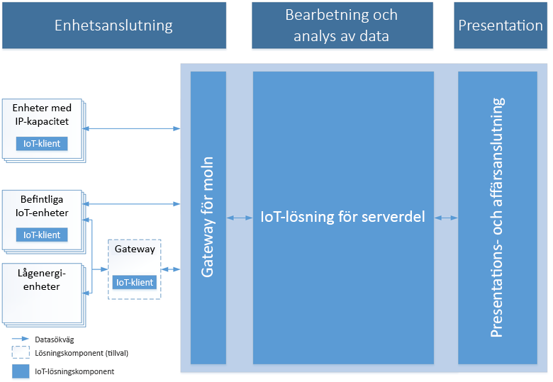

# Introduktion till Azure och Sakernas Internet

Azure IoT består av tre områden av tekniker och lösningar – lösningar, plattformstjänster och gränser; alla utformade för att underlätta utvecklingen av ditt IoT-program. Artikeln börjar med en beskrivning av de gemensamma egenskaperna för en IoT-molnlösning, följt av en översikt över hur Azure IoT löser problem i IoT-projekt och varför vi rekommenderar Azure IoT.

## IoT-lösningsarkitektur

IoT-lösningar kräver säker, dubbelriktad kommunikation mellan enheter, potentiellt miljontals, samt en serverdelslösning. En lösning kan exempelvis använda automatiserad, förutsägande analys för att få fram insikter från din enhet-till-molnet händelseström. 

I följande diagram visas nyckelelement för en typisk IoT-lösningsarkitektur. Diagrammet är oberoende av specifik implementeringsinformation, till exempel vilka Azure-tjänster som används och enhetens operativsystem. I den här lösningen samlar IoT-enheter in data som de sedan skickar till en molngateway. Molngatewayen tillhandahåller data för bearbetning av andra serverdeltjänster. Dessa serverdelstjänster kan skicka data till:

* Andra verksamhetsspecifika program.
* Mänskliga operatörer via en instrumentpanel eller annan presentationsenhet.

> [!NOTE]
> En detaljerad beskrivning av IoT-arkitekturen finns i [Microsoft Azure IoT Reference Architecture](https://aka.ms/iotrefarchitecture) (Referensarkitektur för Microsoft Azure IoT).

### Enhetsanslutning

I en IoT-lösningsarkitektur skickar enheter vanligtvis telemetri till molnet för lagring och bearbetning. Till exempel, i ett scenario med förutsägande underhåll kan lösningen för serverdelen använda sig av strömmen med sensordata för att fastställa när en specifik pump kräver underhåll. Enheter kan också ta emot och svara på meddelanden från moln till enhet genom att läsa meddelanden från en molnslutpunkt. I samma exempel kan serverdelen av lösningen skicka meddelanden till andra pumpar på pumpstationen för att börja dirigera om flöden strax innan underhållet ska påbörjas. Den här proceduren säkerställer att underhållsteknikern kan sätta igång så fort han anländer.

Att ansluta enheter säkert och tillförlitligt är ofta den största utmaningen för IoT-lösningar. Det här beror på att IoT-enheter skiljer sig från andra klienter som till exempel webbläsare och mobilappar. IoT-enheter är mer specifikt:

* Ofta inbyggda system utan mänskliga operatörer (till skillnad från en telefon).
* Kan distribueras på avlägsna platser, där fysisk åtkomst är dyr.
* Kan i vissa fall enbart nås via lösningens serverdel. Det finns inget annat sätt att interagera med enheten.
* Kan ha begränsade ström- och bearbetningsresurser.
* Kan ha oregelbunden, långsam eller dyr nätverksanslutning.
* Kan behöva använda privatägda, anpassade eller branschspecifika programprotokoll.
* Kan skapas med en stor mängd populära maskinvaru- och programvaruplattformar.

Utöver föregående restriktioner måste alla IoT-lösningar också vara skalbara, säkra och tillförlitliga.

Beroende på vilket kommunikationsprotokoll som används och nätverkstillgänglighet kan en enhet antingen kommunicera med molnet direkt eller via en mellanliggande gateway. IoT-arkitekturer har ofta en blandning av dessa två kommunikationsmönster.

### Databearbetning och analys

I moderna IoT-lösningar kan databearbetning ske i molnet eller på enheten. Bearbetning på enheten kallas *Edge computing* (Edge-databehandling). Valet av var du vill bearbeta data beror på faktorer som:

* Nätverksbegränsningar. Om bandbredden mellan enheterna och molnet är begränsad så kan det vara en anledning att utföra mer edge-bearbetning.
* Svarstid. Om det finns ett krav på att agera på en enhet i nära realtid kan det vara bättre att bearbeta svaret på själva enheten. Till exempel om en robotarm måste stoppas i ett nödfall.
* Föreskriftsmiljö. Vissa data kan inte skickas till molnet.

I allmänhet är edge-databehandling och i databehandling i molnet en kombination av följande funktioner:

* Ta emot stora mängder telemetri från dina enheter och bestämma hur telemetridata bearbetas och lagras.
* Analysera telemetri för att ge insikter, oavsett om de skickas i realtid eller i efterhand.
* Skicka kommandon från molnet eller en gateway-enhet till en specifik enhet.

Dessutom bör en serverdel för IoT-molnet tillhandahålla:

* Funktioner för enhetsregistrering för att:
    * Etablera enheter.
    * Styra vilka enheter som tillåts att ansluta till din infrastruktur.
* Enhetshantering för att kontrollera status för enheter och övervaka deras verksamhet.

I ett förutsägande underhållsscenario lagrar till exempel molnserverdelen historisk telemetridata. Lösningen använder dessa data för att identifiera potentiellt avvikande beteenden på specifika pumpar innan de orsakar verkliga problem. Med hjälp av dataanalys kan den identifiera att den förebyggande lösningen ska skicka ett kommando till enheten för att vidta en korrigerande åtgärd. Den här processen skapar en automatisk feedback-loop mellan enheten och molnet som ökar effektiviteten för lösningen dramatiskt.

### Presentation och företagsanslutningar

Slutanvändarna kan interagera med IoT-lösningen och enheterna via ett presentations- och företagsanslutningsskikt. I det här skiktet kan användare se och analysera data som samlats in från deras enheter. Vyerna kan bestå av instrumentpaneler eller BI-rapporter som kan visa både historiska data eller nästan realtidsdata. En operatör kan exempelvis kontrollera statusen för en viss pumpstation och se alla varningar som har utlösts i systemet. Här kan även IoT-lösningens serverdel integreras med befintliga branschspecifika program för att knytas samman med företagets verksamhetsprocesser eller arbetsflöden. En förutsägande underhållslösning kan till exempel integreras med ett system för schemaläggning som bokar in en ingenjör att besöka en pumpstation när en pump är i behov av underhåll.

## Varför Azure IoT?

Azure IoT förenklar IoT-projekt och löser problem till exempel med säkerhet, inkompatibilitet mellan infrastrukturer och skalning av IoT-lösningen. Här är hur:

### Flexibel

Accelerera din IoT-resa.

* Skala: börja litet och utöka till önskad storlek, var som helst och överallt – upp till miljoner enheter och terabyte av data i de flesta regioner över hela världen.

* Öppna: använd vad du har, eller modernisera för framtiden genom att ansluta till enheter, programvara och tjänster enligt behov.

* Hybrid: skapa efter behov genom att distribuera IoT-lösningen vid gränsen, i molnet eller var som helst däremellan.

* Takt: distribuera snabbare, med snabbare tid till marknad och hålls steget före konkurrenterna inom IoT-lösningar och -innovationer.

### Omfattande

Påverka marknaden.

* Fullständig: Microsoft är den enda IoT-lösningsleverantören med en fullständig plattform från enheter till moln med funktioner för stordata och analys samt hanterade tjänster.

* Lyckas med partner: utnyttja världens största partnernätverk och ta i bruk affärsprogram och nya tekniker över branschgränser runtom i världen.

* Datadriven: IoT handlar om data, och de bästa IoT-lösningarna tillhandahåller alla verktyg du behöver för att lagra, tolka, transformera, analysera och presentera data för rätt användare på rätt plats vid rätt tidpunkt.

* Enhetscentrerad: med Microsoft IoT kan du ansluta allt, från äldre utrustning till ett brett spektrum av certifierad maskinvara, med möjligheten att skapa egna enheter över såväl gränssystem som mobila och inbäddade system.

### Skydda

Lös den svåraste delen av IoT – säkerhet.

* Tillhandahåll: med Microsoft IoT samordnar du din vision med teknik, bästa praxis och funktioner för att lösa den svåraste delen av IoT – säkerhet.

* Åtgärda: skydda dina IoT-data och hantera risker med identitets-, åtkomst- och säkerhetshantering samt skydd mot hot och skydd av information.

* Sinnesro: säkerställ känslig information mellan enheter, programvara, program och molntjänster samt lokala miljöer.

* Efterlevnad: Microsoft är ledande i branschen med säkerhetskrav som uppfyller en bred uppsättning internationella och branschspecifika standarder för IoT-enheter, data och tjänster.

## Nästa steg

Utforska följande områden med tekniker och lösningar.

**Lösningar**

* [IoT-lösningsacceleratorer](/azure/iot-suite)
* [IoT Central](/azure/iot-central)

**Plattformstjänster**

* [IoT Hub](/azure/iot-hub)
* [IoT Hub Device Provisioning Service](/azure/iot-dps)
* [Azure Maps](/azure/azure-maps/)
* [Time Series Insights](/azure/time-series-insights)

**Edge**

* [Översikt över IoT Edge](/azure/iot-edge)
* [Vad är IoT Edge](/azure/how-iot-edge-works)
