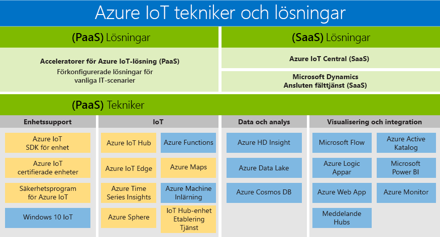

# Azure IoT-tekniker och befintliga lösningar: PaaS och SaaS

Microsoft har skapat en portfölj som har stöd för alla kunder, vilket gör att alla kan komma åt fördelarna med digital transformering. Azure IoT-produktportfölj är en översikt över tillgängliga PaaS-/SaaS-tekniker och -lösningar. Den innehåller de två sökvägarna som är tillgängliga för att skapa din egen lösning:

- PaaS (Platform as a Service): skapa ett program med hjälp av någon av följande tjänster.
    - [Acceleratorer för Azure IoT-lösning](https://www.azureiotsolutions.com/), som är en samling av förkonfigurerade lösningar i företagsklass som hjälper dig att påskynda utvecklingen av anpassade IoT-lösningar, eller 
    - [Azure Digital Twins](https://azure.microsoft.com/services/digital-twins/)-tjänsten, som gör att du kan modellera den fysiska miljön för att skapa kontextmedvetna IoT-lösningar med hjälp av en graf för rumslig intelligens och domänspecifika objektmodeller.

- Programvara som en tjänst (SaaS): Kom igång snabbt med [Azure IoT Central](https://azure.microsoft.com/services/iot-central/), den nya SaaS-lösningen för att utveckla IoT-program utan att utsättas för komplexiteten hos IoT-lösningen. Om din organisation saknar resurser för att skapa en egen IoT-lösning, är Azure IoT Central en kodlös IoT-lösning som kan skapa enhetsmodeller, instrumentpaneler och regler på några få minuter.

## Lösningar

Kom igång snabbt med lösningsacceleratorer och SaaS-erbjudanden. Välj förkonfigurerade lösningar som  möjliggör vanliga IoT-scenarier, till exempel fjärrövervakning, förutsägande underhåll och ansluten fabrik, för att skapa en helt anpassningsbar lösning. Använd Azure IoT Central, en fullständigt hanterad, komplett lösning som möjliggör kraftfulla IoT-scenarier utan att det krävs några expertkunskaper om molnlösningar.

### Azure IoT-lösningsacceleratorer (PaaS)

Azure IoT-lösningsacceleratorer är anpassningsbara PaaS-lösningar som ger en hög nivå av kontroll för din IoT-lösning. Om ditt företag implementerar IoT för anslutna åtgärder eller har specifika anpassningskrav för anslutna produkter, ger Azure IoT-lösningsacceleratorer den kontroll som du behöver. 

Organisationer med ett stort antal enheter eller enhetsmodeller och tillverkare som vill ha anslutna fabrikslösningar är exempel på företag kan dra nytta av Azure IoT-lösningsacceleratorer. Genom att skapa mycket anpassningsbara lösningar som är skräddarsydda för komplexa behov, ger IoT-lösningsacceleratorer: 

- Färdiga lösningar
    - Fjärrövervakning
    - Ansluten fabrik
    - Förebyggande underhåll
    - Enhetssimulering
- Möjligheten att distribuera på några minuter
- Snabbare avkastning på investeringen
- Lösningar som ger ultimat kontroll 
 
### Azure IoT Central (SaaS)

Azure IoT Central är en helt hanterad SaaS-lösning, där du kan komma igång snabbt med minimal IoT-upplevelse. Om ditt företag söker hastighet över anpassning, kan SaaS-modeller vara det perfekta valet för dina behov av IoT-implementering. 

Organisationer med färre enhetsmodeller, mer förutsägbara scenarier och begränsade IoT-/IT-funktioner kan nu dra nytta av IoT genom en SaaS-strategi. Företag som tidigare saknade tid, pengar och expertis för att utveckla anslutna produkter kan nu komma igång snabbt med Azure IoT Central. Microsoft är branschledande i att tillhandahålla en mogen SaaS-lösning som åtgärdar gemensamma krav på IoT-implementering. 

- Helt hanterad IoT SaaS
- Ingen kunskap om utveckling av molnlösningar krävs
- Kan konfigureras för dina behov
- Perfekt för enkla IoT-behov

### Jämför Azure IoT-lösningsacceleratorer och Azure IoT Central

För att implementera en typisk [IoT-lösningsarkitektur](/azure/iot-fundamentals/iot-introduction#iot-solution-architecture), erbjuder Azure IoT flera alternativ, [Azure IoT-lösningsacceleratorer](/azure/iot-suite) och [Azure IoT Central](https://www.microsoft.com/internet-of-things/iot-central-saas-solutions), vart och ett passar för olika uppsättningar av kundbehov.

[Azure IoT Hub](https://azure.microsoft.com/services/iot-hub/) är kärnan i Azure PaaS och används av både Azure IoT Central och Azure IoT-lösningsacceleratorer. IoT Hub möjliggör tillförlitlig och säker dubbelriktad kommunikation mellan flera miljoner IoT-enheter och är en molnlösning. IoT Hub hjälper dig att möta utmaningarna för IoT-implementering som:

* Omfattande enhetsanslutning och hantering.
* Omfattande inmatning av telemetri.
* Kontroll av enheter.
* Tillämpning av enhetssäkerhet.

Att välja Azure IoT-produkt är en viktig del av planeringen av IoT-lösningen. IoT Hub är en enskild Azure-tjänst som inte är ensamt tillhandahåller en IoT-lösning slutpunkt till slutpunkt. IoT Hub kan användas som utgångspunkt för alla slags IoT-lösningar. Du behöver inte använda Azure IoT-lösningsacceleratorer eller Azure IoT Central för att kunna använda IoT Hub. Både Azure IoT-lösningsacceleratorer och Azure IoT Central använder IoT Hub tillsammans med andra Azure-tjänster. I följande tabell sammanfattas de största skillnaderna mellan Azure IoT-lösningsacceleratorer och Azure IoT Central, så att det blir lättare för dig att välja rätt metod för dina behov:

|                        | Azure IoT-lösningsacceleratorer | Azure IoT Central |
| ---------------------- | --------- | ----------- |
| Primär användning | Om du vill påskynda utvecklingen av en anpassad IoT-lösning som behöver maximal flexibilitet. | Om du vill påskynda processen att få ut lösningen på marknaden för enkla IoT-lösningar som inte kräver mycket tjänstanpassning. |
| Åtkomst till underliggande PaaS-tjänster          | Du har åtkomst till de underliggande Azure-tjänsterna och kan hantera eller ersätta dem efter behov. | SaaS. Fullständigt hanterad lösning, de underliggande tjänsterna är inte gjorda tillgängliga. |
| Flexibilitet            | Hög. Koden för mikrotjänsterna är öppen källkod och du kan göra ändringar i den som du vill. Du kan dessutom anpassa distributionsinfrastrukturen.| Medel. Du kan använda den inbyggda webbläsarbaserade användarupplevelsen för att anpassa lösningsmodellen och delar av användargränssnittet. Infrastrukturen kan inte anpassas eftersom de olika komponenterna inte har gjorts tillgängliga.|
| Kompetensnivå                 | Mellanhög. Du behöver kunskaper i Java eller .NET för att anpassa lösningens serverdel. Du behöver kunskaper i JavaScript för att anpassa visualiseringen. | Låg. Du behöver modelleringskunskaper för att anpassa lösningen. Inga kunskaper om kodning krävs. |
| Kom igång | Lösningsacceleratorer implementerar vanliga IoT-scenarier. Kan distribueras på minuter. | Programmallar tillhandahåller förskapade modeller. Kan distribueras på minuter. |
| Prissättning                | Du kan finjustera tjänsterna för att kontrollera kostnaden. | Enkel förutsägbar prissättningsstruktur. |

Beslutet vilken produkt som ska användas för att skapa IoT-lösningen bestäms slutligen av:

* Dina affärskrav
* Typ av lösning som du vill skapa
* Din organisations kunskaper för att skapa och hantera lösningen på lång sikt

## Tekniker (PaaS)

Med den mest omfattande IoT-portföljen för plattformstjänster möjliggör Plattform-som-en-tjänst (PaaS)-tekniker som sträcker sig över Azure-plattformen att du enkelt kan skapa, anpassa och styra alla aspekter av din IoT-lösning. Upprätta en dubbelriktad kommunikation med miljarder av IoT-enheter och hantera dina IoT-enheter i större skala. Integrera sedan dina IoT-enhetsdata med andra plattformstjänster, till exempel Azure Cosmos DB och Azure Time Series Insights för att förbättra insikterna i din lösning. 

### Stöd för enheter

Känn dig säker med att komma igång med ditt IoT-projekt genom att utnyttja [Azure IoT Starter Kits](https://catalog.azureiotsuite.com/kits) (Azure IoT-startpaket) eller genom att välja från hundratals enheter som är certifierade för IoT i [enhetskatalogen](http://catalog.azureiotsuite.com/). Alla enheter är plattformsoberoende och testade för att smidigt ansluta till IoT Hub.
Anslut alla dina enheter till Azure IoT med [enhets-SDK](/azure/iot-hub/iot-hub-devguide-sdks) er med öppen källkod. SDK:erna har stöd för flera olika operativsystem som till exempel Linux och Windows, samt även realtidsoperativsystem och flera olika programmeringsspråk, till exempel [C](https://github.com/Azure/azure-iot-sdk-c), [Node.js](https://github.com/Azure/azure-iot-sdk-node), [Java](https://github.com/Azure/azure-iot-sdk-java), [.NET](https://github.com/Azure/azure-iot-sdk-csharp) och [Python](https://github.com/Azure/azure-iot-sdk-python).

### IoT 
[Azure IoT Hub](https://azure.microsoft.com/services/iot-hub/) är en helt hanterad tjänst som möjliggör tillförlitlig och säker dubbelriktad kommunikation mellan flera miljoner IoT-enheter och som tillhandahåller en serverdel för lösningar av den här typen. Azure IoT Hub Device Provisioning är en hjälptjänst för IoT Hub som möjliggör zero-touch och just-in-time-etablering till rätt IoT-hubb utan mänsklig interaktion, vilket gör att kunderna kan etablera miljontals enheter på ett säkert och skalbart sätt.

### Edge
[Azure IoT Edge](https://azure.microsoft.com/services/iot-edge/) är en IoT-tjänst. Den här tjänsten är avsedd för kunder som vill analysera data på enheter, dvs. ”vid gränsen”. Genom att flytta delar av din arbetsbelastning till gränsen, kommer du får minskad latens och ha alternativ för offline-scenarier.

### Rumslig intelligens
[Azure Digital Twins](https://azure.microsoft.com/services/digital-twins/) är en IoT-tjänst som gör att du kan skapa en modell för en fysisk miljö. Det innehåller ett diagram för rumslig intelligens för att modellera relationerna mellan människor, områdena och enheterna. Du kan skapa sammanhangsmedvetna lösningar genom att korrelera data över hela världen, digitalt och fysiskt.  

### Data och analys
Dra nytta av en matris av Azure-data och -analyser med PaaS-erbjudanden i din IoT-lösning, från att ta molnintelligens till gränsen med Azure Machine Learning till att lagra IoT-enhetsdata på ett kostnadseffektivt sätt med Azure Data Lake för att visualisera stora mängder data från IoT-enheter med [Azure Time Series Insights](https://azure.microsoft.com/services/time-series-insights/).

### Visualisering och integrering
Microsoft Azure erbjuder en komplett molnlösning som kombinerar en ständigt växande samling integrerade molntjänster med ett branschledande åtagande att leverera skydd och sekretess för dina data. Lär dig mer om [Microsoft Azure](https://azure.microsoft.com/).

## Nästa steg

Ta en titt på [Kom igång-avsnittet i IoT Hub-dokumentationen](/azure/iot-hub/iot-hub-get-started) för att använda IoT-funktioner snabbt och enkelt. Eller för en mer detaljerad praktisk erfarenhet, prova en av våra [IoT Edge-självstudier](/azure/iot-edge/tutorial-simulate-device-windows).
