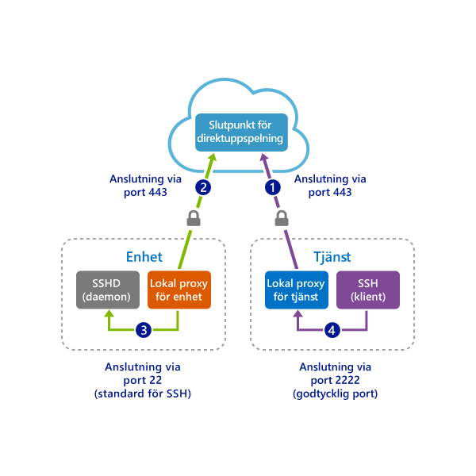

# <a name="quickstart-sshrdp-over-iot-hub-device-streams-using-c-proxy-application-preview"></a>Snabbstart: SSH/RDP över IoT Hub-enhetsströmmar med hjälp av C-proxyprogram (förhandsversion)

[!INCLUDE [iot-hub-quickstarts-4-selector](../../includes/iot-hub-quickstarts-4-selector.md)]

[IoT Hub-enhetsströmmar](./iot-hub-device-streams-overview.md) gör att tjänst- och enhetsprogram kan kommunicera på ett säkert och brandväggsvänligt sätt. En översikt över konfigurationen finns på [den här sidan](./iot-hub-device-streams-overview.md#local-proxy-sample-for-ssh-or-rdp).

I det här dokumentet beskrivs konfigurationen för att händelsedirigera SSH-trafik nedåt (genom port 22) via enhetsströmmar. Konfigurationen för RDP-trafik är liknande och kräver en enkel konfigurationsändring. Eftersom enhetsströmmar är program- och protokolloberoende kan den aktuella snabbstarten ändras (genom att kommunikationsportarna ändras) med avseende på andra typer av programtrafik.

## <a name="how-it-works"></a>Hur fungerar det?
I bilden nedan visas konfigurationen för hur de enhets- och tjänstlokala proxyprogrammen möjliggör slutpunkt till slutpunkt-anslutning mellan SSH-klient- och SSH-daemonprocesser. Under den allmänna förhandsversionen stöder C SDK endast enhetsströmmar på enhetssidan. Därför omfattar den här snabbstarten bara instruktioner för att köra enhetslokalt proxyprogram. Du bör köra ett tillhörande tjänstlokalt proxyprogram som finns tillgängligt i guiderna för [C#-snabbstart](./quickstart-device-streams-proxy-csharp.md) eller [Node.js-snabbstart](./quickstart-device-streams-proxy-nodejs.md).




1. Tjänstlokal proxy ansluter till IoT-hubben och initierar en enhetsström till målenheten.

2. Enhetslokal proxy slutför handskakningen för ströminitiering och upprättar en slutpunkt till slutpunkt-strömningstunnel via IoT-hubbens slutpunkt för direktuppspelning till tjänstsidan.

3. Enhetslokal proxy ansluter till den SSH-daemon (SSHD) som lyssnar på port 22 på enheten (detta kan konfigureras enligt beskrivningen [nedan](#run-the device-local-proxy-application)).

4. Tjänstlokal proxy väntar på nya SSH-anslutningar från användaren genom att lyssna på en avsedd port, vilket i det här fallet är port 2222 (detta kan också konfigureras enligt beskrivningen [nedan](#run-the-device-local-proxy-application)). När användaren ansluter via SSH-klient gör tunneln så att SSH-programtrafik kan överföras mellan SSH-klienten och serverprogram.

> [!NOTE]
> SSH-trafik som skickas via en enhetsström dirigeras via IoT-hubbens slutpunkt för direktuppspelning i stället för att skickas direkt mellan tjänst och enhet. Detta ger [dessa fördelar](./iot-hub-device-streams-overview.md#benefits). Bilden visar dessutom hur SSH-daemon körs på samma enhet (eller dator) som den enhetslokala proxyn. I den här snabbstarten blir det tack vare att IP-adressen för SSH-daemon tillhandahålls dessutom möjligt för enhetslokal proxy och daemon att köras på olika datorer.

[!INCLUDE [cloud-shell-try-it.md](../../includes/cloud-shell-try-it.md)]

Om du inte har en Azure-prenumeration kan du skapa ett [kostnadsfritt konto](https://azure.microsoft.com/free/?WT.mc_id=A261C142F) innan du börjar.

## <a name="prerequisites"></a>Nödvändiga komponenter

* Installera [Visual Studio 2017](https://www.visualstudio.com/vs/) med arbetsbelastningen [”Desktop development with C++”](https://www.visualstudio.com/vs/support/selecting-workloads-visual-studio-2017/) (Skrivbordsutveckling med C++) aktiverad.
* Installera den senaste versionen av [Git](https://git-scm.com/download/).

## <a name="prepare-the-development-environment"></a>Förbereda utvecklingsmiljön

För den här snabbstarten kommer du att använda [SDK för Azure IoT-enheter](iot-hub-device-sdk-c-intro.md). Du kommer att förbereda en utvecklingsmiljö som ska användas för att klona och skapa [Azure IoT C SDK](https://github.com/Azure/azure-iot-sdk-c) från GitHub. SDK:n på GitHub inkluderar den exempelkod som används i den här snabbstarten. 


1. Ladda ned version 3.11.4 av [CMake-buildsystemet](https://cmake.org/download/) från [GitHub](https://github.com/Kitware/CMake/releases/tag/v3.11.4). Kontrollera den hämta binära filen med hjälp av det motsvarande kryptografiska hashvärdet. I följande exempel används Windows PowerShell för att verifiera den kryptografisk hashen för version 3.11.4 av x64 MSI-distributionen:

    ```PowerShell
    PS C:\Downloads> $hash = get-filehash .\cmake-3.11.4-win64-x64.msi
    PS C:\Downloads> $hash.Hash -eq "56e3605b8e49cd446f3487da88fcc38cb9c3e9e99a20f5d4bd63e54b7a35f869"
    True
    ```
    
    Följande hash-värden för version 3.11.4 visades på CMake-webbplatsen när detta skrevs:

    ```
    6dab016a6b82082b8bcd0f4d1e53418d6372015dd983d29367b9153f1a376435  cmake-3.11.4-Linux-x86_64.tar.gz
    72b3b82b6d2c2f3a375c0d2799c01819df8669dc55694c8b8daaf6232e873725  cmake-3.11.4-win32-x86.msi
    56e3605b8e49cd446f3487da88fcc38cb9c3e9e99a20f5d4bd63e54b7a35f869  cmake-3.11.4-win64-x64.msi
    ```

    Det är viktigt att förutsättningarna för Visual Studio (Visual Studio och arbetsbelastningen ”Desktop development with C++” (Skrivbordsutveckling med C++)) är installerade på datorn **innan** installationen av `CMake` påbörjas. När förutsättningarna är uppfyllda och nedladdningen har verifierats installerar du CMake-byggesystemet.

2. Öppna en kommandotolk eller Git Bash-gränssnittet. Kör följande kommando för att klona [Azure IoT C SDK](https://github.com/Azure/azure-iot-sdk-c) GitHub-lagringsplatsen:
    
    ```
    git clone https://github.com/Azure/azure-iot-sdk-c.git --recursive -b public-preview
    ```
    Storleken på den här lagringsplatsen är för närvarande cirka 220 MB. Den här åtgärden kan förväntas ta flera minuter att slutföra.


3. Skapa en `cmake`-underkatalog i rotkatalogen på git-lagringsplatsen och navigera till den mappen. 

    ```
    cd azure-iot-sdk-c
    mkdir cmake
    cd cmake
    ```

4. Kör följande kommando som skapar en version av SDK:n som är specifik för din utvecklingsklientsplattform. I Windows genereras en Visual Studio-lösning för den simulerade enheten i `cmake`-katalogen. 

```
    # In Linux
    cmake ..
    make -j
```

I Windows kör du följande kommandon i kommandotolken för utvecklare för din Visual Studio 2015- eller 2017-kommandotolk:

```
    rem In Windows
    rem For VS2015
    cmake .. -G "Visual Studio 15 2015"

    rem Or for VS2017
    cmake .. -G "Visual Studio 15 2017"

    rem Then build the project
    cmake --build . -- /m /p:Configuration=Release
```
    

## <a name="create-an-iot-hub"></a>Skapa en IoT Hub

[!INCLUDE [iot-hub-include-create-hub](../../includes/iot-hub-include-create-hub-device-streams.md)]

## <a name="register-a-device"></a>Registrera en enhet

En enhet måste vara registrerad vid din IoT-hubb innan den kan ansluta. I det här avsnittet kommer du att använda Azure Cloud Shell med [IoT-tillägget](https://docs.microsoft.com/cli/azure/ext/azure-cli-iot-ext/iot?view=azure-cli-latest) för att registrera en simulerad enhet.

1. Kör följande kommandon i Azure Cloud Shell för att lägga till IoT Hub CLI-tillägget och skapa enhetens identitet. 

   **YourIoTHubName**: Ersätt platshållaren nedan med det namn du valde för din IoT-hubb.

   **MyDevice**: Det här är det namn du angav för den registrerade enheten. Använd MyDevice såsom det visas. Om du väljer ett annat namn för din enhet måste du även använda det namnet i hela artikeln, och uppdatera enhetsnamnet i exempelprogrammen innan du kör dem.

    ```azurecli-interactive
    az extension add --name azure-cli-iot-ext
    az iot hub device-identity create --hub-name YourIoTHubName --device-id MyDevice
    ```

2. Kör följande kommandon i Azure Cloud Shell för att hämta _enhetsanslutningssträngen_ för enheten du just registrerade:

   **YourIoTHubName**: Ersätt platshållaren nedan med det namn du valde för din IoT-hubb.

    ```azurecli-interactive
    az iot hub device-identity show-connection-string --hub-name YourIoTHubName --device-id MyDevice --output table
    ```

    Anteckna enhetsanslutningssträngen. Den ser ut ungefär som följande exempel:

   `HostName={YourIoTHubName}.azure-devices.net;DeviceId=MyDevice;SharedAccessKey={YourSharedAccessKey}`

    Du kommer att använda det här värdet senare i snabbstarten.


## <a name="ssh-to-a-device-via-device-streams"></a>SSH till en enhet via enhetsströmmar

### <a name="run-the-device-local-proxy-application"></a>Kör det enhetslokala proxyprogrammet

- Redigera källfilen `iothub_client/samples/iothub_client_c2d_streaming_proxy_sample/iothub_client_c2d_streaming_proxy_sample.c` och ange enhetens anslutningssträng, målenhetens IP/värdnamn samt RDP-port 22:
```C
  /* Paste in the your iothub connection string  */
  static const char* connectionString = "[Connection string of IoT Hub]";
  static const char* localHost = "[IP/Host of your target machine]"; // Address of the local server to connect to.
  static const size_t localPort = 22; // Port of the local server to connect to.
```

- Kompilera exemplet på följande sätt:

```
    # In Linux
    # Go to the sample's folder cmake/iothub_client/samples/iothub_client_c2d_streaming_proxy_sample
    make -j
```

```
    rem In Windows
    rem Go to cmake at root of repository
    cmake --build . -- /m /p:Configuration=Release
```

- Kör det kompilerade programmet på enheten:
```
    # In Linux
    # Go to sample's folder cmake/iothub_client/samples/iothub_client_c2d_streaming_proxy_sample
    ./iothub_client_c2d_streaming_proxy_sample
```

```
    rem In Windows
    rem Go to sample's release folder cmake\iothub_client\samples\iothub_client_c2d_streaming_proxy_sample\Release
    iothub_client_c2d_streaming_proxy_sample.exe
```

### <a name="run-the-service-local-proxy-application"></a>Köra tjänstlokalt proxyprogram

Enligt [ovan](#how-it-works) kräver upprättande av en slutpunkt till slutpunkt-dataström för att dirigera SSH-trafik en lokal proxy i varje ände (dvs. tjänsten och enheten). Under den allmänna förhandsversionen stöder dock IoT Hub C SDK endast enhetsströmmar på enhetssidan. För den tjänstlokala proxyn använder du de medföljande guiderna i [C#-snabbstarten](./quickstart-device-streams-proxy-csharp.md) eller [Node.js-snabbstarten](./quickstart-device-streams-proxy-nodejs.md) i stället.


### <a name="establish-an-ssh-session"></a>Upprätta en SSH-session

Förutsatt att både den enhetslokala proxyn och den tjänstlokala proxyn körs ska du nu använda SSH-klientprogrammet och ansluta till den tjänstlokala proxyn på port 2222 (i stället för direkt till SSH-daemon). 

```
ssh <username>@localhost -p 2222
```

Nu visas prompten för SSH-inloggning, där du anger dina autentiseringsuppgifter.


Konsolens utdata på den enhetslokala proxy som ansluter till SSH-daemon på `IP_address:22`: 

Konsolens utdata för SSH-klientprogrammet (SSH-klienten kommunicerar med SSH-daemon genom att ansluta till port 22 där den tjänstlokala proxyn lyssnar): 

## <a name="clean-up-resources"></a>Rensa resurser

[!INCLUDE [iot-hub-quickstarts-clean-up-resources](../../includes/iot-hub-quickstarts-clean-up-resources-device-streams.md)]

## <a name="next-steps"></a>Nästa steg

I den här snabbstarten har du konfigurerat en IoT-hubb, registrerat en enhet, distribuerat ett program med enhetslokal proxy och tjänstlokal proxy för att upprätta en enhetsström via IoT Hub samt använt proxyservrarna till att dirigera SSH-trafik.

Använd länkarna nedan om du vill läsa mer om enhetsströmmar:

> [!div class="nextstepaction"]
> [Översikt över enhetsströmmar](./iot-hub-device-streams-overview.md)
