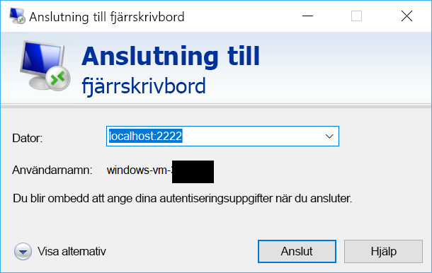

# <a name="quickstart-sshrdp-over-iot-hub-device-streams-using-c-proxy-applications-preview"></a>Snabbstart: SSH/RDP över IoT Hub-enhetsströmmar med hjälp av C#-proxyprogram (förhandsversion)

[!INCLUDE [iot-hub-quickstarts-4-selector](../../includes/iot-hub-quickstarts-4-selector.md)]

Microsoft Azure IoT Hub stöder för närvarande enheten strömmar som en [förhandsgranskningsfunktion](https://azure.microsoft.com/support/legal/preview-supplemental-terms/).

[IoT Hub-enhetsströmmar](./iot-hub-device-streams-overview.md) gör att tjänst- och enhetsprogram kan kommunicera på ett säkert och brandväggsvänligt sätt. Den här snabbstartsguiden omfattar två C#-program som gör att trafik från klient-/servertillämpningar (som SSH och RDP) kan skickas via en enhetsström som upprättas genom IoT Hub. [Här](./iot-hub-device-streams-overview.md#local-proxy-sample-for-ssh-or-rdp) finns en översikt över konfigurationen.

Först beskrivs konfiguration för SSH (via port 22). Sedan beskrivs hur du ändrar konfigurationens port för RDP. Eftersom enhetsströmmar är program- och protokolloberoende kan samma exempel ändras med avseende på andra typer av programtrafik. Detta innebär vanligtvis bara att du ändrar kommunikationsporten till den som används av det avsedda programmet.

## <a name="how-it-works"></a>Hur fungerar det?

I bilden nedan visas konfigurationen för hur de enhets- och tjänstlokala proxyprogrammen i det här exemplet möjliggör slutpunkt till slutpunkt-anslutning mellan SSH-klient och SSH-daemon. Här förutsätter vi att daemon körs på samma enhet som den enhetslokala proxyn.


1. Tjänstlokal proxy ansluter till IoT-hubben och initierar en enhetsström till målenheten via målenhetens enhets-ID.

2. Enhetslokal proxy slutför handskakningen för ströminitiering och upprättar en slutpunkt till slutpunkt-strömningstunnel via IoT-hubbens slutpunkt för direktuppspelning till tjänstsidan.

3. Enhetslokal proxy ansluter till den SSH-daemon (SSHD) som lyssnar på port 22 på enheten (porten kan konfigureras enligt beskrivningen [nedan](#run-the-device-local-proxy)).

4. Tjänstlokal proxy väntar på nya SSH-anslutningar från användaren genom att lyssna på en avsedd port, vilket i det här fallet är port 2222 (detta kan också konfigureras enligt beskrivningen [nedan](#run-the-service-local-proxy)). När användaren ansluter via SSH-klient gör tunneln så att programtrafik kan växlas mellan SSH-klienten och serverprogram.

> [!NOTE]
> SSH-trafik som skickas via en strömmen dirigeras via IoT-hubbens slutpunkt för direktuppspelning i stället för att skickas direkt mellan tjänst och enhet. Detta ger [dessa fördelar](./iot-hub-device-streams-overview.md#benefits).

[!INCLUDE [cloud-shell-try-it.md](../../includes/cloud-shell-try-it.md)]

Om du inte har en Azure-prenumeration kan du skapa ett [kostnadsfritt konto](https://azure.microsoft.com/free/?WT.mc_id=A261C142F) innan du börjar.

## <a name="prerequisites"></a>Förutsättningar

Förhandsgranskning av enheten strömmar är för närvarande stöds endast för IoT-hubbar som har skapats i följande regioner:

  - **Centrala USA**
  - **USA, centrala – EUAP**

De två exempelprogram som du kör i den här snabbstarten skrivs med C#. Du måste ha .NET Core SDK 2.1.0 eller senare på utvecklingsdatorn.

Du kan ladda ned .NET Core-SDK:n för flera plattformar från [.NET](https://www.microsoft.com/net/download/all).

Du kan kontrollera den aktuella versionen av C# på utvecklingsdatorn med följande kommando:

```
dotnet --version
```

Kör följande kommando för att lägga till Microsoft Azure IoT-tillägget för Azure CLI i Cloud Shell-instans. IOT-tillägget lägger till IoT Hub, IoT Edge och IoT Device Provisioning-tjänsten (DPS) för vissa kommandon i Azure CLI.

```azurecli-interactive
az extension add --name azure-cli-iot-ext
```

Ladda ned exempelprojektet för C# från https://github.com/Azure-Samples/azure-iot-samples-csharp/archive/master.zip och extrahera ZIP-arkivet.

## <a name="create-an-iot-hub"></a>Skapa en IoT Hub

[!INCLUDE [iot-hub-include-create-hub](../../includes/iot-hub-include-create-hub-device-streams.md)]

## <a name="register-a-device"></a>Registrera en enhet

En enhet måste vara registrerad vid din IoT-hubb innan den kan ansluta. I den här snabbstarten använder du Azure Cloud Shell till att registrera en simulerad enhet.

1. Kör följande kommando i Azure Cloud Shell för att skapa enhetens identitet.

   **YourIoTHubName**: Ersätt platshållaren nedan med det namn du valde för din IoT-hubb.

   **MyDevice**: Det här är det namn du angav för den registrerade enheten. Använd MyDevice såsom det visas. Om du väljer ett annat namn för din enhet måste du även använda det namnet i hela artikeln, och uppdatera enhetsnamnet i exempelprogrammen innan du kör dem.

    ```azurecli-interactive
    az iot hub device-identity create --hub-name YourIoTHubName --device-id MyDevice
    ```

2. Kör följande kommandon i Azure Cloud Shell för att hämta _enhetsanslutningssträngen_ för enheten du just registrerade:

   **YourIoTHubName**: Ersätt platshållaren nedan med det namn du valde för din IoT-hubb.

    ```azurecli-interactive
    az iot hub device-identity show-connection-string --hub-name YourIoTHubName --device-id MyDevice --output table
    ```

    Anteckna enhetsanslutningssträngen. Den ser ut ungefär som följande exempel:

   `HostName={YourIoTHubName}.azure-devices.net;DeviceId=MyDevice;SharedAccessKey={YourSharedAccessKey}`

    Du kommer att använda det här värdet senare i snabbstarten.

3. Du behöver även _tjänstanslutningssträngen_ från din IoT-hubb för att göra så att programmet på tjänstsidan kan ansluta till din IoT-hubb och upprätta en enhetsström. Följande kommando hämtar det här värdet för din IoT-hubb:

   **YourIoTHubName**: Ersätt platshållaren nedan med det namn du valde för din IoT-hubb.

    ```azurecli-interactive
    az iot hub show-connection-string --policy-name service --name YourIoTHubName
    ```

    Anteckna det returnerade värdet, som ser ut så här:

   `"HostName={YourIoTHubName}.azure-devices.net;SharedAccessKeyName=service;SharedAccessKey={YourSharedAccessKey}"`
    

## <a name="ssh-to-a-device-via-device-streams"></a>SSH till en enhet via enhetsströmmar

### <a name="run-the-device-local-proxy"></a>Köra den enhetslokala proxyn

Gå till `device-streams-proxy/device` i den uppackade projektmappen. Du behöver ha följande information till hands:

| Argumentnamn | Argumentvärde |
|----------------|-----------------|
| `deviceConnectionString` | Anslutningssträngen för den enhet som du skapade tidigare. |
| `targetServiceHostName` | IP-adressen som SSH-servern lyssnar på (detta är `localhost` om det är samma IP-adress där den enhetslokala proxyn körs). |
| `targetServicePort` | Den port som används av programprotokollet (som standard är det här port 22 för SSH).  |

Kompilera och kör koden på följande sätt:

```
cd ./iot-hub/Quickstarts/device-streams-proxy/device/

# Build the application
dotnet build

# Run the application
# In Linux/MacOS
dotnet run $deviceConnectionString localhost 22

# In Windows
dotnet run %deviceConnectionString% localhost 22
```

### <a name="run-the-service-local-proxy"></a>Köra den tjänstlokala proxyn

Gå till `device-streams-proxy/service` i den uppackade projektmappen. Du behöver ha följande information till hands:

| Parameternamn | Parametervärde |
|----------------|-----------------|
| `iotHubConnectionString` | Tjänstanslutningssträngen för din IoT-hubb. |
| `deviceId` | Identifieraren för den enhet som du skapade tidigare. |
| `localPortNumber` | En lokal port dit din SSH-klient ska ansluta. Vi använder port 2222 i det här exemplet, men du kan ändra detta till andra godtyckliga nummer. |

Kompilera och kör koden på följande sätt:

```
cd ./iot-hub/Quickstarts/device-streams-proxy/service/

# Build the application
dotnet build

# Run the application
# In Linux/MacOS
dotnet run $serviceConnectionString MyDevice 2222

# In Windows
dotnet run %serviceConnectionString% MyDevice 2222
```

### <a name="run-ssh-client"></a>Köra SSH-klient

Använd nu SSH-klientprogrammet och anslut till den tjänstlokala proxyn på port 2222 (i stället för direkt till SSH-daemon). 

```
ssh <username>@localhost -p 2222
```

Nu visas prompten för SSH-inloggning, där du anger dina autentiseringsuppgifter.

Konsolens utdata på tjänstsidan (den tjänstlokala proxyn lyssnar på port 2222):


Konsolens utdata på den enhetslokala proxy som ansluter till SSH-daemon på `IP_address:22`:

]Alternativ text(./media/quickstart-device-streams-proxy-csharp/device-console-output.png "")Utdata för enhetslokal proxy

Konsolens utdata för SSH-klientprogrammet (SSH-klienten kommunicerar med SSH-daemon genom att ansluta till port 22 där den tjänstlokala proxyn lyssnar):


## <a name="rdp-to-a-device-via-device-streams"></a>RDP till en enhet via enhetsströmmar

Konfigurationen för RDP liknar SSH (beskrivs ovan). I princip behöver vi använda RDP-mål-IP och port 3389 i stället och använda RDP-klienten (i stället för SSH-klienten).

### <a name="run-the-device-local-proxy-rdp"></a>Köra den enhetslokala proxyn (RDP)

Gå till `device-streams-proxy/device` i den uppackade projektmappen. Du behöver ha följande information till hands:

| Argumentnamn | Argumentvärde |
|----------------|-----------------|
| `DeviceConnectionString` | Anslutningssträngen för den enhet som du skapade tidigare. |
| `targetServiceHostName` | Värddatornamnet eller IP-adressen som RDP-servern körs på (detta är `localhost` om det är samma IP-adress där den enhetslokala proxyn körs). |
| `targetServicePort` | Den port som används av programprotokollet (som standard är det här port 3389 för RDP).  |

Kompilera och kör koden på följande sätt:

```
cd ./iot-hub/Quickstarts/device-streams-proxy/device

# Run the application
# In Linux/MacOS
dotnet run $DeviceConnectionString localhost 3389

# In Windows
dotnet run %DeviceConnectionString% localhost 3389
```

### <a name="run-the-service-local-proxy-rdp"></a>Köra den tjänstlokala proxyn (RDP)

Gå till `device-streams-proxy/service` i den uppackade projektmappen. Du behöver ha följande information till hands:

| Parameternamn | Parametervärde |
|----------------|-----------------|
| `iotHubConnectionString` | Tjänstanslutningssträngen för din IoT-hubb. |
| `deviceId` | Identifieraren för den enhet som du skapade tidigare. |
| `localPortNumber` | En lokal port dit din SSH-klient ska ansluta. Vi använder port 2222 i det här exemplet, men du kan ändra detta till andra godtyckliga nummer. |

Kompilera och kör koden på följande sätt:

```
cd ./iot-hub/Quickstarts/device-streams-proxy/service/

# Build the application
dotnet build

# Run the application
# In Linux/MacOS
dotnet run $serviceConnectionString MyDevice 2222

# In Windows
dotnet run %serviceConnectionString% MyDevice 2222
```

### <a name="run-rdp-client"></a>Köra RDP-klient

Använd RDP-klientprogrammet och anslut till den tjänstlokala proxyn på port 2222 (det här var en godtycklig tillgänglig port som du valde tidigare).



## <a name="clean-up-resources"></a>Rensa resurser

[!INCLUDE [iot-hub-quickstarts-clean-up-resources](../../includes/iot-hub-quickstarts-clean-up-resources-device-streams.md)]

## <a name="next-steps"></a>Nästa steg

I den här snabbstarten har du konfigurerat en IoT-hubb, registrerat en enhet, distribuerat ett program med enhetslokal proxy och tjänstlokal proxy för att upprätta en enhetsström via IoT Hub samt använt proxyservrarna till att dirigera SSH- eller RDP-trafik. Samma paradigm kan tillgodose andra klient/server-protokoll (där servern körs på enheten, t.ex. SSH-daemon).

Använd länkarna nedan om du vill läsa mer om enhetsströmmar:

> [!div class="nextstepaction"]
> [Strömmar enhetsöversikt](./iot-hub-device-streams-overview.md)
