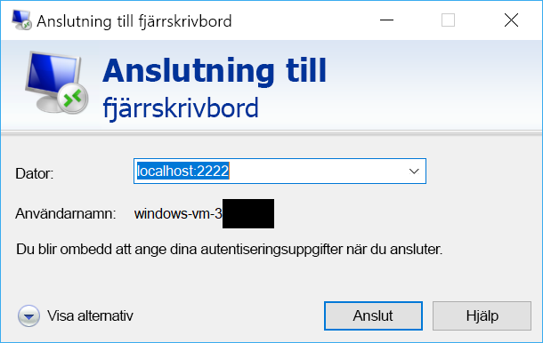

# <a name="quickstart-sshrdp-over-iot-hub-device-streams-using-nodejs-proxy-application-preview"></a>Snabbstart: SSH/RDP över IoT Hub-enhetsströmmar med hjälp av Node.js-proxyprogram (förhandsversion)

[!INCLUDE [iot-hub-quickstarts-4-selector](../../includes/iot-hub-quickstarts-4-selector.md)]

Microsoft Azure IoT Hub stöder för närvarande enheten strömmar som en [förhandsgranskningsfunktion](https://azure.microsoft.com/support/legal/preview-supplemental-terms/).

[IoT Hub-enhetsströmmar](./iot-hub-device-streams-overview.md) gör att tjänst- och enhetsprogram kan kommunicera på ett säkert och brandväggsvänligt sätt. Den här snabbstarten beskriver körningen av ett Node.js-proxyprogram som körs på tjänstsidan för att tillåta att SSH- och RDP-trafik skickas till enheten via en enhetsström. [Här](./iot-hub-device-streams-overview.md#local-proxy-sample-for-ssh-or-rdp) finns en översikt över installationen. Under den allmänna förhandsversionen stöder Node.js SDK endast enhetsströmmar på tjänstsidan. Därför innehåller den här snabbstarten endast instruktioner för att köra den tjänstlokala proxyn. Du bör köra en tillhörande enhetslokal proxy som är tillgänglig i [C-snabbstarten](./quickstart-device-streams-proxy-c.md) och [C#-snabbstarten](./quickstart-device-streams-proxy-csharp.md).

Först beskrivs konfiguration för SSH (via port 22). Sedan beskrivs hur du ändrar konfigurationen för RDP (som använder port 3389). Eftersom enhetsströmmar är program- och protokolloberoende kan samma exempel ändras att passa andra typer av ”klient/server”-programtrafik (vanligtvis genom att kommunikationsportarna ändras).

[!INCLUDE [cloud-shell-try-it.md](../../includes/cloud-shell-try-it.md)]

Om du inte har en Azure-prenumeration kan du skapa ett [kostnadsfritt konto](https://azure.microsoft.com/free/?WT.mc_id=A261C142F) innan du börjar.

## <a name="prerequisites"></a>Förutsättningar

Förhandsgranskning av enheten strömmar är för närvarande stöds endast för IoT-hubbar som har skapats i följande regioner:

  - **Centrala USA**
  - **USA, centrala – EUAP**

För att kunna köra det tjänstlokala programmet i den här snabbstarten behöver du ha Node.js v4.x.x eller senare på utvecklingsdatorn.

Du kan ladda ned Node.js för flera plattformar från [nodejs.org](https://nodejs.org).

Du kan kontrollera den aktuella versionen av Node.js på utvecklingsdatorn med följande kommando:

```
node --version
```

Kör följande kommando för att lägga till Microsoft Azure IoT-tillägget för Azure CLI i Cloud Shell-instans. IOT-tillägget lägger till IoT Hub, IoT Edge och IoT Device Provisioning-tjänsten (DPS) för vissa kommandon i Azure CLI.

```azurecli-interactive
az extension add --name azure-cli-iot-ext
```

Ladda ned Node.js-exempelprojektet från https://github.com/Azure-Samples/azure-iot-samples-node/archive/streams-preview.zip, om du inte redan har gjort det, och extrahera ZIP-arkivet.

## <a name="create-an-iot-hub"></a>Skapa en IoT Hub

Om du har slutfört föregående [Snabbstart: Skicka telemetri från en enhet till en IoT-hubb](quickstart-send-telemetry-node.md). Du kan hoppa över det här steget.

[!INCLUDE [iot-hub-include-create-hub](../../includes/iot-hub-include-create-hub-device-streams.md)]

## <a name="register-a-device"></a>Registrera en enhet

Om du har slutfört föregående [Snabbstart: Skicka telemetri från en enhet till en IoT-hubb](quickstart-send-telemetry-node.md). Du kan hoppa över det här steget.

En enhet måste vara registrerad vid din IoT-hubb innan den kan ansluta. I den här snabbstarten använder du Azure Cloud Shell till att registrera en simulerad enhet.

1. Kör följande kommando i Azure Cloud Shell för att skapa enhetens identitet.

   **YourIoTHubName**: Ersätt platshållaren nedan med det namn som du har valt för din IoT-hubb.

   **MyDevice**: Det här är det namn du angav för den registrerade enheten. Använd MyDevice såsom det visas. Om du väljer ett annat namn för din enhet måste du även använda det namnet i hela artikeln, och uppdatera enhetsnamnet i exempelprogrammen innan du kör dem.

    ```azurecli-interactive
    az iot hub device-identity create --hub-name YourIoTHubName --device-id MyDevice
    ```

2. Du måste också ha en _tjänstanslutningssträng_ för att kunna aktivera serverdelsprogrammet och ansluta till din IoT-hubb och hämta meddelanden. Följande kommando hämtar tjänstanslutningssträngen för din IoT-hubb:

    **YourIoTHubName**: Ersätt platshållaren nedan med det namn som du har valt för din IoT-hubb.

    ```azurecli-interactive
    az iot hub show-connection-string --policy-name service --name YourIoTHubName
    ```

    Anteckna det returnerade värdet, som ser ut så här:

   `"HostName={YourIoTHubName}.azure-devices.net;SharedAccessKeyName=service;SharedAccessKey={YourSharedAccessKey}"`

## <a name="ssh-to-a-device-via-device-streams"></a>SSH till en enhet via enhetsströmmar

### <a name="run-the-device-local-proxy"></a>Köra den enhetslokala proxyn

Som tidigare nämnts stöder IoT Hub Node.js SDK endast enhetsströmmar på tjänstsidan. För det enhetslokala programmet använder du de associerade enhetsproxyprogrammen som är tillgängliga i [C-snabbstarten](./quickstart-device-streams-proxy-c.md) och [C#-snabbstarten](./quickstart-device-streams-proxy-csharp.md). Se till att den enhetslokala proxyn körs innan du fortsätter till nästa steg.

### <a name="run-the-service-local-proxy"></a>Köra den tjänstlokala proxyn

Förutsatt att den [enhetslokala proxyn](#run-the-device-local-proxy) körs följer du stegen nedan för att köra den tjänstlokala proxyn som skrivits i Node.js.

- Ange autentiseringsuppgifter för tjänsten, målets enhets-ID där SSH-daemon körs samt portnumret för den proxy som körs på enheten som miljövariabler.
  ```
  # In Linux
  export IOTHUB_CONNECTION_STRING="<provide_your_service_connection_string>"
  export STREAMING_TARGET_DEVICE="MyDevice"
  export PROXY_PORT=2222

  # In Windows
  SET IOTHUB_CONNECTION_STRING=<provide_your_service_connection_string>
  SET STREAMING_TARGET_DEVICE=MyDevice
  SET PROXY_PORT=2222
  ```
  Ändra värdena ovan så att de matchar ditt enhets-ID och anslutningssträngen.

- Gå till `Quickstarts/device-streams-service` i den uppackade projektmappen och kör den tjänstlokala proxyn.
  ```
  cd azure-iot-samples-node-streams-preview/iot-hub/Quickstarts/device-streams-service

  # Install the preview service SDK, and other dependencies
  npm install azure-iothub@streams-preview
  npm install

  # Run the service-local proxy application
  node proxy.js
  ```

### <a name="ssh-to-your-device-via-device-streams"></a>SSH till din enhet via enhetsströmmar

I Linux kör du SSH med hjälp av `ssh $USER@localhost -p 2222` på en terminal. I Windows använder du valfri SSH-klient (till exempel PuTTY).

Konsolens utdata på den tjänstlokala proxyn när SSH-sessionen har upprättats (den tjänstlokala proxyn lyssnar på port 2222): 

Konsolens utdata för SSH-klientprogrammet (SSH-klienten kommunicerar med SSH-daemon genom att ansluta till port 22 där den tjänstlokala proxyn lyssnar): 

### <a name="rdp-to-your-device-via-device-streams"></a>RDP till din enhet via enhetsströmmar

Använd RDP-klientprogrammet och anslut till tjänstproxyn på port 2222 (det här var en godtycklig tillgänglig port som du valde tidigare).

> [!NOTE]
> Kontrollera att din enhetsproxy är korrekt konfigurerad för RDP och konfigurerad med RDP-port 3389.



## <a name="clean-up-resources"></a>Rensa resurser

[!INCLUDE [iot-hub-quickstarts-clean-up-resources](../../includes/iot-hub-quickstarts-clean-up-resources-device-streams.md)]

## <a name="next-steps"></a>Nästa steg

I den här snabbstarten har du konfigurerat en IoT-hubb, registrerat en enhet och distribuerat ett tjänstproxyprogram för att aktivera RDP och SSH till en IoT-enhet. RDP- och SSH-trafiken kommer att dirigeras genom en enhetsström via IoT Hub. Detta eliminerar behovet av en direktanslutning till enheten.

Använd länkarna nedan om du vill läsa mer om enhetsströmmar:

> [!div class="nextstepaction"]
> [Strömmar enhetsöversikt](./iot-hub-device-streams-overview.md)
