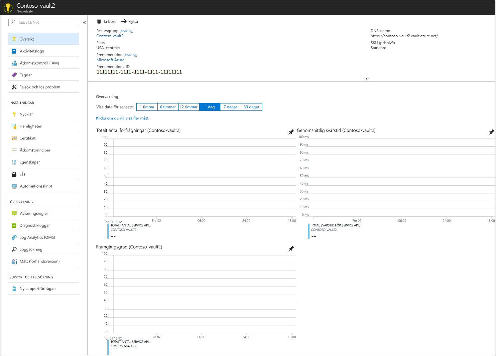

# Snabb start: skapa ett nyckel valv med hjälp av Azure Portal

Azure Key Vault är en moln tjänst som tillhandahåller en säker lagring för [nycklar](../keys/index.yml), [hemligheter](../secrets/index.yml)och [certifikat](../certificates/index.yml). Mer information om Key Vault finns i [About Azure Key Vault](overview.md); Mer information om vad som kan lagras i ett nyckel valv finns i [om nycklar, hemligheter och certifikat](about-keys-secrets-certificates.md).

Om du inte har någon Azure-prenumeration kan du skapa ett [kostnadsfritt konto](https://azure.microsoft.com/free/?WT.mc_id=A261C142F) innan du börjar.

[!INCLUDE [cloud-shell-try-it.md](../../../includes/cloud-shell-try-it.md)]

I den här snabb starten skapar du ett nyckel valv med [Azure Portal](https://portal.azure.com). 

## Logga in på Azure

Logga in på Azure Portal på https://portal.azure.com.

## Skapa ett valv

1. På Azure Portal-menyn eller på **Start** sidan väljer du **skapa en resurs**.
2. Skriv **Key Vault** i sökrutan.
3. Välj **Key Vault** i listan med resultat.
4. Välj **Skapa** i avsnittet Key Vault.
5. Ange följande information i avsnittet **Skapa nyckelvalv** avsnittet Ange följande information:
    - **Namn**: Ett unikt namn krävs. I den här snabb starten använder vi **contoso-vault2**. 
    - **Prenumeration**: Välj en prenumeration.
    - Under **resurs grupp** väljer du **Skapa ny** och anger ett resurs grupp namn.
    - Välj en plats i listrutan **Plats**.
    - Lämna standardvärdena för de andra alternativen.
6. När du har angett den här informationen väljer du **Skapa**.

Anteckna de två egenskaperna som visas nedan:

* **Valvnamn**: I det här exemplet är namnet **Contoso-vault2**. Du kommer att använda det här namnet i senare steg.
* **Valvets URI**: I det här exemplet är det https://contoso-vault2.vault.azure.net/. Program som använder ditt valv via dess REST-API måste använda denna URI.

Nu är ditt Azure-konto det enda kontot med behörighet att utföra åtgärder i det nya valvet.

## Rensa resurser

Andra snabbstarter och självstudier om Key Vault bygger på den här snabbstarten. Om du planerar att fortsätta med efterföljande snabbstarter och självstudier kan du lämna kvar de här resurserna.
När du inte behöver resursgruppen längre så tar du bort den. Då tas även nyckelvalvet och relaterade resurser bort. Så här tar du bort resursgruppen via portalen:

1. Skriv namnet på resursgruppen i rutan Sök längst upp i portalen. När du ser resursgruppen du använde i den här snabbstarten bland sökresultaten väljer du den.
2. Välj **Ta bort resursgrupp**.
3. I rutan **SKRIV RESURSGRUPPSNAMNET:** skriver du namnet på resursgruppen och väljer **Ta bort**.

## Nästa steg

I den här snabb starten skapade du en Key Vault med hjälp av Azure Portal. Om du vill veta mer om Key Vault och hur du integrerar den med dina program, Fortsätt till artiklarna nedan.

- Läs en [Översikt över Azure Key Vault](overview.md)
- Se [Azure Key Vault Developer ' s guide](developers-guide.md)
- Granska [Azure Key Vault bästa praxis](best-practices.md)
