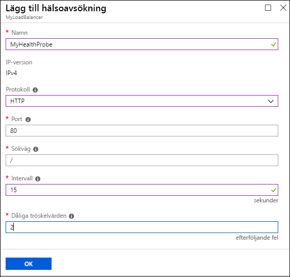
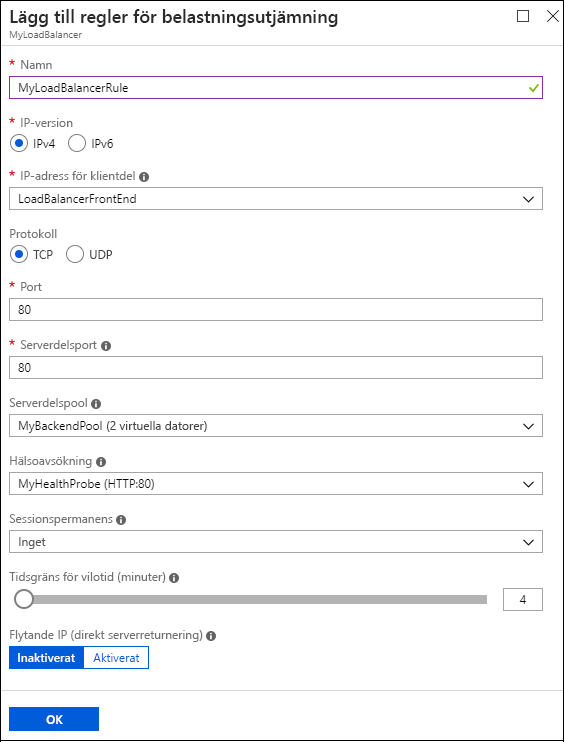

# Skapa en Internetuppkopplad belastningsutjämnare med hjälp av Azure Portal
[!INCLUDE [load-balancer-get-started-internet-arm-selectors-include.md](../../includes/load-balancer-get-started-internet-arm-selectors-include.md)]

[!INCLUDE [load-balancer-get-started-internet-intro-include.md](../../includes/load-balancer-get-started-internet-intro-include.md)]

[!INCLUDE [azure-arm-classic-important-include](../../includes/azure-arm-classic-important-include.md)]

Den här artikeln beskriver Resource Manager-distributionsmodellen. Du kan också läsa om [hur du skapar en Internetuppkopplad belastningsutjämnare med hjälp av en klassisk distribution](load-balancer-get-started-internet-classic-portal.md)

[!INCLUDE [load-balancer-get-started-internet-scenario-include.md](../../includes/load-balancer-get-started-internet-scenario-include.md)]

Artikeln beskriver de enskilda åtgärder så krävs för att skapa en belastningsutjämnare och förklarar i detalj hur målet uppnås.

## Vad krävs för att skapa en Internetuppkopplad belastningsutjämnare?
Du måste skapa och konfigurera följande objekt för att distribuera en belastningsutjämnare.

* IP-konfiguration på klientsidan – innehåller offentliga IP-adresser för inkommande nätverkstrafik.
* Backend-adresspool (serverdelspool) – innehåller nätverksgränssnitten (NIC) som de virtuella datorerna använder för att ta emot nätverkstrafik från belastningsutjämnaren.
* Belastningsutjämningsregler – innehåller regler för mappning av en offentlig port på belastningsutjämnaren till en port i backend-adresspoolen.
* NAT-regler för inkommande trafik – innehåller regler för mappning av en offentlig port i belastningsutjämnaren till en port för en specifik virtuell dator i backend-adresspoolen.
* Avsökningar – innehåller hälsoavsökningar som används för att kontrollera tillgängligheten av instanser av virtuella datorer i backend-adresspoolen.

Mer information om belastningsutjämningskomponenter för Azure Resource Manager finns i [Azure Resource Manager support for Load Balancer](load-balancer-arm.md) (Belastningsutjämningsstöd i Azure Resource Manager).

## Konfigurera en belastningsutjämnare på Azure Portal
> [!IMPORTANT]
> I det här exemplet förutsätter vi att du har ett virtuellt nätverk som heter **myVNet**. Information om hur du skapar det virtuella nätverket finns i avsnittet om hur du [skapar ett virtuellt nätverk](../virtual-network/virtual-networks-create-vnet-arm-pportal.md). Vi förutsätter också att det finns ett undernät i **myVNet** med namnet **LB-Subnet-BE** och två virtuella datorer, **web1** och **web2**, i samma tillgänglighetsuppsättning med namnet **myAvailSet** i **myVNet**. Information om hur du skapar virtuella datorer finns på [den här länken](../virtual-machines/virtual-machines-windows-hero-tutorial.md).
> 
> 

1. Öppna en webbläsare och gå till Azure Portal: [http://portal.azure.com](http://portal.azure.com). Logga in med ditt Azure-konto.
2. Längst upp till vänster på skärmen väljer du **Nytt** > **Nätverk** > **Belastningsutjämnare**.
3. På bladet **Skapa belastningsutjämnare** skriver du ett namn för belastningsutjämnaren. I vårt exempel använder vi **myLoadBalancer**.
4. Under **Typ** väljer du **Offentlig**.
5. Under **Offentlig IP-adress** skapar du en ny offentlig IP-adress med namnet **myPublicIP**.
6. Under Resursgrupp väljer du **myRG**. Välj en lämplig **plats** och klicka sedan på **OK**. Nu startar distributionen av belastningsutjämnaren. Distributionen tar några minuter att slutföra.

## Skapa en backend-adresspool
1. När belastningsutjämnaren har distribuerats väljer du den från dina resurser. Välj Serverdelspooler under Inställningar. Skriv ett namn för poolen. Klicka på knappen **Lägg till** överst på bladet som visas.
2. Klicka på **Lägg till en virtuell dator** på bladet **Lägg till serverdelspool**.  Välj **Välj en tillgänglighetsuppsättning** under **Tillgänglighetsuppsättning** och välj **myAvailSet**. Välj **Välj de virtuella datorerna** under avsnittet Virtuella datorer på bladet och klicka på **web1** och **web2**, de två virtuella datorerna som skapats för belastningsutjämning. Se till att både visas med blå markeringar till vänster, som i bilden nedan. Klicka sedan på **Välj** på bladet följt av OK på bladet **Välj virtuella datorer** och sedan på **OK** på bladet **Lägg till serverdelspool**.
   
    
3. Kontrollera att listrutan för meddelanden innehåller en uppdatering för att spara belastningsutjämnarens backend-pool samt för att uppdatera nätverksgränssnittet för de båda virtuella datorerna, **web1** och **web2**.

## Skapa en avsökning, LB-regel och NAT-regler
1. Skapa en hälsoavsökning.
   
    Välj Avsökningar under Inställningar för belastningsutjämnaren. Klicka på **Lägg till** längst upp på bladet.
   
    Du kan konfigurera en avsökning på två sätt: HTTP eller TCP. I det här exemplet använder vi HTTP, men TCP kan konfigureras på liknande sätt.
    Uppdatera nödvändig information. Som vi redan nämnt belastningsutjämnar **myLoadBalancer** trafik på port 80. Den valda sökvägen är HealthProbe.aspx, Intervall är 15 sekunder och Tröskelvärde för Ej felfri är 2. När du är klar skapar du avsökningen genom att klicka på **OK**.
   
    Hovra över ”i”-ikonen om du vill läsa mer om dessa enskilda konfigurationer och hur de kan ändras för att uppfylla dina behov.
   
    
2. Skapa en belastningsutjämningsregel.
   
    Klicka på Belastningsutjämningsregler i avsnittet Inställningar för belastningsutjämnaren. Klicka på **Lägg till** på det nya bladet. Ge regeln ett namn. Här använder vi HTTP. Välj porten på klientsidan och backend-porten. Här har vi valt 80 för båda. Välj **LB-backend** som backend-pool och den tidigare skapade **HealthProbe** som avsökning. Du kan använda andra konfigurationer beroende på dina krav. Spara belastningsutjämningsregeln genom att klicka på OK.
   
    
3. Skapa NAT-regler för inkommande trafik
   
    Klicka på Ingående NAT-regler under avsnittet Inställningar för belastningsutjämnaren. På det nya bladet klickar du på **Lägg till**. Ge NAT-regeln för inkommande trafik ett namn. Här använder vi **inboundNATrule1**. Målet ska vara den offentliga IP-adressen som vi skapade tidigare. Välj Anpassad under Tjänst och välj det protokoll som du vill använda. Här har vi valt TCP. Ange porten, 3441, och målporten, i vårt exempel 3389. Spara regeln genom att klicka på OK.
   
    När den första regeln har skapats upprepar du det här steget för den andra NAT-regeln för inkommande trafik med namnet inboundNATrule2 från port 3442 till målporten 3389.
   
    

## Ta bort en belastningsutjämnare
Om du vill ta bort en belastningsutjämnare markerar du den belastningsutjämnare som du vill ta bort. På bladet *Belastningsutjämnare* klickar du på **Ta bort** överst på bladet. Välj **Ja** när du uppmanas att göra det.

## Nästa steg
[Komma igång med att konfigurera en intern belastningsutjämnare](load-balancer-get-started-ilb-arm-cli.md)

[Konfigurera ett distributionsläge för belastningsutjämnare](load-balancer-distribution-mode.md)

[Konfigurera timeout-inställningar för inaktiv TCP för en belastningsutjämnare](load-balancer-tcp-idle-timeout.md)

<!--HONumber=Nov16_HO2-->

