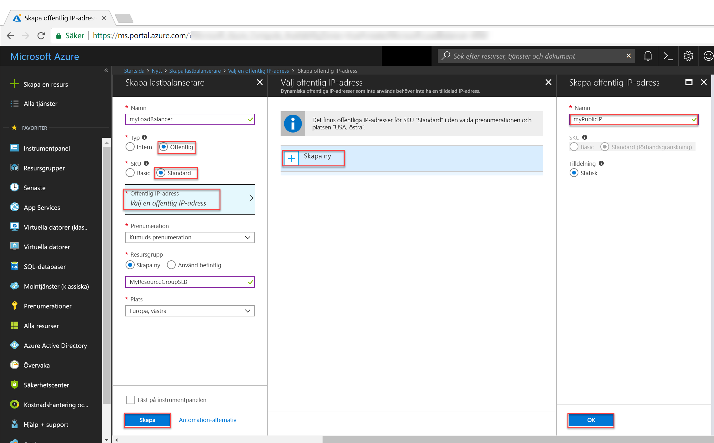

# <a name="tutorial-configure-port-fowarding-in-load-balancer-using-the-azure-portal"></a>Självstudier: Konfigurera vidarebefordrade portar med Load Balancer med Azure Portal

Med vidarebefordrade portar med hjälp av Azure Load Balancer kan du fjärransluta till virtuella datorer i det virtuella Azure-nätverket och använda Load Balancers offentliga IP-adress via portnummer. I kursen får du lära dig att konfigurera vidarebefordran av port i Azure Load Balancer och lära dig hur du:


> [!div class="checklist"]
> * skapa en Azure Load Balancer
> * skapa en hälsoavsökning för belastningsutjämnaren
> * skapa trafikregler för belastningsutjämnaren
> * Skapa virtuella datorer och installera IIS-servern
> * Koppla virtuella datorer till en belastningsutjämnare
> * Skapa inkommande NAT-regler för en belastningsutjämnare
> * Visa portvidarebefordran i praktiken


Om du inte har en Azure-prenumeration kan du skapa ett [kostnadsfritt konto](https://azure.microsoft.com/free/?WT.mc_id=A261C142F) innan du börjar. 

## <a name="log-in-to-azure"></a>Logga in på Azure

Logga in på Azure Portal på [http://portal.azure.com](http://portal.azure.com).

## <a name="create-a-standard-load-balancer"></a>Skapa en standardbelastningsutjämnare

I det här avsnittet skapar du en offentlig belastningsutjämnare som hjälper till att belastningsutjämna virtuella datorer. En standardbelastningsutjämnare stöder endast offentliga IP-standardadresser. När du skapar en standardbelastningsutjämnare, och även måste skapa en ny offentlig IP-standardadress som är konfigurerad som klientdelen (med namnet *LoadBalancerFrontend* som standard) för standardbelastningsutjämnaren. 

1. Längst upp till vänster på skärmen klickar du på **Skapa en resurs** > **Nätverk** > **Belastningsutjämnare**.
2. Ange dessa värden för belastningsutjämnaren på sidan **Skapa en belastningsutjämnare**:
    - *myLoadBalancer* – namnet på belastningsutjämnaren.
    - **Standard** – för SKU-versionen av belastningsutjämnaren.
    - **Public** – typen av belastningsutjämnaren.
    - *myPublicIP* – för den **nya** offentliga IP-adress som du skapar.
    - *myResourceGroupSLB* – namnet på den **nya** resursgrupp som du väljer för att skapa.
    - **westeurope** – för platsen.
3. Skapa belastningsutjämnaren genom att klicka på **Skapa**.


   
## <a name="create-load-balancer-resources"></a>Skapa resurser för belastningsutjämning

I det här avsnittet ska du konfigurera belastningsutjämningsinställningarna för en serverdelsadresspool och en hälsoavsökning, och ange regler för belastningsutjämnare.

### <a name="create-a-backend-address-pool"></a>Skapa en serverdelsadresspool

För att distribuera trafik till de virtuella datorerna finns en adresspool på serverdelen som innehåller IP-adresserna för de virtuella nätverkskort som är anslutna till belastningsutjämnaren. Skapa serverdelsadresspoolen *myBackendPool* så att den omfattar *VM1* och *VM2*.

1. Klicka på **Alla resurser** i den vänstra menyn och klicka sedan på **myLoadBalancer** i resurslistan.
2. Klicka på **Serverdelspooler** under **Inställningar** och klicka sedan på **Lägg till**.
3. På sidan **Lägg till en serverdelspool** anger du *myBackEndPool* som namn på din serverdelspool och klickar sedan på **OK**.

### <a name="create-a-health-probe"></a>Skapa en hälsoavsökning

Om du vill att belastningsutjämnaren ska övervaka status för din app kan du använda en hälsoavsökning. Hälsoavsökningen lägger till eller tar bort virtuella datorer dynamiskt från belastningsutjämnarens rotation baserat på deras svar på hälsokontroller. Skapa en hälsoavsökning *myHealthProbe* så att du kan övervaka de virtuella datorernas hälsotillstånd.

1. Klicka på **Alla resurser** i den vänstra menyn och klicka sedan på **myLoadBalancer** i resurslistan.
2. Klicka på **Hälsoavsökningar** under **Inställningar** och klicka sedan på **Lägg till**.
3. Använd följande värden när du skapar hälsoavsökningen:
    - *myHealthProbe* – för hälsoavsökningens namn.
    - **HTTP** – för protokolltypen.
    - *80* – för portnumret.
    - *15* – för antalet **intervall** i sekunder mellan avsökningsförsöken.
    - *2* – för antalet **tröskelvärden för ohälsosamt värde** eller antalet avsökningsfel i följd som måste inträffa innan en virtuell dator anses vara felaktig.
4. Klicka på **OK**.

   

### <a name="create-a-load-balancer-rule"></a>Skapa en belastningsutjämningsregel

En belastningsutjämningsregel används för att definiera hur trafiken ska distribueras till de virtuella datorerna. Du definierar IP-konfigurationen på klientdelen för inkommande trafik och IP-poolen på serverdelen för att ta emot trafik samt nödvändig käll- och målport. Skapa belastningsutjämningsregeln *myLoadBalancerRuleWeb* så att du kan lyssna på port 80 i klientdelen *FrontendLoadBalancer* och skicka belastningsutjämnad nätverkstrafik till serverdelsadresspoolen *myBackEndPool* som också använder port 80. 

1. Klicka på **Alla resurser** i den vänstra menyn och klicka sedan på **myLoadBalancer** i resurslistan.
2. Klicka på **Belastningsutjämningsregler** under **Inställningar** och klicka sedan på **Lägg till**.
3. Använd följande värden när du konfigurerar belastningsutjämningsregeln:
    - *myHTTPRule* – för belastningsutjämningsregelns namn.
    - **TCP** – för protokolltypen.
    - *80* – för portnumret.
    - *80* – för serverdelsporten.
    - *myBackendPool* – för serverdelspoolens namn.
    - *myHealthProbe* – för hälsoavsökningens namn.
4. Klicka på **OK**.
    
## <a name="create-backend-servers"></a>Skapa serverdelsservrar

I det här avsnittet skapar du först ett virtuellt nätverk, sedan två virtuella datorer för din belastningsutjämnares serverdelspool och installerar sedan IIS på de virtuella datorerna, vilket gör det lättare att testa portvidarebefordring belastningsutjämnaren.

### <a name="create-a-virtual-network"></a>Skapa ett virtuellt nätverk
1. Klicka på **Nytt** > **Nätverk** > **Virtuella nätverk** överst till vänster på skärmen och ange följande värden för det virtuella nätverket:
    - *myVnet* – det virtuella nätverkets namn.
    - *myResourceGroupSLB* – namnet på den befintliga resursgruppen
    - *myBackendSubnet* – för undernätsnamnet.
2. Skapa det virtuella nätverket genom att klicka på **Skapa**.

    

### <a name="create-virtual-machines"></a>Skapa virtuella datorer

1. Klicka på **Nytt** > **Beräkna** > **Windows Server 2016 Datacenter** överst till vänster på skärmen och ange följande värden för den virtuella datorn:
    - *myVM1* – för den virtuella datorns namn.        
    - *azureuser* – administratörens användarnamn.    
    - *myResourceGroupSLB* – för **Resursgrupp**väljer du **Använd befintlig**, och väljer sedan *myResourceGroupSLB*.
2. Klicka på **OK**.
3. Välj **DS1_V2** som storlek på den virtuella datorn och klicka på **Välj**.
4. Ange dessa värden för VM-inställningarna:
    -  *myVNet* – se till att detta har markerats som det virtuella nätverket.
    - *myBackendSubnet* – kontrollera att det har markerats som undernätet.
    - *myNetworkSecurityGroup* – namnet på den nya nätverkssäkerhetsgrupp (brandvägg) som du måste skapa.
5. Inaktivera startdiagnostikinställningar genom att klicka på **Inaktiverad**.
6. Klicka på **OK**, granska inställningarna på sammanfattningssidan och klicka sedan på **Skapa**.
7. Skapa, med hjälp av steg 1-6, en andra virtuell dator med namnet *VM2* med *myVnet* som dess virtuella nätverk, *myBackendSubnet* som dess undernät och **myNetworkSecurityGroup* som dess nätverkssäkerhetsgrupp. 

### <a name="create-nsg-rules"></a>Skapa nätverkssäkerhetsgruppsregler

I det här avsnittet skapar du nätverkssäkerhetsgruppsregler som tillåter att inkommande anslutningar använder HTTP och RDP.

1. Klicka på **Alla resurser** på den vänstra menyn och klicka sedan i resurslistan på **myNetworkSecurityGroup** som finns i resursgruppen **myResourceGroupSLB**.
2. Klicka på **Ingående säkerhetsregler** under **Inställningar** och klicka sedan på **Lägg till**.
3. Ange dessa värden för den ingående säkerhetsregeln *myHTTPRule* så att inkommande HTTP-anslutningar som använder port 80 tillåts:
    - *Tjänstetagg* – för **Källa**.
    - *Internet* – för **Källtjänsttagg**
    - *80* – för **målportsintervall**
    - *TCP* – för **Protokoll**
    - *Tillåt* – för **Åtgärd**
    - *100* för **Prioritet**
    - *myHTTPRule* för namn
    - *Tillåt HTTP* – för beskrivning
4. Klicka på **OK**.
 
 
5. Skapa, genom att upprepa steg 2 till 4, en annan regel med namnet *myRDPRule* som tillåter att en inkommande RDP-anslutning använder port 3389 med följande värden:
    - *Tjänstetagg* – för **Källa**.
    - *Internet* – för **Källtjänsttagg**
    - *3389* – för **målportsintervall**
    - *TCP* – för **Protokoll**
    - *Tillåt* – för **Åtgärd**
    - *200* för **Prioritet**
    - *myRDPRule* för namn
    - *Tillåt HTTP* – för beskrivning

### <a name="install-iis-on-vms"></a>Installera IIS på virtuella datorer

1. Klicka på **Alla resurser** på den vänstra menyn och klicka sedan i resurslistan på **myVM1** som finns i resursgruppen *myResourceGroupILB*.
2. Klicka på **Anslut** på sidan **Översikt** och anslut RDP till den virtuella datorn.
3. Logga in på den virtuella datorn med användarnamnet *azureuser*.
4. Navigera till **Windows Administrationsverktyg**>**Windows PowerShell** på serverdatorn.
5. I PowerShell-fönstret kör du följande kommandon för att installera IIS.servern, ta bort standardfilen iisstart.htm och lägga till en ny iisstart.htm-fil som visar namnet på den virtuella datorn:

   ```azurepowershell-interactive
    
    # install IIS server role
    Install-WindowsFeature -name Web-Server -IncludeManagementTools
    
    # remove default htm file
     remove-item  C:\inetpub\wwwroot\iisstart.htm
    
    # Add a new htm file that displays server name
     Add-Content -Path "C:\inetpub\wwwroot\iisstart.htm" -Value $("Hello World from" + $env:computername)
   ```
6. Stäng RDP-sessionen med *myVM1*.
7. Upprepa steg 1 till 6 för att installera IIS och den uppdaterade filen iisstart.htm på *myVM2*.

## <a name="add-vms-to-the-backend-address-pool"></a>Lägga till virtuella datorer i serverdelsadresspoolen

Lägg till virtuella datorer om du vill distribuera trafik till de virtuella datorerna *VM1* och *VM2* till den tidigare skapade serverdelsadresspoolen *myBackendPool*. Serverdelspoolen innehåller IP-adresserna för de virtuella nätverkskort som är anslutna till belastningsutjämnaren.

1. Klicka på **Alla resurser** i den vänstra menyn och klicka sedan på **myLoadBalancer** i resurslistan.
2. Under **Inställningar** klickar du på **serverdelspooler** och sedan **myBackendPool** i listan med serverdelspooler.
3. Gör följande på sidan **myBackendPool**:
    - Klicka på **Lägg till en målnätverks-IP-konfiguration** och lägg till varje virtuell dator (*myVM1*och *myVM2*) som du skapade till serverdelspoolen.
    - Klicka på **OK**.
4. Kontrollera att inställningen för serverdelspoolens belastningsutjämnare visar båda de virtuella datorerna **VM1** och **VM2**.

## <a name="create-inbound-nat-rules"></a>Skapa NAT-regler för inkommande trafik
Med belastningsutjämnare kan du skapa en inkommande NAT-regel för att vidarebefordra trafik för port från en viss port på en klientdel IP-adress till en specifik port för en serverdelinstans i det virtuella nätverket.

Skapa en regel för ingående NAT för att portvidarebefordra trafik från belastningsutjämngarns klientdelportar till port 3389 för de virtuella datorernas serverdel.

1. Klicka på **Alla resurser** i den vänstra menyn och klicka sedan på **myLoadBalancer** i resurslistan.
2. Under **Inställningar** klickar du på **Ingående NAT-regler** och sedan **myBackendPool** i listan med serverdelspooler.
3. I **Lägg till ingående NAT-regel** anger du följande värden:
    - För namnet på NAT-regeln skriver du *myNATRuleRDPVM1*,
    - För port, skriv *4221*.
    - För **virtuell måldator** väljer du *myVM1* från listrutan.
    - För **portmappning** klickar du på anpassad och sedan, för **målport**, anger du **3389**.
    - Klicka på **OK**.
4. Upprepa steg 2 och 3 för att skapa inkommande NAT-regler med namnet *myNATRuleRDPVM2* för de virtuella datorerna *myVM2* med klientdelsporten *4222*.

## <a name="test-the-load-balancer"></a>Testa belastningsutjämnaren
1. Hitta den offentliga IP-adressen för belastningsutjämnaren på skärmen **Översikt**. Klicka på **Alla resurser** och sedan på **myPublicIP**.

2. Kopiera den offentliga IP-adressen och klistra in den i webbläsarens adressfält. IIS-webbserverns standardsida visas i webbläsaren.

      

Om du vill se hur belastningsutjämnaren distribuerar trafik över alla tre virtuella datorer som kör din app, kan du framtvinga uppdatering av webbläsaren.

## <a name="test-port-forwarding"></a>Testportvidarebefordran
Med portvidarebefordran kan du skapa en fjärrskrivbordsanslutning till de virtuella datorerna i serverdelsadresspoolen med IP-adressen för belastningsutjämnaren och klientdelsportvärde som definierats i föregående steg.

1. Hitta den offentliga IP-adressen för belastningsutjämnaren på skärmen **Översikt**. Klicka på **Alla resurser** och sedan på **myPublicIP**.
2. Använd följande kommando för att skapa en fjärrskrivbordssession med den virtuella datorn *myVM2* från den lokala datorn. Ersätt `<publicIpAddress>` med IP-adressen som returnerades från föregående steg.

    ```
    mstsc /v:<publicIpAddress>:4222
    ```
  
3. Öppna den nedladdade RDP-filen. Välj **Anslut** om du uppmanas att göra det.

4. Ange användarnamnet och lösenordet du angav när du skapade den virtuella datorn (du kanske måste välja **Fler alternativ** och sedan **Använd ett annat konto** för att ange autentiseringsuppgifterna du angav när du skapade den virtuella datorn) och välj **OK**. Du kan få en certifikatvarning under inloggningen. Välj **Ja** för att fortsätta med anslutningen.
 
   RDP-anslutningen lyckas, enligt den inkommande NAT-regeln *myNATRuleRDPVM2*, trafik från belastningsutjämnarens klientdelsport **4222** konfigureras för att omdirigera till port 3389 för den virtuella datorn *myVM2*.

## <a name="clean-up-resources"></a>Rensa resurser

Ta bort resursgruppen, belastningsutjämnaren och alla relaterade resurser när de inte längre behövs. Gör det genom att markera den resursgrupp som innehåller belastningsutjämnaren och sedan klicka på **Ta bort**.

## <a name="next-steps"></a>Nästa steg

I den här kursen har du skapat en Standard Load Balancer, anslutit virtuella datorer till den, konfigurerat regeln för trafikbelastningsutjämning, hälsoavsökningen och sedan testat belastningsutjämnaren. Du har också tagit bort en virtuell dator från den belastningsutjämnade uppsättningen och lagt till den virtuella datorn i serverdelsadresspoolen. Om du vill läsa mer om Azure Load Balancer fortsätter du till självstudierna för Azure Load Balancer.

> [!div class="nextstepaction"]
> [Självstudier om Azure Load Balancer](tutorial-load-balancer-standard-public-zone-redundant-portal.md)
