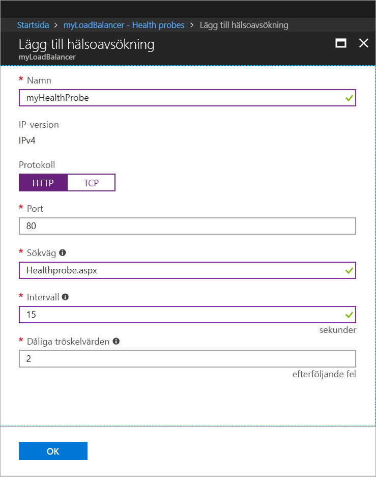

# <a name="tutorial-load-balance-internet-traffic-to-vms-using-the-azure-portal"></a>Självstudie: Belastningsutjämna internettrafik till virtuella datorer med hjälp av Azure-portalen

Med belastningsutjämning får du högre tillgänglighet och skala genom att inkommande förfrågningar sprids över flera virtuella datorer. I den här självstudien får du lära dig mer om de olika komponenterna i den Azure Standard Load Balancer som distribuerar internettrafik till virtuella datorer och ger hög tillgänglighet. Lär dig att:


> [!div class="checklist"]
> * skapa en Azure Load Balancer
> * Skapa virtuella datorer och installera IIS-servern
> * Skapa resurser för lastbalansering
> * visa en lastbalanserare i praktiken
> * lägga till och ta bort virtuella datorer från en lastbalanserare.

Om du inte har en Azure-prenumeration kan du skapa ett [kostnadsfritt konto](https://azure.microsoft.com/free/?WT.mc_id=A261C142F) innan du börjar. 

## <a name="sign-in-to-the-azure-portal"></a>Logga in på Azure Portal

Logga in på Azure Portal på [http://portal.azure.com](http://portal.azure.com).

## <a name="create-a-standard-load-balancer"></a>Skapa en Standard Load Balancer

I det här avsnittet skapar du en offentlig lastbalanserare som hjälper till att lastbalansera virtuella datorer. En Standard Load Balancer stöder endast offentliga IP-standardadresser. När du skapar en Standard Load Balancer, och även måste skapa en ny offentlig IP-standardadress som är konfigurerad som klientdelen (med namnet *LoadBalancerFrontend* som standard) för Standard Load Balancer. 

1. Längst upp till vänster på skärmen klickar du på **Skapa en resurs** > **Nätverk** > **Lastbalanserare**.
2. I **Skapa lastbalanserare** anger eller väljer du följande information, accepterar standardinställningarna för de återstående inställningarna och väljer sedan **Skapa**:
    
    | Inställning                 | Värde                                              |
    | ---                     | ---                                                |
    | Namn                   | *myLoadBalancer*                                   |
    | Typ          | Offentligt                                        |
    | SKU           | Standard                          |
    | Offentlig IP-adress | Välj **Skapa nytt** och skriv *myPublicIP* i textrutan. Standard-SKU för den offentliga IP-adressen är vald som standard. Välj **Zonredundant** för **Tillgänglighetszon**. |
    | Prenumeration               | Välj din prenumeration.    |
    |Resursgrupp | Välj **Skapa nytt** och skriv sedan *myResourceGroupSLB*.    |
    | Plats           | Välj **Västeuropa**.                          |
    


   
## <a name="create-backend-servers"></a>Skapa serverdelsservrar

I det här avsnittet skapar du först ett virtuellt nätverk, sedan tre virtuella datorer för din lastbalanserares serverdelspool och installerar sedan IIS på de virtuella datorerna, vilket gör det lättare att testa lastbalanseraren.

### <a name="create-a-virtual-network"></a>Skapa ett virtuellt nätverk
1. Längst upp till vänster på Azure Portal väljer du **Skapa en resurs** > **Nätverk** > **Virtuellt nätverk** och anger sedan följande värden för det virtuella nätverket:
    |Inställning|Värde|
    |---|---|
    |Namn|Ange *myVNet*.|
    |Prenumeration| Välj din prenumeration.|
    |Resursgrupp| Välj **Använd befintlig** och sedan *myResourceGroupSLB*.|
    |Namn på undernät| Ange *myBackendSubnet*.|
    
2. Skapa det virtuella nätverket genom att klicka på **Skapa**.

### <a name="create-virtual-machines"></a>Skapa virtuella datorer

1. Längst upp till vänster på Azure Portal väljer du **Skapa en resurs** > **Beräkna** > **Windows Server 2016 Datacenter** och anger följande värden för den virtuella datorn:
    1. Ange *myVM1* som namn på den virtuella datorn.        
    2. Välj **Använd befintlig** för **Resursgrupp** och välj sedan *myResourceGroupSLB*.
2. Klicka på **OK**.
3. Välj **DS1_V2** som storlek på den virtuella datorn och klicka på **Välj**.
4. Ange dessa värden för VM-inställningarna:
    1. Kontrollera att *myVNet* är valt som det virtuella nätverket och att *myBackendSubnet* är valt som undernätet.
    2. Välj **Standard** för **Offentlig IP-adress** i rutan **Skapa offentlig IP-adress** och välj sedan **OK**.
    3. Välj **Avancerat** för **Nätverkssäkerhetsgrupp** och gör sedan följande:
        1. Välj *Nätverkssäkerhetsgrupp (brandvägg) och välj **Skapa ny** på sidan **Välj nätverkssäkerhetsgrupp**. 
        2. I rutan **Namn** på sidan **Välj nätverkssäkerhetsgrupp** anger du *myNetworkSecurityGroup* som namn på den nya nätverkssäkerhetsgruppen och väljer sedan **OK**.
5. Inaktivera startdiagnostikinställningar genom att klicka på **Inaktiverad**.
6. Klicka på **OK**, granska inställningarna på sammanfattningssidan och klicka sedan på **Skapa**.
7. Följ steg 1 till och med 6 och skapa ytterligare två virtuella datorer med namnen *VM2* och *VM3* med det virtuella nätverket *myVnet*, undernätet *myBackendSubnet* och nätverkssäkerhetsgruppen *myNetworkSecurityGroup*. 

### <a name="create-network-security-group-rule"></a>Skapa en regel för nätverkssäkerhetsgruppen

I det här avsnittet skapar du en NSG-regel (nätverkssäkerhetsgrupp) som tillåter inkommande anslutningar via HTTP.

1. Klicka på **Alla resurser** på den vänstra menyn och klicka sedan i resurslistan på **myNetworkSecurityGroup** som finns i resursgruppen **myResourceGroupSLB**.
2. Klicka på **Ingående säkerhetsregler** under **Inställningar** och klicka sedan på **Lägg till**.
3. Ange dessa värden för den ingående säkerhetsregeln *myHTTPRule* så att inkommande HTTP-anslutningar som använder port 80 tillåts:
    - *Tjänstetagg* – för **Källa**.
    - *Internet* – för **Källtjänsttagg**
    - *80* – för **målportsintervall**
    - *TCP* – för **Protokoll**
    - *Tillåt* – för **Åtgärd**
    - *100* för **Prioritet**
    - *myHTTPRule* för namn
    - *Tillåt HTTP* – för beskrivning
4. Välj **Lägg till**.

### <a name="install-iis-on-vms"></a>Installera IIS på virtuella datorer

1. Klicka på **Alla resurser** i den vänstra menyn och från resurslistan klickar du sedan på **myVM1** som finns i resursgruppen *myResourceGroupILB*.
2. Klicka på **Anslut** på sidan **Översikt** och anslut RDP till den virtuella datorn.
3. I popup-fönstret **Anslut till virtuell dator** väljer du **Hämta RDP-fil** och öppnar sedan den nedladdade RDP-filen.
4. Klicka på **Anslut** i fönstret **Anslutning till fjärrskrivbord**.
5. Logga in på den virtuella datorn med de autentiseringsuppgifter som du angav när du skapade den virtuella datorn. När du gör det startar en fjärrskrivbordssession med den virtuella datorn *myVM1*.
6. Navigera till **Windows Administrationsverktyg**>**Windows PowerShell** på serverdatorn.
7. I PowerShell-fönstret kör du följande kommandon för att installera IIS.servern, ta bort standardfilen iisstart.htm och lägga till en ny iisstart.htm-fil som visar namnet på den virtuella datorn:

   ```azurepowershell-interactive
    
    # install IIS server role
    Install-WindowsFeature -name Web-Server -IncludeManagementTools
    
    # remove default htm file
     remove-item  C:\inetpub\wwwroot\iisstart.htm
    
    # Add a new htm file that displays server name
     Add-Content -Path "C:\inetpub\wwwroot\iisstart.htm" -Value $("Hello World from " + $env:computername)
   ```
6. Stäng RDP-sessionen med *myVM1*.
7. Upprepa steg 1 till 6 för att installera IIS och den uppdaterade filen iisstart.htm på *myVM2* och *myVM3*.

## <a name="create-load-balancer-resources"></a>Skapa resurser för lastbalansering

I det här avsnittet konfigurerar du inställningarna för lastbalanseraren för en serverdelsadresspool och en hälsoavsökning, och anger en regel för lastbalanseraren.

### <a name="create-a-backend-address-pool"></a>Skapa en serverdelsadresspool

För att distribuera trafik till de virtuella datorerna finns en adresspool på serverdelen som innehåller IP-adresserna för de virtuella nätverkskort som är anslutna till lastbalanseraren. Skapa serverdelsadresspoolen *myBackendPool* så att den omfattar *VM1* och *VM2*.

1. Klicka på **Alla resurser** i den vänstra menyn och klicka sedan på **myLoadBalancer** i resurslistan.
2. Klicka på **Serverdelspooler** under **Inställningar** och klicka sedan på **Lägg till**.
3. Gör följande på sidan **Lägg till en serverdelspool**:
   - Ange *myBackendPool* som namn på serverdelspoolen.
   - Välj *myVNet* för **Virtuellt nätverk**.
   - Lägg till *myVM1*, *myVM2* och *my VM3* under **Virtuell dator** tillsammans med deras respektive IP-adresser och välj sedan **Lägg till**.
4. Kontrollera att inställningen för lastbalanserarens serverdelspool visar alla virtuella datorer (*myVM1*, *myVM2* och *myVM3*) och klicka sedan på **OK**.

### <a name="create-a-health-probe"></a>Skapa en hälsoavsökning

Om du vill att lastbalanseraren ska övervaka status för din app kan du använda en hälsoavsökning. Hälsoavsökningen lägger till eller tar bort virtuella datorer dynamiskt från lastbalanserarens rotation baserat på deras svar på hälsokontroller. Skapa en hälsoavsökning *myHealthProbe* så att du kan övervaka de virtuella datorernas hälsotillstånd.

1. Klicka på **Alla resurser** i den vänstra menyn och klicka sedan på **myLoadBalancer** i resurslistan.
2. Klicka på **Hälsoavsökningar** under **Inställningar** och klicka sedan på **Lägg till**.
3. Använd följande värden när du skapar hälsoavsökningen:
    - *myHealthProbe* – för hälsoavsökningens namn.
    - **HTTP** – för protokolltypen.
    - *80* – för portnumret.
    - *15* – för antalet **intervall** i sekunder mellan avsökningsförsöken.
    - *2* – för antalet **tröskelvärden för ohälsosamt värde** eller antalet avsökningsfel i följd som måste inträffa innan en virtuell dator anses vara felaktig.
4. Klicka på **OK**.

   

### <a name="create-a-load-balancer-rule"></a>Skapa en lastbalanseringsregel

En lastbalanseringsregel används för att definiera hur trafiken ska distribueras till de virtuella datorerna. Du definierar IP-konfigurationen på klientdelen för inkommande trafik och IP-poolen på serverdelen för att ta emot trafik samt nödvändig käll- och målport. Skapa lastbalanseringsregeln *myLoadBalancerRuleWeb* så att du kan lyssna på port 80 i klientdelen *FrontendLoadBalancer* och skicka lastbalanserad nätverkstrafik till serverdelsadresspoolen *myBackEndPool* som också använder port 80. 

1. Klicka på **Alla resurser** i den vänstra menyn och klicka sedan på **myLoadBalancer** i resurslistan.
2. Klicka på **Belastningsutjämningsregler** under **Inställningar** och klicka sedan på **Lägg till**.
3. Använd följande värden när du konfigurerar belastningsutjämningsregeln:
    - *myHTTPRule* – för belastningsutjämningsregelns namn.
    - **TCP** – för protokolltypen.
    - *80* – för portnumret.
    - *80* – för serverdelsporten.
    - *myBackendPool* – för serverdelspoolens namn.
    - *myHealthProbe* – för hälsoavsökningens namn.
4. Klicka på **OK**.

## <a name="test-the-load-balancer"></a>Testa lastbalanseraren
1. Hitta den offentliga IP-adressen för lastbalanseraren på skärmen **Översikt**. Klicka på **Alla resurser** och sedan på **myPublicIP**.

2. Kopiera den offentliga IP-adressen och klistra in den i webbläsarens adressfält. IIS-webbserverns standardsida visas i webbläsaren.

      

Om du vill se hur lastbalanseraren distribuerar trafik över alla tre virtuella datorer som kör din app, kan du framtvinga uppdatering av webbläsaren.

## <a name="remove-or-add-vms-from-the-backend-pool"></a>Ta bort eller lägg till virtuella datorer från serverdelspoolen
Du kan behöva utföra underhåll på de virtuella datorerna som kör appen, till exempel installera uppdateringar av operativsystemet. För att klara ökad trafik till din app kan du behöva lägga till fler virtuella datorer. I det här avsnittet visas hur du tar bort eller lägger till en virtuell dator från lastbalanseraren.

1. Klicka på **Alla resurser** i den vänstra menyn och klicka sedan på **myLoadBalancer** i resurslistan.
2. Under **Inställningar** klickar du på **serverdelspooler** och sedan i listan med serverdelspoolerna, klickar du på **myBackendPool**.
3. På sidan **myBackendPool** under **IP-konfigurationer för målnätverk** tar du bort *VM1* från serverdelen genom att klicka på ikonen Ta bort bredvid **Virtuell dator:myVM1**

När *myVM1* inte längre är i serverdelens adresspool, kan du utföra alla underhållsaktiviteter på *myVM1*, till exempel installera programuppdateringar. När nu *VM1** saknas, är lasten nu balanserad över *myVM2* och *myVM3*. 

Om du vill lägga tillbaka *myVM1* till serverdelspoolen, följer du proceduren i avsnittet *Lägg till virtuella datorer till serverdelspoolen* i den här artikeln.

## <a name="clean-up-resources"></a>Rensa resurser

Ta bort resursgruppen, lastbalanseraren och alla relaterade resurser när de inte längre behövs. Gör det genom att markera den resursgrupp som innehåller lastbalanseraren och sedan klicka på **Ta bort**.

## <a name="next-steps"></a>Nästa steg

I den här kursen har du skapat en Standard Load Balancer, anslutit virtuella datorer till den, konfigurerat regeln för trafiklastbalansering, hälsoavsökningen och sedan testat lastbalanseraren. Du har också tagit bort en virtuell dator från den belastningsutjämnade uppsättningen och lagt tillbaka den till serverdelsadresspoolen. Om du vill läsa mer om Azure Load Balancer fortsätter du till självstudierna för Azure Load Balancer.

> [!div class="nextstepaction"]
> [Självstudier om Azure Load Balancer](tutorial-load-balancer-standard-public-zone-redundant-portal.md)
