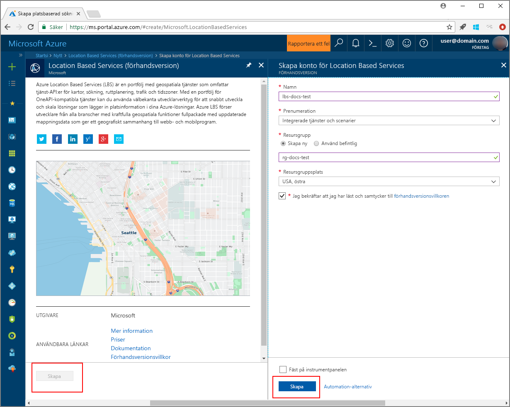
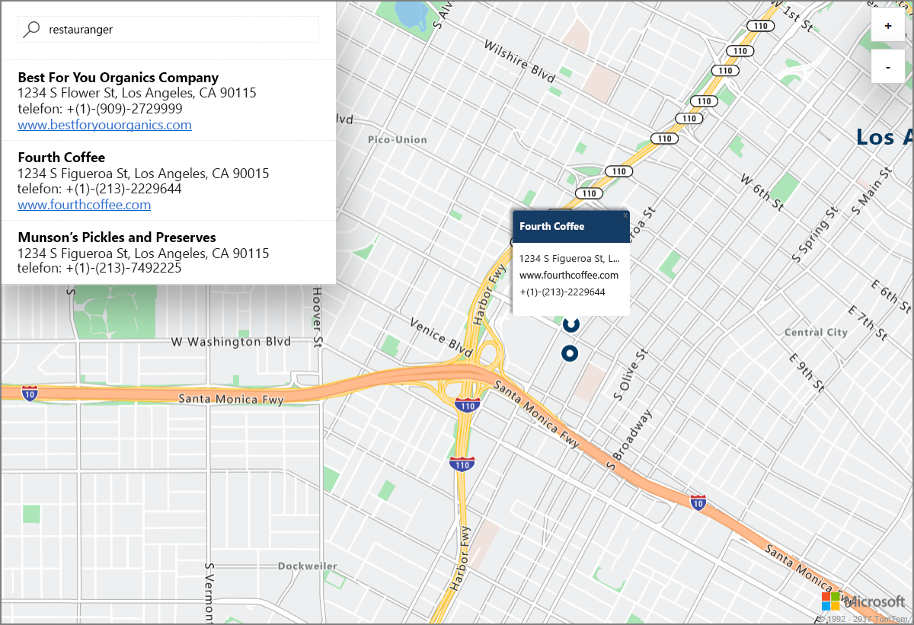

# Starta en interaktiv kartsökning som demonstration med Azure Location Based Services (förhandsversion)

Den här artikeln visar funktionerna i Azure Location Based Services (förhandsversion) eller det kortare LBS, i en interaktiv sökning med hjälp av Azure Maps. Här beskrivs också de grundläggande stegen för att skapa ditt eget LBS-konto och hur du får kontots nyckeln att använda i webbappen i demonstrationen. 

Om du inte har en Azure-prenumeration kan du skapa ett [kostnadsfritt konto](https://azure.microsoft.com/free/?WT.mc_id=A261C142F) innan du börjar.

## Logga in på Azure Portal

Logga in på [Azure-portalen](https://portal.azure.com/).

## Skapa ett Location Based Services-konto och hämta kontonyckeln

1. Klicka på **Skapa en resurs** längst upp till vänster i [Azure Portal](https://portal.azure.com).
2. Skriv **location based services** i rutan *Search the Marketplace* (sök på marketplace).
3. Klicka på **Location Based Services (förhandsversion)** i *Resultat*. Klicka på knappen **Skapa** som visas nedanför kartan. 
4. På sidan **Skapa Location Based Services-konto** anger du *Namn* för ditt nya konto, väljer vilken *Prenumeration* som ska användas och anger namnet på en ny eller befintlig  *Resursgrupp*. Välj plats för resursgruppen, acceptera *Förhandsversionsvillkoren* och klicka på **skapa**.

    

5. Öppna kontot när det har skapats och navigera till kontots **INSTÄLLNINGAR**. Klicka på **Nycklar** för att hämta primära och sekundära prenumerationsnycklar för ditt konto. Kopiera värdet för **Primär nyckel** till din lokala Urklipp för användning i följande avsnitt. 

## Ladda ned demonstrationsprogrammet för Azure Maps

1. Ladda ned eller kopiera innehållet i filen [interactiveSearch.html](https://github.com/Azure-Samples/location-based-services-samples/blob/master/src/interactiveSearch.html).
2. Spara innehållet i filen lokalt som **AzureMapDemo.html** och öppna den i ett textredigeringsprogram.
3. Sök efter strängen **&#60;insert-key&#62;** och ersätt den med värdet för **Primär nyckel** som hämtades i föregående avsnitt. 

## Starta demonstrationsprogrammet för Azure Maps

1. Öppna filen **AzureMapDemo.html** i en webbläsare.
2. Observera att kartan visar staden Los Angeles. Staden bestäms av värdet för `[longitude, latitude]`-paret som anges för JavaScript-variabeln med namnet **center** i *AzureMapDemo.html*. Du kan ändra dessa koordinater till en annan stad. Koordinaterna för New York City är till exempel *[-74.0060, 40.7128]*.
3. Ange eventuell platstyp eller en adress som du vill söka efter i sökrutan i det övre vänstra hörnet av demonstrationswebbappen. 
4. Flytta musen över listan med adresser/platser som visas under sökrutan och observera hur motsvarande nål på kartan visar information om den platsen. Till exempel får vi följande om vi startar webbappen och söker efter *restaurants*. Observera att för skydda privata företag visas fiktiva namn och adresser här. 

    

## Rensa resurser

Självstudierna visar i detalj hur du använder och konfigurerar Azure Location Based Services för ditt konto. Om du planerar att fortsätta arbeta med självstudierna ska du inte rensa upp resurserna som du skapade i den här snabbstarten. Om du inte planerar att fortsätta kan du använda stegen nedan för att ta bort alla resurser som har skapats i den här snabbstarten.

1. Stäng webbläsaren där webbappen **AzureMapDemo.html** körs.
2. Klicka på **Alla resurser** på menyn till vänster på Azure Portal och välj sedan ditt LBS-konto. Klicka på **Ta bort** överst på bladet **Alla resurser**.

## Nästa steg

I den här snabbstarten har du skapat ett Azure LBS-konto och startat en demonstrationsapp med ditt konto. Om du vill lära dig hur du skapar egna program med API:erna för Azure Location Based Services kan du fortsätta med nästa självstudie.

> [!div class="nextstepaction"]
> [Självstudiekurs om att använda Azure Map och Search](./tutorial-search-location.md)
