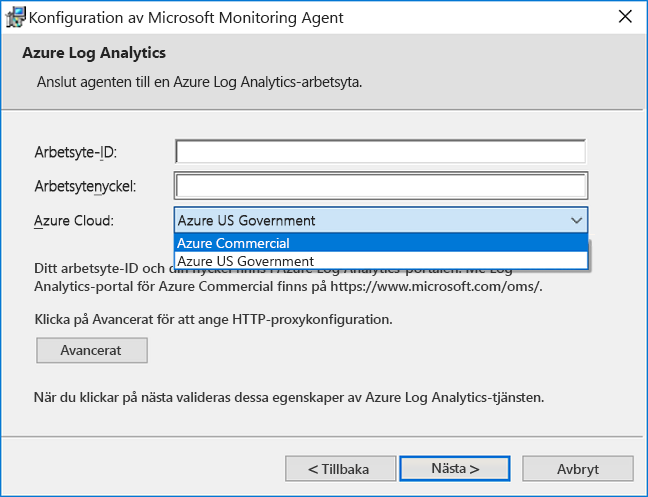
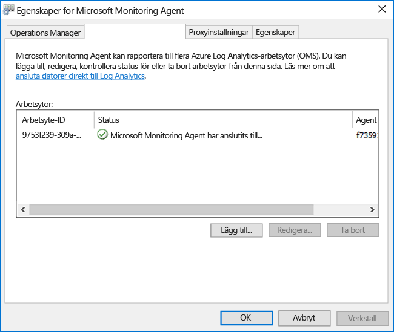

# <a name="connect-windows-computers-to-the-log-analytics-service-in-azure"></a>Ansluta Windows-datorer till Log Analytics-tjänsten i Azure

För att övervaka och hantera virtuella datorer eller fysiska datorer i ditt lokala datacenter eller andra molnmiljö med logganalys, måste du distribuera Microsoft Monitoring Agent (MMA) och konfigurera den för att rapportera till en eller flera logganalys arbetsytor.  Agenten stöder också Hybrid Runbook Worker-rollen för Azure Automation.  

Agenten har listats som tjänsten Microsoft Monitoring Agent på en övervakad Windows-dator. Microsoft Monitoring Agent-tjänsten samlar in händelser från loggfiler och Windows-händelseloggen, prestandadata och andra telemetri. Även om agenten kan inte kommunicera med tjänsten logganalys den rapporterar till agenten fortsätter att köras och köer insamlade data på disken för den övervakade datorn. När anslutningen återupprättas skickar insamlade data till tjänsten Microsoft Monitoring Agent-tjänsten.

Agenten kan installeras på något av följande metoder. De flesta installationer använda en kombination av dessa metoder för att installera olika uppsättningar av datorer, efter behov.  Information om hur du använder varje metod finns senare i artikeln.

* Manuell installation. Installationsprogrammet körs manuellt på datorn med hjälp av guiden Konfigurera från kommandoraden eller distribueras med en befintlig distribution programverktyg.
* Azure Automation Desired State Configuration (DSC). Använda DSC i Azure Automation med ett skript för Windows-datorer som redan har distribuerats i din miljö.  
* PowerShell-skript.
* Resource Manager-mall för virtuella datorer som kör Windows på plats i Azure-stacken.  

För att förstå kraven för Nätverks- och distribuera Windows-agenten ska granska [krav för Windows-datorer](log-analytics-concept-hybrid.md#prerequisites).

## <a name="obtain-workspace-id-and-key"></a>Hämta arbetsytans ID och nyckel
Innan du installerar Microsoft Monitoring Agent för Windows behöver du arbetsytans ID och nyckel för Log Analytics-arbetsytan.  Den här informationen krävs under installationen från olika installationsmetoderna konfigurera agenten och se till att den kan kommunicera med logganalys i Azure kommersiella och som tillhör amerikanska myndigheter moln korrekt.  

1. I Azure-portalen klickar du på **alla tjänster**. I listan över resurser skriver du **Log Analytics**. När du börjar skriva filtreras listan baserat på det du skriver. Välj **Log Analytics**.
2. Välj arbetsytan som du tänker på Konfigurera agenten rapporterar till i din lista över logganalys arbetsytor.
3. Välj **Avancerade inställningar**.<br><br> <br><br>  
4. Välj **Anslutna källor** och välj sedan **Windows-servrar**.   
5. Kopiera och klistra in i din favorit redigeraren i **arbetsyte-ID** och **primärnyckel**.    
   
## <a name="install-the-agent-using-setup-wizard"></a>Installera agenten med installationsguiden
Följande steg installera och konfigurera agenten för Log Analytics i Azure och Azure Government moln med hjälp av installationsguiden för Microsoft Monitoring Agent på datorn.  

1. I arbetsytan loggen Analyics från den **Windows-servrar** sidan som du har navigerat tidigare, markera lämpliga **ladda ned Windows Agent** versionen för att hämta beroende på processorarkitektur Windows-operativsystemet.   
2. Kör installationsprogrammet för att installera agenten på datorn.
2. På sidan **Välkommen** klickar du på **Nästa**.
3. På sidan **Licensvillkor** läser du licensen och klickar sedan på **Jag accepterar**.
4. På sidan **Målmapp** ändrar du eller behåller standardinstallationsmappen och klickar sedan på **Nästa**.
5. På sidan **Installationsalternativ för agent** väljer du att ansluta agenten till Azure Log Analytics (OMS) och klickar sedan på **Nästa**.   
6. På sidan **Azure Log Analytics** gör du följande:
   1. Klistra in **Id för arbetsyta** och **Arbetsytenyckel (primär nyckel)** som du kopierade tidigare.  Om datorn ska rapportera till en Log Analytics-arbetsyta i Azure Government-molnet väljer du **Azure US Government** i listrutan **Azure Cloud**.  
   2. Om datorn behöver kommunicera via en proxyserver till Log Analytics-tjänsten klickar du på **Avancerat** och anger URL och portnummer för proxyservern.  Om proxyservern kräver autentisering anger du användarnamn och lösenord för att autentisera hos proxyservern och klickar sedan på **Nästa**.  
7. Klicka på **Nästa** när du har gjort de konfigurationsinställningar som krävs.<br><br> <br><br>
8. På sidan **Klar att installera** kontrollerar du valen och klickar sedan på **Installera**.
9. På sidan **Konfigurationen har slutförts** klickar du på **Slutför**.

När du är klar visas **Microsoft Monitoring Agent** i **Kontrollpanelen**. För att bekräfta att den rapporterar till logganalys, granska [verifiera agenten anslutning till logganalys](#verify-agent-connectivity-to-log-analytics). 

## <a name="install-the-agent-using-the-command-line"></a>Installera agenten med hjälp av kommandoraden
Den hämta filen för agenten är ett fristående installationsprogram som skapats med IExpress.  Installationsprogrammet för agenten och stödfilerna finns i paketet och behöver extraheras för att kunna installera med hjälp av kommandoraden som visas i följande exempel.    

>[!NOTE]
>Om du vill uppgradera en agent måste du använda logganalys scripting-API. Finns i avsnittet [hantera och underhålla logganalys-agenten för Windows och Linux](log-analytics-agent-manage.md) för ytterligare information.

Följande tabell visar specifika logganalys parametrar som stöds av installationsprogrammet för agenten, inklusive när de distribueras med hjälp av Automation DSC.

|MMA-specifika alternativ                   |Anteckningar         |
|---------------------------------------|--------------|
|ADD_OPINSIGHTS_WORKSPACE               | 1 = konfigurera agenten ska rapportera till en arbetsyta                |
|OPINSIGHTS_WORKSPACE_ID                | Arbetsyte-Id (guid) för arbetsytan att lägga till                    |
|OPINSIGHTS_WORKSPACE_KEY               | Arbetsytenyckel som används för att först autentisera med arbetsytan |
|OPINSIGHTS_WORKSPACE_AZURE_CLOUD_TYPE  | Ange molnmiljön där arbetsytan finns <br> 0 = kommersiella azuremolnet (standard) <br> 1 = azure Government |
|OPINSIGHTS_PROXY_URL               | URI för proxy som ska användas |
|OPINSIGHTS_PROXY_USERNAME               | Användarnamn för att komma åt en autentiserad proxyserver |
|OPINSIGHTS_PROXY_PASSWORD               | Lösenord för åtkomst till en autentiserad proxyserver |

1. Extrahera installationsfilerna för agent från en upphöjd kommandotolk kör `extract MMASetup-<platform>.exe` och blir du ombedd för sökvägen till filerna ska extraheras.  Du kan också ange sökvägen genom att skicka argumenten `extract MMASetup-<platform>.exe /c:<Path> /t:<Path>`.  Mer information om kommandoradsverktyget switchar som stöds av IExpress finns [kommandoradsväxlar för IExpress](https://support.microsoft.com/help/197147/command-line-switches-for-iexpress-software-update-packages) och uppdatera sedan exempel så att de passar dina behov.
2. Om du vill installera agenten och konfigurera den för att rapportera till en arbetsyta i Azure kommersiella molntjänster från mappen tyst extraherade installationsfilerna till typen: 
   
     ```dos
    setup.exe /qn NOAPM=1 ADD_OPINSIGHTS_WORKSPACE=1 OPINSIGHTS_WORKSPACE_AZURE_CLOUD_TYPE=0 OPINSIGHTS_WORKSPACE_ID=<your workspace id> OPINSIGHTS_WORKSPACE_KEY=<your workspace key> AcceptEndUserLicenseAgreement=1
    ```

   eller om du vill konfigurera agenten ska rapportera till Azure som tillhör amerikanska myndigheter molnet, skriv: 

     ```dos
    setup.exe /qn NOAPM=1 ADD_OPINSIGHTS_WORKSPACE=1 OPINSIGHTS_WORKSPACE_AZURE_CLOUD_TYPE=1 OPINSIGHTS_WORKSPACE_ID=<your workspace id> OPINSIGHTS_WORKSPACE_KEY=<your workspace key> AcceptEndUserLicenseAgreement=1
    ```

## <a name="install-the-agent-using-dsc-in-azure-automation"></a>Installera agenten i Azure Automation DSC

Du kan använda följande exempel på skript för att installera agenten med hjälp av Azure Automation DSC.   Om du inte har ett Automation-konto, se [Kom igång med Azure Automation](../automation/automation-offering-get-started.md) att förstå kraven och steg för att skapa ett Automation-konto krävs innan du använder Automation DSC.  Om du inte är bekant med Automation DSC kan du granska [komma igång med Automation DSC](../automation/automation-dsc-getting-started.md).

I följande exempel installeras på 64-bitars agent som identifieras av den `URI` värde. Du kan också använda 32-bitars version genom att ersätta URI-värdet. URI: er för båda versionerna är:

- Windows 64-bitars agent - https://go.microsoft.com/fwlink/?LinkId=828603
- Windows 32-bitars agent - https://go.microsoft.com/fwlink/?LinkId=828604


>[!NOTE]
>Den här proceduren och skript exempel stöder inte uppgradera agenten redan har distribuerats till en Windows-dator.

32-bitars och 64-bitars versioner av paketet agent har olika koder och nya versioner släpps också ha ett unikt värde.  Den här koden är ett GUID som är den primära identifieringen av ett program eller en produkt och representeras av Windows Installer **ProductCode** egenskapen.  Den `ProductId value` i den **MMAgent.ps1** skriptet måste matcha den här koden från 32-bitars eller 64-bitars agent installer-paketet.

Om du vill hämta den här koden från installera agenten direkt, kan du använda Orca.exe från den [Windows SDK-komponenterna för Windows Installer-utvecklare](https://msdn.microsoft.com/library/windows/desktop/aa370834%27v=vs.85%28.aspx) som är en del av Windows Software Development Kit eller med hjälp av Följande PowerShell en [exempelskriptet](http://www.scconfigmgr.com/2014/08/22/how-to-get-msi-file-information-with-powershell/) skrivs av en Microsoft Valuable Professional (MVP).

1. Importera xPSDesiredStateConfiguration DSC-modul från [http://www.powershellgallery.com/packages/xPSDesiredStateConfiguration](http://www.powershellgallery.com/packages/xPSDesiredStateConfiguration) i Azure Automation.  
2.  Skapa en variabel Azure Automation-tillgångar för *OPSINSIGHTS_WS_ID* och *OPSINSIGHTS_WS_KEY*. Ange *OPSINSIGHTS_WS_ID* till logganalys arbetsyte-ID och ange *OPSINSIGHTS_WS_KEY* till den primära nyckeln för arbetsytan.
3.  Kopiera skriptet och spara den som MMAgent.ps1

    ```PowerShell
    Configuration MMAgent
    {
        $OIPackageLocalPath = "C:\Deploy\MMASetup-AMD64.exe"
        $OPSINSIGHTS_WS_ID = Get-AutomationVariable -Name "OPSINSIGHTS_WS_ID"
        $OPSINSIGHTS_WS_KEY = Get-AutomationVariable -Name "OPSINSIGHTS_WS_KEY"

        Import-DscResource -ModuleName xPSDesiredStateConfiguration
        Import-DscResource –ModuleName PSDesiredStateConfiguration

        Node OMSnode {
            Service OIService
            {
                Name = "HealthService"
                State = "Running"
                DependsOn = "[Package]OI"
            }

            xRemoteFile OIPackage {
                Uri = "https://go.microsoft.com/fwlink/?LinkId=828603"
                DestinationPath = $OIPackageLocalPath
            }

            Package OI {
                Ensure = "Present"
                Path  = $OIPackageLocalPath
                Name = "Microsoft Monitoring Agent"
                ProductId = "8A7F2C51-4C7D-4BFD-9014-91D11F24AAE2"
                Arguments = '/C:"setup.exe /qn NOAPM=1 ADD_OPINSIGHTS_WORKSPACE=1 OPINSIGHTS_WORKSPACE_ID=' + $OPSINSIGHTS_WS_ID + ' OPINSIGHTS_WORKSPACE_KEY=' + $OPSINSIGHTS_WS_KEY + ' AcceptEndUserLicenseAgreement=1"'
                DependsOn = "[xRemoteFile]OIPackage"
            }
        }
    }

    ```

4. [Importera konfigurationsskript MMAgent.ps1](../automation/automation-dsc-getting-started.md#importing-a-configuration-into-azure-automation) till ditt Automation-konto. 
5. [Tilldela en Windows-dator eller en nod](../automation/automation-dsc-getting-started.md#onboarding-an-azure-vm-for-management-with-azure-automation-dsc) i konfigurationen. Noden kontrollerar konfigurationen inom 15 minuter och agenten skickas till noden.

## <a name="verify-agent-connectivity-to-log-analytics"></a>Verifiera agenten anslutning till logganalys

När installationen av agenten har slutförts, verifiera att den är ansluten och rapportering kan du göra på två sätt.  

Från datorn i **Kontrollpanelen**, söka efter artikeln **Microsoft Monitoring Agent**.  Markera den och på den **Azure logganalys (OMS)** fliken agenten ska visa ett meddelande om: **i Microsoft Monitoring Agent har lyckats ansluta till tjänsten Microsoft Operations Management Suite.**<br><br> 

Du kan också utföra en enkel logg sökning i Azure-portalen.  

1. I Azure-portalen klickar du på **alla tjänster**. I listan över resurser skriver du **Log Analytics**. När du börjar skriva filtreras listan baserat på det du skriver. Välj **Log Analytics**.  
2. På sidan logganalys-arbetsytan väljer målarbetsytan och välj sedan den **loggen Sök** panelen. 
2. I fönstret loggen Sök i fälttypen fråga:  

    ```
    search * 
    | where Type == "Heartbeat" 
    | where Category == "Direct Agent" 
    | where TimeGenerated > ago(30m)  
    ```

Du bör se heartbeat-posterna för den dator som du anger den är ansluten och rapporterar till tjänsten i sökresultaten returneras.   

## <a name="next-steps"></a>Nästa steg

Granska [hantera och underhålla logganalys-agenten för Windows och Linux](log-analytics-agent-manage.md) att lära dig hur du hanterar agenten under dess distributionslivscykel på dina datorer.  