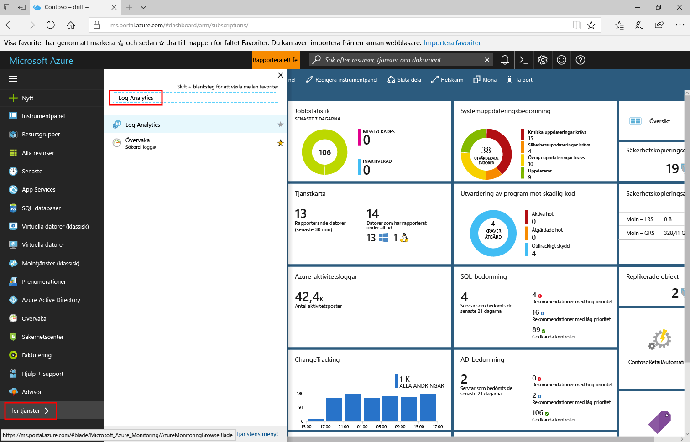

# Hantera kostnader genom att kontrollera datavolym och kvarhållning i logganalys
Log Analytics utformats för att skala och stöd för att samla in, indexering och lagra stora mängder data per dag från alla datakällor i företaget eller distribueras i Azure.  Detta kan vara en primär drivrutin för din organisation är kostnadseffektiviteten slutligen den underliggande drivrutinen. Det är också beroende av den valda planen därför det är viktigt att förstå att kostnaden för en logg Analytisc arbetsyta inte är bara baserat på mängden data som samlas in, och hur länge du väljer att lagra data som genereras av dina anslutna källor.  

I den här artikeln vi går igenom hur du proaktivt övervaka datatillväxt för volymen och lagring, och definiera gränser för att styra de relaterade kostnaderna. 

Kostnaden för att data kan vara betydande beroende på följande faktorer: 

- Antal system, infrastruktur, molnresurser, etc. som du samlar in från 
- Typ av data som skapats av källa, till exempel meddelandeköer, loggar, händelser, säkerhetsrelaterade data eller prestandamått 
- Mängden data som genereras av dessa källor och inhämtas till arbetsytan 
- Period data finns kvar på arbetsytan  
- Antal hanteringslösningar aktiverad, datakällan och frekvens för samlingen 

Finns i dokumentationen för varje lösning eftersom det ger dig en uppfattning av hur mycket data som samlas in.   

Om du är i ”kostnadsfria”-prisnivån begränsas data till 7 dagar kvarhållning. Data som samlas in är tillgänglig under de senaste 31 dagarna för ”Per GB (fristående)” eller ”Per nod (OMS)” nivåer och kvarhållning kan du öka upp till 2 år. Avgifter kan tillkomma om du väljer en längre period. Fria abonnemang har 500 MB dagliga införandet gränsen och om du hittar du konsekvent överskrider de belopp som tillåts volym, kan du ändra ditt arbetsområde Per GB eller Per nod nivåer för att samla in data utöver den här gränsen. Du kan ändra Plantyp av när som helst och mer information om priser, se [prisinformationen](https://azure.microsoft.com/pricing/details/log-analytics/). 

> [!NOTE]
> I April 2018 vi [introduceras](https://azure.microsoft.com/en-us/blog/introducing-a-new-way-to-purchase-azure-monitoring-services/) en ny prissättningsmodell för övervakning av Azure. Den här modellen antar en enkel ”betalning per användning” modell över komplett portfölj av övervaka tjänster. Lär dig mer om den [nya Prismodell](https://docs.microsoft.com/en-us/azure/monitoring-and-diagnostics/monitoring-usage-and-estimated-costs), hur till [utvärdera effekten av att flytta till den här modellen](https://docs.microsoft.com/en-us/azure/monitoring-and-diagnostics/monitoring-usage-and-estimated-costs#assessing-the-impact-of-the-new-pricing-model) baserat på ditt användningsmönster och [så att använda den nya modellen](https://docs.microsoft.com/en-us/azure/monitoring-and-diagnostics/monitoring-usage-and-estimated-costs#moving-to-the-new-pricing-model). 

Oavsett prisnivå modell eller nivå är hantera volymen av data fundmental att styra dina kostnader. Dessa är dagliga fästpunkten och lagring av data utöver valet och konfigurering av specifika lösningen i logganalys som det finns två sätt mängden data kan vara begränsad och att styra dina kostnader.  

## Granska uppskattade kostnaden
Log Analytics gör det enkelt att förstå vad kostnaderna kan vara baserad på senaste användningsmönster.  Utför följande steg om du vill göra detta.  

1. Logga in på [Azure-portalen](http://portal.azure.com). 
2. Klicka på **Alla tjänster** på Azure Portal. I listan över resurser skriver du **Log Analytics**. När du börjar skriva filtreras listan baserat på det du skriver. Välj **Log Analytics**.       
3. Välj din arbetsyta i fönstret logganalys prenumerationer och klicka sedan på **användning och de uppskattade kostnaderna** i den vänstra rutan.    

Du kan granska din datavolym månadens härifrån. Detta omfattar alla data tas emot och lagras i logganalys-arbetsytan.  Klicka på **användningsinformation** från överkanten på sidan för att visa instrumentpanelen för användning med information om datatrender av källa, datorer och erbjudande. Klicka på att visa och ange en daglig fjärrskrivbordsanslutning eller ändra kvarhållningsperioden **volym datahantering**.
 
Log Analytics avgifter läggs till fakturan Azure. Du kan se information om din Azure debiterar under avsnittet faktureringen av Azure-portalen eller i den [Azure Billing Portal](https://account.windowsazure.com/Subscriptions).  

## Dagliga linjeslut
När du skapar en logganalys-arbetsytan från Azure portal och du väljer den *lediga* plan, är den inställd på 500 MB per dag gränsen. Det finns ingen gräns för de prisnivå planerna. Du kan konfigurera en daglig kapacitet och begränsa dagliga införandet för din arbetsyta men försiktig som inte bör målet vara att träffa den dagliga gränsen.  Annars då förlorar du data för resten av dagen och möjligheten att se hälsa villkoren för resurser som stödjer IT-tjänster påverkas.  Dagliga fästpunkten är avsedd att användas som ett sätt att hantera den oväntade mängden data från dina hanterade resurser och hålla sig inom gränsen, eller när du vill begränsa bara oplanerad avgifter för din arbetsyta.  

När den dagliga gränsen har uppnåtts, stoppar insamling av fakturerbar datatyper för resten av dagen.  En varning banderoll visas överst på sidan för den valda logganalys-arbetsytan och en åtgärden händelse skickas till den *åtgärden* tabell **LogManagement** kategori. Insamling av data återupptar när återställningstiden definierats *dagliga gränsen anges till*. Vi rekommenderar att du definierar en aviseringsregel baserat på den här åtgärden händelsen som konfigurerats för att meddela när den dagliga data gränsen har nåtts. 

### Identifiera vilka data dagsgränsen definiera 
Granska [Log Analytics användning och de uppskattade kostnaderna](log-analytics-usage.md) att förstå data införandet trend och vad som är daglig volym fästpunkten definiera. Det bör ses med försiktighet, eftersom du inte kommer att kunna övervaka dina resurser när gränsen har nåtts. 

### Hantera maximala dagliga datavolym 
Följande steg beskriver hur du konfigurerar en gräns för att hantera mängden data som logganalys kommer att mata in per dag.  

1. Från arbetsytan, Välj **användning och de uppskattade kostnaderna** i den vänstra rutan.
2. På den **användning och de uppskattade kostnaderna** för den valda arbetsytan, klickar du på **volym datahantering** från sidans överkant. 
5. Dagliga fästpunkten är **OFF** som standard – klickar du på **ON** att aktivera den och ange sedan begränsningen för volymen i GB/dag.   

### Avisering om gränsen
Medan vi presentera tydligt i Azure-portalen när dina data gränsen tröskeln uppfylls överensstämmer inte nödvändigtvis problemet med hur du hanterar operativa problem som kräver omedelbara åtgärder.  För att ta emot en avisering kan du skapa en ny avisering regel i Azure-Monitor.  Läs mer i [så att skapa, visa och hantera aviseringar](../monitoring-and-diagnostics/monitor-alerts-unified-usage.md).      

Här följer de rekommenderade inställningarna för aviseringen för att komma igång:

* Mål: Välj logganalys-resurs
* Villkor: 
   * Signal name: anpassad logg sökning
   * Sökfråga: åtgärden | där detalj har 'OverQuota'
   * Baserat på: antalet resultat
   * Villkor: Större än
   * Tröskelvärde: 0
   * Period: 5 (minuter)
   * Frekvens: 5 (minuter)
* Varningsregelns namn: dagliga data har nåtts
* Allvarlighetsgrad: Varning (b 1)

När aviseringen definieras och gränsen har nåtts, en varning utlöses och utför svaret som definierats i gruppen åtgärd. Det kan meddela din teamet via e-post och textmeddelanden eller automatisera åtgärder med hjälp av webhooks, Automation-runbooks eller [integrera med en extern ITSM lösning](log-analytics-itsmc-overview.md#create-itsm-work-items-from-azure-alerts). 

## Ändra Datalagringsperiod 
Följande steg beskriver hur du konfigurerar hur länge logga data bevaras av på arbetsytan.
 
1. Från arbetsytan, Välj **användning och de uppskattade kostnaderna** i den vänstra rutan.
2. På den **användning och de uppskattade kostnaderna** klickar du på **volym datahantering** från sidans överkant.
5. Flytta skjutreglaget för att öka eller minska antalet dagar och klicka i rutan **OK**.  Om du är på den *ledigt* nivån du kommer inte att kunna ändra kvarhållningsperioden för data och du måste uppgradera till betald nivån för att styra den här inställningen.   

## Felsökning
**Fråga**: Hur felsöker om logganalys inte längre att samla in data? 
**Svaret**: Om du på den kostnadsfria prisnivån och har skickat mer än 500 MB data under en dag, stoppar datainsamling för resten av dagen. Når den dagliga gränsen är en vanlig orsak till att logganalys slutar att samla in data eller data verkar saknas.  
Log Analytics skapar en händelse av typen igen när datainsamlingen startar och stoppar.  
Kör följande fråga i sökning för att kontrollera om du når den dagliga gränsen och data som saknas: åtgärden | där OperationCategory == ”Datainsamlingsstatus'   
När datainsamlingen stoppar varning OperationStatus. När datainsamlingen startar lyckades OperationStatus.  
I följande tabell beskrivs skäl som datainsamling stoppar och en rekommenderad åtgärd för att återuppta datainsamling:  

|Stoppar orsak samling| Lösning| 
|-----------------------|---------|
|Dagliga gränsen för ledigt data uppnåtts1|Vänta förrän följande dag för samling ska startas automatiskt eller ändra till en betald prisnivå.|
|Dagliga du definierat i volym datahantering gränsen|Vänta förrän följande dag för samling ska startas automatiskt eller öka den dagliga data Volymgränsen som beskrivs i [hantera maximala dagliga datavolym](#manage-the-maximum-daily-volume)|
|Azure-prenumeration är i ett pausat tillstånd på grund av:  Kostnadsfri utvärderingsversion avslutades  Azure-pass upphört att gälla  Varje månad utgiftsgräns uppnåtts (till exempel på en MSDN- eller Visual Studio-prenumeration)|Konvertera till en betald prenumeration  Ta bort gränsen eller vänta tills gränsen återställs|

1 om arbetsytan finns på den kostnadsfria prisnivån, du är begränsad till att skicka 500 MB data per dag till tjänsten. När du når den dagliga gränsen slutar datainsamlingen förrän följande dag. Data som skickas när datainsamling har stoppats är inte indexerat och är inte tillgängligt för sökning. När datainsamlingen återställs sker bearbetning endast för nya skickade data. 

Log Analytics använder UTC-tid. Återställningstiden varierar mellan arbetsytor att förhindra alla begränsat arbetsytor start mata in data på samma gång. Om arbetsytan når den dagliga gränsen, bearbetning återupptas när återställningstiden som definierats i **dagliga gränsen anges till**.   

**Fråga**: hur kan jag få meddelanden när datainsamling stoppar? 
**Svaret**: Använd stegen som beskrivs i *skapa dagliga data cap* aviseringen ska meddelas när datainsamling stoppar och följ stegen använder stegen som beskrivs i Lägg till åtgärder för att Varningsregler konfigurera ett e-post, webhook eller runbook åtgärden för regeln. 

## Nästa steg  

Information om hur mycket data som samlas in, vilka källor skickar och olika typer av data som skickas för att hantera förbrukning och kostnaden finns [analysera dataanvändning av i logganalys](log-analytics-usage.md).