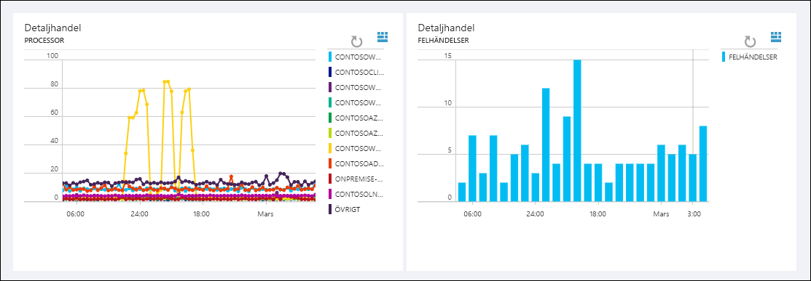

# Vad är Log Analytics?
Log Analytics är en tjänst i [Operations Management Suite\(OMS\)](../operations-management-suite/operations-management-suite-overview.md) som hjälper dig att övervaka molnet och lokala miljöer för att bibehålla tillgänglighet och prestanda.  Den samlar in data som genereras av resurser i dina miljöer i molnet och lokalt och från andra övervakningsverktyg för att tillhandahålla analyser över flera källor.  Den här artikeln innehåller en kort beskrivning av värdet som Log Analytics tillhandahåller, en översikt över hur det fungerar och länkar till mer detaljerat innehåll så att du kan fördjupa dig.

## Är Log Analytics rätt val för dig?
Om du inte har någon aktuell övervakning för Azure-miljön ska du börja med [Azure Monitor](../monitoring-and-diagnostics/monitoring-overview.md) som samlar in och analyserar övervakningsdata för dina Azure-resurser.  Log Analytics kan [samla in data från Azure Monitor](log-analytics-azure-storage.md) för att jämföra dem med andra data och ge ytterligare analys.

Om du vill övervaka din lokala miljö, eller om du har befintlig övervakning med hjälp av tjänster som Azure Monitor eller System Center Operations Manager, kan Log Analytics lägga till betydande värde.  Den kan samla in data direkt från dina agenter och från de andra verktygen till en databas.  Analysverktygen i Log Analytics som loggsökningar, vyer och lösningar fungerar mot alla insamlade data och ger en centraliserad analys av hela miljön.

## Använda Log Analytics
Du kommer åt Log Analytics via OMS-portalen eller Azure Portal som kan köras i alla webbläsare och ger åtkomst till konfigurationsinställningar och flera olika verktyg för att analysera och agera utifrån insamlade data.  Från portalen kan du utnyttja [loggsökningar](log-analytics-log-searches.md) där du skapar förfrågningar för att analysera insamlad data, [instrumentpaneler](log-analytics-dashboards.md) som du kan anpassa med grafiska vyer över dina mest värdefulla sökningar och [lösningar](log-analytics-add-solutions.md) som ger ytterligare funktioner och analysverktyg.

Bilden nedan är från OMS-portalen och visar instrumentpanelen som innehåller översiktsinformation om de [lösningar](#add-functionality-with-management-solutions) som är installerade på arbetsytan.  Du kan klicka på valfri ikon om du vill gå djupare in data för den här lösningen.

Log Analytics tillhandahåller en frågesyntax för att snabbt hämta och konsolidera data i databasen.  Du kan skapa och spara [Loggsökningar](log-analytics-log-searches.md) för att direkt analysera data i portalen eller köra loggsökningar automatiskt för att skapa en avisering om resultatet av frågan indikerar ett viktigt villkor.

För att få en snabb grafisk vy över hälsotillståndet för hela din miljö kan du lägga till visualiseringar för sparade loggsökningar på [instrumentpanelen](log-analytics-dashboards.md).   

För att analysera data utanför Log Analytics kan du exportera data från OMS-databasen till verktyg som [Power BI](log-analytics-powerbi.md) eller Excel.  Du kan också använda [Loggsöknings-API](log-analytics-log-search-api.md) för att skapa anpassade lösningar som utnyttjar Log Analytics-data eller för att integrera med andra system.

## Lägga till funktioner med hanteringslösningar
[Hanteringslösningar](log-analytics-add-solutions.md) lägger till funktioner i OMS, tillhandahåller ytterligare data och analysverktyg i Log Analytics.  De kan också definiera nya typer av poster som ska samlas in och analyseras med loggsökningar eller via ytterligare användargränssnitt som tillhandahålls i lösningen på instrumentpanelen.  På bilden nedan visas [Ändra spårningslösning](log-analytics-change-tracking.md)

Lösningar är tillgängliga för en mängd funktioner och ytterligare lösningar läggs till hela tiden.  Du kan enkelt bläddra bland tillgängliga lösningar och [lägga till dem på din OMS-arbetsyta](log-analytics-add-solutions.md) från lösningsgalleriet eller Azure Marketplace.  Många distribueras automatiskt och börjar fungera direkt, medan andra kan kräva en viss konfiguration.

## Komponenter i Log Analytics
I centrum av Log Analytics finns OMS-databasen som ligger i Azure-molnet.  Data samlas i databasen från anslutna källor genom att konfigurera datakällor och lägga till lösningar i din prenumeration.  Alla datakällor och lösningar skapar olika typer av poster som har en egen uppsättning egenskaper, men de kan fortfarande analyseras tillsammans i förfrågningar till databasen.  Det gör att du kan använda samma verktyg och metoder för att arbeta med olika typer av data som samlats från olika källor.

Anslutna datakällor är de datorer och andra resurser som genererar data som samlas in av Log Analytics.  Detta kan omfatta agenter som installerats på [Windows](log-analytics-windows-agents.md)- och [Linux](log-analytics-linux-agents.md)-datorer som ansluter direkt, eller agenter i en [ansluten System Center Operations Manager-hanteringsgrupp](log-analytics-om-agents.md).  För Azure-resurser samlar Log Analytics in data från [Azure Monitor och Azure Diagnostics](log-analytics-azure-storage.md).

[Datakällor](log-analytics-data-sources.md) är olika typer av data som samlas in från varje anslutna källa.  Detta innefattar [händelser](log-analytics-data-sources-windows-events.md) och [prestandadata](log-analytics-data-sources-performance-counters.md) från [Windows](log-analytics-data-sources-windows-events.md)- och Linux-agenter förutom källor som [IIS-loggar](log-analytics-data-sources-iis-logs.md) och [anpassade textloggar](log-analytics-data-sources-custom-logs.md).  Du kan konfigurera varje datakälla som du vill samla in och konfigurationen skickas automatiskt till varje ansluten källa.

Om du har anpassade krav kan du använda [HTTP Data Collector API](log-analytics-data-collector-api.md) för att skriva data till databasen från en REST API-klient.

## Log Analytics-arkitekturen
Kraven för en distribution av Log Analytics är minimala eftersom de centrala komponenterna finns i Azure-molnet.  Detta inkluderar databasen utöver de tjänster som gör att du kan kombinera och analysera insamlad data.  Portalen kan nås från valfri webbläsare, så det finns inga krav på klientprogramvaran.

Du måste installera agenter på [Windows](log-analytics-windows-agents.md)- och [Linux](log-analytics-linux-agents.md)-datorer, men det krävs ingen ytterligare agent för datorer som redan tillhör en [ansluten SCOM-hanteringsgrupp](log-analytics-om-agents.md).  SCOM-agenter fortsätter att kommunicera med hanteringsservrar som vidarebefordrar sina data till Log Analytics.  Vissa lösningar kräver dock agenter som kommunicerar direkt med Log Analytics.  Dokumentationen för varje lösning specificerar kommunikationskraven.

När du [registrerar dig för Log Analytics](log-analytics-get-started.md) skapar du en OMS-arbetsyta.  Du kan betrakta arbetsytan som en unik Log Analytics-miljö med en egen databas och egna datakällor och lösningar. Du kan skapa flera arbetsytor i din prenumeration för att stödja flera miljöer, till exempel för produktion och test.

## Nästa steg
* [Registrera dig för ett kostnadsfritt Log Analytics-konto](log-analytics-get-started.md) för att testa i din egen miljö.
* Visa de olika [datakällor](log-analytics-data-sources.md) som finns tillgängliga för att samla data till OMS-databasen.
* [Bläddra bland tillgängliga lösningar i lösningsgalleriet](log-analytics-add-solutions.md) för att lägga till funktioner i Log Analytics.

