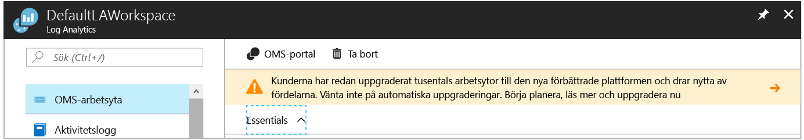

# Samla in data om virtuella datorer i Azure
[Azure logganalys](log-analytics-overview.md) kan samla in data direkt från din virtuella Azure-datorer och andra resurser i din miljö till en databas för detaljerad analys och korrelation.  Den här snabbstarten visar hur du konfigurerar och samla in data från din Azure Linux- eller virtuella Windows-datorer med några enkla steg.  
 
Denna Snabbstart förutsätter att du har en befintlig Azure virtuell dator. Om du inte kan [skapa en virtuell Windows-dator](../virtual-machines/windows/quick-create-portal.md) eller [skapa ett Linux VM](../virtual-machines/linux/quick-create-cli.md) följande våra VM-Snabbstart.

## Logga in på Azure-portalen
Logga in på Azure-portalen på [https://portal.azure.com](https://portal.azure.com). 

## Skapa en arbetsyta
1. I Azure-portalen klickar du på **fler tjänster** hittades i det nedre vänstra hörnet. I listan över resurser skriver du **Log Analytics**. När du börjar skriva filtreras listan baserat på det du skriver. Välj **logga Analytics**.     
2. Klicka på **skapa**, och välj sedan alternativ för följande objekt:

  * Ange ett namn för den nya **OMS-arbetsytan**, som *DefaultLAWorkspace*. 
  * Välj en **prenumeration** att länka till genom att välja från den listrutan om standardvalet inte är lämpligt.
  * För **resursgruppen**, Välj en befintlig resursgrupp som innehåller en eller flera virtuella Azure-datorer.  
  * Välj den **plats** dina virtuella datorer distribueras till.  Mer information finns i som [regioner Log Analytics är tillgängligt i](https://azure.microsoft.com/regions/services/).
  * Du kan välja mellan tre olika **prisnivåer** i logganalys, men för denna Snabbstart som du ska välja den **ledigt** nivå.  Mer information om de specifika nivåerna finns [Log Analytics-prisinformation](https://azure.microsoft.com/pricing/details/log-analytics/).

           
3. När du har angett informationen som krävs på den **OMS-arbetsytan** rutan klickar du på **OK**.  

När informationen har verifierats och arbetsytan skapas, kan du spåra förloppet under **Meddelanden** på menyn. 

## Aktivera Log Analytics VM-tillägget
För Windows och Linux virtuella datorer redan har distribuerats i Azure, installera agenten logganalys med Log Analytics VM-tillägg.  Med hjälp av tillägget förenklar installationen och konfigurerar automatiskt agent ska skicka data till logganalys-arbetsytan som du anger. Agenten uppgraderas också automatiskt, se till att du har de senaste funktionerna och korrigeringarna.

Du kan se banderollen överst på sidan logganalys resurs i portalen bjuda in dig att uppgradera.  Uppgraderingen behövs inte för denna Snabbstart. 

.    
1. I Azure-portalen klickar du på **fler tjänster** hittades i det nedre vänstra hörnet. I listan över resurser skriver du **Log Analytics**. När du börjar skriva filtreras listan baserat på det du skriver. Välj **logga Analytics**.
2. Välj i listan över logganalys arbetsytor *DefaultLAWorkspace* skapade tidigare.
3. Klicka på den vänstra menyn under arbetsytan datakällor **virtuella datorer**.  
4. I listan över **virtuella datorer**, Välj en virtuell dator som du vill installera agenten på. Observera att den **OMS anslutningsstatus** för den virtuella datorn anger att den är **inte ansluten**.
5. I informationen för den virtuella datorn, väljer **Anslut**. Agenten är installerad och konfigurerad för logganalys-arbetsytan automatiskt. Den här processen tar några minuter under denna tid den **Status** är **ansluta**.
6. När du installerar och ansluta agenten den **OMS anslutningsstatus** kommer att uppdateras med **arbetsytan**.

## Samla in data om händelser och prestanda
Logganalys kan samla in händelser från händelseloggarna i Windows eller Linux Syslog och prestandaräknare som du anger för längre sikt analys och rapportering och vidta åtgärder när ett visst villkor har identifierats.  Följ dessa steg om du vill konfigurera insamling av händelser från systemloggen Windows och Linux Syslog och flera prestandaräknare från början.  

### Insamling av data från Windows VM
1. Välj **avancerade inställningar**.    
3. Välj **Data**, och välj sedan **Windows-händelseloggar**.  
4. Du kan lägga till en händelselogg genom att skriva namnet på loggen.  Typen **System** och sedan klicka på plustecknet  **+** .  
5. I tabellen, kontrollera allvarlighetsgraderna **fel** och **varning**.   
6. Klicka på **spara** längst upp på sidan för att spara konfigurationen.
7. Välj **Windows prestandadata** att aktivera insamling av prestandaräknare på en Windows-dator. 
8. När du först konfigurera Windows-prestandaräknare för en ny logganalys-arbetsyta möjlighet du att snabbt skapa flera vanliga räknare. De listas med en kryssruta bredvid varje.  .  Klicka på **Lägg till valda prestandaräknare**.  De läggs till och förinställningen med provintervall tio andra samlingen.  
9. Klicka på **spara** längst upp på sidan för att spara konfigurationen.

### Insamling av data från Linux VM

1. Välj **Syslog**.  
2. Du kan lägga till en händelselogg genom att skriva namnet på loggen.  Typen **Syslog** och sedan klicka på plustecknet  **+** .  
3. I tabellen, avmarkera allvarlighetsgraderna **Info**, **meddelande** och **felsöka**. 
4. Klicka på **spara** längst upp på sidan för att spara konfigurationen.
5. Välj **Linux prestandadata** att aktivera insamling av prestandaräknare på en Windows-dator. 
6. När du först konfigurerar Linux prestandaräknare för en ny logganalys-arbetsyta möjlighet du att snabbt skapa flera vanliga räknare. De listas med en kryssruta bredvid varje.  .  Klicka på **Lägg till valda prestandaräknare**.  De läggs till och förinställningen med provintervall tio andra samlingen.  
7. Klicka på **spara** längst upp på sidan för att spara konfigurationen.

## Visa data som samlas in
Nu när du har aktiverat insamling av data, kan du köra en enkel logg Sök exemplet för att se vissa data från målet virtuella datorer.  

1. Gå till logganalys och markera arbetsytan skapade tidigare i Azure-portalen.
2. Klicka på den **loggen Sök** panelen och i fönstret loggen Sök i frågan fälttypen `Type=Perf` och sedan trycker eller klicka på sökknappen till höger om fältet fråga.    Till exempel returnerade frågan i följande bild 78,000 uppgifter.  Resultatet blir betydligt mindre.  

## Rensa resurser
Ta bort logganalys-arbetsytan när de inte längre behövs. Om du vill göra det, Välj logganalys-arbetsytan som du skapade tidigare och resursen sidan klickar du på **ta bort**.  

## Nästa steg
Nu när du samlar in operativa och prestandadata från din Windows- eller Linux virtuella datorer, kan du enkelt börja utforska, analysera och vidtar åtgärder på data som du samlar in för *ledigt*.  

Information om hur du visar och analyserar data, även i fortsättningen kursen.   

> [!div class="nextstepaction"]
> [Visa och analysera data i logganalys](log-analytics-tutorial-viewdata.md)
