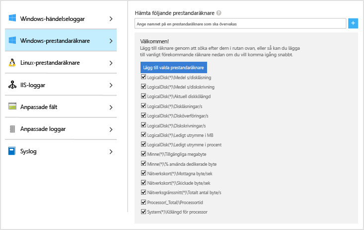
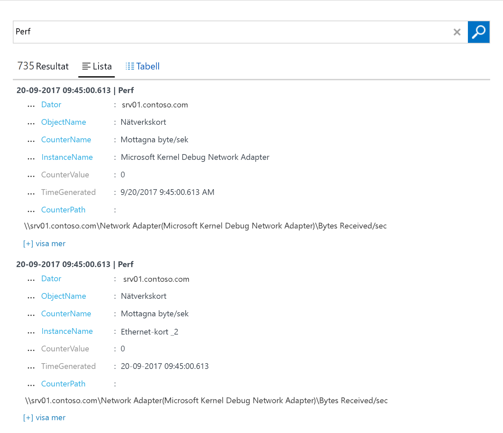

# Samla in data från Windows-datorer i din miljö
Med [Azure Log Analytics](log-analytics-overview.md) kan du samla in data direkt från fysiska eller virtuella Windows-datorer och andra resurser i din miljö till en enda lagringsplats för detaljerad analys och korrelation.  Den här snabbstarten visar hur du konfigurerar och samlar in data från Windows-datorer med några enkla steg.  För virtuella Azure Windows-datorer kan du se avsnittet [Samla in data om virtuella datorer i Azure](log-analytics-quick-collect-azurevm.md).  
 
Om du inte har en Azure-prenumeration kan du skapa ett [kostnadsfritt konto](https://azure.microsoft.com/free/?WT.mc_id=A261C142F) innan du börjar.

## Logga in på Azure Portal
Logga in på Azure Portal på [https://portal.azure.com](https://portal.azure.com). 

## Skapa en arbetsyta
1. I Azure Portal klickar du på knappen **Fler tjänster** längst upp till vänster. I listan över resurser skriver du **Log Analytics**. När du börjar skriva filtreras listan baserat på det du skriver. Välj **Log Analytics**.       
2. Klicka på **Skapa** och välj sedan alternativ för följande objekt:

  * Ange ett namn för den nya **OMS-arbetsytan**, som *DefaultLAWorkspace*. 
  * Välj en **prenumeration** att länka till genom att välja från den listrutan om standardvalet inte är lämpligt.
  * För **Resursgrupp** väljer du en befintlig resursgrupp som innehåller en eller flera virtuella datorer i Azure.  
  * Välj den **plats** där dina virtuella datorer distribueras.  Mer information finns i avsnittet om [tillgängliga regioner för Log Analytics](https://azure.microsoft.com/regions/services/).
  * Du kan välja mellan tre olika **prisnivåer** i Log Analytics, men för den här snabbstarten ska du välja den **kostnadsfria** nivån.  Mer information om de olika nivåerna finns i [prisinformation om Log Analytics](https://azure.microsoft.com/pricing/details/log-analytics/).

           
3. När du har angett den nödvändiga informationen i fönsterrutan **OMS-arbetsyta** klickar du på **OK**.  

När informationen har verifierats och arbetsytan skapas, kan du spåra förloppet under **Meddelanden** på menyn. 

## Hämta arbetsytans ID och nyckel
Innan du installerar Microsoft Monitoring Agent för Windows behöver du arbetsytans ID och nyckel för Log Analytics-arbetsytan.  Den här informationen krävs av installationsguiden för att agenten ska konfigureras ordentligt och kunna kommunicera med Log Analytics.  

1. I Azure Portal klickar du på knappen **Fler tjänster** längst upp till vänster. I listan över resurser skriver du **Log Analytics**. När du börjar skriva filtreras listan baserat på det du skriver. Välj **Log Analytics**.
2. Välj *DefaultLAWorkspace* som du skapade tidigare i listan med Log Analytics-arbetsytor.
3. Välj **Avancerade inställningar**.       
4. Välj **Anslutna källor** och välj sedan **Windows-servrar**.   
5. Värdet till höger om **Id för arbetsyta** och **Primär nyckel**. Kopiera och klistra in båda två i det redigeringsprogram du föredrar.   

## Installera agenten för Windows
Följande steg installerar och konfigurerar agenten för Log Analytics i Azure och Azure Government-molnet med hjälp av installationsprogrammet för Microsoft Monitoring Agent på datorn.  

1. På sidan **Windows-servrar** väljer du lämplig version för **Ladda ned Windows-agent** som ska laddas ned, beroende på processorarkitekturen för Windows-operativsystemet.
2. Kör installationsprogrammet för att installera agenten på datorn.
2. På sidan **Välkommen** klickar du på **Nästa**.
3. På sidan **Licensvillkor** läser du licensen och klickar sedan på **Jag accepterar**.
4. På sidan **Målmapp** ändrar du eller behåller standardinstallationsmappen och klickar sedan på **Nästa**.
5. På sidan **Installationsalternativ för agent** väljer du att ansluta agenten till Azure Log Analytics (OMS) och klickar sedan på **Nästa**.   
6. På sidan **Azure Log Analytics** gör du följande:
   1. Klistra in **Id för arbetsyta** och **Arbetsytenyckel (primär nyckel)** som du kopierade tidigare.  Om datorn ska rapportera till en Log Analytics-arbetsyta i Azure Government-molnet väljer du **Azure US Government** i listrutan **Azure Cloud**.  
   2. Om datorn behöver kommunicera via en proxyserver till Log Analytics-tjänsten klickar du på **Avancerat** och anger URL och portnummer för proxyservern.  Om proxyservern kräver autentisering anger du användarnamn och lösenord för att autentisera hos proxyservern och klickar sedan på **Nästa**.  
7. Klicka på **Nästa** när du har gjort de konfigurationsinställningar som krävs.     
8. På sidan **Klar att installera** kontrollerar du valen och klickar sedan på **Installera**.
9. På sidan **Konfigurationen har slutförts** klickar du på **Slutför**.

När du är klar visas **Microsoft Monitoring Agent** i **Kontrollpanelen**. Du kan granska konfigurationen och bekräfta att agenten är ansluten till Log Analytics. När du är ansluten visar agenten ett meddelande på fliken **Azure Log Analytics (OMS)** där det står: **The Microsoft Monitoring Agent has successfully connected to the Microsoft Operations Management Suite service** (Microsoft Monitoring Agent har anslutits till tjänsten Microsoft Operations Management Suite).   

## Samla in data om händelser och prestanda
Log Analytics kan samla in händelser från Windows-händelseloggar och prestandaräknare som du anger för analys och rapportering på längre sikt samt vidta åtgärder när ett visst villkor har identifierats.  Följ dessa steg om du vill konfigurera insamling av händelser från Windows-händelseloggen och flera vanliga prestandaräknare till att börja med.  

1. I Azure Portal klickar du på knappen **Fler tjänster** längst upp till vänster. I listan över resurser skriver du **Log Analytics**. När du börjar skriva filtreras listan baserat på det du skriver. Välj **Log Analytics**.
2. Välj **Avancerade inställningar**.      
3. Välj **Data** och sedan **Windows-händelseloggar**.  
4. Du kan lägga till en händelselogg genom att skriva namnet på loggen.  Skriv **System** och klicka sedan på plustecknet **+**.  
5. Kontrollera allvarlighetsgraderna **Fel** och **Varning** i tabellen.   
6. Klicka på **Spara** överst på sidan för att spara konfigurationen.
7. Välj **Windows-prestandadata** för att aktivera insamling av prestandaräknare på en Windows-dator. 
8. När du först konfigurerar Windows-prestandaräknare för en ny Log Analytics-arbetsyta har du möjlighet att snabbt skapa flera vanliga räknare. De listas med en kryssruta bredvid varje.  .  Klicka på **Lägg till valda prestandaräknare**.  De läggs till med en förinställning av provintervall på tio sekunder.  
9. Klicka på **Spara** överst på sidan för att spara konfigurationen.

## Visa data som samlas in
Nu när du har aktiverat insamling av data kan du köra en enkel loggsökning för att se vissa data från måldatorn.  

1. I Azure-portalen klickar du på panelen **Loggsökning** under den valda arbetsytan.  
2. I fönstret Loggsökning skriver du sedan `Perf` i frågefältet och trycker på retur eller klickar på sökknappen till höger om fältet.      Frågan i följande bild returnerar till exempel 735 prestandaposter.   

## Rensa resurser
När den inte längre behövs kan du ta bort agenten från Windows-datorn och ta bort Log Analytics-arbetsytan.  

Utför följande steg för att ta bort agenten.

1. Öppna **Kontrollpanelen**.
2. Öppna **Program och funktioner**.
3. I **Program och funktioner** väljer du **Microsoft Monitoring Agent** och klickar på **Avinstallera**.

Om du vill ta bort arbetsytan väljer du den Log Analytics-arbetsyta som du skapade tidigare och klickar på **Ta bort** på resurssidan.   

## Nästa steg
Nu när du kan samla in funktions- och prestandadata från din lokala Linux-dator kan du enkelt kan börja utforska, analysera och vidta åtgärder på data som du samlar in *utan kostnad*.  

Om du vill lära dig hur du visar och analyserar data kan du fortsätta till självstudiekursen.   

> [!div class="nextstepaction"]
> [Visa eller analysera data i Log Analytics](log-analytics-tutorial-viewdata.md)
