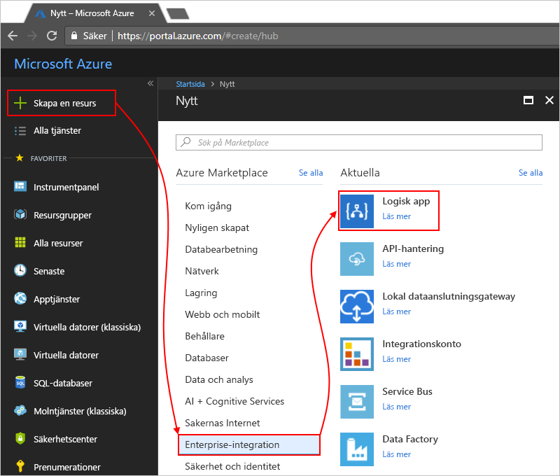

# Övervaka logikappar med Azure Log Analytics

Om du vill övervaka och få bättre information om felsökning om logic apps, aktiverar [Azure Log Analytics](../log-analytics/log-analytics-overview.md) när du skapar din logikapp. Log Analytics tillhandahåller diagnostik loggning och övervakning för logic apps när du installerar lösningen Logic Apps-hantering i Azure-portalen. Den här lösningen ger också samlad information för din logikapp körs med specifik information som status, körningstid, omsändning status och Korrelations-ID: N. Den här artikeln visar hur du aktiverar Log Analytics så att du kan visa körningshändelser och data för din logikapp körs.

Följ dessa steg för att du aktiverar Azure Log Analytics för befintliga logikappar, [aktivera Diagnostisk loggning och skicka logic app runtime-data till Log Analytics](../logic-apps/logic-apps-monitor-your-logic-apps.md#azure-diagnostics).

> [!NOTE]
> Den här sidan som beskrevs tidigare anvisningar att utföra dessa uppgifter med den Microsoft Operations Management Suite (OMS), vilket är [tas ur bruk i januari 2019](../azure-monitor/platform/oms-portal-transition.md), ersätter de här stegen med Azure Log Analytics i stället. 

## Förutsättningar

Innan du börjar behöver du en Log Analytics-arbetsyta. Lär dig [hur du skapar en Log Analytics-arbetsyta](../azure-monitor/learn/quick-create-workspace.md). 

## Aktivera diagnostikloggning när du skapar logikappar

1. I [Azure-portalen](https://portal.azure.com), skapa en logikapp. Välj **skapa en resurs** > **integrering** > **Logikapp**.

   

1. Under **skapa en logikapp**, utföra åtgärderna som visas:

   1. Ange ett namn för din logikapp och välj din Azure-prenumeration. 

   1. Skapa eller välj en Azure-resursgrupp.

   1. Ange **Log Analytics** till **på**. 

   1. Markera arbetsytan där du vill skicka data för din logikapp körs från listan lista Log Analytics-arbetsyta. 

      

      När du har slutfört det här steget skapar Azure logikappen, som nu är kopplad till Log Analytics-arbetsytan. 
      Det här steget installerar också automatiskt Logic Apps-hantering-lösningen i din arbetsyta.

   1. När du är klar väljer du **Skapa**.

1. Visa din logikapp körs [fortsätter du med dessa steg](#view-logic-app-runs-oms).

## Installera lösningen för Logic Apps-hantering

Om du redan aktiverat Log Analytics när du skapade din logikapp kan du hoppa över det här steget. Du har redan en lösning för Logic Apps-hantering installerad.

1. I [Azure-portalen](https://portal.azure.com), väljer du **Alla tjänster**. Hitta ”log analytics” i sökrutan och välj **Log Analytics**.

   

1. Under **Log Analytics**, hitta och välj din Log Analytics-arbetsyta. 

   

1. Under **Kom igång med Log Analytics** > **konfigurera övervakningslösningar**, Välj **visa lösningar**.

   

1. På sidan Översikt väljer **Lägg till**, vilket öppnar den **hanteringslösningar** lista. Välj den listan **Logic Apps-hantering**. 

   

   Om du inte hittar lösningen längst ned i listan, Välj **Läs in fler** tills lösningen visas.

1. Välj **skapa**, bekräfta Log Analytics-arbetsyta där du vill installera lösningen och välj sedan **skapa** igen.   

   

   Om du inte vill använda en befintlig arbetsyta kan du också skapa en ny arbetsyta just nu.

   När du är klar visas lösning för Logic Apps-hantering på översiktssidan. 

## Visa logikappkörningen information

När logikappen körs kan du visa status och antal för de körs på den **Logic Apps-hantering** panelen. 

1. Gå till Log Analytics-arbetsytan och öppna sidan Översikt. Välj **Logic Apps-hantering**. 

   

   Här kan är din logikapp-körningar grupperade efter namn eller efter Körningsstatus. 
   Information om fel visas i åtgärder eller utlösare för de logikapp-körningarna också i den här sidan.

   
   
1. Välj raden för en logikapp eller ett status om du vill visa alla körningar för en specifik logikapp eller status.

   Här är ett exempel som visar alla körningar för en specifik logikapp:

   

   Den här sidan har dessa avancerade alternativ:

   * **Spårade egenskaper:**

     Denna kolumn visar spårade egenskaper, som är grupperade efter åtgärder för logikappen. Välj för att visa de spårade egenskaperna **visa**. 
     Om du vill söka i de spårade egenskaperna, använder du filtret för kolumnen.
   
     

     Alla nytillagda spårade egenskaper kan ta 10 – 15 minuter innan de kan visas första gången. Lär dig [hur du lägger till spårade egenskaperna i logikappen](logic-apps-monitor-your-logic-apps.md#azure-diagnostics-event-settings-and-details).

   * **Skicka:** du skicka minst en logikapp-körningar som har misslyckats, lyckades, eller är fortfarande körs. Markera kryssrutorna för körningar som du vill skicka igen och välj **skicka**. 

     

1. Du kan utföra både på klientsidan och serversidan filtrering för att filtrera resultaten.

   * **Klientsidan filter**: för varje kolumn väljer du de filter som du vill, till exempel:

     

   * **Serversidan filter**: att välja ett specifikt tidsfönster eller begränsa antalet körningar som visas måste du använda scope-kontroll högst upp på sidan. Som standard visas endast 1 000 poster i taget.
   
     
 
1. Om du vill visa alla åtgärder och deras information för en specifik körning, markerar du en rad för en logikappskörning.

   Här är ett exempel som visar alla åtgärder för en specifik logikapp-körningen:

   
   
1. På sidan alla resultat kan du se frågan bakom resultaten eller för att se alla resultat väljer **finns i alla**, vilket öppnar du loggsökningssidan.
   
   
   
   På sidan Log Search

   * Om du vill visa resultatet av frågan i en tabell, Välj **tabell**.

   * Om du vill ändra frågan kan du redigera frågesträngen i sökfältet. 
   För en bättre användarupplevelse och välja **Advanced Analytics**.

     
     
     På sidan Azure Log Analytics kan du uppdatera frågor och visa resultat från tabellen. Den här frågan använder [Kusto-frågespråket](https://aka.ms/LogAnalyticsLanguageReference), som du kan redigera om du vill visa olika resultat. 

     

## Nästa steg

* [Övervaka B2B-meddelanden](../logic-apps/logic-apps-monitor-b2b-message.md)