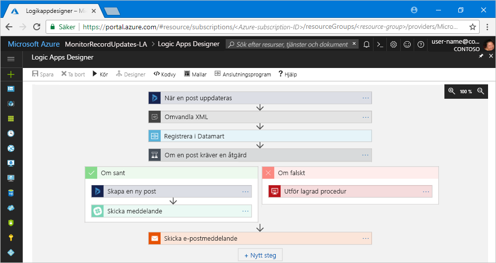

# Vad är Azure Logic Apps?

[Azure Logic Apps](https://azure.microsoft.com/services/logic-apps) är en molnbaserad tjänst som hjälper dig att automatisera och samordna uppgifter, affärsprocesser och [arbetsflöden](#logic-app-concepts) när du behöver integrera appar, data, system och tjänster i företag eller organisationer. Logic Apps förenklar hur du utformar och skapar skalbara lösningar för appintegrering, dataintegrering, systemintegrering, Enterprise Application Integration (EAI) och business-to-business-kommunikation (B2B) i molnet, lokalt eller både och.

Här är exempel på några arbetsbelastningar som du kan automatisera med logikappar:

* Behandla och dirigera order i lokala system och molntjänster.
* Skicka e-postaviseringar med Office 365 när händelser inträffar i olika system, appar och tjänster.
* Flytta uppladdade filer från en SFTP- eller FTP-server till Azure Storage. 
* Övervaka tweets för ett visst ämne, analysera sentiment och skapa aviseringar eller uppgifter för objekt som behöver granskas.

Om du vill skapa integreringslösningar för företag med Azure Logic Apps kan du välja från ett växande galleri med [över 200 anslutningsappar](../connectors/apis-list.md), som bland annat innehåller tjänster som Azure Service Bus, Functions och Storage, SQL, Office 365, Dynamics, Salesforce, BizTalk, SAP, Oracle DB, filresurser och mer. [Anslutningsappar](#logic-app-concepts) tillhandahåller [utlösare](#logic-app-concepts), [åtgärder](#logic-app-concepts) eller både och för att skapa logikappar som får säker åtkomst till och bearbetar data i realtid.

> [!VIDEO https://channel9.msdn.com/Blogs/Azure/Introducing-Azure-Logic-Apps/player]

## Hur fungerar Logic Apps? 

Varje logikapps arbetsflöde börjar med en utlösare, som utlöses när en viss händelse sker eller när nya tillgängliga data uppfyller specifika villkor. Många utlösare har grundläggande funktioner för schemaläggning så du kan ange hur regelbundet du vill att dina arbetsbelastningar ska köras. Om du vill ha fler anpassade schemaläggningsscenarier kan du börja dina arbetsflöden med en schemautlösare. Läs mer om [att skapa schemabaserade arbetsflöden](../logic-apps/tutorial-build-schedule-recurring-logic-app-workflow.md).

Varje gång utlösaren körs skapar Logic Apps-motorn en logikappinstans som kör åtgärderna i arbetsflödet. Åtgärderna kan även omfatta datakonverteringar och flödeskontroller, som villkorssatser, switch-satser, loopar och branchning. Den här logikappen till exempel börjar med en Dynamics 365-utlösare med det inbyggda villkoret ”När en post uppdateras”. Om utlösaren upptäcker en händelse som matchar villkoret utlöses utlösaren och kör arbetsflödets åtgärder. Här omfattar åtgärderna XML-transformering, datauppdateringar, beslutsbranchning och e-postmeddelanden.

Du kan skapa logikappar visuellt med Logikappdesignern, som är tillgänglig på Azure Portal via webbläsaren och i Visual Studio. Om du behöver mer anpassade logikappar kan du skapa eller redigera logikappsdefinitioner i JavaScript Object Notation (JSON) genom att arbeta i ”kodvyn”. Du kan också använda Azure PowerShell-kommandon och Azure Resource Manager-mallar för utvalda aktiviteter. Logikappar distribueras och körs i molnet på Azure. En mer detaljerad introduktion finns i den här videon: [Use Azure Enterprise Integration Services to run cloud apps at scale](https://channel9.msdn.com/Events/Connect/2017/T119/) (Använda Azure Enterprise-integreringstjänster för att köra molnappar i skala) 

## Varför ska man använda Logic Apps?

Logikappar hjälper det digitala företaget att snabbt och enkelt ansluta äldre, moderna och banbrytande system genom att erbjuda inbyggda API:er som Microsoft-hanterade anslutningsappar. På så vis kan du lägga krutet på apparnas affärslogik och funktionalitet. Du behöver inte tänka på att skapa, vara värd för, skala, hantera, underhålla eller övervaka dina appar. Logic Apps gör det åt dig. Dessutom betalar du endast för det du använder baserat på en [förbrukningsprismodell](../logic-apps/logic-apps-pricing.md). 

I många fall behöver du inte skriva kod. Men om du måste skriva lite kod kan du skapa kodfragment med [Azure Functions](../azure-functions/functions-overview.md) och köra koden på begäran från logikappar. Om dina logikappar behöver interagera med händelser från Azure-tjänster, anpassade appar eller andra lösningar kan du dessutom använda [Azure Event Grid](../event-grid/overview.md) med dina logikappar för händelseövervakning, routning och publicering.

Logic Apps, Functions och Event Grid hanteras fullständigt av Microsoft Azure, som frikopplar dig från bekymmer om att skapa, vara värd för, skala, hantera, övervaka och underhålla dina lösningar. Med möjligheten att skapa [”serverlösa” appar och lösningar](../logic-apps/logic-apps-serverless-overview.md) kan du enbart fokusera på affärslogiken. Tjänsterna skalar automatiskt för att uppfylla dina behov, göra integreringar snabbare och hjälpa dig att skapa robusta molnappar med minimal kod. Dessutom betalar du endast för det du använder baserat på en [förbrukningsprismodell](../logic-apps/logic-apps-pricing.md). 

Om du vill veta hur företag har förbättrat sin flexibilitet och ökat sitt fokus i sin huvudsakliga verksamhet genom att kombinera Logic Apps med andra Azure-tjänster och Microsoft-produkter kan du kolla in de här [kundberättelserna](https://aka.ms/logic-apps-customer-stories).

Här är fler information om fördelarna du får med Logic Apps:

### Skapa arbetsflöden visuellt med lättanvända verktyg

Spara tid och förenkla komplexa processer med visuella designverktyg. Skapa logikappar från början till slut med hjälp av Logikappdesigner i webbläsaren i Azure-portalen eller i Visual Studio. Starta arbetsflödet med en utlösare och lägg till valfritt antal åtgärder från [anslutningsgalleriet](../connectors/apis-list.md).

### Kom igång snabbare med mallar för Logic Apps

Skapa vanliga lösningar snabbare när du väljer fördefinierade arbetsflöden från [mallgalleriet](../logic-apps/logic-apps-create-logic-apps-from-templates.md). Mallarna sträcker sig från enkla anslutningsmöjligheter för SaaS-appar (programvara som en tjänst) till avancerade B2B-lösningar plus mallar ”för skojs skull”. Lär dig att [skapa logikappar från fördefinierade mallar](../logic-apps/logic-apps-create-logic-apps-from-templates.md).

### Ansluta olika system i olika miljöer

Vissa mönster och arbetsflöden är lätta att beskriva men svåra att implementera i kod. Med logikappar kan du smidigt ansluta olika system i lokala miljöer eller molnmiljöer. Du kan till exempel ansluta en marknadsföringslösning i molnet till ditt lokala faktureringssystem eller centralisera meddelandehanteringen mellan API:er och system med en Enterprise Service Bus. Logikappar levererar snabbt, tillförlitligt och konsekvent metoder för att leverera återanvändbara och omkonfigurerbara lösningar för dessa scenarier.

### Förstklassigt stöd för Enterprise-integration och B2B-scenarier

Företag och organisationer kommunicerar elektroniskt med varandra med branschstandard men olika meddelandeprotokoll och format, till exempel EDIFACT, AS2 och X12. Med funktionerna i [Enterprise-integrationspaket (EIP)](../logic-apps/logic-apps-enterprise-integration-overview.md) kan du skapa logikappar som transformerar meddelandeformat som används av dina partner till format som din organisations system kan tolka och bearbeta. I Logic Apps hanteras dessa utbyten smidigt och på ett säkert sätt med hjälp av kryptering och digitala signaturer.

Börja i liten skala med dina aktuella system och tjänster, och utöka stegvis i din egen takt. När du är klar hjälper dig Logic Apps och EIP dig att implementera och skala upp till mognare integrationsscenarier genom att tillhandahålla bland annat följande kapacitet:

* Utveckla med dessa produkter och tjänster:

  * [Microsoft BizTalk Server](https://docs.microsoft.com/biztalk/core/introducing-biztalk-server)
  * [Azure Service Bus](../service-bus-messaging/service-bus-messaging-overview.md)
  * [Azure Functions](../azure-functions/functions-overview.md)
  * [Azure API Management](../api-management/api-management-key-concepts.md)

* Bearbeta [XML-meddelanden](../logic-apps/logic-apps-enterprise-integration-xml.md)
* Bearbeta [flata filer](../logic-apps/logic-apps-enterprise-integration-flatfile.md)
* Utbyta meddelanden med protokollen [EDIFACT](../logic-apps/logic-apps-enterprise-integration-edifact.md), [AS2](../logic-apps/logic-apps-enterprise-integration-as2.md) och [X12](../logic-apps/logic-apps-enterprise-integration-x12.md)
* Lagra och hantera B2B-artefakterna med mera på en plats med [integrationskonton](../logic-apps/logic-apps-enterprise-integration-accounts.md):

  * [Partner](../logic-apps/logic-apps-enterprise-integration-partners.md)
  * [Avtal](../logic-apps/logic-apps-enterprise-integration-agreements.md) 
  * [Mappningar för XML-omvandling](../logic-apps/logic-apps-enterprise-integration-maps.md)
  * [Scheman för XML-verifiering](../logic-apps/logic-apps-enterprise-integration-schemas.md)
   
Om du till exempel använder Microsoft BizTalk Server kan logikappar kommunicera med din BizTalk-server via [anslutningsappen för BizTalk Server](../connectors/apis-list.md#on-premises-connectors). Du kan sedan utöka eller utföra BizTalk-liknande åtgärder i dina Logic Apps-appar genom att ta med [anslutningsappar för integrationskonton](../connectors/apis-list.md#integration-account-connectors) som finns med i Enterprise Integration Pack. 

Åt andra hållet så kan BizTalk Server ansluta till och kommunicera med Logic Apps via [Microsoft BizTalk Server-adaptern för Logic Apps](https://www.microsoft.com/download/details.aspx?id=54287). Lär dig hur du [konfigurerar och använder BizTalk Server-adaptern](https://docs.microsoft.com/biztalk/core/logic-app-adapter) på din BizTalk-server.

### Skriv en gång, återanvänd ofta

Skapa dina logikappmallar så att du kan [distribuera och konfigurera om dina appar](../logic-apps/logic-apps-create-deploy-template.md) i flera miljöer och regioner.

### Inbyggd utökningsbarhet

Om du inte hittar det anslutningsprogram du vill ha eller behöver för att köra anpassad kod kan du utöka logikappar genom att skapa och anropa dina egna kodfragment på begäran via [Azure Functions](../azure-functions/functions-overview.md). Skapa dina egna [API:er](../logic-apps/logic-apps-create-api-app.md) och [anpassade anslutningsappar](../logic-apps/custom-connector-overview.md) som du kan anropa från logikappar.

### Betala bara för det du använder
  
Logic Apps använder förbrukningsbaserad [prissättning och mätning](../logic-apps/logic-apps-pricing.md) om du inte redan har skapat logikappar med App Service-planer.

Läs mer om Logic Apps med följande introduktionsvideor:

* [Integrering med Logic Apps – från inget till allt](https://channel9.msdn.com/Events/Build/2017/C9R17)
* [Enterprise-integrering med Microsoft Azure Logic Apps](https://channel9.msdn.com/Events/Ignite/Microsoft-Ignite-Orlando-2017/BRK2188)
* [Skapa avancerade verksamhetsprocesser med Logic Apps](https://channel9.msdn.com/Events/Ignite/Microsoft-Ignite-Orlando-2017/BRK3179)

## Viktiga begrepp

* **Arbetsflöde**: Visualisera, designa, skapa, automatisera och distribuera verksamhetsprocesser som en serie steg.

* **Hanterade anslutningsappar**: Dina logikappar behöver åtkomst till data, tjänster och system. Du kan använda fördefinierade Microsoft-hanterade anslutningsappar som är utformade för att ansluta, komma åt och arbeta med dina data. Läs [Anslutningsappar för Azure Logic Apps](../connectors/apis-list.md)

* **Utlösare**: Många Microsoft-hanterade anslutningsappar tillhandahåller utlösare som utlöses när händelser eller nya data uppfyller angivna villkor. En händelse kan exempelvis få ett e-postmeddelande eller upptäcka ändringar i ditt Azure Storage-konto. Varje gång utlösaren körs skapar Logic Apps-motorn en ny logikappinstans som kör arbetsflödet.

* **Åtgärder**: Åtgärder är alla steg som sker efter utlösaren. Alla åtgärder mappar vanligtvis till en åtgärd som är definierad av en hanterad anslutning, anpassad API eller anpassad anslutning.

* **Enterprise-integrationspaket**: Logic Apps innehåller funktioner från BizTalk Server för mer avancerade integrationsscenarier. Enterprise-integrationspaketet tillhandahåller anslutningsappar som hjälper logikappar att enkelt utföra verifiering, transformering med mera.

## Hur skiljer sig Logic Apps från Functions, WebJobs och Flow?

Alla dessa tjänster hjälper dig att ”sammanlänka” och ansluta olika system till varandra. Varje tjänst har sina fördelar, så om du snabbt vill skapa ett skalbart, komplett integreringssystem är det bästa sättet att kombinera deras funktioner. Mer information finns i [Välj mellan Flow, Logic Apps, Functions och WebJobs](../azure-functions/functions-compare-logic-apps-ms-flow-webjobs.md).

## Kom igång 

Logic Apps är en av de många tjänsterna på Microsoft Azure. Innan du börjar behöver du en Azure-prenumeration. Om du inte har någon prenumeration kan du <a href="https://azure.microsoft.com/free/" target="_blank">registrera ett kostnadsfritt Azure-konto</a>. 

Om du har en Azure-prenumeration kan du prova den här [snabbstarten för att skapa din första logikapp](../logic-apps/quickstart-create-first-logic-app-workflow.md), som övervakar nytt innehåll på en webbplats via en RSS-feed och skickar e-post när nytt innehåll kommer.

## Support och feedback

* Om du har frågor kan du besöka [forumet för Azure Logic Apps](https://social.msdn.microsoft.com/Forums/en-US/home?forum=azurelogicapps).
* Om du vill skicka in eller rösta på förslag på funktioner besöker du [webbplatsen för Logic Apps-användarfeedback](http://aka.ms/logicapps-wish).

## Nästa steg

* [Kontrollera trafik med en schemabaserad logikapp](../logic-apps/tutorial-build-schedule-recurring-logic-app-workflow.md)
* Läs mer om [serverlösa lösningar med Azure](../logic-apps/logic-apps-serverless-overview.md)
* Läs mer om [B2B-integrering med Enterprise-integrationspaketet](../logic-apps/logic-apps-enterprise-integration-overview.md)