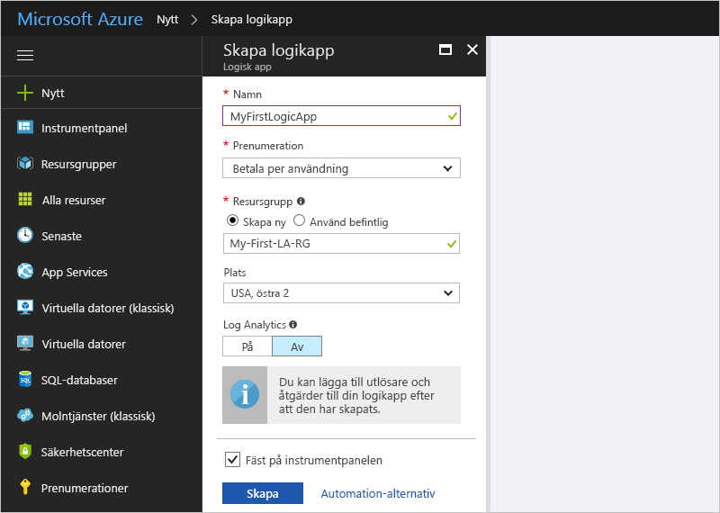
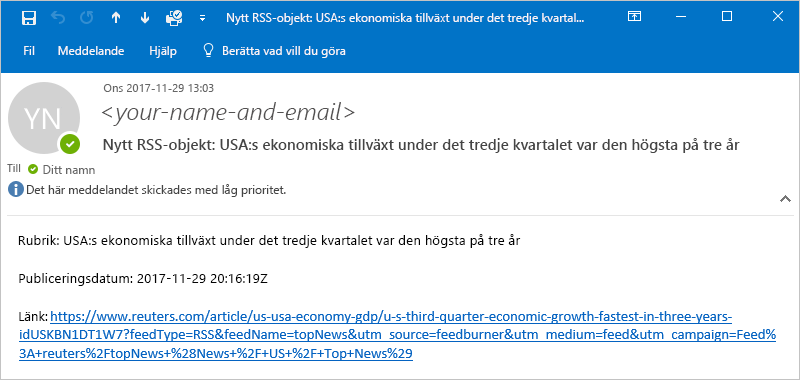
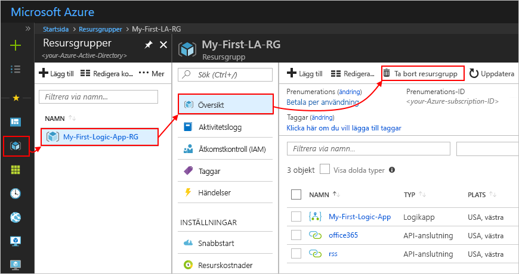
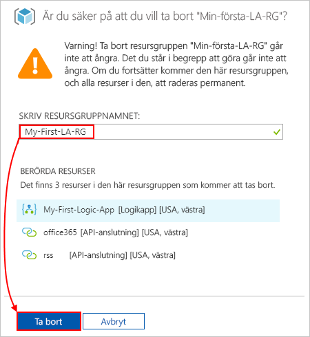

# Snabb start: skapa din första Logic Apps arbets flöde – Azure Portal

Den här snabb starten förklarar hur du skapar ditt första arbets flöde i [Azure Logic Apps](logic-apps-overview.md) via [Azure Portal](https://portal.azure.com). I den här vägledningen beskrivs också grundläggande begrepp i Logic Appss tjänsten, inklusive hur du skapar en ny Logi Kap par, lägger till en utlösare och åtgärd i din Logic app och testar din Logi Kap par. Följ den här snabb starten för att bygga en exempel på en Logic-app som regelbundet kontrollerar ett RSS-flöde och skickar ett e-postmeddelande för nya objekt. Följande skärm bild visar arbets flödet i den här exempel Logic-appen på hög nivå:

Om du vill lära dig hur du skapar och hanterar din första Logic-app via andra gränssnitt och appar, se följande Logic Apps snabb starter: 

* [Skapa och hantera Logic Apps med Azure Command-Line-gränssnittet (Azure CLI)](quickstart-logic-apps-azure-cli.md)
* [Skapa och hantera Logic Apps i Visual Studio Code](quickstart-create-logic-apps-visual-studio-code.md)
* [Skapa och hantera Logic Apps i Visual Studio](quickstart-create-logic-apps-with-visual-studio.md)

## Förutsättningar

* En Azure-prenumeration. Om du inte har någon kan du [Registrera dig för ett kostnads fritt Azure-konto](https://azure.microsoft.com/free/?WT.mc_id=A261C142F).
* Ett e-postkonto från en tjänst som stöds av Logic Apps (till exempel Office 365 Outlook eller Outlook.com). [Granska anslutnings listan](/connectors/)för andra e-postleverantörer som stöds.

    > [!IMPORTANT]
    > Observera att endast G Suite-konton kan använda den här anslutningen utan begränsning i Logic Apps om du använder [Gmail-anslutningsprogrammet](/connectors/gmail/). Om du har ett kund Gmail-konto kan du bara använda den här anslutningen med vissa Google-godkända tjänster, om du inte [skapar en Google-app som ska användas för autentisering med din Gmail-anslutning](/connectors/gmail/#authentication-and-bring-your-own-application). Mer information finns i [principer för data säkerhet och sekretess för Google Connectors i Azure Logic Apps](../connectors/connectors-google-data-security-privacy-policy.md).

## Skapa en logikapp

1. Logga in på [Azure Portal](https://portal.azure.com) med autentiseringsuppgifterna för ditt Azure-konto.

1. I rutan Azure Portal Sök anger `logic apps` du och väljer **Logic Apps** .

   

1. På sidan **Logic Apps** väljer du **Lägg till** .

   

1. I fönstret **Logic app** anger du grundläggande information och inställningar för din Logic app. Skapa en ny [resurs grupp](../azure-resource-manager/management/overview.md#terminology) för syftet med den här exempel Logic-appen.
    
   | Egenskap | Värde | Beskrivning |
   |----------|-------|-------------|
   | **Namn** | <*Logic – App-Name*> | Din Logic Apps namn, som måste vara unikt i flera regioner. Namnet får bara innehålla bokstäver, siffror, bindestreck ( `-` ), under streck ( `_` ), parenteser ( `(` , `)` ) och punkter ( `.` ). I det här exemplet används "min-First-Logic-app". |
   | **Prenumeration** | <*Azure-prenumeration-namn*> | Namnet på din Azure-prenumeration. |
   | **Resursgrupp** | <*Azure-resurs-grupp-namn*> | Namnet på den [Azure-resurs grupp](../azure-resource-manager/management/overview.md#terminology) där du skapar Logic-appen. Resurs gruppens namn måste vara unikt i flera regioner. I det här exemplet används "My-First-LA-RG". |
   | **Plats** | <*Azure-region*> | Den Azure-region där du vill lagra information om din Logic Apps. I det här exemplet används "västra USA". |
   | **Log Analytics** | Av | Inställningen för diagnostisk loggning, som är **avstängd** som standard. I det här exemplet ska du behålla inställningen **av** . |
   ||||

   

1. När du är klar väljer du **Granska + skapa** . Bekräfta informationen som du har angett och välj **skapa** .

1. När Azure har distribuerat din app väljer **du gå till resurs** . Eller så kan du hitta och välja din Logic-app genom att skriva namnet i sökrutan.

   

   Logic Apps Designer öppnas och det visas en sida med en introduktionsvideo och vanliga utlösare. Under **Mallar** väljer du **Tom logikapp** .

   

Lägg sedan [till en utlösare i din Logic app](#add-rss-trigger).

## Lägg till RSS-utlösaren

Varje Logi Kap par måste börja med en [utlösare](../logic-apps/logic-apps-overview.md#how-do-logic-apps-work)som utlöses när en enskild händelse inträffar, eller när ett angivet villkor uppfylls. Varje gång utlösaren hittar nya objekt utlöses den och Logic Appss motorn skapar en Logic App-instans som startar och kör ditt arbets flöde. Om utlösaren inte hittar nya objekt utlöses inte utlösaren och skapar inte en instans eller kör arbets flödet vid den här kontrollen.

I det här snabb starts exemplet, när du har [skapat en Logic app](#create-your-logic-app), lägger du till en utlösare som söker efter nya objekt i en RSS-feed och utlöses när det finns nya objekt. Du kan också skapa Logi Kap par med olika typer av utlösare, till exempel i självstudierna för att [skapa automatiska godkännande-baserade arbets flöden](tutorial-process-mailing-list-subscriptions-workflow.md).

1. I **Logic App Designer** väljer du **alla** under sökrutan.

1. Du hittar RSS-anslutningen genom att ange i rutan Sök `rss` . I listan **utlösare** väljer du RSS-utlösaren **när ett feed-objekt publiceras** .

   

1. Ange URL: en för RSS-feed för utlösaren. Definiera sedan utlösarens schema genom att ange intervall och frekvens.

   | Egenskap | Värde | Beskrivning |
   | -------- | ----- | ----------- |
   | **RSS-feedens webbadress** | <*RSS-feed-URL*> | URL-adressen till det RSS-flöde som du vill övervaka. I det här exemplet används RSS-flödet för wallets gata i `https://feeds.a.dj.com/rss/RSSMarketsMain.xml` . I det här exemplet kan du dock använda alla RSS-flöden som inte kräver HTTP-auktorisering. Välj en RSS-feed som publiceras ofta, så att du enkelt kan testa din Logic app. |
   | **Intervall** | 1 | Antalet intervaller som ska förflyta mellan RSS-flöden. I det här exemplet används intervall på 1 minut. |
   | **Frekvens** | Minut | Tidsenhet för varje intervall mellan RSS-flöde-kontroller. I det här exemplet används intervall på 1 minut. |
   ||||

   

1. Dölj utlösarens information för tillfället genom att klicka inuti dess namn List.

   

1. Spara din Logic app genom att välja **Spara** i Design verktygsfältet.

Din Logi Kap par är nu Live, men det gör inte något annat än att kontrol lera RSS-flödet. Lägg sedan [till en åtgärd](#add-email-action) för att definiera vad som händer när utlösaren utlöses.

## Lägg till åtgärden "skicka e-post"

När du har [lagt till en utlösare för din Logic app](#add-rss-trigger)måste du lägga till en [åtgärd](../logic-apps/logic-apps-overview.md#logic-app-concepts) för att fastställa svaret när din Logic App kontrollerar RSS-flödet och ett nytt objekt visas. Du kan också skapa Logi Kap par med mycket mer komplexa åtgärder, till exempel i självstudien för att [bearbeta e-postmeddelanden med Logic Apps, Azure Functions och Azure Storage](/tutorial-process-email-attachments-workflow.md).

> [!NOTE]
> I det här exemplet används Office 365 Outlook som e-posttjänst. Om du använder en annan e-posttjänst som stöds i din Logic app kan användar gränssnittet se annorlunda ut. De grundläggande begreppen för att ansluta till en annan e-posttjänst är dock desamma.

1. Under **när ett flödes objekt publiceras** utlösare väljer du **nytt steg** .

   

1. Under **Välj en åtgärd** och sökrutan väljer du **alla** .

1. I sökrutan anger `send an email` du så att du kan hitta anslutningar som erbjuder den här åtgärden. Om du vill filtrera åtgärds listan till en speciell app eller tjänst kan du välja att först använda appen eller tjänsten.

   Om du till exempel använder ett arbets-eller skol konto från Microsoft och vill använda Office 365 Outlook, väljer du **office 365 Outlook** . Eller, om du använder en personlig Microsoft-konto, kan du välja Outlook.com. Det här exemplet fortsätter med Office 365 Outlook:

   

   Nu kan du enkelt hitta och välja den åtgärd som du vill använda, till exempel `send an email` :

   

1. Om din valda e-postanslutning meddelar dig att du vill autentisera din identitet, slutför du det steget nu. Du måste skapa en anslutning mellan din Logic app och din e-posttjänst för att det här exemplet ska fungera. 

    > [!NOTE]
    > Det här exemplet visar manuell autentisering till Office 365 Outlook Connector. Andra anslutningar kan dock ha stöd för olika typer av autentisering.
    > Du kan också hantera autentisering för dina Logi Kap par på olika sätt, beroende på ditt användnings fall. Om du till exempel använder Azure Resource Manager mallar för distribution kan du Parameterisera för att förbättra säkerheten vid indata som ändras ofta, till exempel anslutnings information. Mer information finns i de här ämnena:
   > * [Mallparametrar för distribution](../logic-apps/logic-apps-azure-resource-manager-templates-overview.md#template-parameters)
   > * [Auktorisera OAuth-anslutningar](../logic-apps/logic-apps-deploy-azure-resource-manager-templates.md#authorize-oauth-connections)
   > * [Autentisera åtkomst med hanterade identiteter](../logic-apps/create-managed-service-identity.md)
   > * [Autentisera anslutningar för Logic app-distribution](../logic-apps/logic-apps-azure-resource-manager-templates-overview.md#authenticate-connections)

1. I åtgärden **Skicka ett e-postmeddelande** anger du vilken information som ska inkluderas i e-postmeddelandet.

   1. Ange mottagarens e-postadress i fältet **Till** . I det här exemplet använder du din e-postadress.

        > [!NOTE]
        > Listan **Lägg till dynamiskt innehåll** visas när du klickar i rutan **till** och vissa andra inmatade rutor i Logic Apps designer. I det här exemplet används dynamiskt innehåll i ett senare steg. I listan **Lägg till dynamiskt innehåll** visas alla tillgängliga utdata från föregående steg, som du kan använda som indata för den aktuella åtgärden.

   1. I rutan **ämne** anger du ämnet för e-postaviseringen. I det här exemplet anger du följande text med ett avslutande blank steg: `New RSS item: `

      

   1. I listan **Lägg till dynamiskt innehåll** väljer du **feed-rubrik** , som är utdata från utlösaren, **när ett feed-objekt publiceras** . E-postaviseringen använder dessa utdata för att hämta rubriken för RSS-objektet.

      

      > [!TIP]
      > Om inga utdata visas från listan **när ett feed-objekt publiceras** utlösare i listan med dynamiskt innehåll, väljer du **Visa fler** .
      > 
      > 

      När du är klar ser ämnet ut som i det här exemplet:

      

      Om en "för varje"-slinga visas i designern väljer du en token för en matris. till exempel **Kategorier-objekt-** token. För sådana typer av token lägger designern automatiskt till den här loopen omkring åtgärden som refererar till token. På så sätt kan din logikappsåtgärd utföra samma åtgärd på varje element i matrisen. Om du vill ta bort loopen väljer du **ellipserna** ( **...** ) på loopens namn list och väljer sedan **ta bort** .

   1. I rutan **brödtext** anger du innehåll för e-postmeddelandets brödtext. I det här exemplet innehåller innehållet tre egenskaper med beskrivande text för var `Title:` och en:, egenskapen **feed title** `Date published:` , den **feed som publicerats för** egenskapen och `Link:` den **primära feed-länkens** egenskap. Tryck på Skift + Enter för att lägga till tomma rader i en redigeringsruta.

      | Egenskap | Beskrivning |
      |----------|-------------|
      | **Flödesrubrik** | Objektets rubrik |
      | **Flödet publicerat den** | Objektets publiceringsdatum och -tid |
      | **Flödets primära länk** | Objektets webbadress |
      |||

      

1. Spara logikappen. Välj **Spara** i design menyn.

Testa sedan [att din Logic app fungerar](#test-logic-app).

## Kör logikappen

När du har skapat din exempel Logic-App kontrollerar du att arbets flödet har kon figurer ATS korrekt. Du kan vänta på att Logic-appen ska kontrol lera RSS-flödet baserat på det angivna schemat. Du kan också köra din Logic-app manuellt genom att välja **Kör** i verktygsfältet i Logic Apps designer, som visas på följande skärm bild. 

Om RSS-flödet innehåller nya objekt skickar din logikapp ett e-postmeddelande för varje nytt objekt. Annars väntar din Logic app tills nästa intervall för att kontrol lera RSS-flödet igen. 

Följande skärm bild visar ett exempel på ett e-postmeddelande från den här exempel Logic app. E-postmeddelandet innehåller information om varje RSS-flöde som valts i designern, samt den beskrivande text som lagts till för var och en.

Om du inte får e-postmeddelanden från den logiska appen som förväntat:

* Kontrol lera e-postkontots skräp post eller spam-mapp, om meddelandet var felaktigt filtrerat.
* Se till att RSS-flödet du använder har publicerat objekt sedan den senaste schemalagda eller manuella kontrollen.

## Rensa resurser

När du har testat den här exempel Logic-appen, rensar du Logi Kap par och relaterade resurser genom att ta bort resurs gruppen som du skapade i det här exemplet.

> [!NOTE]
> När du [tar bort en Logic app](manage-logic-apps-with-azure-portal.md#delete-logic-apps)instansieras inga nya körningar. Alla pågående och väntande körningar avbryts. Om du har flera tusen körningar kan det ta relativt lång tid att avbryta dem.

1. I rutan Azure Search anger du `resource groups` och väljer sedan **resurs grupper** .

   

1. Hitta och välj din Logic Apps resurs grupp. I **översikts** fönstret väljer du **ta bort resurs grupp** .

   

1. När fönstret bekräftelse visas anger du namnet på resurs gruppen och väljer **ta bort** .

   

## Nästa steg

I den här snabb starten skapade du din första Logic-app i Azure Portal för att kontrol lera en RSS-feed för uppdateringar enligt ett schema och skicka ett e-postmeddelande om varje nytt flödes objekt. 

Information om hur du skapar mer avancerade schemabaserade arbets flöden i Logic Apps finns i följande självstudie:

> [!div class="nextstepaction"]
> [Kontrollera trafik med en schemabaserad logikapp](../logic-apps/tutorial-build-schedule-recurring-logic-app-workflow.md)
