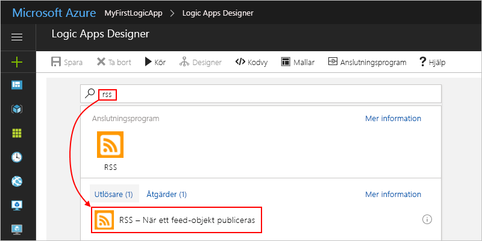
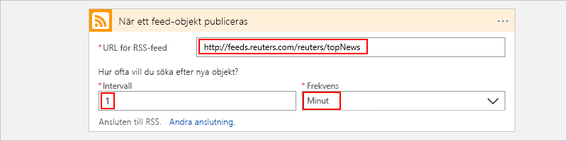
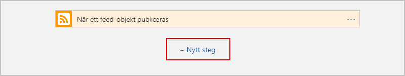
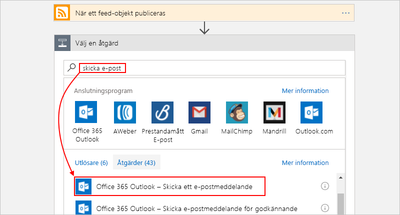
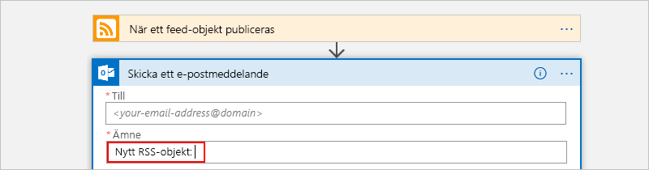
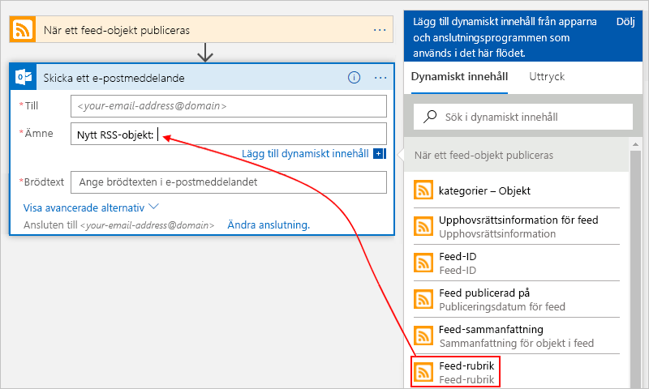
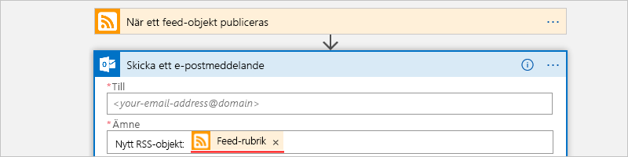
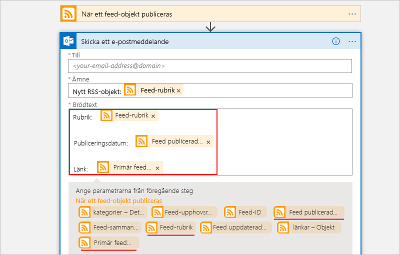

# <a name="quickstart-create-your-first-automated-workflow-with-azure-logic-apps---azure-portal"></a>Snabbstart: Skapa ditt första automatiserade arbetsflöde med Azure Logic Apps – Azure-portalen

I den här snabbstarten beskrivs hur du bygger ditt första automatiserade arbetsflöde med [Azure Logic Apps](../logic-apps/logic-apps-overview.md). I den här artikeln skapar du en logikapp som regelbundet kontrollerar om det finns nya objekt via en webbplats RRS-feed. Om det finns ett nytt objekt skickar logikappen ett e-postmeddelande för vart och ett. När du är klar ser logikappen ut som det här arbetsflödet på en hög nivå:


Om du vill följa den här snabbstarten måste du ha ett e-postkonto från en provider som stöds av Logic Apps, som Office 365 Outlook, Outlook.com eller Gmail. För andra providrar [läser du listan med anslutningsappar här](https://docs.microsoft.com/connectors/). För den här logikappen används ett Office 365 Outlook-konto. Om du använder något annat e-postkonto är de övergripande stegen desamma, men användargränssnittet kan skilja sig något. 

Om du heller inte har någon Azure-prenumeration kan du <a href="https://azure.microsoft.com/free/" target="_blank">registrera ett kostnadsfritt Azure-konto</a>.

## <a name="sign-in-to-the-azure-portal"></a>Logga in på Azure Portal

Logga in på <a href="https://portal.azure.com" target="_blank">Azure Portal</a> med autentiseringsuppgifterna för ditt Azure-konto.

## <a name="create-your-logic-app"></a>Skapa en logikapp 

1. Välj **Skapa en resurs** > **Integration** > **Logikapp** på Azure-huvudmenyn.

   

3. Under **Skapa en logikapp** anger du information om din logikapp så som det visas här. När du är klar väljer du **Skapa**.

   

   | Egenskap  | Värde | Beskrivning | 
   |----------|-------|-------------| 
   | **Namn** | MyFirstLogicApp | Logikappens namn | 
   | **Prenumeration** | <*your-Azure-subscription-name*> | Azure-prenumerationens namn | 
   | **Resursgrupp** | My-First-LA-RG | Namnet på den [Azure-resursgrupp](../azure-resource-manager/resource-group-overview.md) som används för att organisera relaterade resurser | 
   | **Plats** | Västra USA | Regionen där logikappens information ska lagras | 
   | **Log Analytics** | Av | Behåll inställningen **Av** för diagnostisk loggning. | 
   |||| 

3. När Azure har distribuerat din app öppnas Logic Apps Designer och det visas en sida med en introduktionsvideo och vanliga utlösare. Under **Mallar** väljer du **Tom logikapp**.

   

Lägg därefter till en [utlösare](../logic-apps/logic-apps-overview.md#logic-app-concepts) som utlöses när ett nytt RSS-flödesobjekt kommer. Varje logikapp måste börja med en utlösare som utlöses när en specifik händelse sker eller när ett särskilt villkor uppfylls. Varje gång utlösaren körs skapar Logic Apps-motorn en logikappinstans som startar och kör ditt arbetsflöde.

<a name="add-rss-trigger"></a>

## <a name="check-rss-feed-with-a-trigger"></a>Kontrollera RSS-feed med en utlösare

1. På designern anger du ”rss” i sökrutan. Välj den här utlösaren: **RSS – När ett flödesobjekt publiceras**

   

2. Ange den här informationen för utlösaren som det visas och beskrivs: 

   

   | Egenskap  | Värde | Beskrivning | 
   |----------|-------|-------------| 
   | **RSS-feedens URL** | ```http://feeds.reuters.com/reuters/topNews``` | Länken till det RSS-flöde som du vill övervaka | 
   | **Intervall** | 1 | Antalet intervaller som ska förflyta mellan kontrollerna | 
   | **Frekvens** | Minut | Tidsenhet för varje intervall mellan kontroller  | 
   |||| 

   Tillsammans definierar intervall och frekvens schemat för logikappens utlösare. 
   Logikappen kontrollerar feeden varje minut.

3. Om du vill dölja utlösarinformationen för tillfället klickar du in utlösarens rubriklist.

   

4. Spara din logikapp. Välj **Spara** i designerverktygsfältet. 

Logikappen har nu lanserats men gör inget annat än att kontrollera RSS-flödet. Därför ska vi lägga till en åtgärd som svarar när utlösaren utlöses.

## <a name="send-email-with-an-action"></a>Skicka e-post med en åtgärd

Nu lägger du till en [åtgärd](../logic-apps/logic-apps-overview.md#logic-app-concepts) som skickar e-postmeddelande när ett nytt objekt visas i RSS-flödet. 

1. Under utlösaren **När ett flödesobjekt publiceras** väljer du **Nytt steg**.

   

2. Under **Välj en åtgärd** anger du ”skicka ett e-postmeddelande” i sökrutan. Under sökrutan väljer du **Alla**. Välj åtgärden skicka ett e-postmeddelande för den önskade e-postleverantören. 

   

   Om du vill filtrera åtgärdslistan till ett specifikt program eller en tjänst kan du välja det programmet eller den tjänsten först:

   * För Azure arbets- eller skolkonto väljer du Office 365 Outlook. 
   * För personliga Microsoft-konton väljer du Outlook.com.

3. Om du blir tillfrågad om autentiseringsuppgifter loggar du in på e-postkontot så Logic Apps skapar en anslutning till ditt e-postkonto.

4. I åtgärden **Skicka ett e-postmeddelande** anger du de data som du vill att e-postmeddelandet ska innehålla. 

   1. Ange mottagarens e-postadress i fältet **Till**. 
   I testsyfte kan du använda din egen e-postadress.

      För närvarande kan du listan **Lägg till dynamiskt innehåll** som visas. 
      När du klickar i vissa redigeringsrutor blir listan synlig och visar eventuella tillgängliga parametrar från föregående steg som du kan ta med som indata i arbetsflödet. 

   2. I rutan **Ämne** anger du den här texten med ett avslutande blanksteg: ```New RSS item:```

      
 
   3. På listan **Lägg till dynamiskt innehåll** väljer du **Flödesrubrik** för att ta med RSS-objektets titel.

      

      När du är klar ser ämnet ut som i det här exemplet:

      

      Om en For each-loop (för varje) visas i designern har du valt en token för en matris, till exempel token **categories-item**. 
      För sådana typer av token lägger designern automatiskt till den här loopen omkring åtgärden som refererar till token. 
      På så sätt kan din logikappsåtgärd utföra samma åtgärd på varje element i matrisen. 
      Om du vill ta bort loopen väljer du **ellipserna**  (**...**) på loopens namnlist och väljer **Ta bort**.

   4. I **brödtextrutan** anger du texten och väljer dessa token för e-postmeddelandets brödtext. 
   Tryck på Skift + Enter för att lägga till tomma rader i en redigeringsruta. 

      

      | Egenskap  | Beskrivning | 
      |----------|-------------| 
      | **Flödesrubrik** | Objektets rubrik | 
      | **Flödet publicerat den** | Objektets publiceringsdatum och -tid | 
      | **Primär flödeslänk** | Objektets webbadress | 
      ||| 
   
5. Spara din logikapp.

Testa därefter logikappen.

## <a name="run-your-logic-app"></a>Kör logikappen

Om du vill starta logikappen manuellt väljer du **Kör** i Designer-verktygsfältet. Eller vänta tills logikappen har kontrollerat RSS-flödet baserat på ditt angivna schema (varje minut). Om RSS-flödet innehåller nya objekt skickar din logikapp ett e-postmeddelande för varje nytt objekt. Annars väntar logikappen tills nästa intervall innan kontrollen utförs på nytt. 

Här är ett exempel på ett e-postmeddelande som den här logikappen skickar. Om du inte får e-post kan du titta i mappen Skräppost.


När utlösaren kontrollerar RSS-flödet och hittar nya objekt utlöses den och Logic Apps-motorn skapar en instans av ditt logikapparbetsflöde som kör åtgärderna i arbetsflödet.
Om utlösaren inte hittar nya objekt utlöses den inte, och den ”hoppar över” att instansiera arbetsflödet.

Grattis! Nu har du skapar och kört din första logikapp med Azure Portal!

## <a name="clean-up-resources"></a>Rensa resurser

Ta bort resursgruppen som innehåller logikappen och alla relaterade resurser när du inte längre behöver dem. 

1. På Azures huvudmeny öppnar du **Resursgrupper** och väljer logikappens resursgrupp. På sidan **Översikt** väljer du **Ta bort resursgrupp**. 

   

2. Ange resursgruppens namn som bekräftelse och välj **Ta bort**.

   

> [!NOTE]
> När du tar bort en logikapp instantieras inga nya körningar. Alla pågående och väntande körningar avbryts. Om du har flera tusen körningar kan det ta relativt lång tid att avbryta dem.

## <a name="get-support"></a>Få support

* Om du har frågor kan du besöka [forumet för Azure Logic Apps](https://social.msdn.microsoft.com/Forums/en-US/home?forum=azurelogicapps).
* Om du vill skicka in eller rösta på förslag på funktioner besöker du [webbplatsen för Logic Apps-användarfeedback](https://aka.ms/logicapps-wish).

## <a name="next-steps"></a>Nästa steg

I den här snabbstarten skapade du först en logikapp som söker efter RSS-uppdateringar baserat på ditt angivna schema (varje minut) och vidtar åtgärder (skickar e-post) när det finns uppdateringar. Om du vill lära dig mer fortsätter du med den här självstudien där du får skapa mer avancerade schemabaserade arbetsflöden:

> [!div class="nextstepaction"]
> [Kontrollera trafik med en schemabaserad logikapp](../logic-apps/tutorial-build-schedule-recurring-logic-app-workflow.md)
