# Snabbstart: Skapa automatiserade uppgifter, processer och arbetsflöden med Azure Logic Apps – Visual Studio

Med [Azure Logic Apps](../logic-apps/logic-apps-overview.md) och Visual Studio kan du skapa arbets flöden för att automatisera uppgifter och processer som integrerar appar, data, system och tjänster i företag och organisationer. Den här snabbstarten visar hur du utformar och bygger sådana arbetsflöden genom att skapa logikappar i Visual Studio och distribuera apparna till Azure. Även om du kan utföra dessa uppgifter i Azure Portal kan du med Visual Studio lägga till dina Logi Kap par i käll kontrollen, publicera olika versioner och skapa Azure Resource Manager mallar för olika distributions miljöer.

Om du inte har använt Azure Logic Apps och bara vill ha de grundläggande begreppen kan du prova [snabb starten för att skapa en Logic app i Azure Portal](../logic-apps/quickstart-create-first-logic-app-workflow.md). Logic App Designer fungerar på samma sätt i både Azure Portal och Visual Studio.

I den här snabb starten skapar du samma Logic-app med Visual Studio som Azure Portal snabb start. Du kan också lära dig att [skapa en exempel-app i Visual Studio Code](quickstart-create-logic-apps-visual-studio-code.md)och [skapa och hantera Logi Kap par via Azure Command-Line Interface (Azure CLI)](quickstart-logic-apps-azure-cli.md). Den här Logic-appen övervakar en webbplats RSS-flöde och skickar e-post för varje nytt objekt i denna feed. Din färdiga Logic-app ser ut som detta arbets flöde på hög nivå:

## Förutsättningar

* Ett Azure-konto och prenumeration. Om du inte har någon prenumeration kan du [registrera ett kostnadsfritt Azure-konto](https://azure.microsoft.com/free/). Om du har en Azure Government-prenumeration följer du dessa ytterligare steg för att [Konfigurera Visual Studio för Azure Government molnet](#azure-government).

* Hämta och installera följande verktyg, om du inte redan har dem:

  * [Visual Studio 2019, 2017 eller 2015 – Community Edition eller senare](https://aka.ms/download-visual-studio). Den här snabb starten använder Visual Studio Community 2017.

    > [!IMPORTANT]
    > När du installerar Visual Studio 2019 eller 2017 ser du till att du väljer arbets belastningen **Azure Development** .

  * [Microsoft Azure SDK för .net (2.9.1 eller senare)](https://azure.microsoft.com/downloads/). Läs mer om [Azure SDK för .NET](/dotnet/azure/intro).

  * [Azure PowerShell](https://github.com/Azure/azure-powershell#installation)

  * De senaste Azure Logic Apps verktygen för Visual Studio-tillägget för den version du vill använda:

    * [Visual Studio 2019](https://aka.ms/download-azure-logic-apps-tools-visual-studio-2019)

    * [Visual Studio 2017](https://aka.ms/download-azure-logic-apps-tools-visual-studio-2017)

    * [Visual Studio 2015](https://aka.ms/download-azure-logic-apps-tools-visual-studio-2015)
  
    Du kan hämta och installera Azure Logic Apps Tools direkt från Visual Studio Marketplace, eller läsa mer om [hur du installerar tillägget från Visual Studio](/visualstudio/ide/finding-and-using-visual-studio-extensions). Se till att starta om Visual Studio när installationen är klar.

* Tillgång till Internet när du använder den inbäddade Logic App Designer

  Designern behöver en Internet anslutning för att skapa resurser i Azure och läsa egenskaper och data från kopplingar i din Logic app.

* Ett e-postkonto som stöds av Logic Apps, till exempel Outlook för Microsoft 365, Outlook.com eller Gmail. För andra leverantörer granskar du [kopplings listan här](/connectors/). I det här exemplet används Office 365 Outlook. Om du använder en annan provider är övergripande stegen desamma, men ditt användargränssnitt kan skilja sig något.

  > [!IMPORTANT]
  > Om du vill använda Gmail Connector kan endast företags konton i G-Suite använda den här anslutningen utan begränsning i Logic Apps. Om du har ett Gmail-konto kan du använda den här anslutningen med endast vissa Google-godkända tjänster, eller så kan du [skapa en Google-klient som används för autentisering med din Gmail-anslutning](/connectors/gmail/#authentication-and-bring-your-own-application). Mer information finns i [principer för data säkerhet och sekretess för Google Connectors i Azure Logic Apps](../connectors/connectors-google-data-security-privacy-policy.md).

## Konfigurera Visual Studio för Azure Government

### Visual Studio 2017

Du kan använda [Visual Studio-tillägget i Azure-miljön](https://devblogs.microsoft.com/azuregov/introducing-the-azure-environment-selector-visual-studio-extension/), som du kan hämta och installera från [Visual Studio Marketplace](https://marketplace.visualstudio.com/items?itemName=SteveMichelotti.AzureEnvironmentSelector).

### Visual Studio 2019

Om du vill arbeta med Azure Government prenumerationer i Azure Logic Apps måste du [lägga till en identifierings slut punkt för Azure Government molnet i Visual Studio](../azure-government/documentation-government-connect-vs.md). *Innan du loggar in i Visual Studio med ditt Azure Government-konto* måste du dock byta namn på den JSON-fil som genereras när du har lagt till slut punkten för identifieringen genom att följa dessa steg:

1. Stäng Visual Studio.

1. Hitta den genererade JSON-filen med namnet `Azure U.S. Government-A3EC617673C6C70CC6B9472656832A26.Configuration` på den här platsen:

   `%localappdata%\.IdentityService\AadConfigurations`
 
1. Byt namn på JSON-filen till `AadProvider.Configuration.json` .

1. Starta om Visual Studio.

1. Fortsätt med stegen för att logga in med ditt Azure Government-konto.

Om du vill återställa installationen tar du bort JSON-filen på följande plats och startar om Visual Studio:

`%localappdata%\.IdentityService\AadConfigurations\AadProvider.Configuration.json`

## Skapa ett projekt för en Azure-resursgrupp

Kom igång genom att skapa ett [projekt för en Azure-resursgrupp](../azure-resource-manager/templates/create-visual-studio-deployment-project.md). Läs mer om [Azure-resursgrupper och resurser](../azure-resource-manager/management/overview.md).

1. Starta Visual Studio. Logga in med ditt Azure-konto.

1. Gå till **Arkiv**-menyn och välj **Nytt** > **Projekt**. (Tangent bord: CTRL + SKIFT + N)

   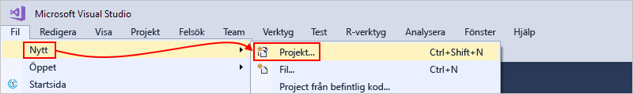

1. Under **Installerad** väljer du **Visual C#** eller **Visual Basic**. Välj **moln**  >  **resurs grupp i Azure**. Namnge projektet, t.ex.:

   

   > [!NOTE]
   > Resurs grupp namn får bara innehålla bokstäver, siffror, punkter ( `.` ), under streck ( `_` ), bindestreck ( `-` ) och parenteser ( `(` , `)` ), men kan inte *sluta* med punkter ( `.` ).
   >
   > Om **molnet** eller **Azure-resurs gruppen** inte visas kontrollerar du att du installerar Azure SDK för Visual Studio.

   Följ dessa steg om du använder Visual Studio 2019:

   1. I rutan **skapa ett nytt projekt** väljer du **Azure Resource Group** -projektet för Visual C# eller Visual Basic. Välj **Nästa**.

   1. Ange ett namn för den Azure-resurs grupp som du vill använda och annan projekt information. Välj **Skapa**.

1. Välj **Logic app** -mallen i listan Mall. Välj **OK**.

   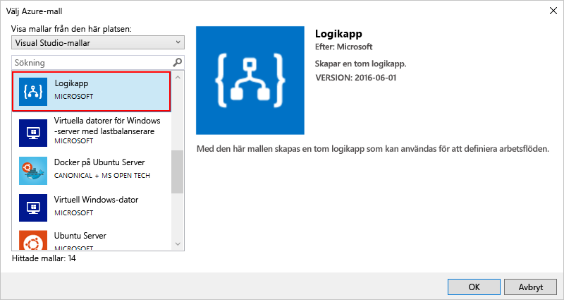

   När Visual Studio har skapat ditt projekt öppnas Solution Explorer och visar din lösning. I lösningen lagrar **LogicApp.jspå** filen inte bara din Logic app-definition, men är också en Azure Resource Manager mall som du kan använda för distribution.

   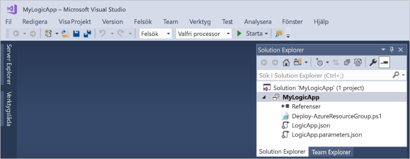

## Skapa en tom logikapp

När du har ett Azure-resurs grupps projekt skapar du din Logic app med den **tomma Logic app** -mallen.

1. Öppna snabb menyn **LogicApp.jspå** filen i Solution Explorer. Välj **Öppna med Logic App Designer**. (Tangent bord: Ctrl + L)

   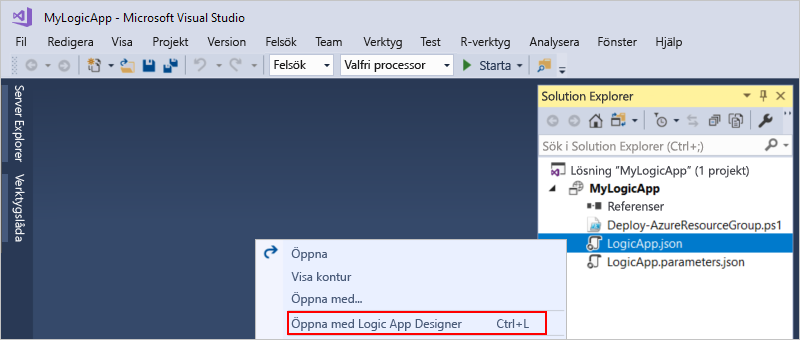

   > [!TIP]
   > Om du inte har det här kommandot i Visual Studio 2019 kontrollerar du att du har de senaste uppdateringarna för Visual Studio.

   I Visual Studio uppmanas du att ange din Azure-prenumeration och en Azure-resurs grupp för att skapa och distribuera resurser för din Logic app och dina anslutningar.

1. För **prenumeration** väljer du din Azure-prenumeration. För **resurs grupp** väljer du **Skapa ny** för att skapa en annan Azure-resurs grupp.

   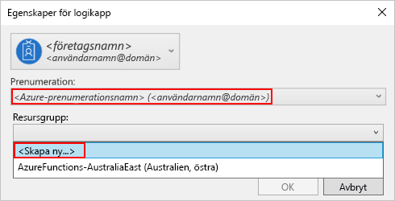

   | Inställning | Exempelvärde | Description |
   | ------- | ------------- | ----------- |
   | Användar konto | Fabrikam   sophia-owen@fabrikam.com | Det konto som du använde när du loggade in i Visual Studio |
   | **Prenumeration** | Betala per användning   (sophia-owen@fabrikam.com) | Namnet på din Azure-prenumeration och det associerade kontot |
   | **Resursgrupp** | MyLogicApp-RG   (USA, västra) | Azures resurs grupp och plats för att lagra och distribuera din Logic Apps resurser |
   | **Plats** | **Samma som resurs grupp** | Plats typen och en bestämd plats för att distribuera din Logic app. Plats typen är antingen en Azure-region eller en befintlig [integrerings tjänst miljö (ISE)](connect-virtual-network-vnet-isolated-environment.md). 
I den här snabb starten ska du se till att plats typen är **region** och att platsen är inställd på **samma som resurs gruppen**. 
**Obs!** när du har skapat ett resurs grupps projekt kan du [ändra plats typen och platsen](manage-logic-apps-with-visual-studio.md#change-location), men olika platstyp påverkar din Logic app på olika sätt. |
   ||||

1. Logic Apps designer öppnar en sida som visar en introduktions video och ofta använda utlösare. Rulla ned förbi videon och utlösarna till **mallar** och välj **Tom Logic app**.

   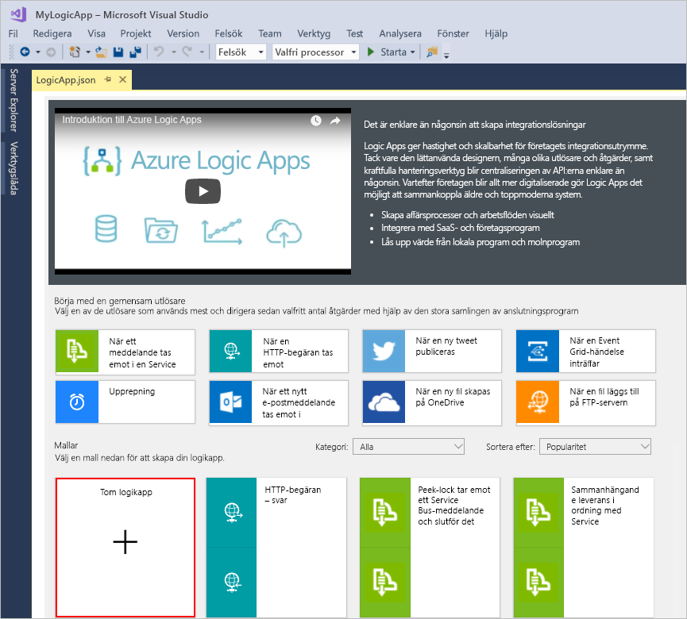

## Bygg ett arbetsflöde för logikappen

Lägg sedan till en RSS- [utlösare](../logic-apps/logic-apps-overview.md#logic-app-concepts) som utlöses när ett nytt flödes objekt visas. Varje Logic app börjar med en utlösare som utlöses när vissa villkor uppfylls. Varje gång utlösaren utlöses skapar Logic Apps-motorn en logikappinstans som kör ditt arbetsflöde.

1. I Logic App Designer väljer du **alla** under sökrutan. Skriv "RSS" i rutan Sök. Välj den här utlösaren i listan utlösare: **när ett feed-objekt publiceras**

   

1. När utlösaren visas i designern, slutför du den genom att följa stegen i arbets flödet i [snabb](../logic-apps/quickstart-create-first-logic-app-workflow.md#add-rss-trigger)starten för Azure Portal och återgå sedan till den här artikeln. När du är klar ser logikappen ut som i det här exemplet:

   

1. Spara din Visual Studio-lösning. (Tangentbord: Ctrl + S)

## Distribuera logikappen till Azure

Innan du kan köra och testa din Logic-app distribuerar du appen till Azure från Visual Studio.

1. I Solution Explorer, på projektets snabb meny, väljer du **distribuera**  >  **ny**. Om du uppmanas logga in med ditt Azure-konto ska du göra det.

   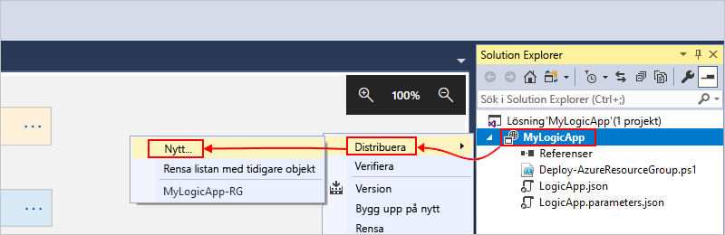

1. Behåll standard prenumerationen för Azure, resurs gruppen och andra inställningar för den här distributionen. Välj **Distribuera**.

   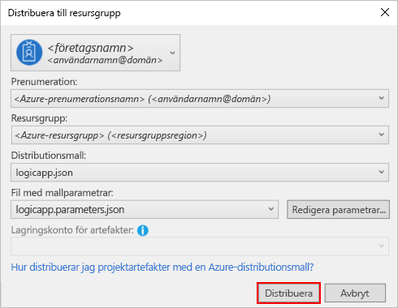

1. Ange ett resurs namn för din Logic app om rutan **Redigera parametrar** visas. Spara inställningarna.

   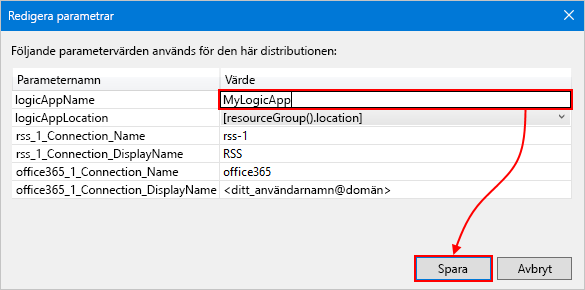

   När distributionen startar visas appens distributionsstatus i Visual Studios **utdatafönster**. Om statusen inte visas ska du öppna listan **Show output from** (Visa utdata från) och välja Azure-resursgruppen.

   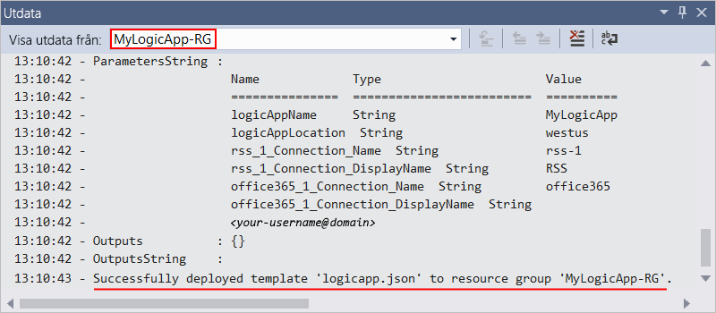

   Om de valda anslutningarna behöver inmatas från dig, öppnas ett PowerShell-fönster i bakgrunden och du uppmanas att ange nödvändiga lösen ord eller hemliga nycklar. När du har angett den här informationen fortsätter distributionen.

   

   När distributionen är klar är din Logic app Live i Azure Portal och körs enligt ditt angivna schema (varje minut). Om utlösaren hittar nya feed-objekt utlöses utlösaren, som skapar en arbets flödes instans som kör din Logi Kap par åtgärder. Din Logic App skickar e-post för varje nytt objekt. Annars, om utlösaren inte hittar nya objekt, utlöses inte utlösaren och "hoppar över" ininstansierar arbets flödet. Din Logic app väntar till nästa intervall innan den markeras.

   Här är exempel på e-postmeddelanden som den här Logic-appen skickar. Om du inte får e-post kan du titta i mappen Skräppost.

   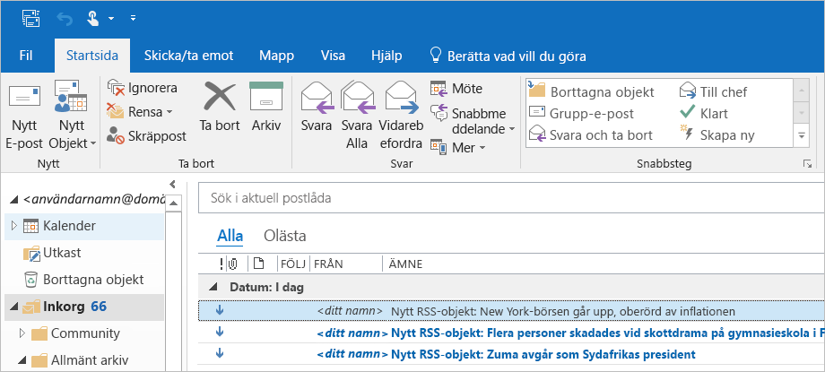

Grattis, du har skapat och distribuerat din Logic app med Visual Studio. Om du vill hantera din logikapp och granska dess körningshistorik, se [Hantera Logic Apps i Visual Studio](../logic-apps/manage-logic-apps-with-visual-studio.md).

## Lägg till ny Logic-app

När du har ett befintligt Azure Resource Group-projekt kan du lägga till en ny tom Logic-app i projektet med hjälp av JSON-dispositions fönstret.

1. Öppna filen i Solution Explorer `<logic-app-name>.json` .

1. I menyn **Visa** väljer du **annan Windows**  >  **JSON-disposition**.

1. Om du vill lägga till en resurs i mallfilen väljer du **Lägg till resurs** längst upp i fönstret JSON-disposition. Eller i fönstret JSON-disposition öppnar du snabb menyn **resurser** och väljer **Lägg till ny resurs**.

   

1. I dialog rutan **Lägg till resurs** i sökrutan söker du efter `logic app` och väljer **Logic app**. Namnge din Logic app och välj **Lägg till**.

   

## Rensa resurser

När du är klar med din Logic-app tar du bort resurs gruppen som innehåller din Logic app och relaterade resurser.

1. Logga in på [Azure Portal](https://portal.azure.com) med samma konto som användes för att skapa din logikapp.

1. På Azure Portal-menyn väljer du **resurs grupper** eller söker efter och väljer **resurs grupper** från vilken sida som helst. Välj din Logic Apps resurs grupp.

1. På sidan **Översikt** väljer du **ta bort resurs grupp**. Ange resurs gruppens namn som bekräftelse och välj **ta bort**.

   

1. Ta bort Visual Studio-lösningen från den lokala datorn.

## Nästa steg

Genom att läsa den här artikeln har du lärt dig att bygga, distribuera och köra din logikapp med Visual Studio. Information om hur du hanterar och utför avancerad distribution för logi Kap par med Visual Studio finns i följande artiklar:

> [!div class="nextstepaction"]
> [Hantera Logic Apps i Visual Studio](../logic-apps/manage-logic-apps-with-visual-studio.md)
