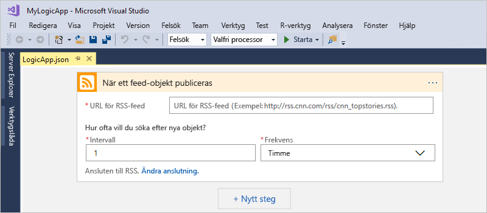

# Snabbstart: Skapa automatiserade uppgifter, processer och arbetsflöden med Azure Logic Apps – Visual Studio

Med [Azure Logic Apps](../logic-apps/logic-apps-overview.md) och Visual Studio kan du skapa arbetsflöden för att automatisera uppgifter och processer som integrerar appar, data, system och tjänster åt företag och organisationer. Den här snabbstarten visar hur du utformar och bygger sådana arbetsflöden genom att skapa logikappar i Visual Studio och distribuera apparna till Azure i molnet. Även om du kan utföra dessa uppgifter i Azure portal, kan Visual Studio du lägga till dina logikappar för att köra källkontroll, publicera olika versioner och skapa Azure Resource Manager-mallar för olika distributionsmiljöer.

Om du inte har arbetat med Azure Logic Apps tidigare och bara vill lära dig det grundläggande ska du läsa [snabbstarten för att skapa en logikapp i Azure Portal](../logic-apps/quickstart-create-first-logic-app-workflow.md) istället. Logic App Designer fungerar på ungefär samma sätt i både Azure Portal och Visual Studio.

Här kan skapa du samma logikapp som i snabbstarten för Azure Portal, men med Visual Studio. Den här logikappen övervakar en webbplats RSS-flöde och skickar e-post för varje nytt objekt som publiceras på webbplatsen. När du är klar ser logikappen ut som det här arbetsflödet på en hög nivå:

Innan du börjar bör du kontrollera att du har följande för att kunna följa den här snabbstarten:

* Om du heller inte har någon Azure-prenumeration kan du <a href="https://azure.microsoft.com/free/" target="_blank">registrera ett kostnadsfritt Azure-konto</a>.

* Hämta och installera följande verktyg, om du inte redan har dem:

  * <a href="https://aka.ms/download-visual-studio" target="_blank">Visual Studio 2019, 2017 eller 2015 – Community edition eller större</a>. 
  I denna snabbstart används Visual Studio Community 2017 som är tillgängligt utan kostnad.

    > [!IMPORTANT]
    > När du installerar Visual Studio 2019 eller 2017, kontrollera att du väljer den **Azure development** arbetsbelastning.
    > För Visual Studio-2019 Cloud Explorer öppnas Logic App Designer i Azure-portalen, men ännu inte kan öppna den inbäddade Logic App Designer.

  * <a href="https://azure.microsoft.com/downloads/" target="_blank">Microsoft Azure SDK för .NET (2.9.1 eller senare)</a>. Läs mer om <a href="https://docs.microsoft.com/dotnet/azure/dotnet-tools?view=azure-dotnet">Azure SDK för .NET</a>.

  * <a href="https://github.com/Azure/azure-powershell#installation" target="_blank">Azure PowerShell</a>

  * Azure Logic Apps Tools för Visual Studio-version som du vill använda:

    * <a href="https://aka.ms/download-azure-logic-apps-tools-visual-studio-2019" target="_blank">Visual Studio 2019</a>
    
    * <a href="https://aka.ms/download-azure-logic-apps-tools-visual-studio-2017" target="_blank">Visual Studio 2017</a>
    
    * <a href="https://aka.ms/download-azure-logic-apps-tools-visual-studio-2015" target="_blank">Visual Studio 2015</a>
  
    Du kan hämta och installera Azure Logic Apps Tools direkt från Visual Studio Marketplace, eller läsa mer om <a href="https://docs.microsoft.com/visualstudio/ide/finding-and-using-visual-studio-extensions" target="_blank">hur du installerar tillägget från Visual Studio</a>. 
    Se till att starta om Visual Studio när installationen är klar.

* Tillgång till Internet när du använder den inbäddade Logic App Designer

  Designer kräver en Internetanslutning för att kunna skapa resurser i Azure och läsa in egenskaper och data från anslutningarna i din logikapp. 
  Om du t.ex. använder Dynamics CRM Online-anslutningen kontrollerar Designer om CRM-instansen har några standardegenskaper och anpassade egenskaper.

* Ett e-postkonto som stöds av Logic Apps, t.ex. Office 365 Outlook, Outlook.com eller Gmail. För andra providrar <a href="https://docs.microsoft.com/connectors/" target="_blank">läser du listan med anslutningsappar här</a>. Den här logikappen använder Office 365 Outlook. Om du använder en annan provider är övergripande stegen desamma, men ditt användargränssnitt kan skilja sig något.

## Skapa ett projekt för en Azure-resursgrupp

Kom igång genom att skapa ett [projekt för en Azure-resursgrupp](../azure-resource-manager/vs-azure-tools-resource-groups-deployment-projects-create-deploy.md). Läs mer om [Azure-resursgrupper och resurser](../azure-resource-manager/resource-group-overview.md).

1. Starta Visual Studio och logga in med ditt Azure-konto.

1. Gå till **Arkiv**-menyn och välj **Nytt** > **Projekt**. (Tangentbord: CTRL + SKIFT + N)

   

1. Under **Installerad** väljer du **Visual C#** eller **Visual Basic**. Välj **Moln** > **Azure-resursgrupp**. Namnge projektet, t.ex.:

   

   > [!NOTE]
   > Om den **molnet** kategori eller **Azure-resursgrupp** projektet inte finns, kontrollera att du har installerat Azure SDK för Visual Studio.

   Följ dessa steg om du använder Visual Studio 2019:

   1. I den **skapa ett nytt projekt** väljer den **Azure-resursgrupp** projektmall för att antingen Visual C# eller Visual Basic, och välj **nästa**.

   1. Ange namn för Azure-resursgrupp som du vill använda och annan projektinformation. När du är klar väljer du **Skapa**.

1. Mall-listan väljer du den **Logikapp** mall.

   

   När Visual Studio har skapat ditt projekt öppnas Solution Explorer och visar din lösning.

   

   I din lösning lagrar filen **LogicApp.json** inte bara definitionen för din logikapp utan den fungerar även som en Azure Resource Manager-mall som kan konfigureras för distribution.

## Skapa en tom logikapp

När du har skapat projektet för Azure-resursgruppen kan du skapa och bygga din logikapp utifrån mallen **Tom logikapp**.

1. Gå till Solution Explorer och öppna snabbmenyn för filen **LogicApp.json**. 
   Välj **Öppna med Logic App Designer**. (Tangentbord: CTRL + L)

   

1. Som **prenumeration** anger du den Azure-prenumeration som du vill använda. 
   För **Resursgrupp** väljer du **Skapa nytt...** , vilket skapar en ny Azure-resursgrupp.

   

   För att du ska kunna skapa och distribuera resurser som är associerade till din logikapp och dina anslutningar med Visual Studio måste du ha en Azure-prenumeration och en resursgrupp.

   | Inställning | Exempelvärde | Beskrivning |
   | ------- | ------------- | ----------- |
   | Lista med användarprofiler | Contoso   jamalhartnett@contoso.com | Som standard det konto som du använde för att logga in |
   | **Prenumeration** | Betala per användning   (jamalhartnett@contoso.com) | Namnet på din Azure-prenumeration och det associerade kontot |
   | **Resursgrupp** | MyLogicApp-RG   (Västra USA) | Azure-resursgrupp och plats för lagring och distribution av resurser för din logikapp |
   | **Plats** | MyLogicApp-RG2   (Västra USA) | En annan plats om du inte vill använda resursgruppens plats |
   ||||

1. Logic Apps Designer öppnas och det visas en sida med en introduktionsvideo och vanliga utlösare. 
   Rulla förbi videon och utlösarna. Under **Mallar** väljer du **Tom logikapp**.

   

## Bygg ett arbetsflöde för logikappen

Lägg därefter till en [utlösare](../logic-apps/logic-apps-overview.md#logic-app-concepts) som utlöses när ett nytt RSS-flödesobjekt kommer. Varje logikapp måste börja med en utlösare som utlöses när särskilda villkor uppfylls. Varje gång utlösaren utlöses skapar Logic Apps-motorn en logikappinstans som kör ditt arbetsflöde.

1. I Logic App Designer anger du ”rss” i sökrutan. Välj den här utlösaren: **När ett flödesobjekt publiceras**

   

   Utlösaren visas nu i Designer:

   

1. Slutför skapandet av logikappen genom att följa stegen i [snabbstarten för Azure Portal](../logic-apps/quickstart-create-first-logic-app-workflow.md#add-rss-trigger) och gå sedan tillbaka till den här artikeln.

   När du är klar ser logikappen ut som i det här exemplet:

   

1. Om du vill spara din logikapp ska du spara Visual Studio-lösningen. (Tangentbord: Ctrl + S)

Innan du kan testa din logikapp måste du distribuera appen till Azure.

## Distribuera logikappen till Azure

Innan du kan köra din logikapp måste du distribuera appen från Visual Studio till Azure, vilket du gör med några få snabba steg.

1. Gå till Solution Explorer, öppna projektets snabbmeny och välj **Distribuera** > **Nytt**. Om du uppmanas logga in med ditt Azure-konto ska du göra det.

   

1. För att skapa den här distributionen ska du behålla värdena för Azure-prenumerationen, resursgruppen och alla andra standardinställningar. När du är klar kan du välja **Distribuera**.

   

1. Om rutan **Redigera parametrar** visas anger du resursnamnet för logikappen som ska användas vid distributionen och sparar sedan inställningarna. Exempel:

   

   När distributionen startar visas appens distributionsstatus i Visual Studios **utdatafönster**. 
   Om statusen inte visas ska du öppna listan **Show output from** (Visa utdata från) och välja Azure-resursgruppen.

   

   Om de anslutningsappar du väljer behöver någon åtgärd av dig kan det hända att ett PowerShell-fönster öppnas i bakgrunden och fråga efter nödvändiga lösenord eller hemliga nycklar. När du har angett den här informationen fortsätter distributionen.

   

   När distributionen är klar aktiveras logikappen i Azure-portalen och kontrollerar RSS-flödet efter ett angivet schema (varje minut). 
   Om RSS-flödet innehåller nya objekt skickar din logikapp ett e-postmeddelande för varje nytt objekt. 
   Annars väntar logikappen tills nästa intervall innan kontrollen utförs på nytt.

   Här är exempel på e-postmeddelanden som den här logikappen skickar. 
   Om du inte får e-post kan du titta i mappen Skräppost.

   

   När utlösaren kontrollerar RSS-flödet och hittar nya objekt utlöses den och Logic Apps-motorn skapar en instans av ditt logikapparbetsflöde som kör åtgärderna i arbetsflödet.
   Om utlösaren inte hittar nya objekt utlöses den inte, och den ”hoppar över” att instansiera arbetsflödet.

Du har nu skapat och distribuerat din logikapp med Visual Studio! Om du vill hantera din logikapp och granska dess körningshistorik, se [Hantera Logic Apps i Visual Studio](../logic-apps/manage-logic-apps-with-visual-studio.md).

## Rensa resurser

Ta bort resursgruppen som innehåller logikappen och alla relaterade resurser när de inte längre behövs.

1. Logga in på <a href="https://portal.azure.com" target="_blank">Azure Portal</a> med samma konto som användes för att skapa din logikapp.

1. På Azure-huvudmenyn väljer du **Resursgrupper**.
Välj resursgrupp för din logikapp, och välj sedan **Översikt**.

1. På sidan **Översikt** väljer du **Ta bort resursgrupp**. Ange resursgruppens namn som bekräftelse och välj **Ta bort**.

   

1. Ta bort Visual Studio-lösningen från den lokala datorn.

## Få support

* Om du har frågor kan du besöka <a href="https://social.msdn.microsoft.com/Forums/en-US/home?forum=azurelogicapps" target="_blank">forumet för Azure Logic Apps</a>.
* Om du vill skicka in eller rösta på förslag på funktioner besöker du <a href="https://aka.ms/logicapps-wish" target="_blank">webbplatsen för Logic Apps-användarfeedback</a>.

## Nästa steg

Genom att läsa den här artikeln har du lärt dig att bygga, distribuera och köra din logikapp med Visual Studio. Lär dig mer om hur du hanterar och utför avancerad distribution av logikappar med Visual Studio genom att läsa följande artiklar:

> [!div class="nextstepaction"]
> * [Hantera logic apps i Visual Studio](../logic-apps/manage-logic-apps-with-visual-studio.md)
> * [Skapa mallar för distribution för logic apps med Visual Studio](../logic-apps/logic-apps-create-deploy-template.md)
