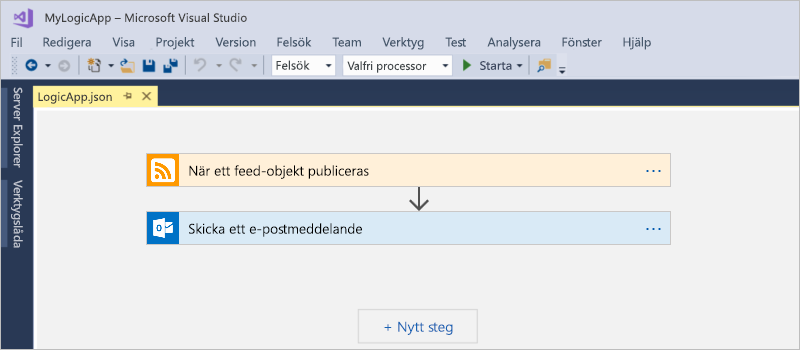
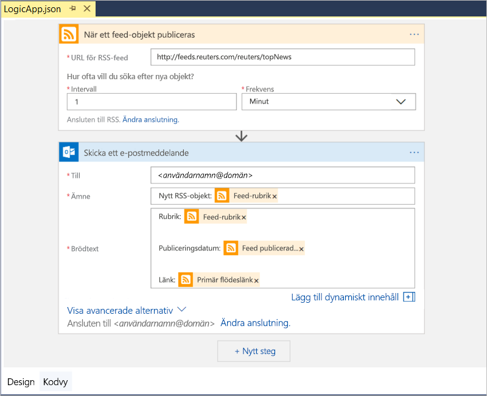
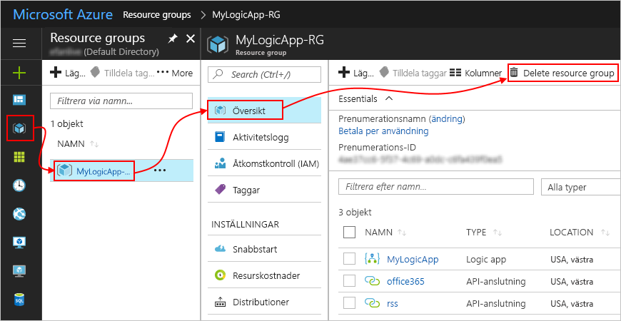

# Snabbstart: Skapa automatiserade uppgifter, processer och arbetsflöden med Azure Logic Apps – Visual Studio

Med [Azure Logic Apps](../logic-apps/logic-apps-overview.md) och Visual Studio kan du skapa arbetsflöden för att automatisera uppgifter och processer som integrerar appar, data, system och tjänster åt företag och organisationer. Den här snabbstarten visar hur du utformar och bygger sådana arbetsflöden genom att skapa logikappar i Visual Studio och distribuera apparna till Azure. Även om du kan utföra dessa uppgifter i Azure portal, kan Visual Studio du lägga till dina logikappar för att köra källkontroll, publicera olika versioner och skapa Azure Resource Manager-mallar för olika distributionsmiljöer.

Om du inte har arbetat med Azure Logic Apps och vill bara de grundläggande begreppen, prova den [Snabbstart för att skapa en logikapp i Azure-portalen](../logic-apps/quickstart-create-first-logic-app-workflow.md). Logic App Designer fungerar på samma sätt i både Azure-portalen och Visual Studio.

I den här snabbstarten skapar du samma logikapp med Visual Studio som snabbstarten för Azure portal. Den här logikappen övervakar en webbplats RSS-feed och skickar e-postmeddelande för varje nytt objekt i som feed. Det ser ut som den här generella din logikapp:

## Nödvändiga komponenter

* En Azure-prenumeration. Om du heller inte har någon Azure-prenumeration kan du [registrera ett kostnadsfritt Azure-konto](https://azure.microsoft.com/free/).

* Hämta och installera följande verktyg, om du inte redan har dem:

  * [Visual Studio 2019, 2017 eller 2015 – Community edition eller större](https://aka.ms/download-visual-studio). 
  Den här snabbstarten används Visual Studio Community 2017.

    > [!IMPORTANT]
    > När du installerar Visual Studio 2019 eller 2017, kontrollera att du väljer den **Azure development** arbetsbelastning.

  * [Microsoft Azure SDK för .NET (2.9.1 eller senare)](https://azure.microsoft.com/downloads/). 
  Läs mer om [Azure SDK för .NET](https://docs.microsoft.com/dotnet/azure/dotnet-tools?view=azure-dotnet).

  * [Azure PowerShell](https://github.com/Azure/azure-powershell#installation)

  * Azure Logic Apps Tools för Visual Studio-version som du vill använda:

    * [Visual Studio 2019](https://aka.ms/download-azure-logic-apps-tools-visual-studio-2019)

    * [Visual Studio 2017](https://aka.ms/download-azure-logic-apps-tools-visual-studio-2017)

    * [Visual Studio 2015](https://aka.ms/download-azure-logic-apps-tools-visual-studio-2015)
  
    Du kan hämta och installera Azure Logic Apps Tools direkt från Visual Studio Marketplace, eller läsa mer om [hur du installerar tillägget från Visual Studio](https://docs.microsoft.com/visualstudio/ide/finding-and-using-visual-studio-extensions). 
    Se till att starta om Visual Studio när installationen är klar.

* Tillgång till Internet när du använder den inbäddade Logic App Designer

  Designern måste ha en Internetanslutning för att skapa resurser i Azure och läsa egenskaper och data från anslutningarna i din logikapp. 
  Till exempel för Dynamics CRM Online-anslutningar kontrollerar designer om CRM-instansen för standard och anpassade egenskaper.

* Ett e-postkonto som stöds av Logic Apps, t.ex. Office 365 Outlook, Outlook.com eller Gmail. För andra providrar [läser du listan med anslutningsappar här](https://docs.microsoft.com/connectors/). Det här exemplet används Office 365 Outlook. Om du använder en annan provider är övergripande stegen desamma, men ditt användargränssnitt kan skilja sig något.

## Skapa ett projekt för en Azure-resursgrupp

Kom igång genom att skapa ett [projekt för en Azure-resursgrupp](../azure-resource-manager/vs-azure-tools-resource-groups-deployment-projects-create-deploy.md). Läs mer om [Azure-resursgrupper och resurser](../azure-resource-manager/resource-group-overview.md).

1. Starta Visual Studio. Logga in med ditt Azure-konto.

1. Gå till **Arkiv**-menyn och välj **Nytt** > **Projekt**. (Tangentbord: CTRL + SKIFT + N)

   

1. Under **Installerad** väljer du **Visual C#** eller **Visual Basic**. Välj **Moln** > **Azure-resursgrupp**. Namnge projektet, t.ex.:

   

   > [!NOTE]
   > Om **molnet** eller **Azure-resursgrupp** inte visas, måste du installera Azure SDK för Visual Studio.

   Följ dessa steg om du använder Visual Studio 2019:

   1. I den **skapa ett nytt projekt** väljer den **Azure-resursgrupp** projekt för Visual C# eller Visual Basic. Välj **Nästa**.

   1. Ange ett namn för Azure-resursgrupp som du vill använda och annan projektinformation. Välj **Skapa**.

1. Mall-listan väljer du den **Logikapp** mall. Välj **OK**.

   

   När Visual Studio har skapat ditt projekt öppnas Solution Explorer och visar din lösning. 
   I din lösning på **LogicApp.json** filen inte bara lagrar sina logikapp-definitioner men är också en Azure Resource Manager-mall som du kan använda för distribution.

   

## Skapa en tom logikapp

När du har din Azure-resursgrupp projekt, skapa din logikapp med den **tom Logikapp** mall.

1. I Solution Explorer öppnar du den **LogicApp.json** filens snabbmenyn. Välj **Öppna med Logic App Designer**. (Tangentbord: CTRL + L)

   

   Visual Studio ber om det för din Azure-prenumeration och en Azure-resursgrupp för att skapa och distribuera resurser för din logikapp och dina anslutningar.

1. För **prenumeration**, Välj din Azure-prenumeration. För **resursgrupp**väljer **Skapa ny** att skapa en ny Azure resursgrupp.

   

   | Inställning | Exempelvärde | Beskrivning |
   | ------- | ------------- | ----------- |
   | Lista med användarprofiler | Contoso   jamalhartnett@contoso.com | Som standard det konto som du använde för att logga in |
   | **Prenumeration** | Betala per användning   (jamalhartnett@contoso.com) | Namnet på din Azure-prenumeration och det associerade kontot |
   | **Resursgrupp** | MyLogicApp-RG   (Västra USA) | Azure-resursgrupp och plats för att lagra och distribuera resurser som din logikapp |
   | **Plats** | MyLogicApp-RG2   (Västra USA) | En annan plats om du inte vill använda resursgruppens plats |
   ||||

1. Logic Apps Designer öppnas en sida som visar en introduktion video och vanliga utlösare. Rulla ned förbi videon och utlösarna till **mallar**, och välj **tom Logikapp**.

   

## Bygg ett arbetsflöde för logikappen

Lägg sedan till ett RSS [utlösaren](../logic-apps/logic-apps-overview.md#logic-app-concepts) som utlöses när ett nytt flödesobjekt. Varje logikapp börjar med en utlösare som utlöses när särskilda villkor uppfylls. Varje gång utlösaren utlöses skapar Logic Apps-motorn en logikappinstans som kör ditt arbetsflöde.

1. I Logic App Designer under sökrutan väljer **alla**.
I sökrutan anger du ”rss”. Välj den här utlösaren från listan över utlösare: **När ett flödesobjekt publiceras – RSS**

   

1. När utlösaren visas i designern, Slutför att skapa logikappen genom att följa arbetsflödet stegen i den [snabbstarten för Azure portal](../logic-apps/quickstart-create-first-logic-app-workflow.md#add-rss-trigger)och gå sedan tillbaka till den här artikeln. När du är klar ser logikappen ut som i det här exemplet:

   

1. Spara din Visual Studio-lösning. (Tangentbord: Ctrl + S)

## Distribuera logikappen till Azure

Innan du kan köra och testa din logikapp kan du distribuera appen till Azure från Visual Studio.

1. Gå till Solution Explorer, öppna projektets snabbmeny och välj **Distribuera** > **Nytt**. Om du uppmanas logga in med ditt Azure-konto ska du göra det.

   

1. Den här distributionen behåller du standardvärdet Azure-prenumeration, resurs grupp och andra inställningar. Välj **distribuera**.

   

1. Om den **redigera parametrar** visas rutan Ange ett resursnamn för din logikapp. Spara dina inställningar.

   

   När distributionen startar visas appens distributionsstatus i Visual Studios **utdatafönster**. Om statusen inte visas ska du öppna listan **Show output from** (Visa utdata från) och välja Azure-resursgruppen.

   

   Om dina valda anslutningar kräver indata från dig, ett PowerShell-fönster öppnas i bakgrunden och uppmanas för alla nödvändiga lösenord och hemliga nycklar. När du har angett den här informationen fortsätter distributionen.

   

   När distributionen är klar logikappen är live i Azure-portalen och körs på ditt angivna schema (varje minut). Om utlösaren hittar nya objekt i feed utlöses utlösaren, vilket skapar en arbetsflödesinstans som körs dina logic Apps-åtgärder. Logikappen skickar e-postmeddelande för varje nytt objekt. Annars, om utlösaren inte hittar nya objekt utlösaren utlöses inte och ”hoppar över” att instansiera arbetsflödet. Det väntar logikappen tills nästa intervall innan kontrollen utförs.

   Här följer exempel e-postmeddelanden som den här logikappen skickar. 
   Om du inte får e-post kan du titta i mappen Skräppost.

   

Grattis, du har skapat och distribuerat din logikapp med Visual Studio. Om du vill hantera din logikapp och granska dess körningshistorik, se [Hantera Logic Apps i Visual Studio](../logic-apps/manage-logic-apps-with-visual-studio.md).

## Rensa resurser

Ta bort resursgruppen som innehåller logikappen och alla relaterade resurser när du är klar med din logikapp.

1. Logga in på [Azure Portal](https://portal.azure.com) med samma konto som användes för att skapa din logikapp.

1. På Azure-huvudmenyn väljer du **Resursgrupper**.
Välj resursgrupp för din logikapp och välj **översikt**.

1. På sidan **Översikt** väljer du **Ta bort resursgrupp**. Ange resursgruppens namn som bekräftelse och välj **Ta bort**.

   

1. Ta bort Visual Studio-lösningen från den lokala datorn.

## Nästa steg

Genom att läsa den här artikeln har du lärt dig att bygga, distribuera och köra din logikapp med Visual Studio. Om du vill veta om att hantera och utför avancerad distribution av logic apps i Visual Studio kan du läsa följande artiklar:

> [!div class="nextstepaction"]
> * [Hantera Logic Apps i Visual Studio](../logic-apps/manage-logic-apps-with-visual-studio.md)